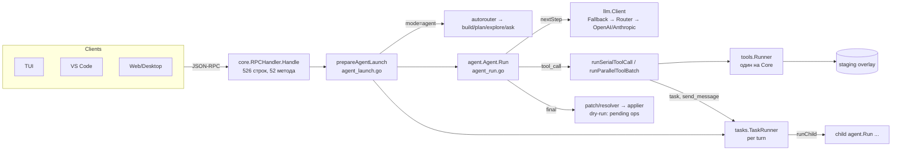
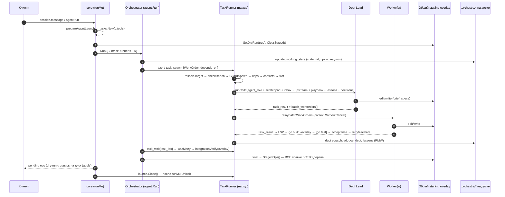
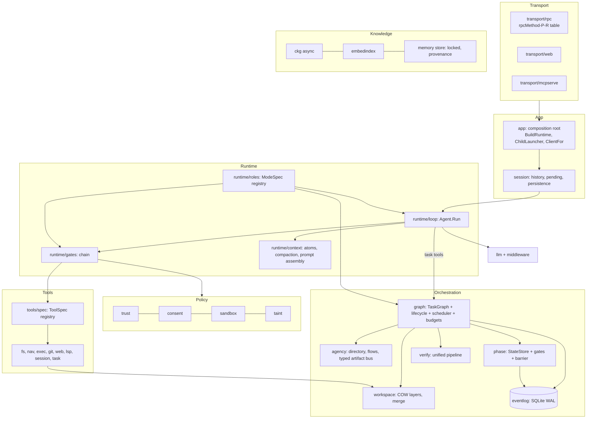
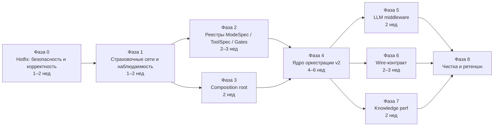

# Orchestra Code — технический аудит: архитектура, агентные режимы, безопасность

**Дата:** 2026-09-25 · **Срез кода:** `master` @ `793c76b` (включает слой agency из PR #3) · **Объём:** ~198.6K строк Go (112.9K прод + 85.8K тестов), 8.8K TS, 2.1K Rust

**Метод.** Пять независимых треков:
1. AppSec;
2. оркестратор и мультиагентный рантайм;
3. данные, память и хранилища;
4. архитектура и техдолг;
5. агентный цикл и LLM-пайплайн.

Треки проводились только чтением кода. Для ключевых утверждений писались тесты-пробы в изолированной копии репозитория (`go test -overlay`); сам репозиторий не менялся. `go vet ./...` чистый, `go test -race` по `internal/tasks`, `internal/agent` и `internal/orchestrastate` зелёный.

Каждая находка помечена по степени проверки:

| Метка | Что значит |
|---|---|
| ✅ | подтверждено тестом-пробой (воспроизведено) |
| 🔎 | подтверждено чтением кода при сведении отчёта: путь прослежен от входа до эффекта |
| ◻ | по данным трека, повторно не перепроверялось |

Шкала серьёзности:

| Уровень | Критерий |
|---|---|
| **Critical** | эксплуатируемо в штатном сценарии, либо ломает основной путь работы |
| **High** | реальный риск или дефект при распространённых условиях |
| **Medium** | ограниченный радиус, либо нужны особые условия |
| **Low** | гигиена |

> **Прозрачность.** Часть находок оркестратора относится к слою agency (`internal/tasks/agency*.go`, `batch_relay.go`, `internal/agent/agency.go`), который добавлен в PR #3 в этой же рабочей сессии. Они помечены **[agency]** и оценены с той же строгостью, что и остальной код.

---

## 0. Executive Summary

**Коротко.** Инженерное ядро Orchestra — редкий для open-source агентов уровень:
- двухслойная модель патчей: `file_hash`, anchors, атомарная запись;
- containment путей с разрешением symlink'ов;
- SSRF-защита с DNS-pinning;
- loopback, токен и Origin на всех сетевых поверхностях;
- 0.76 тестов на строку кода и `-race` на двух ОС;
- граф импортов без циклов, с `SubtaskRunner`-интерфейсами на стороне потребителя.

Слабые места — не в «железе», а в **границах доверия и в разделяемом состоянии**:

1. **Граница доверия проекту отсутствует.** Закоммиченный `.orchestra.yml` или `.mcp.json` чужого репозитория при открытии проекта:
   - запускает процессы (MCP-серверы и хуки);
   - снимает exec-consent для всех ходов;
   - может отправить API-ключ пользователя на произвольный `api_base`.
   
   Понятия «workspace trust» в коде нет.
2. **Поверхность инструментов режима — рекомендация, а не граница.** Диспетчер исполняет любой зарегистрированный инструмент, даже не предложенный режиму. `final.patches` дочерних агентов проходят мимо write-scope. Режимы plan и architecture могут породить пишущих детей.
3. **У оркестратора три источника истины, и нет изоляции.**
   - Все агенты дерева пишут в **один** staging overlay. Правки упавших или отменённых воркеров не откатываются, и Lead сбрасывает их вместе с остальными.
   - `.orchestra/state.md` обновляется read-modify-write из нескольких горутин без блокировки.
   - Waivers фаз модель выдаёт себе сама.
4. **История агента ломается на основном пути (C1).** Два `edit` в одном ответе плюс подсказка (LSP или «staged ready») между результатами дают осиротевший `tool`-message. Провайдер отвечает 400, и сессия остаётся сломанной.
5. **Путь Anthropic отстаёт от OpenAI-совместимого.** Нет retry, неверно классифицируются 429/529, thinking-блоки не возвращаются, мультимодальность теряется, обрезанный стрим принимается как завершённый.
6. **Техдолг — дублирование сборки агента.** Опции агента собираются вручную в 10+ местах, и CLI с core уже ведут себя по-разному. Режимы описаны в шести местах. Диспетчер инструментов — одна функция на 863 строки.

### Оценка по областям (0–5)

| Область | Оценка | Комментарий |
|---|:-:|---|
| Безопасность правок (patch/resolver/applier) | 4.5 | Хеш-предусловия, anchors, атомарность. Минус: блочный anchor-проход не сверяет середину (LLM-12) |
| Сетевые поверхности, SSRF, containment путей | 4 | Сильно. Исключения: `ckg-ui` на `0.0.0.0` без токена, `memory_read` traversal |
| Граница доверия, exec-политика | **1.5** | Нет workspace trust; allowlist обходится; env с ключами наследуется |
| Устойчивость к prompt injection | **1** | Недоверенный контент нигде не маркируется; межагентные сообщения идут с ролью `user`; есть персистентное отравление памяти |
| Агентный цикл | 3 | Капы, компакция и overflow-recovery хороши, но C1, ID вызовов и неработающий `MaxFinalFailures` |
| Паритет LLM-провайдеров | 2.5 | Сквозные функции (retry, логгер, overflow) есть только у OpenAI-клиента |
| Оркестратор: дизайн | 4 | Спецификация (L1–L5, WorkOrders, Contract Freeze, Question Barrier) продумана |
| Оркестратор: целостность рантайма | **2** | Общий overlay, гонки state.md, самовыдача waivers, финал при живых детях |
| Данные и память | 3 | Хорошие бюджеты и компакция. Неатомарная память, промах кэша промпта на каждом шаге, синхронный CKG-refresh |
| Модульность | 3 | Граф чистый, но дублированная сборка агента, god-объекты, режимы в шести местах |
| Тесты и CI | 4 | Широко. Нет gofmt/lint в CI; 76 прод-файлов не отформатированы |
| Наблюдаемость | 2.5 | События есть, но нет единого дерева трассировки и replay; в `llm_log` нет `task_id` |

### Десять приоритетов

| # | Что сделать | Находки | Оценка |
|---|---|---|---|
| 1 | **Workspace trust.** Опасные ключи конфига проекта не действуют без явного доверия | SEC-1, SEC-2, SEC-9 | 3–5 дн |
| 2 | **Enforced tool surface.** Отказ на вызов непредложенного инструмента; scope для `final.patches` детей; `CanSpawn` по режиму родителя | SEC-4 | 2–3 дн |
| 3 | **Целостность истории.** Подсказки добавлять после всего батча; ID tool_call назначать при нормализации | LLM-1, LLM-2 | 1–2 дн |
| 4 | **Containment.** `memory_read`, `ckg-ui` (loopback + токен), валидация `session_id` | SEC-3, SEC-10, SEC-11 | 1–2 дн |
| 5 | **Exec.** Allowlist с учётом shell; очистка env; одобрение полной команды | SEC-5–7 | 2–3 дн |
| 6 | **Изоляция задач.** COW-слой overlay на задачу с откатом; запрет `final` при живых задачах; флаг `closed` у `TaskRunner` | ORC-1, ORC-2 | 1–2 нед |
| 7 | **StateStore для `.orchestra/`.** Лок, runtime-owned поля, waivers только от пользователя, чтение через overlay | ORC-3, ORC-4, ORC-6 | 1 нед |
| 8 | **Паритет Anthropic.** Классификация ошибок и retry, thinking, multimodal, stop reason | LLM-4 … LLM-8 | 1 нед |
| 9 | **Память и кэш.** Атомарная и заблокированная память; стабильный system prompt; асинхронный CKG-refresh | DATA-1 … DATA-3 | 1 нед |
| 10 | **Архитектура.** Composition root, реестры `ModeSpec`/`ToolSpec`, цепочка гейтов | ARCH-1 … ARCH-3 | 2–3 нед |

---

## Статус исправлений

**Фаза 0 выполнена 2026-09-25**, ветка `claude/admiring-galileo-6c3jib`.

Каждый пункт закрыт регрессионными тестами. Для LLM-1/2, SEC-3, SEC-4, SEC-5 они сначала воспроизводили дефект на коде до исправления. Модель безопасности после фазы описана в [security.md](security.md).

| Находки | Что сделано | Коммит |
|---|---|---|
| LLM-1, LLM-2 | Подсказки добавляются после всего батча; `OrderToolReplies` чинит и уже сохранённые сессии; ID `tool_call` назначаются при нормализации ответа | `29cd26d` |
| SEC-3, SEC-10, SEC-11 | `memory_read` только внутри `.orchestra/memory/`; `ckg-ui` на loopback с токеном и проверкой путей; `session_id` — простое имя | `4e59cbf` |
| SEC-4, ORC-8 | Непредложенный инструмент отклоняется; `final.patches` проходят правила записи; plan, architecture и ask делегируют только читателям; кастомный агент с `write` считается пишущим | `ec19933` |
| SEC-5, SEC-6, SEC-7 | `internal/execpolicy`: allowlist по каждой команде shell-строки; полная команда в запросе одобрения; `bash` без секретов в окружении (`exec.env_passthrough`) | `54feae9` |
| ORC-2, ORC-3, SEC-8 (часть) | Финал ждёт задачи хода; `TaskRunner.Close` закрывает приём задач; `launch.Close` до освобождения лока; runtime-поля `state.md` и waivers кроме `prd`/`contract` берутся с диска; сообщения агентов экранируются | `3cacceb` |
| LLM-3, LLM-4, LLM-5, LLM-15 | Статус ошибок Anthropic, `overloaded`, `prompt is too long`; окно и промпт больше не перепутаны; регистр имён MCP сохраняется; prefill только без инструментов; напоминание о лимите шагов — user-сообщение | `e306884` |
| SEC-1, SEC-2, SEC-9 | Workspace trust: опасный срез конфига действует только после `orchestra trust` или `workspace.trust`; ключ пользователя не уходит на endpoint проекта; правка среза снова требует доверия. Protocol v22, tools v17 | `6532c86` |

**Фаза 1 выполнена 2026-09-25**, та же ветка. Все три критерия приёмки закрыты тестами:
- `TestRunJournal_RebuildsTheDelegationTree` восстанавливает дерево делегирования (корень → general → explore) и строки `llm_log` каждого агента только из файлов прогона на mock-LLM;
- `TestAppend_ConcurrentWritersLoseNothing` и `TestAppend_ConcurrentProcessesLoseNothing`: 30 из 30 фактов, в одном процессе и в нескольких; без лока тест теряет факты;
- `TestAgent_SystemPromptStableWhenMemoryChangesMidRun`: префикс промпта стабилен в session-режиме при записи в память посреди хода; на старом коде падал.

| Находки | Что сделано | Коммит |
|---|---|---|
| ARCH-12 (gofmt), ARCH-9 | Дерево отформатировано; в CI gofmt, golangci-lint (unused, staticcheck, ineffassign) и govulncheck. Находки линтера исправлены, среди них два дефекта: `Core.Health` на nil-`Core` и typed-nil из `mcp.startServer`. Рёбра ARCH-9 убраны и закреплены правилами импортов: `config → memory`, `contract → tools/exec`, бинарник → `tests/eval` | `2eae17c`, `89aa01e` |
| — (govulncheck) | 40 достижимых уязвимостей: 34 в stdlib go1.25.0 и 6 в `x/net`, `x/text`, `goldmark`. Toolchain go1.25.14, зависимости обновлены | `09524be` |
| §3.4, наблюдаемость | `llm.Trace` (`run_id`, `task_id`, `parent_task_id`, `depth`) на каждой строке `llm_log` через контекст; журнал логов агента не зависит от провайдера; trajectory для `agent.run` в `.orchestra/runs/`; `child_done` с глубиной и родителем, ровно один на задачу | `59e861b` |
| ORC-10, ORC-11 | `agent.turn_budget` (задачи, токены, wall-clock на дерево); отказ на копию работающей задачи и на третью попытку дважды упавшей; `task_wait` по таймауту возвращает `still_running`, а не убивает ребёнка; ожидание собранной задачи не даёт «not found». Tools v18 | `b3c3a9c` |
| DATA-1, DATA-4, SEC-8 (провенанс) | `fsutil.LockFile` (flock / LockFileEx); запись памяти и уроков целиком под локом и атомарная; в заголовке записи памяти указано, кто её оставил; `AtomicWriteFile` не теряет цель и не меняет права чужих каталогов | `a457e0c` |
| DATA-2 | System prompt собирается один раз за ход; уроки нового отдела приходят в волатильном хвосте | `64f095e` |
| §3.4 (потери контекста) | Компактор понимает `WaitManyResult`; сжатый результат воркера сохраняет `blocked_reason`, проваленные проверки и эскалацию и помечает обрезку; провалы записываются в «Not done»; невлезшие заметки доставляются на следующем шаге; обрезка inbox, тредов и хвостов подсчитывается; вложенные `ORCHESTRA.md` получает каждый агент хода | `47e58d8` |

**Фаза 2 выполнена 2026-09-25**, та же ветка. Все три критерия приёмки закрыты тестами:
- новый режим — правка двух файлов: `TestASpecOnlyModeLivesInTwoFiles` проверяет, что `scout` и `product` не названы ни в одном Go-файле, кроме `internal/roles/roles.go`, и что у них есть файл промпта;
- `runSerialToolCall` — 18 строк; `TestDispatchFunctionsStaySmall` держит каждую функцию диспетчера в пределах 150 строк;
- тест промпт↔инструменты берёт режимы из реестра (раньше в нём не было `scout`) и проверяет agency-инструменты и `skill_invoke`.

| Находки | Что сделано | Коммит |
|---|---|---|
| ARCH-3 (метаданные инструментов) | `internal/toolspec`: одна таблица вместо семи списков (`parallelSafeTools`, `mutatingTools`, `orchestraLeadToolNames`, `is*Gated`, `agent.isWebTool`, `isAgentInProcessTool`, `config.validAgentToolNames`). Согласие берётся из группы, в которой инструмент выдаётся. Исправлен дефект: `bash.output`, `bash.kill`, запросы `gh.*`, `git.worktree.*` и `gh.pr.create` выдавались custom-агенту без согласия на exec | `8b7c373` |
| ARCH-3 (режимы) | `internal/roles`: одна запись `roles.Spec` на режим. Из неё берут данные config (зарезервированные имена, spawnable, рёбра по умолчанию), `ListToolsForMode` (сверено побайтно со старыми билдерами по всем режимам и флагам), политика записи агента, `final.patches`, tasks (режим ребёнка, карточки, lead-роли, tier), enum `subagent_type`, фазовый гейт и промпты. Исправлен дефект: ask и verifier запускали `skill_invoke`, потому что их проверка стояла после in-process диспетчера | `9e31d7c` |
| ARCH-2, SEC-4 (второй путь) | `toolGates` — одна цепочка для последовательного и параллельного путей. `refuseCall` вместо 18 копий блока отказа, таблица `inProcessTools` вместо цепочки `if name ==`. `batchNeedsSerialGates` удалён. Исправлен дефект: параллельный батч без этой маршрутизации выполнял инструмент, которого у режима нет, и `webfetch` без согласия | `f674205` |

**Фаза 3 выполнена 2026-09-25**, та же ветка. Оба критерия приёмки закрыты тестами:
- `TestAgentOptionsAreBuiltOnlyInApp`: литерал `agent.Options{` есть только в `internal/app` (было 11 мест);
- паритет CLI и core обеспечен устройством: у CLI больше нет своей сборки агента, прямой режим `apply` вызывает `Core.AgentRun`. `TestRunApply_DirectRunsThroughTheCore` гоняет `apply` на mock-модели и проверяет, что `exec.allow` доходит до агента; на старом пути тест не проходит. LLM-верификатор воркеров и `PermissionRequester` CLI получает из той же сборки, что и core.

| Находки | Что сделано | Коммит |
|---|---|---|
| ARCH-1 (CLI ↔ core) | Прямой режим `orchestra apply` запускает `core.Core` в своём процессе: `Options.Config` и `ExecInDryRun`, а также in-process поля `AllowWeb`, `OnAgentEvent`, `UserImages` и `BindInteractive`. Из CLI ушло около 390 строк своей сборки агента. CLI терял `exec.allow`/`exec.deny`, LLM-верификатор и `BytesPerContextToken`; теперь их даёт общая сборка. Инструменты custom-агента берутся с согласием хода | `e2870bc` |
| ARCH-1, ARCH-10, ARCH-8 (клиенты) | `internal/app`: `Settings`, `TurnOptions`, `ChildOptions`, `ClientFor`. Все дети (задачи, верификатор, навыки, стадии workflow и pipeline) собираются одной функцией. Опции хода в core побайтно совпадают со старыми. Исправлены дефекты: стадии pipeline не были детьми и теряли `task_result`, из-за чего цикл Investigator → Critic не работал; правила `permissions` не действовали на подагентов; дети навыков шли без бюджета и с 25-секундным таймаутом шага; переопределение модели навыка или custom-агента теряло fallback и router | `de18880` |

**Фаза 4 выполнена 2026-09-25** (PR #8 и #9), та же ветка. Все пять сценариев приёмки закрыты тестами:
- правки упавшего воркера не попадают в финал: `TestLayer_FailedWorkerEditsDoNotReachTheTurn`;
- два воркера на одном файле — конфликт при merge, а не порча: `TestLayer_TwoTasksOnOneFileConflict`, `TestLayer_ConcurrentChangeIsAConflict`;
- смена epoch отменяет воркеров и отбрасывает их слои: `TestEpochChange_CancelsStaleWorkersAndDropsTheirLayers`. Владелец меняет `NFR.md`, коммит его слоя двигает epoch, воркер на старом хеше отменяется, его правка не доходит до хода. На старом коде хук срабатывал только у корня при `apply`;
- модель не может выдать себе waiver: `TestWaiver_ModelCannotGrantItself`. Lead пытается перейти в delivery с непогашенным `doc_debt` тремя путями: `write` в `state.md`, `update_working_state` и `final.patches`. Все три отклонены, файл на диске не изменился.

- `kill -9` ядра посреди хода → resume с того же состояния графа: `TestResume_AfterACrashTheTurnGoesOnFromTheSameGraph`. Корень запустил задачи A и B и ждёт их; A правит `a.txt` и завершается, B работает. В этот момент ядро «умирает»: его checkpoint возвращается на диск таким, каким был в момент краха. Новое ядро продолжает ход (`resume: last`): staged-правка A возвращается, A не запускается повторно, B стартует заново под тем же id, корень получает оба результата, и ход заканчивается с правками обоих.

Каждое исправление проверено мутацией: без него тест падает.

| Находки | Что сделано | Коммит |
|---|---|---|
| ORC-1, ORC-12 (часть) | У каждой задачи свой слой поверх вида владельца (`fs.Overlay.Fork`). Коммит в владельца — только при успехе; упавшая, отменённая или без результата задача отбрасывает слой. Конфликт по `base`-хешу — `merge_conflict`, а не перезапись. `go build -overlay` воркера — по его слою; ошибка LSP в пакете, чья сборка по слою прошла, не валит воркера | `b8cad9a` |
| ORC-4 | `orchestrastate.Update` / `Rewrite` / `Lock`: перечитывание, изменение и атомарная запись `state.md` под межпроцессным локом; scratchpad'ы отделов и Done-строки воркеров — под тем же локом. Барьер, эскалация, `doc_debt`, `contract_epoch` больше не теряют чужие изменения | `d02fcc1` |
| ORC-5, ORC-6, ORC-3 (остаток) | Владельцы контракта (`contract.DefaultOwners`) пишут свои артефакты. Изменение артефакта становится контрактом, когда слой владельца коммитится в ход: epoch двигается, воркеры с устаревшими `contract_refs` отменяются. `contract_freeze` делает то же. Проверки (гейты спавна и фаз, бриф, `contract_freeze`, `contract_refs`, conventions и playbook в промпте ребёнка) читают вид задачи (`internal/wsview`, `tools.Runner.View`), а не диск. `state.md`, `depts/`, `decisions.md`, `EPOCH.yaml`, `agency/` — записи рантайма: `write`, `edit`, удаление, переименование и `final.patches` на них отклоняются в любом режиме | `4999417` |
| ORC-7 | Ключи `depends_on` — в пространстве имён спавнера; зависимость на предка и на нестартовавшую задачу другой ветки отклоняется при спавне | `e9ab725` |
| ORC-9 | Барьер до relay; блокирующий вопрос задерживает пачку WorkOrder'ов до ревизии Lead'ом; один раунд к пользователю за раз, повторный вопрос не задаётся; бюджет на фазу; без `QuestionAsker` результат говорит, что ответа не было | `e203076` |
| SEC-8 | Spotlighting: результаты web, `gh.*`, браузера и MCP — в `<untrusted source="…">`. Taint хода: после недоверенного текста `bash`, `git.push`, `gh.pr.create` требуют «да» пользователя на вызов, `memory_write` не пишет pin/feedback/global. Taint передаётся через результаты детей, `send_message`, `agent_post` и `<upstream_results>` | `58aba45` |
| §3.4 (resume) | `internal/checkpoint`: атомарный снимок хода `agent.run` после каждого шага агента верхнего уровня и каждого изменения графа задач — история, staged-правки с версией диска, граф (`tasks.Records`). `agent.run {resume}` / `apply --resume`: staged-правки и завершённые задачи возвращаются, прерванные стартуют под своими id, агент продолжает с последнего шага. Согласие — только из нового запроса. Protocol v23. Вместо SQLite-журнала с проекциями — снимок: resume он даёт, а проекции board и дерева по-прежнему строятся из `runs/<id>.events.jsonl` | `5eba668` |
| Гонки, найденные CI фазы 4 | `Core.Close` отменяет и дожидается фоновых прогревов LSP (`2554738`); согласие на установку LSP под мьютексом (`31a94e4`); `Close` закрывает runner, а не обнуляет его — запоздавший `ops.apply` падал на nil (`0088089`) | PR #9 |

**Фаза 5 выполнена 2026-09-25**, та же ветка. Режим thinking сверен с актуальной матрицей моделей Anthropic, как требовало приложение В. Каждое исправление закрыто тестом и проверено мутацией.

| Находки | Что сделано | Коммит |
|---|---|---|
| LLM-8 | `CompleteResponse.StopReason` (end, max_tokens, tool_use, filtered) из `finish_reason` / `stop_reason`. Стрим без терминального события и без stop reason — retryable-ошибка, а не ответ; сервер, проигнорировавший `stream:true`, разбирается как обычный ответ. Агент повторяет оборванный шаг и после начала текста, сообщая клиенту, что частичный ответ отброшен. Ответ, обрезанный `max_tokens`, не принимается никогда: мягкий JSON-ремонт делал из него final без патчей или `write` с обрезанным содержимым | `768997c` |
| LLM-14 | `Retry-After` / `retry-after-ms` на 429 (дольше минуты — не ждём); у Anthropic — ретраи и stall-watchdog (`llm/retry.go`: `StatusError`, `retryDelay`, `relayStream`). Ошибка, которую клиент уже повторял, помечена, и агент её не повторяет (было до 9 POST на шаг). Компакция — под `LLMStepTimeout`, авторутер — под своим таймаутом с откатом на эвристику | `60fcf9f` |
| LLM-6, LLM-7 | Thinking-блоки (и `redacted_thinking`) с подписью хранятся в `Message.Thinking`, остаются в истории рядом с tool-вызовами и возвращаются Anthropic первыми; в OpenAI-запросы не попадают. Модели 4.7+ отвечали 400 на `{type:"enabled"}`, 4.6 его не рекомендует: с 4.6 — `{type:"adaptive"}` + `output_config.effort`, до 4.5 — бюджет. `Parts` → блоки `text` / `image`, в том числе внутри `tool_result` | `7da9cf7` |
| ARCH-8 | `llm.LoggerOf`, `ContextTokensOf`, `DiscoverLimits` обходят стек декораторов по возможностям; `AsOpenAIClient` вне `llm` не используется (закреплено в `tests/importrules`). Anthropic пишет `llm_log.jsonl`. `runtime.set_model` и смена провайдера собирают стек через `BuildClient` — голый `NewClient` терял логгер, fallback и router до конца процесса | `e0cf18a` |
| LLM-12 | Блочные anchor-проходы сверяют строки между якорями (с точностью до пробелов или по сходству fuzzy-прохода): другое тело между двумя уникальными строками больше не заменяется молча | `d110af1` |
| LLM-10 | `session.message` проверяет режим так же, как `agent.run` (`validateTurnMode`) | `038f6bf` |
| LLM-16 | Промпты `general` и `explore` описывают завершение главного хода без `task_result`; напоминание о лимите шагов не требует PatchSet от режимов без записи | `d0a4730` |
| LLM-13 (часть) | Завёрнутый final, не прошедший схему, больше не теряет патчи; `edit` в dry-run проверяет переданный `file_hash`. Патч final без `file_hash` по-прежнему принимается — осознанно: guard в `run_final.go` отклоняет повтор уже сделанной правки и применяет патч после неудачного `edit` | `50c9647` |
| LLM-9 | Счётчик неудачных final сбрасывается только инструментом, изменившим рабочее пространство, а не любым успешным вызовом; отказы final (lead пишет в код, повтор правки) тоже считаются | `31697af` |
| LLM-11 (часть) | `grep` в dry-run ищет по staged-содержимому поверх диска, включая файлы, существующие только в overlay. `diskHash` при повторном staging не двигается намеренно — это версия, которую проверяет финальный apply | `d797c00` |

Отступления от плана фазы: middleware — не отдельный пакет `llm/middleware`, а общие помощники и декораторы в `llm` (`retry.go`, `stack.go`, `fallback.go`, `router.go`). Ретрай живёт в клиентах: цикл OpenAI-совместимого клиента несёт восстановления своего диалекта (json_schema, маркеры prompt-cache, исправленный сервером `max_tokens`), которых обёртка не видит.

**Фаза 6 выполнена 2026-09-25**, та же ветка. ARCH-4 закрыт: контракт определён один раз, рукопожатие — по диапазону версий, клиенты получают контракт кодогенерацией. Каждое изменение закрыто тестом и проверено мутацией (окно версий, дрейф списка методов, устаревшие сгенерированные файлы).

| Что | Что сделано | Коммит |
|---|---|---|
| `protocol/wire`, рукопожатие | Пакет `protocol/wire`: имена всех методов, уведомлений и запросов, `InitializeParams` / `InitializeResult`, `Capabilities`, типизированный `AgentEvent` и `ExecOutputChunk` с полезными нагрузками (`PendingOps`, `Usage`, `ModeRoute`, `ToolDiagnostic`, …). `initialize` (ProtocolVersion 24) принимает `min_protocol_version`, отвечает согласованной версией, своей `tools_version` и `capabilities`; `tools_version` — информационная; окно поддержки — одна версия (`MinProtocolVersion`), `core.health` его показывает. Core везде шлёт `wire.AgentEvent` (стрим, `mode_route`, жизненный цикл детей, сообщения агентства). TUI декодирует события через тот же тип, шлёт диапазон и просит у core до v24 ровно его версию; расширение VS Code выбирает версию по `core.health`; CLI `--via-core` шлёт диапазон. Тест читает `RPCHandler.Handle` и не даёт списку методов разойтись с обработчиком | `6c9d31d` |
| Перенос типов | 78 из 103 `*Params` / `*Result` (все, чьи поля — обычный JSON) и 12 view-типов, до которых они дотягиваются, перенесены в `protocol/wire`; в `internal/core` — алиасы, имена не изменились. `UsageSnapshot`, `MemoryNoteStatus`, `RuleSuggestionPayload` — `wire.Usage` / `MemoryNote` / `RuleSuggestion`. Дубликаты TUI (session, workflow, skill, MCP prompt) — алиасы к тем же типам | `e823fd1` |
| Кодогенерация | `protocol/wire/internal/wiregen` читает исходники пакета через `go/parser` и пишет `ui/vscode/src/protocol/wire.generated.ts` (интерфейсы, версии, списки имён, `MethodSignatures`), `ui/web/src/01-wire.generated.js` (фрагмент бандла с версиями и именами) и `protocol/wire/wire.schema.json` (JSON Schema 2020-12 с сигнатурами). `go generate ./protocol/wire/...`; `gen_test.go` падает, пока файлы устарели. Расширение берёт версии и типы событий из сгенерированного файла; веб шлёт свой диапазон вместо эха `core.health` | `7a84f9d` |

Отступления от плана фазы: 25 типов остаются в `internal/core` — они несут `ops.AnyOp` / `patches.Patch` (модуль `patch` стоит выше `protocol`), конфиг, снапшот сессии или граф кода (`agent.run`, `session.message`, `session.get`, `ops.apply`, результаты `agents.*` / `index.*`); в сгенерированном TS их сигнатуры — `unknown`, форма описана в `PROTOCOL.md`. Расширение VS Code оставляет свои нормализованные типы там, где они шире wire (`PendingOpsPayload`, `PermissionRequestPayload`, `QuestionItemPayload`, usage с `color` в breakdown); `AgentEventParams` — `Partial<AgentEvent>`.

**Фаза 7 выполнена 2026-09-25**, та же ветка. Приёмка на этом репозитории (1 440 файлов, 12 080 узлов, 57 313 рёбер; `ORCH_CKG_TIMING=1 go test ./internal/ckg -run TestRefreshTimingOnThisRepository -v`): «пустой» refresh **3.2 с → 45 мс** (цель < 200 мс), refresh после правки одного файла 169 мс, первичная индексация 49 с → 41 с (читатели заперты 14 с вместо всех 41); `explore` на глубине 2 **p95 303 мс → 7 мс** (цель < 500 мс). Каждое изменение закрыто тестом; ключевые проверены мутацией (окно штампов, точечный relink, план запроса, устаревший индекс).

| Находки | Что сделано | Коммит |
|---|---|---|
| DATA-3, DATA-7 | Таблица `files` хранит mtime и размер рядом с хешем (добавляются в существующую базу на месте): файл с совпадающим штампом не читается, «тронутый» — хешируется один раз и перештамповывается. Проход перелинковывает только висячие рёбра, которые называют вставленный в этом проходе символ, одной транзакцией с подготовленными запросами — на неизменённом дереве ни одного (было: 33K рёбер × до 3 запросов в autocommit); `Store.LastRefresh` отчитывается, что сделал проход. Refresh'и сериализованы своим мьютексом; обход и парсинг идут вне write-lock графа, lock берётся только на запись — читатели ждут записи, а не обхода; warmup по-прежнему резервирует lock заранее, чтобы `index.status` не видел полуготовый граф. SQLite в WAL с `synchronous=NORMAL`: TUI, расширение и ckg-ui читают, пока refresh пишет. Step-1 контекст отвечает из текущего графа и обновляет его в фоне (по одному проходу); `explore` обновляет перед ответом. Найден и закрыт тестом дедлок warmup'а (сканер брал read-lock под write-lock'ом) | `455e76b` |
| DATA-6 | Запросы одного хопа за `explore` объединяли колонку join'а с колонкой рёбер через OR (`tgt.fqn = ? OR e.target_fqn = ?`), чего индекс не обслуживает — каждый хоп сканировал все рёбра; теперь оба терма идут по индексам `edges(target_id)` / `edges(target_fqn)`, downstream-join — через `COALESCE`, `Callers` так же; тест читает `EXPLAIN QUERY PLAN` и падает на скане. `grep` режет до `max_matches` до обогащения FQN, а не после; `rg` работает под контекстом хода и убивается при отмене | `e21f1fe` |
| DATA-5 | Векторы дополнительно лежат в `embedding_cache` под хешем текста символа: переиндексация файла перенумеровывает узлы, но шлёт в endpoint только символы, чей текст изменился (`Result.Reused`). Ввод на символ ограничен 8 КБ. Векторы модели живут в памяти одной нормализованной матрицей, перестраиваемой при смене вектора или узла; запрос — проход скалярных произведений с ограниченной кучей; матрица больше 256 МБ — откат на скан базы. Refresh, изменивший граф, запускает проход эмбеддингов за собой (по одному, `Close` отменяет и ждёт); `orchestra ckg embed` и runtime-действие идут через тот же проход | `6c0629e` |
| DATA-8 | `ClearStaged` закрывает staged-документы в языковых серверах — сервер снова читает диск, а не исчезнувший черновик; сверх 64 открытых документов закрывается наименее недавно использованный, кроме staged (их содержимое есть только в overlay) | `d4208b7` |

Отступления от плана фазы: fsnotify отложен (по одному фоновому проходу на запрос хватает при 45 мс); `didChange` при смене хеша на диске под открытым документом не сделан (документ закрывается на `ClearStaged`, дальше сервер читает диск); `LIKE '%…%'` в `FindRelevantNodes` оставлен — это 12K строк узлов, миллисекунды.

**Фаза 8 выполнена 2026-09-25**, та же ветка. `deadcode ./...` по корневой программе: **126 недостижимых функций → 45**, и все 45 — тестовая инфраструктура (`lsptest`, `oauthtest`, `eval.LoopMetrics`, сиды `ForTest` / `SetTestClient`); с тестами как корнями недостижимых нет. Семь атомарных писателей → один (`fsutil.AtomicWriteFile`), закреплено тестом правил импортов. Каждое изменение закрыто тестом; ключевые проверены мутацией (лок `UpdateFile`, ошибка записи `plan.json`, ротация журнала, принятие чужого refresh-токена, housekeeping сессий).

| Находки | Что сделано | Коммит |
|---|---|---|
| ARCH-12 | Удалены функции, до которых ничего не дотягивается, вместе с тестами, проверявшими только их; тонкие обёртки, которые ещё зовут тесты, переехали к тестам. `patch/cache` удалён (`ComputeSHA256` / `ComputeProjectID` живут в `patch/fsutil`), `--no-daemon` и `cli/metrics.go` убраны, четыре `*_shim.go` заменены прямыми вызовами `digest` / `format` / `guard` / `history`, `plan_enter` удалён вместе с заглушкой, `toolspec.Legacy` и тестами. В документации ссылки на удалённые пути заменены реальными (README, UML, `paths.md`, правила cursor); `paths.md` описывает web-клиент и desktop-оболочку; `CLAUDE.md` и README несут `retention.*` | `09b0196`, `d16bb05` |
| ARCH-11 | Applier, реестр worktree, override системного промпта и инструментатор пишут через `fsutil.AtomicWriteFile` (fsync, повтор rename на Windows, overwrite in place как последний резерв); `orchestra model` правит `.orchestra.yml` через `config.UpdateFile` — под тем же локом, что `Save`, и атомарно; `writeApplyArtifacts` больше не глотает ошибки: провал записи `plan.json` — ошибка команды, остальные артефакты предупреждают в stderr; тест правил импортов падает на новом «своём» temp+rename | `b2a3d35` |
| DATA-9 | Журнал сессии ротируется за 32 МБ (одно старое поколение, `Read` отдаёт оба, seq продолжается), payload больше 1 МБ записывается маркером `{"truncated":true,"bytes":N}`; читатели берут строку любой длины — одна строка длиннее 8 МБ раньше навсегда выключала запись для сессии | `90210b8` |
| DATA-11 | `retention:` в конфиге (`sessions` 200, `session_max_age_days`, `patches` 50; `-1` снимает предел). `.orchestra/sessions` чистится на `session.start` не чаще раза в 10 минут, сессии в памяти ядра не трогаются; сессии без активности 30 минут выгружаются из `session.Manager` (снимок на диске, `GetOrLoad` вернёт); `patch_dir` хранит N новейших экспортов; `decisions.md` за 512 КБ переносит старую половину в `decisions.archive.md` (под локом, целыми записями, архив пишется раньше перезаписи; файл runtime-owned); signal-логи lessons держат последние 1000 строк из 2000; `internal/retention` — один чистильщик файлов, им же чистятся run-логи | `90210b8` |
| DATA-10 | Refresh OAuth-токена координируется между процессами: под локом файла токена источник сначала берёт токен с диска, если его обновил другой процесс, и пересобирает провайдерский источник из него — раньше второе ядро предъявляло уже сожжённый refresh-токен и получало `invalid_grant` | `90210b8` |

Отступления от плана фазы: `tools.CompactSchemasForSmallContext` оставлен намеренно — решение слать полные схемы принято по замеру и может быть пересмотрено; `seenInstructionDirs` уже ограничен 256 агентами (LRU), сброс по концу прогона не делался; `CLAUDE.md` про `-race` на Windows к этому моменту уже был верен.

**ARCH-5 закрыт 2026-09-25** (остаток фазы 4, та же ветка). Состояние хода вынесено из общего `tools.Runner` в объект `tools.Turn` — staging overlay, флаги dry-run / apply / allow-exec, memory-контекст сессии, бюджет dept-уроков — который едет в контексте (`tools.WithTurn`); `Runner.TurnAt(ctx)` даёт default-turn тем вызовам, у которых своего нет (прямой путь CLI, `tool.call`). У каждой сессии свой Turn (`Session.Turn`, закрывается вместе с сессией), `agent.run` / `workflow.run` / `skill.invoke` получают свежий; чекпоинт пишет staged-правки своего Turn'а; `session.apply_pending` и `discard_pending` работают с правками своей сессии; языковые серверы видят staged-документы всех живых Turn'ов. `Core.runMu` — RWMutex: ходы держат его shared, изменения общего состояния ядра (конфиг, модель, MCP-серверы, индекс) — эксклюзивно. Приёмка: ход второй сессии завершается, пока первая ждёт модель (мутация обратно в эксклюзивный лок валит тест); staged-правки сессии переживают ход другой сессии и её apply_pending; `ops.apply` не стоит за чужим ходом. Коммит `4faaebd`.

**Осталось по плану (остатки фаз 4–8):**
- 4.2: `TaskRunner` как адаптер над `Graph`, `StallDetector`; 4.5: типизированная шина артефактов; 4.6: OTel-экспорт и resume для `session.message` (сессия сохраняет историю после шагов, но не граф задач и staging);
- ORC-8 (воркер с goal в прозе без проверок scope; `bash` мимо слоёв), ORC-12 (остаток: `acceptance_checks` и `tsc` в dry-run);
- LLM-11 (остаток: `bash` и CKG видят диск, а не staging), LLM-13 (остаток: см. выше), кеш как отдельный слой (фаза 5);
- 6: типы с `ops.AnyOp` / `patches.Patch` / config / session / CKG в `internal/core` (см. выше); TUI по-прежнему объявляет `SessionGetResult` (несёт `sessionfile.UIMessage`);
- 7: fsnotify вместо фонового прохода по запросу; `didChange` при смене хеша диска под открытым LSP-документом;
- ARCH-6, ARCH-7 (god-объекты; один запускатель дочерних агентов); остаток ARCH-5 — `applyMu` применителя всё ещё один на процесс (backup-файлы), `SetLSPInstallConsent` на runner'е;
- 8: 45 недостижимых функций остаются как тестовые сиды; `CompactSchemasForSmallContext` — по замеру; сброс `seenInstructionDirs` по концу прогона;
- `pipeline` как пресет workflow (пока оставлен: у него стабильный флаг `--pipeline`);
- UI доверия в клиентах.

---

## 1. Разведка

### 1.1 Стек

| Слой | Технологии |
|---|---|
| Язык и сборка | Go 1.25 (`go.work`: 4 модуля — корневой, `llm`, `patch`, `protocol`) |
| CLI | `spf13/cobra`, ~55 команд (`internal/cli`) |
| Ядро | JSON-RPC 2.0 поверх stdio с LSP-обрамлением (`protocol/jsonrpc`), 52 метода (`internal/core/rpc_handler.go`) |
| TUI | Bubble Tea, Lip Gloss, Glamour (`ui/tui`, 7.5K + 9.7K строк view) |
| IDE | Расширение VS Code на TypeScript (`ui/vscode`) |
| Web/Desktop | `orchestra web`: WebSocket JSON-RPC + встроенная статика (`ui/web`). Desktop — Tauri на Rust (`ui/desktop`, sidecar ядра) |
| LLM | Собственный модуль `llm/`. Два протокола: OpenAI-совместимый (OpenAI, OpenRouter, LM Studio, vLLM, Ollama, Azure, Gemini-compat…) и нативный Anthropic. Поверх них: fallback-клиент, router fast/main, каталог окон контекста, калибровка байт на токен |
| Код-интеллект | tree-sitter (`smacker/go-tree-sitter`) → CKG в SQLite (`modernc.org/sqlite`, `.orchestra/ckg.db`), LSP-клиент с auto-provision, repo-map |
| Векторный поиск | `internal/embed`, `internal/embedindex`: эмбеддинги через OpenAI-совместимый endpoint, хранятся BLOB'ами в `ckg.db`, поиск перебором (brute-force) |
| Интеграции | MCP-клиент (stdio и HTTP, `modelcontextprotocol/go-sdk`), MCP-сервер (`orchestra mcp serve`), Playwright-MCP, `gh`/git, OAuth (`golang.org/x/oauth2`) |

### 1.2 Точки входа

```
cmd/orchestra/main.go → cli.Execute()                  (cobra root: internal/cli/root.go)
├── apply [--via-core|--from-plan|--plan-only|--pipeline]  internal/cli/apply.go::runApply (797 строк)
├── core [--http]                                       stdio JSON-RPC → internal/core.RPCHandler
├── tui                                                 ui/tui → rpcclient → subprocess core
├── web / serve                                         internal/webtransport (127.0.0.1 + token + CSP)
├── mcp serve [--http]                                  code-intel tools как MCP-сервер
├── ckg / ckg-ui / repo-map / search / embed / lsp      код-интеллект
├── workflow / skills / memory / session / worktree     вспомогательные подсистемы
└── auth / model / runtime / usage / doctor / eval      операционные
cmd/bench/main.go                                       бенчмарк
```

VS Code, TUI и Web/Desktop — тонкие клиенты одного и того же ядра: `initialize` → `session.start` → `session.message` → уведомления `agent/event` → `session.apply_pending`. Исключение — TUI: он частично обходит ядро (свой MCP-менеджер, прямое чтение памяти и запись конфига; см. ARCH-9).

### 1.3 Хранилища (сводная карта)

| Хранилище | Путь | Формат | Рост |
|---|---|---|---|
| CKG + векторы | `.orchestra/ckg.db` | SQLite, rollback journal, `busy_timeout=5000`, `cache=shared` | ≈ размер репо; `traces`/`spans` без ретеншна |
| Сессии | `.orchestra/sessions/<id>.json` (+ `.events.jsonl`) | JSON атомарно, 0600; JSONL в режиме append | без GC |
| Память | `.orchestra/memory/agent.md`, `sessions/<id>.md`, `~/.orchestra/memory.md` | markdown | компакция на 128 KB (проект), остальное без лимита |
| Lessons, decisions | `.orchestra/memory/lessons/*.md`, `.orchestra/decisions.md` | markdown и лог | `.md` ограничены; `.log` и decisions — нет |
| Состояние оркестры | `.orchestra/state.md`, `depts/*.md`, `contract/EPOCH.yaml`, `specs/**` | markdown и YAML | — |
| Agency | `.orchestra/agency/inbox/*.json`, `threads/*.json` | JSON атомарно | 50 сообщений; 12 сообщений / 16 KB |
| Логи | `.orchestra/llm_log.jsonl`, `usage.jsonl` | JSONL с редактированием секретов | ротация на 5 MB |
| Секреты | `.orchestra.env`, `.orchestra.local.yml`, `~/.orchestra/<ns>/*.json` | dotenv, YAML, JSON 0600 | — |

### 1.4 Маршрутизация и LLM-пайплайн



Один шаг цикла выглядит так:
1. System prompt пересобирается на каждом шаге (см. DATA-2).
2. Первое user-сообщение (оно же step-1 CKG-контекст), затем история после `TruncateMessages`, затем волатильный хвост (todos, working state).
3. `llm.Complete` / `CompleteStream` → `NormalizeLLM`.
4. Дальше ветвление:
   - `tool_call`: гейты (consent, permission rules, mode scope, hooks) → `tools.Call` → подсказки;
   - `final`: `ApplyPatchesToStaged` → `FSApplyOps`.

Капы: `MaxSteps` (по умолчанию 128 в конфиге, 24 в агенте), `MaxInvalidRetries`, `MaxFinalFailures`, `MaxToolErrorRepeats`, `MaxDeniedToolRepeats`, `LLMStepTimeout`.

Режимы — 17 штук:
- верхнеуровневые: build, plan, explore, ask, debug, architecture, general, agent, orchestra;
- только дочерние: worker, verifier, product, documentation, scout;
- внутренние: compaction, title, summary.

Матрица режимов — в приложении Б.

---
## 2. Критические находки

### 2.1 Сводная таблица (Critical и High)

Находки оркестратора (ORC-*) подробно разобраны в §3. Medium и Low — в §2.6 и приложении А.

| ID | Сев. | Область | Суть | Где | Пров. |
|---|:-:|---|---|---|:-:|
| SEC-1 | **Critical** | Доверие | Конфиг проекта запускает процессы и снимает exec-consent без workspace trust | `internal/core/core.go:184-186`, `internal/core/agent_launch.go:237-240`, `internal/config/config.go:466-487` | 🔎 |
| LLM-1 | **Critical** | Цикл | Подсказки между tool-результатами → осиротевший `tool` → HTTP 400; ломается вся сессия | `internal/agent/tool_dispatch.go:946-1003`, `internal/agent/history/atoms.go:33-76` | ✅🔎 |
| ORC-1 | **Critical** | Оркестр | Общий staging overlay на всё дерево; правки упавших и отменённых воркеров не откатываются и попадают в итог | `internal/tasks/tasks.go:922-930,1045-1050`, `internal/agent/run_final.go:140-150` | ✅🔎 |
| SEC-2 | High | Секреты | Проект переопределяет `api_base` и наследует глобальный ключ; `${ANY_ENV}` в credential-полях | `internal/config/global.go:17-20`, `internal/config/env_keys.go:26,40-60` | 🔎 |
| SEC-3 | High | Containment | `memory_read` читает любой файл через `.orchestra/memory/../../..` | `internal/memory/io.go:318-340` | ✅🔎 |
| SEC-4 | High | Политики | Инструмент, не предложенный режиму, всё равно исполняется; `final.patches` детей минуют scope; plan/architecture порождают пишущих детей | `internal/agent/tool_dispatch.go:148`, `internal/agent/run_final.go:89-118`, `internal/tasks/agency.go:211-213` | ✅🔎 |
| SEC-5 | High | Exec | Обход allowlist: `filepath.Base` берётся от целой shell-строки | `internal/agent/tool_parallel.go:27-47`, `internal/config/config.go:102-121`, `internal/tools/exec/run.go:165-190` | 🔎 |
| SEC-9 | High | Персистентность | Агент может переписать `.orchestra.yml` / `.mcp.json` (exec, hooks, MCP) — эскалация на следующую сессию | `internal/tools/toolpath/path.go:108-114` | 🔎 |
| SEC-10 | High* | Сеть | `orchestra ckg-ui` слушает `:port` на всех интерфейсах без токена и отдаёт файлы проекта, включая `.orchestra.env` | `internal/ckg/ui.go:108-127,173-175` | 🔎 |
| LLM-2 | High | Цикл | Пустые `tool_call.id` → все tool-результаты становятся сиротами | `internal/agent/tool_dispatch.go:155`, `internal/agent/agent_run.go:352` | ✅ |
| LLM-3 | High | MCP | Имена MCP-инструментов приводятся к нижнему регистру → camelCase-инструменты «not found» | `internal/agent/digest/names.go:21-30` | ✅🔎 |
| LLM-4 | High | Anthropic | Статус ошибок не распознаётся → 429/529 не ретраятся, overflow не компактируется | `llm/probe.go:146-152`, `llm/anthropic.go:197` | 🔎 |
| LLM-5 | High | Цикл | Prefill `"{"` у всех воркеров и reminder с ролью assistant → запрос заканчивается assistant-сообщением | `internal/tasks/tasks.go:775`, `internal/agent/agent_run.go:268` | ✅🔎 |
| LLM-6 | High | Anthropic | Thinking `{type:"enabled"}`; thinking-блоки не возвращаются в tool-loop | `llm/anthropic.go:44-47`, `llm/anthropic_stream.go` | 🔎◻ |
| LLM-7 | High | Anthropic | Мультимодальные `Parts` теряются (изображения и сам запрос при `--image`) | `llm/anthropic.go:241-254` | 🔎 |
| LLM-8 | High | Стриминг | EOF без `[DONE]`/`message_stop` считается успехом; `finish_reason` не читается | `llm/stream.go:284-289`, `llm/anthropic_stream.go:164` | 🔎 |
| ORC-2 | High | Оркестр | Финал Orchestrator'а при живых детях; `Close` без флага closed; relay на `context.WithoutCancel` **[agency]** | `internal/core/core_agent.go:200-213`, `internal/tasks/tasks.go:1100-1116`, `internal/tasks/batch_relay.go:57-59` | 🔎 |
| ORC-3 | High | Оркестр | Orchestrator сам выдаёт себе waivers и затирает runtime-поля `state.md` | `internal/orchestrastate/state.go:395-440` | 🔎 |
| ORC-4 | High | Оркестр | `state.md` и scratchpads обновляются read-modify-write из горутин без лока | `internal/tasks/question_barrier.go:78-102`, `internal/orchestrastate/state.go:565-584` | ◻ |
| ORC-5 | High | Оркестр | Контрактный слой недостижим; инвалидация stale-contract не срабатывает | `internal/agent/contract_write_hook.go:28`, `internal/agent/contract_freeze.go:23-83` | ◻ |
| DATA-1 | High | Память | Запись памяти — неатомарный RMW без лока; при конкуренции теряется до 73% фактов | `internal/memory/dedup.go:113`, `internal/memory/compact.go:24,41` | ✅ |
| DATA-2 | High | Кэш | System prompt меняется между шагами → промах prompt-cache на каждом шаге | `internal/agent/agent_step.go:45`, `internal/agent/tool_history.go:65` | ✅ |
| DATA-3 | High | CKG | Синхронный refresh графа с N+1-перелинковкой на горячем пути: 3 с «пустой» refresh, 47 с первичный | `internal/ckg/resolve.go:135-180`, `internal/tools/nav/explore.go:28` | ✅ |
| ARCH-1 | High | Архитектура | Опции агента собираются в 10+ местах; CLI и core уже расходятся | `internal/cli/apply.go:748`, `internal/core/agent_launch.go:348`, … | 🔎◻ |
| ARCH-2 | High | Архитектура | `runSerialToolCall` — 863 строки, 18 копий deny-блока, параллельный путь дублирует гейты | `internal/agent/tool_dispatch.go:148` | ◻ |
| ARCH-3 | High | Архитектура | Режимы описаны в шести местах, метаданные инструментов — в параллельных списках (OCP) | `internal/agent/options.go:127-143`, `internal/config/config.go:397-415`, `internal/tools/registry.go:180-750` | 🔎 |
| ARCH-4 | High | Протокол | Нет единого определения wire-типов; версии проверяются на точное совпадение → релизы только в lockstep | `internal/core/core.go:323-339`, `ui/vscode/src/protocol/events.ts` | ◻ |
| ARCH-5 | High | Конкурентность | Состояние хода живёт в долгоживущем `tools.Runner` → `runMu` сериализует все сессии; глобальный `applyMu` | `internal/core/core.go:53-58`, `patch/applier/ops_applier.go:25` | ◻ |

\* SEC-10 — High при запуске команды `ckg-ui`; это отдельная dev-команда, не часть штатного пути.

### 2.2 Безопасность (AppSec)

#### SEC-1 · Critical · Открытие чужого репозитория — это исполнение его кода 🔎

**Где.** `internal/config/config.go:900-930` (`Load`: глобальный → проектный → локальный конфиг, плюс `.mcp.json`). Опасные ключи конфига проекта:

| Ключ | Что происходит | Где |
|---|---|---|
| `mcp.servers[].command` и `.mcp.json` | Процессы запускаются **при старте ядра**, без вопроса | `internal/core/core.go:184-186` → `internal/mcp/manager.go:139-163` |
| `hooks.enabled: true` + `hooks.session_start` / `pre_tool` | `exec.CommandContext` на каждом событии | `internal/config/config.go:466-487`, `internal/hooks/hooks.go:167` |
| `exec.confirm: false` | `allowExec = true` на каждый ход: `bash` от модели без согласия | `internal/core/agent_launch.go:237-240`, `internal/core/workflow.go:137`, `internal/core/skill.go:122` |
| `web.confirm: false` | web-инструменты без согласия | `internal/core/agent_launch.go:243` |
| `agents[].tools`, `skills`, `lsp` | Расширение поверхности, команды LSP | `internal/config/config.go` (`validateAgents`) |

`grep -ri trust internal/{config,core,mcp,hooks,cli}` находит только комментарии про MCP-sampling. Модели «доверенной папки» нет.

**Сценарий.** Пользователь клонирует репозиторий и открывает его в VS Code с расширением Orchestra (или запускает `orchestra tui`). Ядро поднимается, MCP-серверы из закоммиченного конфига стартуют, и произвольная команда исполняется ещё до первого сообщения. Более тихий вариант — `exec.confirm: false` плюс инструкция в README («для сборки выполни …»), которую агент прочтёт и выполнит.

**Исправление.**
1. Ввести `~/.orchestra/trusted.json`: ключ — канонический путь проекта плюс SHA-256 «опасного среза» конфига.
2. Пока проект не доверен, опасные ключи проектного уровня игнорируются, и в UI показывается одно событие `workspace_untrusted` со списком проигнорированного.
3. Если опасный срез изменился, доверие снова запрашивается (как в VS Code Workspace Trust и в диалоге «Do you trust the files in this folder?» у Claude Code).
4. Разрешить эти ключи только в `~/.orchestra/config.yml` и `.orchestra.local.yml`. Их владелец — пользователь, а не репозиторий.

#### SEC-2 · High · Утечка ключей через `api_base` и `${VAR}` 🔎

**Где.**
- `internal/config/global.go:17-20`: приоритет «global < project < local», с deep-merge.
- `internal/config/env_keys.go:26`: `envRefPattern = \$\{([A-Za-z_][A-Za-z0-9_]*)\}`. Разрешено **любое** имя переменной окружения.
- `internal/config/env_keys.go:40-60`: подстановка в `llm.api_key`, `llm.api_base`, `embed.*`, `providers.*`.

**Сценарий 1.** Проектный `.orchestra.yml` задаёт только `llm.api_base: https://<чужой хост>/v1`. Ключ пользователя из `~/.orchestra/config.yml` сохраняется при deep-merge и уходит заголовком `Authorization` на чужой хост с первым же запросом.

**Сценарий 2.** `api_key: ${GITHUB_TOKEN}` или `${AWS_SECRET_ACCESS_KEY}`. Любой секрет из окружения отправляется как bearer-токен.

**Исправление.**
- Привязать секрет к origin endpoint'а: ключ из глобального конфига действует только с тем `api_base`, с которым был задан.
- Изменение `api_base` / `providers.*.api_base` на уровне проекта считать «опасным ключом» из SEC-1.
- `${VAR}` разрешать только для имён из allowlist (`*_API_KEY` известных провайдеров, `ORCH_*`) и только в полях `api_key`.

#### SEC-3 · High · `memory_read`: произвольное чтение файлов ✅🔎

**Где.** `internal/memory/io.go:318-340`:
```go
case strings.HasPrefix(path, ".orchestra/memory/"):
    abs := filepath.Join(s.workspaceRoot, filepath.FromSlash(path))
    data, readErr := os.ReadFile(abs)
```
Префикс проверяется на **сыром** пути, а `filepath.Join` уже нормализует `..`. Проба `Read("", ".orchestra/memory/../../../secret.txt")` вернула содержимое файла вне корня. Этот путь обходит и `toolpath.ResolveWorkspacePath`, и запрет на credential-файлы (`.orchestra.env`).

**Сценарий.** Инъекция через прочитанный файл или веб-страницу просит модель вызвать `memory_read` с путём к `~/.ssh/...` или `~/.aws/credentials`. Содержимое попадает в контекст и уходит провайдеру.

**Исправление.** Разрешать путь через `toolpath.ResolveWorkspacePath`, затем проверять `filepath.Rel(memDir, real)` без префикса `..`; отклонять сегменты `..` заранее; добавить регрессионный тест.

#### SEC-4 · High · Поверхность инструментов режима не принуждается ✅🔎

1. **Непредложенный инструмент исполняется.** `runSerialToolCall` (`internal/agent/tool_dispatch.go:148`) нигде не проверяет, что имя есть в `buildToolDefs()` этого агента. Точечные гейты есть только для браузера и MCP (`browser_gate.go:40`, `mcp_gate.go:65-71`) и отказы для ask/verifier (`tool_dispatch.go:784-800`). Проба: child `explore` вызвал `write`, и файл оказался в staged-правках.
2. **`final.patches` детей.** `handleFinalStep` (`internal/agent/run_final.go:89-106`) блокирует production-пути только для `ModeOrchestra`; для остальных режимов патчи идут прямо в staging (`:114-118`). Проба: worker с WorkOrder на `a.go` вернул `file.write_atomic` для `evil.go`, файл был staged, а Lead получил `no_result`.
3. **Plan и architecture пишут через детей.**
   - Enum `subagent_type` включает `worker`, `general`, `debug` (`internal/tools/task/registry.go:31`).
   - `listToolsPlan` добавляет subtask-инструменты (`internal/tools/registry.go:354-365`).
   - `checkReach` пропускает корень без проверок: `if from.depth == 0 { return nil }` (`internal/tasks/agency.go:211-213`) **[agency]**.
   
   Гарантия «plan = read-only» держится только на промпте.
4. `skill_invoke` диспетчеризуется всегда, когда есть skill runner (`tool_dispatch.go:380`), и `skillsAllowedInMode` не исключает `orchestra` (`internal/core/agent_launch.go:452-462`).

**Исправление.**
- Deny-by-default в начале диспетчера: `if !a.offered(name) → deny("tool not offered in <mode>")`.
- Для детей: либо отказ на непустые `final.patches`, либо проверка по тем же правилам write-scope, что у `edit`/`write` (edit-path set из WorkOrder).
- `ModeSpec.CanSpawn`: plan и architecture могут порождать только `explore`/`scout`/`verifier`. Проверять в `spawnFrom`, а не только в enum.

#### SEC-5 · High · Обход exec-allowlist 🔎

**Где.** Логика продублирована в двух местах: `internal/agent/tool_parallel.go:27-47` (`execCommandAllowed`) и `internal/config/config.go:102-121` (`IsCommandAllowed`). В обоих:
```go
base := strings.ToLower(filepath.Base(strings.TrimSpace(cmd)))
```
При этом команда с метасимволами отправляется в `sh -c` / `cmd /c` (`internal/tools/exec/run.go:165-190`). `filepath.Base` от целой shell-строки — это текст после последнего `/`. Поэтому при `exec.allow: [go]` проходит любая цепочка команд, у которой последний сегмент пути равен `go`.

**Исправление.**
1. Разбирать строку shell-парсером (`mvdan.cc/sh/v3/syntax`) и проверять **каждую** команду в пайплайне и списке.
2. Либо для allowlist-режима требовать argv-форму (`command` без метасимволов плюс `args`) и отказывать в `sh -c`.
3. Свести две реализации в одну.

#### SEC-6 · Medium · Одобрение по превью в 200 байт 🔎

`internal/agent/tool_dispatch.go:235-246`: `PermissionRequest.Description` — это первые 200 **байт** JSON-входа (срез может разрезать UTF-8). Команда, у которой опасный хвост вынесен за 200 байт, одобряется по безобидному началу.

**Исправление.** Передавать полную команду и отдельное поле `summary`; UI показывает всё с прокруткой. Одобрение привязывать к хешу точного входа.

#### SEC-7 · Medium · `bash` наследует окружение с ключами 🔎

`internal/tools/exec/run.go:82-85`: `cmd.Env` не задан, поэтому дочерний процесс получает всё окружение ядра, включая `*_API_KEY`, `GITHUB_TOKEN` и `ORCH_*`.

**Исправление.** Allowlist переменных (`PATH`, `HOME`, `LANG`, `GOPATH`, …) плюс явный `exec.env_passthrough`. Вырезать `*_API_KEY`, `*_TOKEN`, `*_SECRET`.

#### SEC-8 · Medium · Prompt injection: нет разметки недоверенного контента 🔎

Каналы недоверенного текста:
- `webfetch` / `websearch`;
- результаты и **описания** MCP-инструментов;
- содержимое файлов и `git log`;
- `gh` PR/issue;
- диагностики LSP;
- auto-load `ORCHESTRA.md`/`AGENTS.md`/`CLAUDE.md`/`.cursorrules` (`internal/memory/io.go:321`) и вложенных `ORCHESTRA.md`;
- сообщения агентов.

Ни один канал не маркируется: grep по `untrusted|injection` находит только комментарии.

Отягчающие обстоятельства:
- **[agency]** Inbox-сообщения агентов вставляются с ролью `user` (`internal/agent/agency.go:279`), а тело не экранируется (`:284-305`). Воркер, прочитавший вредоносный файл, может в `agent_post` закрыть `</agent_messages>` и «говорить от имени пользователя» с Lead'ом.
- Модель пишет `memory_write` с типом `feedback` или `[pin]` и `scope=global`. Такие записи не компактируются, попадают первыми во **все** будущие system prompts и не имеют провенанса (DATA, M7).

**Исправление.**
1. Spotlighting: обернуть tool-результаты из внешних источников в `<untrusted source="…">` с экранированием и добавить инструкцию в system prompt.
2. Межагентные сообщения — отдельный тег с экранированием и фразой «это данные от агента X, не инструкции пользователя».
3. Taint-режим (идея CaMeL): после того как в ход попал недоверенный контент, `bash`, `git.push`, `gh.pr.create` и запись в конфиг требуют явного согласия, даже если exec разрешён.
4. `memory_write` с `pin` / `feedback` / `global` — только по инициативе пользователя. Записям агента ставить метку `source=agent, session=…`.

#### SEC-9 · High · Агент может переписать собственную политику безопасности 🔎

`toolpath.IsCredentialFile` (`internal/tools/toolpath/path.go:108-114`) защищает только `.orchestra.env` и `.orchestra.local.yml`. `.orchestra.yml`, `.mcp.json`, `.orchestra/skills/**` и `ORCHESTRA.md` пишутся обычными `write`/`edit`.

**Сценарий.** Однократная инъекция заставляет агента добавить `hooks.session_start` и `exec.confirm: false`. При `apply: true` (или если пользователь невнимательно применит pending-правки) это превращается в исполнение кода при **каждом** следующем запуске.

**Исправление.** Отнести эти пути к «policy files». Запись в них — только через отдельное human-gate одобрение с диффом. В режимах worker, product, documentation и scout — запрет.

#### SEC-10 · High (при запуске `ckg-ui`) · Файлы проекта в LAN без аутентификации 🔎

`internal/ckg/ui.go:173-175`: `addr := fmt.Sprintf(":%d", port)` → `http.ListenAndServe` на всех интерфейсах. `/api/source` (`:108-127`) отдаёт любой файл внутри корня: проверяется `filepath.Rel` без `EvalSymlinks` и без фильтра credential-файлов, поэтому доступен и `.orchestra.env` с ключами. Это ещё и цель для DNS rebinding.

**Исправление.** `127.0.0.1` и токен (как в `webtransport`), `toolpath.ResolveWorkspacePath`, `IsCredentialFile`.

#### SEC-11 · Medium · `session_id` в путях без валидации ◻🔎

`internal/sessionfile/store.go:19-21,77-89`, `internal/trajectory/log.go:20`: `id` подставляется в `filepath.Join` без проверки. `session.start` принимает id от клиента (`internal/core/session_rpc.go:51`). Клиент аутентифицирован, так что это defense-in-depth, но правило containment в проекте обязательное.

**Исправление.** `^[A-Za-z0-9._-]{1,64}$` без `..`, и на границе RPC, и в path-хелперах.

#### SEC-12 · Low

- `webtransport.authorized` сравнивает токен через `==`, не constant-time (`internal/webtransport/server.go:455-467`). `mcp serve` делает это правильно, через `subtle.ConstantTimeCompare`.
- `?token=` в URL.
- `fsutil.AtomicWriteFile` делает `chmod 0700` на **любой** родительский каталог (`patch/fsutil/atomic.go:27`): `--output-patch fix.patch` меняет права на cwd.
- Ключи в `.orchestra.env` пишутся неатомарно RMW (`internal/config/env_keys.go:206`).

#### Что в безопасности сделано хорошо

- `webfetch`: схемы только http(s); DNS-resolve с проверкой **каждого** адреса и dial на зафиксированный IP (без повторного резолва); блок loopback, private, link-local, CGNAT, multicast; редиректы идут через тот же dialer (`internal/tools/web/webfetch.go:143-200`).
- `orchestra web`: bind только на `127.0.0.1`, обязательный токен, `SameSite=Strict` cookie, проверка Origin для POST, same-origin WebSocket, строгий CSP (`internal/webtransport/server.go`).
- `mcp serve --http`: обязательный токен, constant-time сравнение, `ReadHeaderTimeout`, по умолчанию loopback.
- Containment путей: `EvalSymlinks` для цели и ближайшего существующего родителя, junction'ы и 8.3-имена на Windows (`internal/tools/toolpath/path.go:17-100`, `patch/applier/ops_applier.go:136,405,678`); запрет на credential-файлы.
- MCP sampling и elicitation: двойной гейт — opt-in в конфиге **и** согласие на каждый запрос, fail-closed, потолок токенов (`internal/mcp/consent.go`).
- `llm_log.jsonl` редактирует секреты (есть тесты на `sk-…`, `sk-ant-…`, `ghp_…`); `authstore` пишет атомарно с 0600 и валидирует компоненты пути.
- Захардкоженных ключей в репозитории нет: совпадения по шаблонам — только тестовые фикстуры редактора логов.
- Exec-consent разделён: `git.commit/push/checkout`, worktree и `gh.pr.create` доступны только в build/debug/general.

### 2.3 Агентный цикл и LLM-пайплайн

#### LLM-1 · Critical · Подсказки внутри батча ломают историю ✅🔎

**Механика.**
1. Модель вернула `assistant(tool_calls=[c1, c2])`, оба вызова — `edit`. Мутирующие вызовы идут последовательно через `runSerialToolCall`.
2. После `c1` в историю **сразу** добавляется user-сообщение:
   - `maybeHintStagedReady` (`internal/agent/tool_dispatch.go:946`);
   - LSP-подсказка (`:975-990`);
   - подсказка о повторах (`:998-1003`);
   - скриншот (`:950-972`).
3. `BuildHistoryAtoms` (`internal/agent/history/atoms.go:33-76`) на user-сообщении делает flush атома и через `sanitizeOrphanedToolCalls` **удаляет `c2`** из assistant-сообщения.
4. Следующий `tool c2` уже не находит открытого вызова и становится отдельным атомом-сиротой.
5. Атомы строятся на каждом запросе (`internal/agent/history/history.go:87`), даже когда обрезать нечего.

**Эффект.** OpenAI и Anthropic отвечают 400 на `tool` без предшествующего `tool_calls`. Ход падает. Сломанная история сохраняется в сессию, поэтому **все** следующие ходы тоже падают. Триггер — обычный dry-run (превью в TUI, `apply` по умолчанию) и две правки в одном ответе. Claude по умолчанию делает параллельные вызовы, так что это основной путь.

**Исправление.**
1. Копить подсказки по вызовам и добавлять их после **всего** батча, как уже делает параллельный путь.
2. `BuildHistoryAtoms` должен переупорядочивать (сначала все `tool`, потом user), а не вырезать вызов, и отбрасывать сироты.
3. Регрессионный тест «2× edit + LSP-hint → валидная история».

#### LLM-2 · High · Пустые ID вызовов ✅

`tool_dispatch.go:155` генерирует ID только для tool-сообщения. `agent_run.go:352` и `tool_parallel.go:159,342` оставляют пустой ID в assistant-сообщении, а `atoms.go:57` требует непустой. Провайдеры и прокси, которые опускают `id` (часть локальных серверов), ломают каждый ход.

**Исправление.** Назначать ID в `toolCallAccumulator.BuildResponse` / `NormalizeLLM` — один раз для обеих сторон.

#### LLM-3 · High · MCP-инструменты в нижнем регистре ✅🔎

`internal/agent/digest/names.go:21-30`: `NormalizeToolName` возвращает `strings.ToLower(name)` для всего, чего нет в словаре алиасов. `internal/mcp/manager.go:377,416` сравнивают имена точно. Поэтому `mcp:GitHub:getIssue` превращается в `mcp:github:getissue` и не находится. Consent- и mode-карты тоже ключуются пониженным именем.

**Исправление.** Не нормализовать имена с префиксом `mcp:`.

#### LLM-4 · High · Ошибки Anthropic классифицируются неверно, retry нет 🔎

`llm/probe.go:146-152`: `fmt.Sscanf(msg, "API error (status %d)")` совпадает только с **началом** строки, а Anthropic-клиент формирует `"anthropic API error (status %d): …"` (`llm/anthropic.go:197`). Статус читается как 0, поэтому:
- 429 и 529 не считаются транзиентными, а своего retry-цикла у `AnthropicClient` нет — ход умирает на первом rate-limit;
- `"prompt is too long: N > M"` не распознаётся как overflow, и компакция не запускается.

**Исправление.** Искать `status (\d{3})` в любом месте строки; добавить ключевые слова overflow; вынести retry с учётом `retry-after` в общий middleware (см. ARCH-8).

#### LLM-5 · High · Prefill и завершающее assistant-сообщение ✅🔎

- `internal/tasks/tasks.go:775`: `opts.AssistantPrefill = "{"` для **каждого** воркера; `agent_step.go:182` ставит его последним сообщением.
- Max-steps reminder тоже имеет роль assistant (`agent_run.go:268`). У воркеров working state выключен, волатильный хвост пуст, и запрос заканчивается assistant-сообщением.

Новые модели Claude отклоняют prefill. На серверах, которые честно продолжают с `{`, воркер вынужден писать JSON-текст и не может вызвать `edit`/`write`.

**Исправление.** Prefill только при отсутствии tools и не для Anthropic; reminder — с ролью user.

#### LLM-6 · High · Extended thinking в Anthropic 🔎◻

- `llm/anthropic.go:44-47` отправляет `{type:"enabled", budget_tokens}`.
- `anthropic_stream.go` отдаёт `thinking_delta` только в UI, игнорирует `signature`, а в `Message` нет поля для thinking-блоков. Поэтому в tool-loop они не возвращаются, хотя API требует возвращать их без изменений.
- По справочнику, на который опирался трек, новые модели ожидают `{type:"adaptive"}`. **Перед исправлением сверить с актуальной матрицей моделей.**

**Исправление.** Хранить thinking-блоки с подписью в `llm.Message` и воспроизводить их; режим thinking выбирать по каталогу моделей.

#### LLM-7 · High · Anthropic теряет мультимодальность 🔎

`llm/anthropic.go:241-254` конвертирует user-сообщение только из `msg.Content`, а `Parts` (изображения, а при `--image` — и сам текст запроса в `Parts[0]`) выбрасываются. Скриншоты браузера и MCP-изображения тоже.

**Исправление.** Конвертировать `Parts` в блоки `text` / `image`.

#### LLM-8 · High · Обрезанный стрим принимается как завершённый 🔎

`llm/stream.go:284-289`: когда сканер дошёл до конца без `[DONE]`, код отдаёт `StreamEventDone` с комментарием «some proxies strip it». `finish_reason` (`stream.go:146`) и `stop_reason` не пробрасываются. Если `max_tokens` обрезал `write`, аргументы — невалидный JSON; модель повторяет ту же огромную запись до `MaxToolErrorRepeats`. Обрезанный prose-ответ отдаётся как финальный.

**Исправление.** Пробросить stop reason. На `length` / `max_tokens` вставлять подсказку «вывод обрезан — разбей на части». EOF без терминального события и без `finish_reason` считать retryable-ошибкой.

#### Прочее из цикла (Medium)

| ID | Суть | Где |
|---|---|---|
| LLM-9 | `MaxFinalFailures` практически не срабатывает: `cb.ResetFinalFailures()` вызывается после **каждого** успешного инструмента. Отказы `final` (lead, restated, `Final==nil`, `plan_exit`) не трогают breaker; детектор повторов ключуется точными аргументами. Реальный лимит — только `MaxSteps=128` 🔎 | `internal/agent/tool_dispatch.go:1008-1010`, `internal/agent/run_final.go:75-110` |
| LLM-10 | `session.message` не валидирует режим (в отличие от `agent.run`): из TUI или VS Code можно запустить worker/scout/compaction как ход, неизвестная строка молча становится build | `internal/core/session_rpc.go:452`, `internal/core/core_agent.go:157` |
| LLM-11 | Overlay не обновляет `diskHash` при повторном staging; `grep`, CKG и `bash` читают диск, а `read`/`ls`/`edit`/LSP — overlay → циклы StaleContent | `internal/tools/fs/overlay.go:122-127`, `internal/tools/fs/search.go:18` |
| LLM-12 | Блочный anchor-проход resolver'а не сверяет средние строки: при уникальной паре «первая/последняя строка» и равном числе строк заменяется всё между ними → молчаливая порча функции | `patch/resolver/external_patches.go:780-817`, `patch/resolver/fuzzy.go:132-172` |
| LLM-13 | `file_hash` фактически необязателен: loose-парсинг `{"patches"}` принимает патчи, не прошедшие схему; dry-run `edit` игнорирует `req.FileHash` | `internal/agent/step_adapter.go:107`, `internal/tools/fs/edit.go:28-45` |
| LLM-14 | Компакция и autorouter без `LLMStepTimeout`; у Anthropic нет stall-watchdog; 429 у OpenAI — линейный backoff без `Retry-After`, до 9 POST за шаг | `internal/agent/compact.go:84`, `llm/anthropic.go:66`, `llm/client.go` |
| LLM-15 | Парсер overflow меняет местами окно и размер промпта | `llm/budget.go:172-177` |
| LLM-16 | `general` и `explore` на верхнем уровне требуют `task_result`, которого там нет; reminder «emit the final PatchSet» уходит всем режимам | `internal/prompt/files/general.txt:4`, `explore.txt:4` |

### 2.4 Данные, память, хранилища

#### DATA-1 · High · Память: неатомарный read-modify-write без блокировки ✅

`internal/memory/dedup.go:113` и `compact.go:24,41` пишут через `os.WriteFile` (сначала truncate, потом запись), а `store.go:169` дописывает в конец. Источники конкуренции — параллельные дети agency и два процесса ядра (VS Code и TUI) на одном проекте. Проба: 60 горутин; из 30 новых фактов выживало **8–29** в пяти прогонах. Крах посреди записи или чтение во время компакции могут обнулить `agent.md` вместе с pin-записями. Это нарушает обязательное правило атомарной записи.

**Исправление.** Мьютекс на путь, межпроцессный `flock` (паттерн `apply.lock`), перечитывание под локом, `fsutil.AtomicWriteFile`.

#### DATA-2 · High · Prompt-cache промахивается на каждом шаге ✅

`internal/agent/agent_step.go:45` вызывает `buildSystemPrompt()` на **каждом** шаге. Тот перечитывает память, хвост session-памяти (`internal/memory/inject.go:107,120`) и lessons. Session auto-notes включены по умолчанию (`internal/config/agent_history.go:17-22`), и `tool_history.go:65` дописывает заметку после каждого `explore`. Проба: префикс system/первое user-сообщение изменился на **3 из 3** переходов между шагами.

Каждый шаг заново оплачивает весь транскрипт, а у Anthropic ещё и cache-write за 125%. Это противоречит `docs/architecture/prompt-cache.md`. Тест `prompt_cache_prefix_test.go` этого не видит, потому что работает без `SessionID`.

**Исправление.** Собирать блок памяти и lessons один раз на `Run`, мид-ран изменения отправлять через волатильный хвост, дополнить тест session-режимом.

#### DATA-3 · High · CKG-refresh на горячем пути ✅

Каждый `explore` (`internal/tools/nav/explore.go:28`) и каждый `Agent.Run`, включая каждого ребёнка (`agent_run.go:73` → `FetchCKGContext`), вызывает `UpdateGraph` под эксклюзивным `indexMu`. Он делает полный обход файлов с SHA-256 и затем `RelinkUnresolvedEdges` (`internal/ckg/resolve.go:135-180`): каждое висячее ребро перерешается до трёх запросов в autocommit, даже когда ничего не поменялось.

На этом репозитории: 1,294 файла, 31,546 висячих рёбер (10,047 из них внешние, `is_external=1`, и никогда не разрешатся), около 73K запросов. «Пустой» refresh занимает ≈**3 с**, первичная индексация — **47 с**. Параллельные дети сериализуются на локе.

**Исправление.**
- Считать внешние рёбра терминальными.
- Перелинковывать только рёбра, чьи имена совпадают с вставленными в этом проходе узлами, в одной транзакции.
- Быстрый путь по mtime и размеру до хеширования.
- Step-1 контекст отдавать из текущего графа, а refresh делать асинхронно (позже — fsnotify).

#### Прочее (Medium)

| ID | Суть | Где |
|---|---|---|
| DATA-4 | `AtomicWriteFile` делает `chmod 0700` любого родительского каталога; фолбэк «remove → rename» на Windows может потерять и цель, и temp-файл (тот же баг H9, уже исправленный в applier) | `patch/fsutil/atomic.go:27,57-63` |
| DATA-5 | Семантический индекс устаревает на всю сессию (перезаполняется только при старте); `SearchSimilar` декодирует **все** векторы на каждый запрос (при 100K×1536 ≈ 600 MB); один слишком большой узел срывает весь проход | `internal/ckg/embed_store.go:145-195`, `internal/embedindex/embedindex.go:98-110` |
| DATA-6 | Полные сканы в CKG (`tgt.fqn = ? OR e.target_fqn = ?`, `LIKE '%…%'`); обогащение grep FQN до обрезки до 200; `rg` без контекста (не отменяется) | `internal/ckg/traversal.go:232`, `internal/ckg/provider.go:524`, `internal/tools/fs/search.go:114`, `ripgrep.go:91` |
| DATA-7 | SQLite без WAL, `cache=shared`, транзакция на файл → блокировки между VS Code, TUI и ckg-ui | CKG store |
| DATA-8 | LSP-документы не пересинхронизируются и не закрываются; `ClearStaged` не откатывает LSP-вид → долгоживущий дрейф и рост памяти | `internal/lsp/manager.go:797`, `internal/tools/fs_delegate.go:198` |
| DATA-9 | Trajectory без лимита; одна строка больше 8 MB навсегда выключает запись для сессии | `internal/trajectory/log.go:186,221`, `internal/core/agent_launch.go:201` |
| DATA-10 | OAuth refresh не координируется между процессами (ротация refresh-token → `invalid_grant`) | `internal/authstore/tokensource.go:28-60` |
| DATA-11 | Нет ретеншна у sessions, `patches/`, `decisions.md`, signal-логов; `session.Manager` не выгружает сессии; `seenInstructionDirs` живёт весь процесс | `internal/tools/runner.go:51,507` |

### 2.5 Архитектура и техдолг

#### ARCH-1 · High · Сборка агента продублирована, поведение уже разошлось 🔎◻

`agent.Options` собираются вручную в: `internal/cli/apply.go:748`, `internal/core/agent_launch.go:348`, `internal/core/skill.go:177`, `internal/skillrun/runner.go:131`, `internal/stageinvoke/stageinvoke.go:226`, `internal/pipeline/pipeline.go:242,286,331,619`, `internal/tasks/tasks.go:741`, `internal/tasks/worker_verify.go:749`, `internal/agent/plan_continue.go:35`. `ChildAgentConfig` — в `apply.go:644` и `agent_launch.go:614`.

Прямой путь `apply` молча теряет:
- `ExecAllow`/`ExecDeny` (🔎: `agent_launch.go:364` задаёт их, CLI нет);
- `WorkerLLMVerifyEnabled`;
- `BytesPerContextToken`;
- `PermissionRequester`.

Выбор LLM-клиента под override скопирован пять раз, каждый раз по-своему (`llm.BuildClient` существует, но 12+ мест собирают `NewClient` + `MaybeWrapFallback` + `MaybeWrapRouter` сами). Комментарий в `internal/config/config.go:938` прямо говорит: «Provider resolution happens in five different places».

#### ARCH-2 · High · Диспетчер инструментов — монолит ◻

`Agent.runSerialToolCall` (`internal/agent/tool_dispatch.go:148`) занимает **863 строки** цепочки `if name == "…"` (`task_result` :300, `todowrite` :458, `contract_freeze` :503, `question` :591, `plan_exit` :640 …). Блок «deny → tool-message → `RecordDenied`» повторён **18 раз**. `runParallelToolBatch` (`tool_parallel.go:151`, 252 строки) частично повторяет те же гейты; согласованность держится на `batchNeedsSerialGates`. Отсюда и SEC-4: нет единой точки, где можно поставить «tool offered?».

#### ARCH-3 · High · Режим или инструмент добавляется правкой 6–7 файлов 🔎

Режимы описаны в:
- 17 константах `internal/agent/options.go:127-143`;
- тех же 17 именах в `internal/config/config.go:397-415`;
- `internal/tools/registry.go:298-333` и 13 билдерах `listTools*`;
- 29 промпт-файлах;
- write-guards `plan.Is*WritablePath`;
- 11 строковых сравнениях в `internal/tasks/tasks.go`.

Метаданные инструментов разнесены по `parallelSafeTools` (`registry.go:180`), `mutatingTools` (:193), `orchestraLeadToolNames` (:469), `isExecGated`/`isWebGated` (:735-750), дубликату `agent.isWebTool` и `config.validAgentToolNames`. Список синхронизируется тестом «чтобы избежать цикла импорта». В нём есть и баг: `isExecGated` проверяет `bash_output`/`bash_kill`, а реальные имена — `bash.output`/`bash.kill` (`registry.go:737`).

#### ARCH-4 · High · Контракт клиент–ядро без единого определения ◻

100 структур `*Params` / `*Result` лежат в `internal/core`, а не в модуле `protocol` (там только версии и ошибки). События `agent/event` — нетипизированные `map[string]any` (118 литералов). TUI повторно объявляет 28 типов. TS-типы в `ui/vscode/src/protocol/events.ts` написаны вручную («Mirrors ui/tui/rpcclient»), веб — третья копия. `initialize` требует **точного** совпадения трёх чисел (`internal/core/core.go:323-339`), причём `ToolsVersion` меняется от правок инструментов, которых клиент не вызывает. Расширение и ядро из разных коммитов не соединяются, а веб-адаптер просто отражает то, что вернул `core.health`, и проверка теряет смысл.

#### ARCH-5 · High · Состояние хода в долгоживущем объекте ◻

Один `tools.Runner` на `Core` держит флаг dry-run и staging overlay (`SetDryRun`/`ClearStaged` в `session_rpc.go:444-445`, `core_agent.go:208-209`). Поэтому `runMu` сериализует **все** мутирующие RPC всех сессий (19 мест `runMu.Lock`), а пакетный `applyMu` (`patch/applier/ops_applier.go:25`) сериализует применения по всем проектам процесса. Параллельные воркеры делят один overlay (→ ORC-1).

### 2.6 Medium и Low архитектуры (сжато)

| ID | Суть | Где |
|---|---|---|
| ARCH-6 | God-объекты: `agent.Options` (65 полей), `ui/tui.App` (80 полей, 203 метода), `tools.Runner` (32 поля, 115 методов), `agent.Agent` (29 и 107); 28 функций длиннее 150 строк (`runApply` 797, `RPCHandler.Handle` 526 с 51 копией decode-boilerplate, `Agent.run` 397, `ApplyAnyOps` 339) | `internal/agent/options.go:168,555`, `ui/tui/app.go:63`, `internal/tools/runner.go:31` |
| ARCH-7 | Четыре независимых запускателя дочерних агентов (`tasks`, `skillrun`, `workflow`+`stageinvoke`, `pipeline`) и семь путей верификации; только `TaskRunner` применяет phase guard, conflicts, slots и события | `internal/{tasks,skillrun,stageinvoke,pipeline}` |
| ARCH-8 | Сквозные функции LLM (логгер, retry, overflow) есть только в `OpenAIClient`; логгер достаётся через type assertion `AsOpenAIClient` → с `provider: anthropic` `agentLogger == nil` везде; 50 `fmt.Fprintf(os.Stderr)` в библиотеках, нет `slog` | `internal/core/agent_launch.go:246-249`, `llm/client.go:446-575` |
| ARCH-9 | Утечки направления импортов: `contract → tools/exec`, `config → memory`, `config.Load` поднимает OAuth token sources; TUI обходит ядро (свой MCP-менеджер, прямое чтение памяти и запись конфига); прод-бинарник импортирует `tests/eval` и `docs/examples` | `internal/contract/spectral.go:9`, `ui/tui/app_mcp.go:196`, `internal/cli/eval.go:16` |
| ARCH-10 | Дефолты конфига вычисляются по месту вызова: 46 `Resolved*`/`Effective*`, 38 вызовов из cli и 51 из core → расхождения ARCH-1 | `internal/config/*.go` |
| ARCH-11 | Семь реализаций атомарной записи; нарушения правила атомарности (`internal/cli/model.go:155` пишет `.orchestra.yml` мимо `config.Save` и его лока); результат записи `plan.json` игнорируется (`apply.go:1036`) | см. DATA-1, DATA-4 |
| ARCH-12 | 92 недостижимые функции (`deadcode`), остатки эпохи daemon (`patch/cache`, `--no-daemon`, `cli/metrics.go`), `*_shim.go` (193 строки); 76 прод-файлов не проходят gofmt, gofmt и lint в CI нет (для Rust `clippy -D warnings` есть); 37 ссылок на удалённые пути в docs; `CLAUDE.md` говорит, что `-race` на Windows не запускается, а CI его запускает | `docs/architecture-uml.md`, `.github/workflows/ci.yml` |

#### Что в архитектуре хорошо

- Три подмодуля (`protocol`, `patch`, `llm`) без обратных зависимостей, закреплённые `go.mod`. **Циклов импорта нет.** `tools` не знает об agent, tasks и core; `agent` не знает о tasks и core: он объявляет `SubtaskRunner`, `SkillRunner`, `HooksRunner` на своей стороне, а `tasks` реализует их с compile-time проверками.
- Двухслойная модель патчей (External Patches → Internal Ops) с resolver'ом-мостом — сильное разделение ответственности.
- Работа по консолидации уже идёт: `prepareAgentLaunch` общий для `agent.run`, `session.message` и `session.compact`; есть `llm.BuildClient`; инструменты разделены на подпакеты; есть обобщённая таблица `call_dispatch.go`; веб переиспользует рендерер VS Code.
- Есть drift-тесты на пины версий, списки инструментов и бюджеты промптов. Комментарии в коде объясняют *почему* — это редкость.
- Паник только три, и все на старте; `go vet` чистый; CI на Linux и Windows с `-race`, stress `-count=50`, coverage floor.

---
## 3. Аудит оркестратора

### 3.1 Как ход работает на самом деле



**Пошагово** (с привязкой к коду):
1. **Запуск.** `prepareAgentLaunch` (`internal/core/agent_launch.go:280-330`) собирает `ChildAgentConfig` (`:614`) и создаёт `tasks.New(..., c.tools, ...)` **на каждый ход**. `c.tools` — единственный `tools.Runner` процесса, общий для всего дерева.
2. **Настройка хода** (`internal/core/core_agent.go:206-213`): `SetDryRun(true)`, `ClearStaged()`, `SetCommitsToDisk(params.Apply)`. Все правки всех агентов попадают в **один** overlay.
3. **Цикл Orchestrator'а.** В начале шага: drain inbox и сжатие старых task-выводов. Инструменты:
   - `update_working_state` → `state.md` на диск после проверки перехода фазы;
   - `contract_freeze` → проверка артефактов на диске, gate G6, запись `EPOCH.yaml`;
   - `task` / `task_spawn` / `task_wait` / `send_message` / `agent_post` / `task_board` / `question`.
4. **Порождение ребёнка** (`spawnFrom`, `internal/tasks/tasks.go:339-583`): маршрутизация `task_type` → `resolveTarget` → `checkReach` (flows, `max_depth`) → `GuardSpawn(role)`. Если goal — JSON WorkOrder, проверяются contract-refs и brief и вычисляется edit-path set. Под локом: `depends_on`, поиск конфликтующих воркеров, регистрация. Дальше горутина.
5. **Перед стартом:** `awaitDeps`, затем ожидание конфликтующих воркеров, затем `acquireSlot(depth)`.
6. **`runChild`** (`:717-957`):
   - инструменты роли (+ делегирование, если его разрешают flows);
   - ребёнок никогда не получает `Apply`;
   - промпт ограничен 64 KB (48 KB для воркеров);
   - goal собирается из `agent_role`, scratchpad отдела (хвост 3 KB), inbox (≤6 KB), `upstream_results` (≤1.5 KB каждый), playbook, lessons, decision log (хвост 4 KB), conventions (4 KB), правила explore-first и WorkOrder;
   - воркеры идут через `runWorkerWithVerification`.
7. **После ребёнка:** explore digest → `relayBatchWorkOrders` (`:914`) → Question Barrier (`:918`) → promote hints, phase timeouts, blocked escalation, повторная проверка contract refs, doc debt, scratchpad отдела, lessons.
8. **Результаты наверх:** `Wait` удаляет задачу из живой карты. В orchestra-режиме результат воркера урезается до ≤1200 B и записывается в `state.md` в раздел Done. `task_wait{task_ids}` → `waitMany` → `integrationVerify` по объединению правок.
9. **Финал Orchestrator'а** (`internal/agent/run_final.go:140-181`): `StagedOps()` — **все** staged-правки всех агентов → `FSApplyOps(DryRun: !Apply)` → pending ops сессии или диск.
10. **`launch.Close()`** → `TaskRunner.Close`: отмена незавершённых задач и ожидание до 30 с на каждую.

### 3.2 Хранилища состояния: три источника истины

| Хранилище | Что там | Кто пишет | Согласованность |
|---|---|---|---|
| **In-memory `TaskRunner`** (на ход) | `tasks`, `all`, `byKey`, slots, счётчик сообщений, root inbox, live inbox задач | `spawnFrom`, `markFinished`, `post` | Мьютекс `r.mu`, корректно. Теряется при крахе процесса, resume нет |
| **Staging overlay** (один на процесс, очищается каждый ход) | Все `edit`/`write` всех агентов: код, PRD, playbooks, specs, docs | Все агенты дерева | Мьютекс внутри overlay, но **без разделения по задачам** (ORC-1) |
| **Диск `.orchestra/**`** (мимо overlay) | `state.md`, `depts/*.md`, `decisions.md`, `contract/EPOCH.yaml`, `agency/inbox`, `agency/threads`, lessons, `tmp/goverlay-*` | Orchestrator, `TaskRunner`, Question Barrier, воркеры (doc debt) | **RMW без лока** (ORC-4); проверки читают диск, а агенты пишут в overlay (ORC-6) |

Главная логическая нестыковка — **проверки рантайма и агенты живут в разных мирах**:
- Guards (`brief_gate.go:92,141`, `artifact_verify.go:35`, `state.go:412`) читают **диск**.
- Агенты в ходе, который всегда dry-run, пишут в **overlay**.
- Поэтому Lead пишет `specs/{dept}/brief.md` (staged) и возвращает `batch_workorders`, а relay отказывает всем воркерам с «no Implementation Brief found». Многофазная работа не может продвинуться в пределах одного хода.

### 3.3 Диспетчеризация, делегирование и защита от циклов

**Что есть.**
- Направленные `agency.flows` (корень проходит всегда).
- `max_depth` (по умолчанию 2, ограничен 1..4).
- Слоты на глубину `max_parallel`: родитель, держащий слот, не душит своих детей.
- `send_message` отказывает, если адресат в цепочке вызова («waiting on you»), и не пишет воркерам.
- Общий на дерево `max_messages` (64).
- `MaxSteps` агента.
- Ребёнок может ждать или отменять только свои задачи (`scopedRunner.checkOwner`).

**Чего нет (сценарии зацикливания и зависаний).**

| ID | Сценарий | Где |
|---|---|---|
| ORC-10 | Нет **глобального бюджета хода**: число задач, токены, $, wall-clock. Ветка `task`/`send_message` возвращается до детектора дублей (`tool_dispatch.go:419` против `:843-862`), а успех сбрасывает breaker. Повторный спавн той же падающей WorkOrder запрещён только промптом | `internal/agent/tool_dispatch.go:419` |
| ORC-7 | `depends_on` без ограничений **[agency]**: воркер может зависеть от собственного Lead'а (Lead ждёт воркера, оба висят до 10-минутного timeout); ребёнок глубины 2 может зависеть от задачи глубины 1 в очереди за слотом родителя; ключи глобальны, и `byKey[key] = entry` молча перезаписывается: два Lead'а с `wo-1` получают чужие `upstream_results` ✅ | `internal/tasks/agency_runner.go:176-197`, `internal/tasks/tasks.go:470-489` |
| ORC-13a | Ping-pong через экземпляры: `frontend@web → backend → "frontend"` поднимает второго frontend-Lead'а (проверка сравнивает точные адреса), и тот съедает inbox `frontend`. Ограничено `max_depth ≤ 4` и `max_messages` **[agency]** | `internal/tasks/agency_runner.go` (`sendMessage`) |
| ORC-11 | Timeout в `task_wait` **отменяет** ребёнка (`tasks.go:1013`), а в `waitMany` общий дедлайн отменяет все оставшиеся (`agency_runner.go:393`). Описание инструмента об этом молчит, так что «опрос» через `task_wait` убивает воркеров. Задачи, отменённые в очереди, не шлют `child_done`, и UI показывает их вечными | `internal/tools/task/registry.go:92-111` |

**Что перенять** (подробнее в §4):
- Progress Ledger из Magentic-One: детектор «нет прогресса N шагов / петля» на уровне дерева с перепланированием.
- Составные termination conditions из AutoGen: `MaxMessages | TokenUsage | Timeout | Stall`.

### 3.4 Передача контекста: что теряется

**Что ребёнок получает.** Структурированный goal: роль, WorkOrder, upstream, scratchpad, inbox, playbook, lessons, decisions и conventions, всё в пределах бюджетов. Для оркестратора это хорошо: WorkOrder — явный контракт, а не пересказ.

**Что теряется, причём молча:**

| Потеря | Механизм | Где | Сигнал модели |
|---|---|---|---|
| Итог `task_wait{task_ids}` и вердикт интеграции | Компактор старых выводов не знает форму `WaitManyResult` и сворачивает её в литерал `"worker "` ✅ **[agency]** | `internal/agent/history/prune.go:151-156` + `orchestraTaskToolCompactor` | Нет |
| Какие проверки упали, `blocked_reason`, `suggestion_for_lead`, `escalated_to_tier` | `CompactWorkerResultForLead` (1200 B; в истории 280 B, в scratchpad 300 B) | `internal/agent/orchestra_scratchpad.go:177-205` | Нет |
| Статус провала | Провалы записываются как `- [x]` в Done, вопреки «Done — только то, что ребёнок сообщил» | `orchestra_scratchpad.go:267`, `internal/tasks/dept_scratchpad.go:61` | Искажён |
| Полные WorkOrders после relay | Заменяются summary (intent урезан до 160 символов); хаб не может переиздать их **[agency]** | `internal/tasks/batch_relay.go:98` | Частично |
| Старые заметки inbox | Лимит 50 выталкивает старые; инъекция урезается до 6 KB с «(more notes truncated)», хотя заметки уже удалены с диска или из памяти **[agency]** | `internal/tasks/agency_runner.go:679,705` | Частично |
| Ранние сообщения треда | `trimThread` (12 сообщений / 16 KB) без маркера **[agency]** | `agency_runner.go` | Нет |
| Решения | В промпт идёт только хвост `decisions.md` (4 KB), а спека требует записи по `affects`. В Product и Documentation не попадает вообще | `internal/tasks/conventions.go:41` | Нет |
| Вложенные `ORCHESTRA.md` | `seenInstructionDirs` живёт весь процесс: правила получает только первый агент, читавший каталог; воркеры обычно их не видят | `internal/tools/runner.go:51,507` | Нет |
| Контекст ретраев воркера | Каждый раунд — со свежей историей; `recordEdited` и doc debt видят только последний раунд, а файлы ранних раундов остаются staged | `internal/tasks/worker_verify.go:891` | Нет |

Принцип исправления: **любая обрезка должна оставлять машиночитаемый маркер** (`"truncated": {"dropped": N, "ref": "<artifact id>"}`), а полный объект — лежать в журнале событий (§5), откуда его можно достать по ссылке.

### 3.5 Асинхронность и многопоточность

| ID | Сев. | Суть | Где |
|---|:-:|---|---|
| ORC-1 | **Critical** | Общий overlay, отката нет. Комментарии обещают обратное: `tasks.go:926` «staged patches are dropped with the dry-run overlay», `tasks.go:1048` «Staged patches live in the child's dry-run overlay, so cancellation discards them». На деле все дети делят `c.tools`, а единственные unstage — это `ClearStaged` в начале хода и `UnstagePath` после записи на диск (`internal/tools/fs_delegate.go:198-213`). Проба: воркер правит `a.go` и возвращает `{"status":"error"}`, а `a.go` остаётся staged и уходит в финал. То же при `stale_contract`, `no_result`, `verification_failed`, timeout и `Close`. Вдобавок `verifyStagedGo` собирает **все** staged-файлы: корректный воркер падает из-за недописанного соседа (и сжигает ретраи и эскалацию), а сломанный проходит, если сосед его «починил». `integrationVerify` — то же ✅🔎 | `internal/tasks/tasks.go:922-930,1045-1050`, `internal/tasks/worker_verify.go:213`, `internal/agent/run_final.go:140-150` |
| ORC-2 | High | Финал при живых детях. `rejectPrematureFinal` и `handleFinalStep` не смотрят на board; relay-воркеры (`context.WithoutCancel`, `batch_relay.go:57-59`) **[agency]** и дети `task_spawn` продолжают писать. Финал снимает срез недоделанных правок, всё позже теряется в `ClearStaged` следующего хода. `defer launch.Close()` (`core_agent.go:200`) зарегистрирован **до** `runMu.Lock()` и defer'ов флагов (`:206-213`), поэтому runner закрывается после освобождения лока и сброса флагов. `Close` подменяет карту задач (`tasks.go:1111`) без флага `closed`: relay или `task_spawn`, успевшие проскочить, регистрируются в новой карте и не отменяются никогда. Их горутины переживают ход и пишут в overlay следующего 🔎 | `internal/core/core_agent.go:200-213`, `internal/tasks/tasks.go:1100-1116` |
| ORC-4 | High | Гонки RMW по `state.md` и scratchpad'ам: Question Barrier загружает state, блокируется в `QuestionAsker.Ask` (минуты) и сохраняет **старый** снимок (`question_barrier.go:78-102`); так же blocked escalation (`phase_timeouts.go:66-116`); `AddDocDebt` из параллельных воркеров (`state.go:565-584`); `appendDeptScratchpadDone` (`dept_scratchpad.go:45-62`). Итог — потерянные смены фаз и потерянный `doc_debt`, после чего delivery-гейт пропускает. `-race` зелёный только потому, что эти пути не тестируются конкурентно ◻ | `internal/tasks/question_barrier.go`, `internal/orchestrastate/state.go` |
| ORC-13b | Low | Два одновременных `send_message` одной пары теряют одно обновление треда (RMW файла без лока пары) **[agency]** | `internal/tasks/agency_runner.go` |
| — | Low | Reaping при `Close` последовательный, до 30 с на задачу; одиночный `task_wait` на уже собранный ID возвращает «not found», хотя `task_board` его показывает | `internal/tasks/tasks.go:989` |

**Хорошо сделано:**
- паника в горутине ребёнка изолирована;
- причины отмены классифицируются;
- регистрация и проверка конфликтов идут под одним локом;
- слоты по глубине не дают родителю задушить собственных детей;
- `go test -race` зелёный.

### 3.6 Целостность фазовой машины и контрактов

| ID | Сев. | Суть | Где |
|---|:-:|---|---|
| ORC-3 | High | **Модель сама выдаёт себе waivers.** `GuardPhaseTransition` читает `next.HasWaiver(...)` и `next.DocDebt` из того, что модель **пишет** (`state.go:404,412,420,435`); `update_working_state` пишет frontmatter модели как есть (`orchestra_scratchpad.go:137`). Lead может поставить `waivers: [prd, contract, playbooks, doc_debt]` и `prd_status: approved` (гейта G1 в коде нет: `human_gates.go` покрывает только `git.commit`/`push`) и затереть `doc_debt`, `clarification_rounds`, `blocked_since`, `contract_epoch`. `maintenance` доступен из любой фазы (`:400`) и выключает все проверки; `max_files` и `expires_after_tasks` из спеки не реализованы. По спеке (§4.4, G7) waivers даёт только пользователь 🔎 | `internal/orchestrastate/state.go:395-440` |
| ORC-5 | High | **Контрактный слой недостижим.** Ни одна негейтованная роль не может писать `.orchestra/contract/*`: Dept Lead запрещён (`plan/orchestra.go:39-56`, тест `dept_lead_scope_test.go` явно это проверяет), у Orchestrator'а, Product и Docs этих путей в scope нет, а воркеры заблокированы в фазе `contract`. `contract_freeze` проходит только через waiver, maintenance или ручные файлы. `afterContractArtifactWrite` срабатывает только при `opts.Apply` (`contract_write_hook.go:28`), а у детей его нет; `handleContractFreeze` не вызывает `InvalidateStaleContractTasks`. В итоге отмена воркеров при смене epoch в orchestra-режиме **не срабатывает никогда** ◻ | `internal/agent/contract_freeze.go:23-83` |
| ORC-6 | Medium | Проверки читают диск, агенты пишут overlay (см. §3.2) ◻ | `internal/tasks/brief_gate.go:92,141`, `internal/contract/artifact_verify.go:35` |
| ORC-9 | Medium | **Question Barrier не соответствует спеке:** запускается по одному ребёнку синхронно, пока тот держит слот; окна агрегации нет; один глобальный счётчик, который не сбрасывается при смене фазы; нет `mode: revise`; воркеры relay'ятся **до** барьера (`tasks.go:914` раньше `:918`) и стартуют до ответа на блокирующие вопросы **[agency]**; без `QuestionAsker` барьер молча выключен; `agent_post{kind:question}` обходит и барьер, и `decisions.md` **[agency]** ◻ | `internal/tasks/question_barrier.go:82,101` |
| ORC-12 | Medium | **Верификация слабее, чем заявлена:** `acceptance_checks` всегда пропускаются в core (ход dry-run, `acceptance_checks.go:33`), но результат — `verified_success`; `tsc` в dry-run пропускается; `integrationVerify` при истёкшем контексте возвращает nil без маркера «skipped» (`integration_verify.go:43`) **[agency]**; `bash` и `git.diff` верификатора читают диск, а не overlay ◻ | `internal/tasks/acceptance_checks.go:33` |
| ORC-8 | Medium | Обход scope'ов: воркер с goal в прозе (не JSON) не получает edit-path, conflict-check и contract/brief-проверок (`tasks.go:396,851`); кастомный агент с `base: explore` и `tools: [write]` проверяется phase guard'ом как read-only (`tasks.go:385`) **[agency]**; `bash` воркера при `apply=true` пишет прямо на диск мимо overlay ◻ | `internal/tasks/tasks.go:385,396,851` |

### 3.7 Промпт против рантайма

| Правило (источник) | Что делает рантайм |
|---|---|
| Waivers `playbooks` / `doc_debt` даёт только пользователь (`orchestra.txt`, спека §4.4) | Самовыдача через `state.md` (ORC-3) |
| Product: «never set `status: approved` yourself»; гейт G1 | Не принуждается; `prdApproved` доверяет PRD.md или state.md |
| Product: порядок Reflect → Research → Draft → Ask | Только промпт |
| Architecture: «уточняй через `question`» | Дети не получают инструмент `question` |
| Architecture: `open_questions[]` агрегируются рантаймом | По одному ребёнку, без окна, после relay |
| Orchestra: «spawn architecture/product/documentation для контрактных артефактов» | Никто из них не может писать `.orchestra/contract/` (ORC-5) |
| «При смене epoch воркер отменяется, staged-патчи отбрасываются» (спека §5.3, комментарии в коде) | Не отменяется; отбрасывать нечего и нечем (ORC-1) |
| Worker: «правь только `target_files`» | `final.patches`, prose-goal и `bash` это обходят (SEC-4, ORC-8) |
| «Верификатор / acceptance-проверки гейтят успех» | Acceptance пропущены в core; LLM-верификатор по умолчанию выключен |
| «Перед delivery — интеграция» | Delivery-гейт смотрит только на `doc_debt`, а его пишет модель |
| `clarification_rounds` сбрасывается при смене фазы (`state.go:51`) | Сброса нет в коде |
| `task`: «Prefer edit/write yourself», `task_spawn` «(rare)» (`tools/task/registry.go:12`) | Противоречит orchestra, где Lead не может править, а параллелизм требует `task_spawn` |
| — (нет в промптах) | `task_wait` по таймауту убивает ребёнка; одиночный wait на собранный ID падает |

### 3.8 Итог по оркестратору

Оркестратор хорошо **спроектирован**: иерархия L1–L5, WorkOrder как контракт, Contract Freeze с EPOCH, Question Barrier, phase guard, scratchpad'ы отделов, relay батчей, слоты. Но **рантайм не держит инварианты, на которых стоит этот дизайн**:
- **изоляция** — задачи не изолированы (ORC-1);
- **завершённость** — финал не ждёт детей (ORC-2);
- **власть** — модель снимает с себя ограничения (ORC-3, SEC-4);
- **согласованность** — три источника истины, RMW-гонки (ORC-4, ORC-6);
- **наблюдаемость** — нет дерева трассировки и replay.

Проблема не в отдельных багах, а в отсутствии **ядра исполнения** с явной моделью задач, рабочих пространств и состояния. Целевая архитектура в §5 строится вокруг него.

**Наблюдаемость сегодня.**
- *Пишутся:* `child_started` (с `depth`, `parent_agent`, `parent_task_id`), `child_done` (без глубины и родителя), `child_queued`, `agent_message` (обрезано до 600 символов), `workorders_relayed` (без `task_id` Lead'а), `integration_verify` (без `task_id`).
- *Сохраняются:* только для сессий (trajectory); у `agent.run` trajectory нет.
- *Не видно:* в `llm_log.jsonl` у tool-записей нет `task_id`, так что параллельных детей не различить. Multi-agent replay нет (`--from-plan` воспроизводит только ops).

---
## 4. Улучшения и альтернативы: сравнение с рынком

### 4.1 Как рынок решает маршрутизацию и состояние

| Фреймворк | Маршрутизация | Состояние и память | Изоляция и безопасность | Что взять Orchestra |
|---|---|---|---|---|
| **LangGraph** (LangChain) | Явный `StateGraph`: узлы, условные рёбра; handoff через `Command(goto=…, update=…)`; готовые supervisor и swarm | Типизированный общий state с **reducers** (правило слияния параллельных веток); **checkpointer** (SQLite/Postgres) на каждый шаг → resume, time-travel, fork; `interrupt()` для человека в цикле | Нет встроенной песочницы | Reducers для слияния параллельных результатов; чекпоинт на шаг задачи; `interrupt` = Question Barrier как состояние графа |
| **OpenAI Agents SDK** (наследник Swarm) | **Handoffs как инструменты** плюс «agents as tools»; маршрут выбирает модель | Sessions для истории; встроенная трассировка (spans на агент, инструмент и handoff) | **Guardrails**: параллельные input/output-валидаторы с tripwire | Guardrails для WorkOrder и `task_result` (схема + политика) как tripwire; трассировка из коробки |
| **Microsoft Agent Framework / AutoGen** (+ Magentic-One) | GroupChat / SelectorGroupChat (выбор спикера), Swarm (HandoffMessage); **Magentic-One**: оркестратор с Task Ledger и Progress Ledger | Ledger'ы: факты, план, «есть ли прогресс?», «мы в цикле?», счётчик застоя → **перепланирование** | Составные **termination conditions** (`MaxMessage`, `TokenUsage`, `Timeout`, `TextMention` через OR) | Progress Ledger и stall-детектор на уровне дерева; составные бюджеты хода |
| **CrewAI** | Crews: `sequential` или `hierarchical` (manager-LLM); **Flows** — событийные `@start` / `@listen` / `@router` | Структурированный state Flow (Pydantic) и `@persist` | — | Разделение «детерминированный Flow» и «автономная Crew»: фазы 0–6 оркестры — это Flow, а не решение модели |
| **agency-swarm** | Направленные `communication_flows`, `SendMessage` | Треды сохраняются через callbacks | — | Уже перенято в agency (flows, треды) |
| **MetaGPT** | SOP: роли публикуют и подписываются на типы сообщений в общем **message pool** (`_watch`) | Структурированные артефакты (PRD, дизайн, список задач) — сообщения со схемой | — | **Типизированные артефакты с подпиской** вместо свободного текста inbox: отдел подписан на `contract.changed`, `api.frozen` |
| **OpenHands** | Контроллер агента; делегирование через `AgentDelegateAction` | **Event stream** (Action / Observation) как единственный источник истины; condensers; replay траекторий | **Docker-песочница** для исполнения | Журнал событий как источник истины → replay, resume, отладка; песочница для exec |
| **Claude Code** | Subagents с изолированным контекстом; Task-инструмент | CLAUDE.md, memory, hooks | Allowlist инструментов **на агента (принуждается)**; permission modes и правила; песочница (bubblewrap / Seatbelt); **git worktrees** для параллельных агентов; диалог доверия к папке | Enforced tool surface (SEC-4); worktree или COW-слой на задачу (ORC-1); workspace trust (SEC-1) |
| **Roo Code / Cline** (Orchestrator, «Boomerang») | `new_task` в заданном режиме с изолированным контекстом; `attempt_completion` возвращает summary родителю | Контекст ребёнка изолирован, наверх идёт только итог | **Группы инструментов и `fileRegex` на режим принуждаются** | Scope режима как данные (`ModeSpec`), проверяемые диспетчером |
| **Google ADK + A2A** | `SequentialAgent` / `ParallelAgent` / `LoopAgent` + `transfer_to_agent`; **A2A**: Agent Card, задачи между агентами | `session.state` с префиксами области (`app:`, `user:`, `temp:`), `output_key` | Жизненный цикл задачи A2A: `submitted → working → input-required → completed / failed / canceled`, артефакты, стриминг | Типизированный жизненный цикл задач; Agent Card = `AgentCard` из agency; `input-required` = Question Barrier |
| **Durable execution** (Temporal, Restate, DBOS) | Workflow-код, activities с retry | Детерминированный replay из журнала; восстановление после краха | Идемпотентность и дедлайны на activity | Задача как долговечная единица: переживает рестарт ядра, ретраи декларативны |
| **Защита от инъекций** (Spotlighting, dual-LLM, CaMeL) | — | — | Маркировка недоверенного ввода; разделение «привилегированной» и «карантинной» модели; **taint и capabilities**: данные из недоверенного источника не могут управлять привилегированными действиями | Taint-флаг хода и гейты на exec / push / запись конфига (SEC-8) |

### 4.2 Что перенять: конкретные решения

1. **Журнал событий как источник истины** (OpenHands, LangGraph checkpoints, Temporal).
   - Каждое событие (`task.submitted`, `task.state`, `tool.call`, `tool.result`, `workspace.commit`, `message.sent`, `state.patch`) пишется в append-only лог (`.orchestra/runs/<run>.db`, SQLite WAL) с `run_id`, `task_id`, `parent_task_id` и `seq`.
   - Из журнала строятся `task_board`, UI-дерево, OTel-трейсы (`gen_ai.*` semconv; OTLP-ingest в репозитории уже есть), replay и resume после краха.
   - Сжатые представления для модели ссылаются на события (`ref`), поэтому ничего не теряется безвозвратно (§3.4).
2. **Типизированный жизненный цикл задач** (A2A): `submitted → queued → working → input_required → completed | failed | canceled | rejected` с явными переходами вместо строковых статусов. `input_required` — это и Question Barrier, и `send_message`-ожидание. Финал Orchestrator'а разрешён только при отсутствии нетерминальных задач (ORC-2).
3. **Рабочее пространство на задачу** (Claude Code worktrees, Devin и OpenHands песочницы).
   - COW-слой overlay: чтение идёт «слой → родитель → диск», запись — в свой слой.
   - `Commit()` делает 3-way merge в слой родителя только при `verified_success`, конфликт — это ошибка; `Discard()` — при провале или отмене.
   - Верификация воркера — на **его** слое поверх родителя, интеграционная — на слое родителя после merge.
   - Для тяжёлых сценариев (`bash`, тесты) — git worktree на задачу.
4. **Progress Ledger и бюджеты** (Magentic-One, AutoGen):
   - `TurnBudget{MaxTasks, MaxTokens, MaxCostUSD, Deadline, MaxMessages}` на дерево;
   - `StallDetector` по журналу: повтор WorkOrder-хеша, отсутствие новых staged-путей или прошедших проверок за N шагов → событие `stall` → принудительное перепланирование или вопрос пользователю.
5. **Роли и инструменты как данные с принуждением** (Roo Code, Claude Code): `ModeSpec` с `Tools(caps)`, `WritePolicy` и `CanSpawn`; диспетчер отказывает на всё, чего нет в поверхности агента.
6. **Guardrails** (Agents SDK): валидаторы входа и выхода на границах задач (схема WorkOrder, `task_result`, контракт-refs, запрет policy-путей) с tripwire-отказом до исполнения.
7. **Типизированная шина артефактов** (MetaGPT): `agent_post` становится `publish(Artifact{kind, schema, ref, provenance})`, а отделы подписываются на виды артефактов. Контрактные изменения (`contract_change_request`) — артефакт со схемой, который маршрутизирует рантайм, а не модель.
8. **Детерминированный Flow поверх автономных агентов** (CrewAI Flows, ADK workflow agents): фазы 0–6 оркестры (discovery → docs → contract freeze → dept specs → WorkOrders → execution → delivery) исполняются как **детерминированная машина** `orchestrastate`. Модель *предлагает* переход, рантайм *решает*: гейты вычисляются по диску и журналу, waivers выдаёт только пользователь.
9. **Workspace trust и песочница** (VS Code, Claude Code, Codex CLI, OpenHands): trust store (SEC-1); `bash` в песочнице (Linux — bubblewrap или Landlock, macOS — `sandbox-exec`; при недоступности — текущий consent) с запретом сети по умолчанию.
10. **Защита от инъекций по принципу CaMeL-lite:** taint-флаг хода — после недоверенного контента привилегированные действия идут только через human gate; spotlighting-разметка tool-результатов; провенанс для памяти.

---

## 5. Целевая архитектура (To-Be)

### 5.1 Принципы

1. **Один composition root.** Агент, дочерние агенты, LLM-клиенты и политики собираются в одном месте (`internal/app`), которое вызывают CLI, core, TUI, workflow и skills.
2. **Данные вместо разбросанных `switch`.** `ModeSpec`, `ToolSpec`, `Gate` — реестры, из которых выводятся промпт, поверхность инструментов, валидация конфига и проверки диспетчера.
3. **Ядро исполнения задач:** граф задач, жизненный цикл, рабочие пространства, бюджеты, журнал событий. `TaskRunner`, `skillrun`, `stageinvoke` и `pipeline` становятся его клиентами.
4. **Одно хранилище состояния `.orchestra/`** с локом, runtime-owned полями и чтением через overlay.
5. **Политики отдельно от механизма.** Trust, consent, песочница, taint и policy-пути — в `internal/policy`. Гейты вызываются из одной цепочки.
6. **LLM-middleware.** Retry, логирование, overflow, кэш, fallback и router — обёртки над любым провайдером.
7. **Wire-контракт — единственный.** `protocol/wire` + кодогенерация TS; рукопожатие по диапазону версий и возможностям.

### 5.2 Компоненты



### 5.3 Структура каталогов

```
cmd/orchestra/                    # main → internal/cli (тонкий)
internal/
  app/                            # NEW: composition root
    runtime.go                    # BuildRuntime(cfg, LaunchSpec) → *Runtime
    launch.go                     # BuildAgentOptions, ChildLauncher(roleSpec), ClientFor(provider, model)
    settings.go                   # RuntimeSettings: конфиг, разрешённый один раз (вместо 46 Resolved*)
  cli/                            # только cobra-команды → app
  transport/
    rpc/                          # из internal/core: generic-регистрация методов, без 526-строчного switch
    web/                          # из internal/webtransport
    mcpserve/
  session/                        # из internal/core/session + sessionfile + trajectory
  policy/                         # NEW
    trust/                        # trusted.json, «опасный срез» конфига, событие workspace_untrusted
    consent/                      # exec/web/mcp/human gates; одобрение по хешу входа
    sandbox/                      # bubblewrap / landlock / sandbox-exec / fallback
    taint/                        # флаг хода, правила эскалации
    paths/                        # policy- и credential-файлы (расширенный IsCredentialFile)
  runtime/
    loop/                         # Agent.Run, step, breaker (из internal/agent, ≤ 300 строк на функцию)
    gates/                        # Gate-цепочка: offered → consent → policy paths → mode scope → phase → hooks
    context/                      # history atoms (с reorder), compaction, token budget, стабильный префикс
    roles/                        # ModeSpec: имя, вид, промпт, Tools(caps), WritePolicy, CanSpawn
    prompt/                       # из internal/prompt (files/*.txt)
  orchestration/
    graph/                        # TaskGraph, lifecycle A2A, scheduler, слоты, TurnBudget, StallDetector
    workspace/                    # Layer (COW поверх overlay), Commit/Discard, 3-way merge, worktree-режим
    agency/                       # directory (cards, flows), threads, typed artifact bus
    phase/                        # orchestrastate + contract + question barrier → StateStore
    verify/                       # единый конвейер: LSP → build → tests → acceptance → LLM-verifier
    eventlog/                     # append-only журнал, projections (board, tree), OTel-экспорт
  tools/
    spec/                         # ToolSpec{Def, Handler, Parallel, Mutating, Gate, InProcess}
    fs/ nav/ exec/ git/ web/ lsp/ session/ task/
  knowledge/
    ckg/ embedindex/ repomap/     # асинхронный refresh, WAL, инкрементальные эмбеддинги
    memory/ lessons/ decisions/   # единый MemoryStore: лок, атомарность, провенанс
  config/                         # только схема и загрузка; без memory и OAuth side effects
llm/                              # модуль: провайдеры
  middleware/                     # NEW: Retry(Retry-After), Log, Overflow, Cache, Fallback, Router
  wire/                           # NEW: Message, ToolDef — лёгкий leaf-пакет для tools/*
protocol/
  wire/                           # NEW: все Params, Result, Event; JSON Schema → TS (ui/*/generated)
patch/                            # без изменений (сильная часть)
ui/ tui/ vscode/ web/ desktop/    # клиенты генерируемого wire-контракта
```

### 5.4 Ключевые контракты (Go)

```go
// runtime/roles
type ModeSpec struct {
    Name      string
    Kind      Kind          // TopLevel | ChildOnly | Internal
    Prompt    string        // имя файла в prompt/files
    Tools     func(Caps) []tools.Spec
    Write     WritePolicy   // None | PlanOnly | Scoped(globs) | Any
    CanSpawn  []string      // роли, которые этот режим вправе порождать
    Exec      ExecPolicy
}

// runtime/gates — одна цепочка для последовательного и параллельного путей
type Decision struct{ Allow bool; Ask *Prompt; Reason string }
type Gate func(ctx context.Context, call ToolCall, env *GateEnv) Decision

// orchestration/graph
type State string // submitted|queued|working|input_required|completed|failed|canceled|rejected
type TaskSpec struct {
    Role, Key string; Goal json.RawMessage; DependsOn []string
    Scope workspace.Scope; Budget Budget
}
type Graph interface {
    Submit(ctx context.Context, from Scope, spec TaskSpec) (TaskID, error) // ключи — в пространстве имён спавнера
    Await(ctx context.Context, ids ...TaskID) ([]Result, error)            // timeout ≠ cancel
    Cancel(id TaskID, cause error)
    Board() []TaskView                                                     // проекция журнала
    Close(ctx context.Context) error                                       // closed-флаг, дальше Submit → ErrClosed
}

// orchestration/workspace
type Layer interface {
    Read(path string) ([]byte, Hash, error) // слой → родитель → диск
    Stage(op ops.Op) error
    Commit(ctx context.Context) error       // merge в родителя; конфликт = ошибка
    Discard()
    Paths() []string
}

// orchestration/phase — единственный писатель .orchestra/state.md
type StateStore interface {
    Load(ctx context.Context) (State, error)
    Update(ctx context.Context, fn func(*State) error) error // лок + перечитывание + атомарная запись
    ProposeTransition(ctx context.Context, to Phase, by Actor) error // гейты по диску и журналу; waiver — только Actor=User
}

// orchestration/eventlog
type Event struct {
    Seq uint64; RunID, TaskID, ParentTaskID string
    Kind string; At time.Time; Payload json.RawMessage
}
```

### 5.5 Как это закрывает найденные проблемы

| Проблема | Решение в To-Be |
|---|---|
| ORC-1, ORC-12 (общий overlay, перекрёстная верификация) | `workspace.Layer` на задачу; verify на своём слое; commit только при успехе |
| ORC-2, ORC-11 (финал при живых детях, timeout = отмена) | `Graph.Close` с флагом `closed`; финал требует пустого множества нетерминальных задач; `Await` с таймаутом не отменяет |
| ORC-3, ORC-4, ORC-6 (waivers, RMW, диск против overlay) | `phase.StateStore` — единственный писатель, runtime-owned поля, `Actor=User` для waivers, чтение через `Layer` |
| ORC-7, ORC-10 (depends_on, бюджеты) | Ключи в пространстве имён спавнера, запрет зависимостей на предков; `TurnBudget` и `StallDetector` |
| §3.4 (потери контекста) | Журнал событий + ссылки `ref` в сжатых представлениях; маркер обрезки |
| SEC-4, ARCH-2, ARCH-3 | `ModeSpec` + `ToolSpec` + `Gate`-цепочка; `offered`-гейт первым |
| SEC-1, SEC-2, SEC-9 | `policy/trust` и `policy/paths` |
| LLM-4, LLM-8, ARCH-8 | `llm/middleware` для всех провайдеров |
| ARCH-1, ARCH-10 | `internal/app` + `RuntimeSettings` |
| ARCH-4 | `protocol/wire` + кодоген + диапазон версий |
| ARCH-5 | `Runtime` на ход, `Layer` вместо флагов на общем `Runner`; сериализация — на уровне сессии, а не процесса |

---
## 6. План рефакторинга

**Стратегия.** Strangler fig: новые подсистемы встают рядом со старыми и включаются флагом (`orchestra.engine: v2`, `policy.trust: enforce`). Каждая фаза заканчивается зелёным CI и конкретными критериями приёмки. Фазы 0–1 не меняют архитектуру и дают максимум снижения риска на единицу усилий.



### Фаза 0 — Hotfix (1–2 недели, без изменения архитектуры)

| # | Шаг | Закрывает | Приёмка |
|---|---|---|---|
| 0.1 | Подсказки добавлять после всего батча; `BuildHistoryAtoms` переупорядочивает и отбрасывает сирот; ID `tool_call` назначать в `NormalizeLLM` | LLM-1, LLM-2 | Тест «2× edit + LSP-hint» и тест «пустые id» → валидная последовательность сообщений |
| 0.2 | `memory_read` через `ResolveWorkspacePath` + проверка `Rel`; `ckg-ui` на `127.0.0.1` с токеном и `IsCredentialFile`; regex для `session_id` | SEC-3, SEC-10, SEC-11 | Traversal-тесты с `..`, symlink и абсолютными путями |
| 0.3 | Гейт «инструмент предложен?» первым в диспетчере; отказ или scope-проверка на `final.patches` детей; таблица `CanSpawn` для plan и architecture; `skill_invoke` только если предложен | SEC-4 | Тесты: explore-ребёнок → `write` отклонён; worker → `final` вне `target_files` отклонён; plan → `task(worker)` отклонён |
| 0.4 | Shell-парсер для allowlist (все команды пайплайна); полная команда в `PermissionRequest`; env-allowlist для `bash` | SEC-5, SEC-6, SEC-7 | Табличные тесты обхода; тест: дочерний процесс не видит `*_API_KEY` |
| 0.5 | Минимальный trust: опасные ключи проекта (`mcp.servers`, `.mcp.json`, `hooks`, `exec.*`, `web.confirm`, `*.api_base`, `agents[].tools`) игнорируются без записи в `~/.orchestra/trusted.json`; событие `workspace_untrusted`; policy-пути (`.orchestra.yml`, `.mcp.json`, `.orchestra/skills/**`) — через human gate | SEC-1, SEC-2, SEC-9 | E2E: «чужой» проект не стартует MCP и не снимает consent; после trust — стартует |
| 0.6 | Отказ на `final` при нетерминальных задачах (подсказка со списком ID); флаг `closed` в `TaskRunner`; `launch.Close()` до `runMu.Unlock` (порядок defer); relay на контексте хода, а не на `WithoutCancel` **[agency]** | ORC-2 | Тест: после `Close` → `Spawn` возвращает `ErrClosed`; `final` при бегущем воркере отклонён |
| 0.7 | Runtime-owned поля `state.md` (`doc_debt`, `waivers`, `contract_epoch`, `clarification_rounds`, `blocked_since`) всегда берутся с диска; waiver и `prd_status: approved` — только через `question` пользователю | ORC-3 | Тест: модель пишет `waivers: [contract]` → переход в execution отклонён |
| 0.8 | Не нормализовать `mcp:*`; разбор `status (\d{3})` в любом месте строки + «prompt is too long»; prefill только без tools и не для Anthropic; reminder с ролью user | LLM-3, LLM-4, LLM-5 | Unit-тесты классификатора и нормализатора |
| 0.9 | Inbox агентов: экранировать `</agent_messages>`, добавить фразу «данные от агента X, не инструкции пользователя» **[agency]** | SEC-8 (часть) | Тест экранирования |

### Фаза 1 — Страховочные сети и наблюдаемость (1–2 недели)

- **CI:** `gofmt -l` (после одного массового форматирования), `golangci-lint` (unused, staticcheck, ineffassign), `govulncheck`, правила импортов для рёбер из ARCH-9.
- **Журнал событий v0:** `run_id`, `task_id`, `parent_task_id` в `llm_log.jsonl` и trajectory; trajectory и для `agent.run`; `child_done` с глубиной и родителем.
- **`TurnBudget` в `TaskRunner`:** лимит задач, токенов и wall-clock на дерево; дедуп одинаковых WorkOrder-хешей; `task_wait` с таймаутом **не** отменяет ребёнка (возвращает `still_running`).
- **Память (DATA-1):** лок, атомарность, провенанс. **Стабильный system prompt** (DATA-2). Фиксы `AtomicWriteFile` (DATA-4).
- **Маркеры обрезки** во всех компакторах; `WaitManyResult` в компакторе оркестра; провалы — как провалы (§3.4).

**Приёмка:**
- orchestra-прогон на mock-LLM восстанавливается деревом из журнала;
- тест конкурентной памяти: 30 из 30 фактов;
- тест кэш-префикса с `SessionID` зелёный.

### Фаза 2 — Реестры и цепочка гейтов (2–3 недели)

1. `runtime/roles.ModeSpec` — единственный источник: конфиг валидирует имена, реестр инструментов берёт `Tools(caps)`, диспетчер — `Write` и `Exec`, tasks — `CanSpawn`.
2. `tools/spec.ToolSpec`: `parallelSafeTools`, `mutatingTools`, `orchestraLeadToolNames`, `is*Gated` и `validAgentToolNames` становятся производными (заодно исправляется `bash.output`).
3. `runtime/gates`: одна цепочка для последовательного и параллельного путей; 18 копий deny-блока превращаются в `deny()`; in-process-инструменты — в таблицу обработчиков.

**Приёмка:**
- новый режим — это правка ≤ 2 файлов (ModeSpec + промпт);
- `runSerialToolCall` ≤ 150 строк;
- тест промпт↔инструменты покрывает все режимы (включая scout) и agency-инструменты.

### Фаза 3 — Composition root (2 недели, параллельно фазе 2)

1. `internal/app`: `BuildAgentOptions`, `ChildLauncher(roleSpec)`, `ClientFor(provider, model)` поверх `llm.BuildClient`; `RuntimeSettings` вместо разрешения дефолтов по месту вызова.
2. Прямой режим CLI `apply` идёт через in-process `core.Core` (`prepareAgentLaunch`), как `--via-core`, но без подпроцесса.
3. `skillrun`, `stageinvoke`, `core/skill.go` и `pipeline` используют `ChildLauncher`. `pipeline` становится пресетом workflow или удаляется.

**Приёмка:**
- grep-тест: `agent.Options{` конструируется только в `internal/app`;
- тест паритета CLI и core на наборе опций (exec allow, LLM-verify, permission requester).

### Фаза 4 — Ядро оркестрации v2 (4–6 недель, за флагом `orchestra.engine: v2`)

| Шаг | Содержание | Закрывает |
|---|---|---|
| 4.1 | `workspace.Layer`: COW поверх overlay, `Commit`/`Discard`, 3-way merge; verify воркера на своём слое, интеграция — на слое родителя; опционально git worktree для `bash` и тестов | ORC-1, ORC-12, ARCH-5 |
| 4.2 | `graph`: жизненный цикл A2A, scheduler (слоты по глубине), ключи в пространстве имён спавнера, запрет зависимостей на предков, `TurnBudget`, `StallDetector` (Progress Ledger); `TaskRunner` становится адаптером над `Graph` | ORC-2, ORC-7, ORC-10, ORC-11 |
| 4.3 | `phase.StateStore` (единственный писатель `state.md`, лок + перечитывание + атомарность); гейты читают через `Layer`; владельцы контрактных артефактов (`DefaultOwners`) получают право записи; `InvalidateStaleContractTasks` после каждого freeze → `Discard` слоя | ORC-3, ORC-4, ORC-5, ORC-6 |
| 4.4 | Question Barrier как состояние `input_required` с окном агрегации; relay **после** барьера; `mode: revise` — повторный спавн с ответами; счётчик на фазу | ORC-9 |
| 4.5 | Типизированная шина артефактов (`publish` / `subscribe` по видам), провенанс, экранирование; `agent_post{question}` идёт через барьер и `decisions.md` | SEC-8, ORC-9 |
| 4.6 | Журнал событий v1 (SQLite WAL): проекции board и дерева, `ref` в сжатых представлениях, resume после краха, OTel-экспорт (`gen_ai.*`) | §3.4, наблюдаемость |

**Приёмка** (сценарные E2E на `tests/integration/mock_llm`):
- правки упавшего воркера не попадают в финал;
- два воркера на одном файле → конфликт при merge, а не порча;
- `kill -9` ядра посреди хода → resume с того же состояния графа;
- смена epoch отменяет воркеров и отбрасывает их слои;
- модель не может выдать себе waiver.

### Фаза 5 — LLM-middleware (2 недели)

- `llm/middleware`: `Retry` (с `Retry-After`, только до первого байта стрима), `Log` (для любого провайдера), `Overflow`, `Cache`, `Fallback`, `Router`. Убрать `AsOpenAIClient` из вызывающего кода.
- Anthropic: thinking-блоки с подписью в `llm.Message` и их воспроизведение; режим thinking по каталогу моделей (LLM-6); `Parts` → `text`/`image` (LLM-7); stall-watchdog.
- Stop reason через весь стек; EOF без терминального события → retryable (LLM-8); таймауты для компакции и autorouter (LLM-14); парсер overflow (LLM-15).

### Фаза 6 — Wire-контракт (2–3 недели)

- `protocol/wire`: все `*Params` / `*Result` и типизированный `AgentEvent`; JSON Schema → TS-кодоген для VS Code и веба; TUI использует те же Go-типы.
- `initialize`: диапазон `min..max` плюс список capabilities; `ToolsVersion` — информационный. Окно двойной поддержки — один минорный релиз.

### Фаза 7 — Knowledge и производительность (2 недели)

- CKG: внешние рёбра терминальны, перелинковка только затронутого в одной транзакции, быстрый путь mtime/размер, асинхронный refresh (позже fsnotify); WAL, без `cache=shared`; индексы под `target_fqn`; обрезка до обогащения в grep; `rg` с контекстом.
- Эмбеддинги по content-hash, инкрементально после `UpdateGraph`; in-memory нормализованная матрица с heap top-K; лимит размера входа.
- LSP: `didChange` / `didClose` при `ClearStaged` и смене хеша, LRU закрытия документов.

**Приёмка:** «пустой» refresh < 200 мс на этом репозитории; `explore` p95 < 500 мс.

### Фаза 8 — Чистка и ретеншн (постоянно)

- Удалить 92 недостижимые функции, `*_shim.go`, остатки daemon-эпохи (`patch/cache`, `--no-daemon`, `cli/metrics.go`), `plan_enter`.
- Выровнять семь атомарных писателей на `fsutil`.
- Ретеншн и GC: sessions, `patches/`, trajectory (ротация), `decisions.md`, signal-логи; выгрузка сессий в `session.Manager`.
- Документация: 37 ссылок на удалённые пути, `CLAUDE.md` (`-race` на Windows), `paths.md` (desktop и web).

### Метрики успеха

| Метрика | Сейчас | Цель |
|---|---|---|
| Ходы, упавшие с HTTP 400 на истории | не измеряется (C1 воспроизводится) | 0 |
| Cache hit prompt-токенов (Anthropic native) | ≈0 в session-режиме (DATA-2) | ≥ 70% |
| Мест конструирования `agent.Options` | 10+ | 1 |
| Длина `runSerialToolCall` | 863 строки | ≤ 150 |
| Файлов на новый режим | 6–7 | ≤ 2 |
| Orchestra-прогоны с правками упавших воркеров в финале | возможны (ORC-1) | 0 (тест-инвариант) |
| «Пустой» CKG refresh | ≈ 3 с | < 0.2 с |
| Прод-файлов без gofmt | 76 | 0 (гейт в CI) |

---

## Приложение А. Индекс находок

| Серьёзность | Находки |
|---|---|
| **Critical** | SEC-1, LLM-1, ORC-1 |
| **High** | SEC-2, SEC-3, SEC-4, SEC-5, SEC-9, SEC-10\*; LLM-2 … LLM-8; ORC-2, ORC-3, ORC-4, ORC-5; DATA-1, DATA-2, DATA-3; ARCH-1 … ARCH-5 |
| **Medium** | SEC-6, SEC-7, SEC-8, SEC-11; LLM-9 … LLM-16; ORC-6 … ORC-12; DATA-4 … DATA-11; ARCH-6 … ARCH-11 |
| **Low** | SEC-12; ORC-13a/b; ARCH-12; прочие пункты «Low» в разделах |

Находки в коде слоя agency (PR #3): SEC-4 (часть 3, `checkReach` на глубине 0), SEC-8 (inbox как `user`), ORC-2 (relay на `WithoutCancel`), ORC-7, ORC-9 (relay до барьера, `agent_post{question}`), ORC-12 (`integrationVerify` без маркера skipped), ORC-8 (кастомный агент с `base: explore`), ORC-13, потери в §3.4 (`WaitManyResult`, relay summary, inbox, треды).

## Приложение Б. Матрица режимов

| Режим | Вид | Промпт | Поверхность инструментов | Особенности и расхождения |
|---|---|---|---|---|
| build | top | `build[-anthropic/gpt/gemini/kimi/local].txt` | fs r/w, nav, LSP, git read, todo, memory; exec, web, browser, git mutate по capabilities; `task*`, `question` | explore-first gate |
| plan | top | `plan.txt` / `plan-local.txt` | чтение, `write` только в plan-путь, `plan_exit`, `task*` | «read-only» обходится через детей (SEC-4) |
| explore | top и child | `explore.txt` | read, nav, LSP | Промпт требует `task_result`, которого на верхнем уровне нет (LLM-16) |
| ask | top | `ask.txt` | read, nav, LSP, `question` | Запись отклоняется в рантайме |
| debug | top | `debug.txt` | build без delete, rename и memory | — |
| architecture | top и child (Dept Lead) | `architecture.txt` | plan + promote, memory, git read, `task*`, agency | Write scope Lead'а; тот же обход через детей |
| general | top и child | `general.txt` | как build без `todowrite` | Промпт требует `task_result` (LLM-16) |
| agent | top | — (фолбэк `build.txt`) | маршрутизируется в build, plan, explore или ask | Если маршрутизации не было, это молча build |
| orchestra | top | `orchestra.txt` | Allowlist Lead'а (≤ 19 инструментов) + agency | `final.patches` в прод-пути запрещены; старые выводы воркеров сворачиваются |
| worker | child | `worker.txt` | fs r/w, nav, LSP, `task_result` (+exec) | Prefill `{` (LLM-5); edit-path scope только для JSON-goal |
| verifier | child | `verifier.txt` | read, LSP, git read (+exec) | Запись отклоняется; `bash` читает диск, а не overlay |
| product | child | `product.txt` | scoped fs write, web, todo, `task_result`, `task*` (scouts) | web всегда в списке |
| documentation | child | `documentation.txt` | scoped fs write, git read, `task_result` | — |
| scout | child | `scout.txt` | read, web, `task_result` | Не покрыт тестом промпт↔инструменты |
| compaction / title / summary | internal | `*.txt` | — | Запускаются через `session.message` без валидации режима (LLM-10) |

## Приложение В. Границы аудита

- **Не проверялось:**
  - клиенты на TS и Rust (VS Code webviews, Tauri) — только поверхностно в части транспорта;
  - CVE зависимостей: `govulncheck` не запускался, так как у окружения аудита не было сети (рекомендован в CI, фаза 1);
  - поведение на реальных LLM;
  - специфика Windows за пределами кода containment;
  - производительность на монорепозиториях крупнее этого.
- **LLM-6** (режим thinking для конкретных моделей Anthropic) опирается на справочник API. Перед исправлением сверить с актуальной документацией провайдера.
- Пути и строки даны по `793c76b`. Утверждения с меткой ◻ взяты из отчётов треков; их пути и строки не перепроверялись при сведении.
- Документ дополняет, а не заменяет `docs/readiness-assessment-2026-09.md` (продуктовая готовность и полевые данные) и `docs/pipeline-issues-audit.md`.
