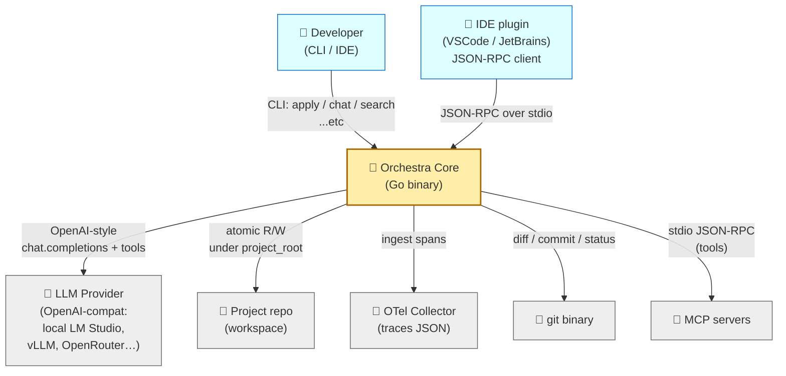
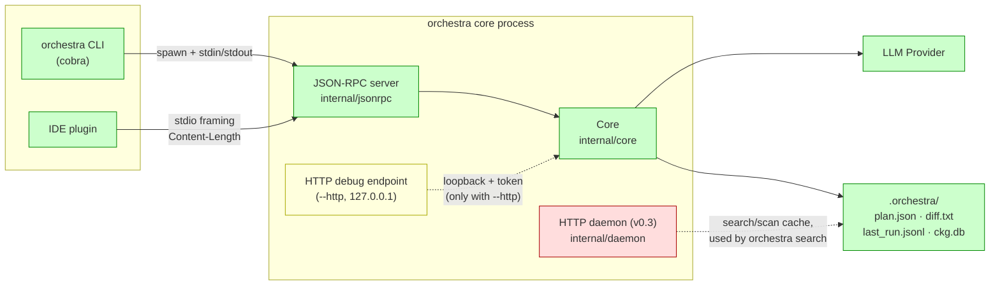
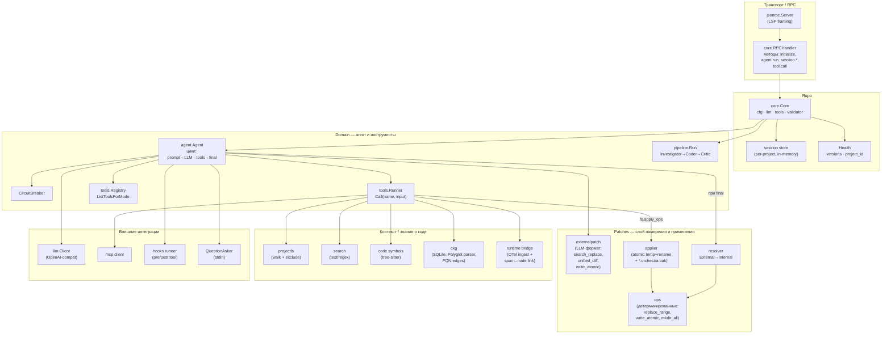
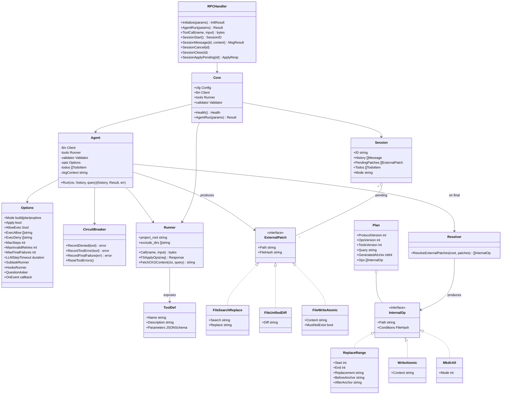
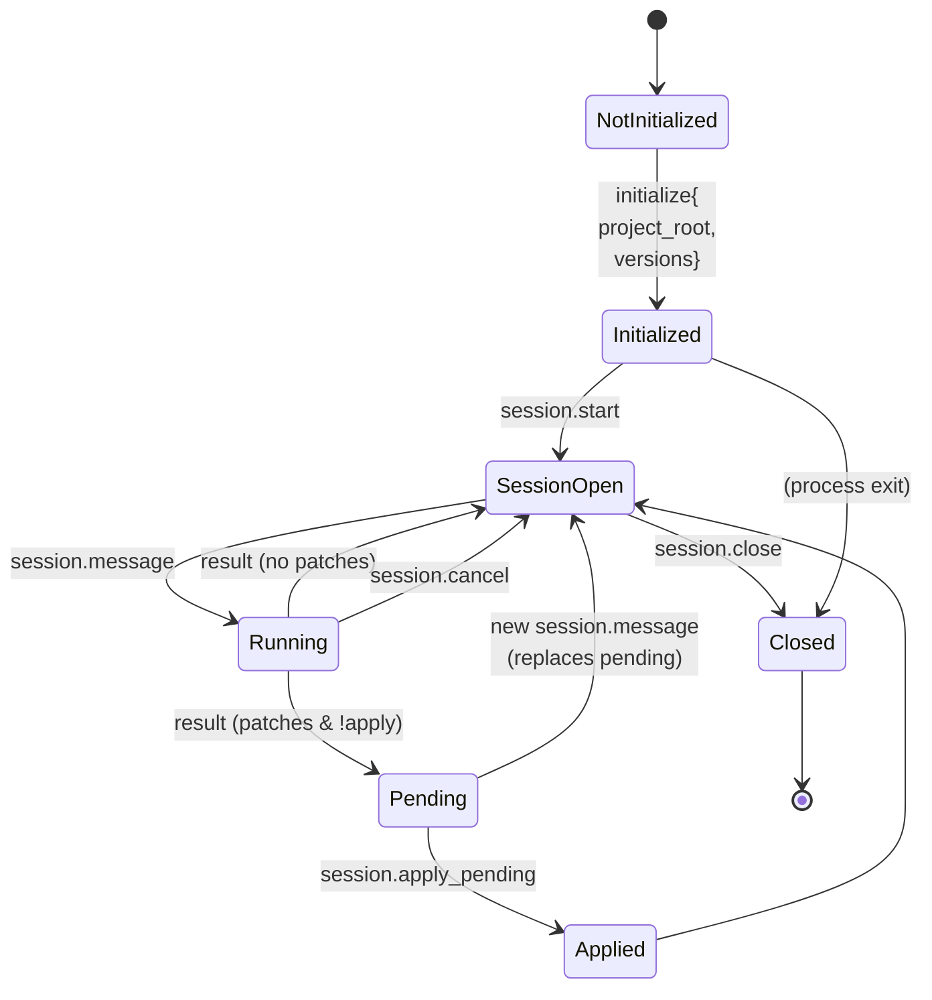
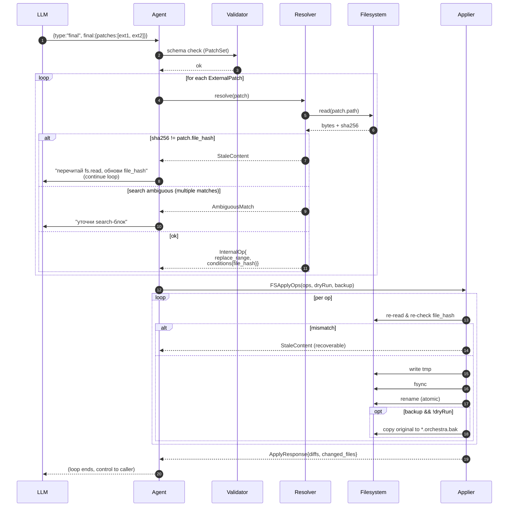
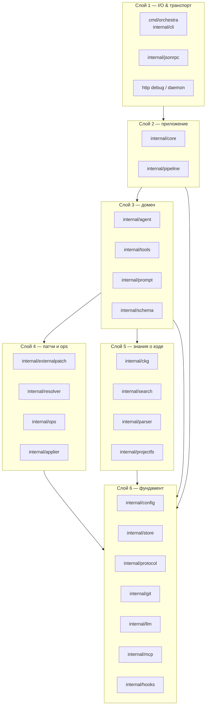
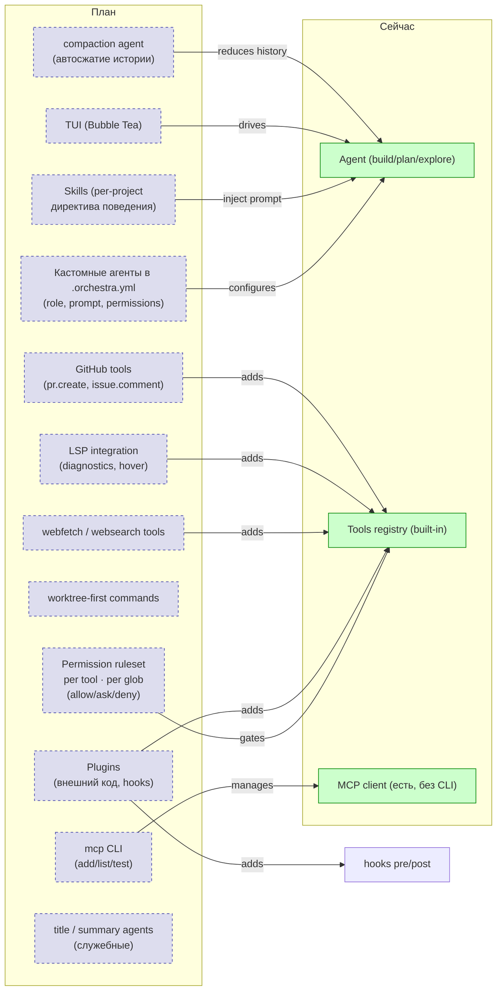
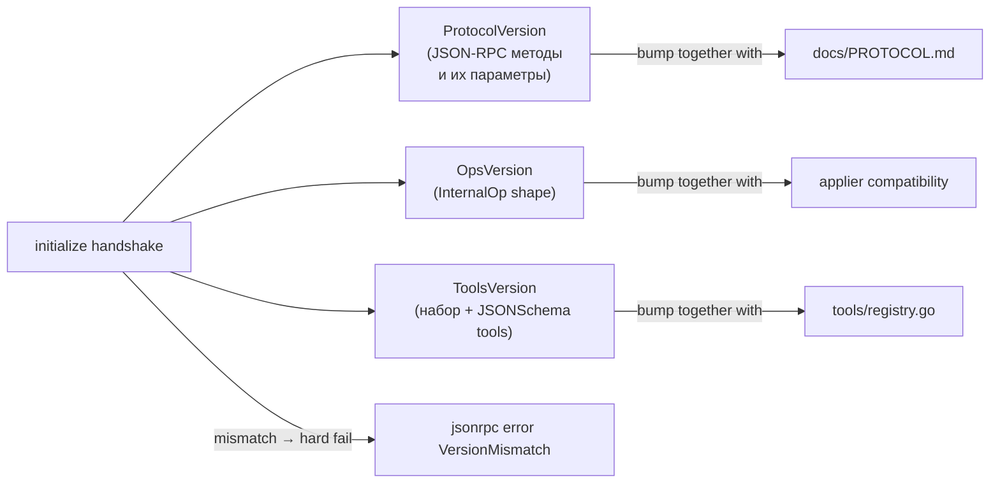

# Архитектура Orchestra — целевая модель (UML)

Документ фиксирует **целевой** облик Orchestra — то, к чему ведёт
vNext-транзиция. Используется как «карта местности» для будущих фич
(TUI, кастомные агенты, Skills, GitHub-tools, multi-provider) и как
основа для код-ревью больших изменений.

Все диаграммы — Mermaid. Открываются в GitHub, VS Code, IntelliJ из коробки.

---

## 1. Контекст продукта (C4 — System Context)

Что такое Orchestra с точки зрения пользователя и внешних систем.

---

## 2. Контейнеры (C4 — Containers)

Что развёрнуто и как. Главный поток — **stdio JSON-RPC**; всё остальное —
debug/legacy.

**Принцип:** stdio JSON-RPC — *единственный* поддерживаемый транспорт.
HTTP-debug и HTTP-daemon — служебные/унаследованные, без гарантий стабильности
протокола.

---

## 3. Внутренние компоненты (C4 — Components)

Как устроен `internal/core` и его соседи. Сгруппировано по слоям ответственности.

---

## 4. Доменная модель (Class-style)

Ключевые типы. Не один-в-один Go-структуры, а *логическая* схема —
что от чего зависит и какие у чего инварианты.

**Инварианты, которые удерживает эта модель:**
- LLM никогда не видит и не порождает `InternalOp` — только `ExternalPatch`.
- Каждый `ExternalPatch` несёт `file_hash` версии, которую модель читала.
- `Resolver` перечитывает файл и заново вычисляет ranges + хэш →
  если файл сместился, мы получаем `StaleContent`, а не «применили в неверное место».
- Любой `InternalOp` несёт `Conditions.FileHash`, и applier перепроверяет
  его *прямо перед* записью.
- Запись = atomic (temp → fsync → rename) + опциональный `*.orchestra.bak`.

---

## 5. Состояния сессии (`session.*`)

Ключевое:
- `pending` патчи живут до следующего `session.message` или явного `apply_pending`;
- `cancel` прерывает текущий ход, но сессию не закрывает;
- режим (`build`/`plan`) — атрибут *хода* (`session.message`), не сессии.

---

## 6. Жизненный цикл патча (sequence)

Полный путь от промта до диска — самый важный sequence, потому что
именно здесь живут гарантии безопасности.

---

## 7. Слои (architecture layers)

Цель этой диаграммы — зафиксировать правило зависимостей: **внутренние слои
не знают о внешних**. Поломка этого правила = архитектурный долг.

**Правила:**
1. `internal/agent` не знает про `internal/cli` и `internal/jsonrpc`.
2. `internal/tools` не знает про `internal/agent` (только про `Runner`-API).
3. `internal/resolver` не знает про `internal/agent`.
4. `internal/ops` — *только* типы и валидация, никакой логики применения
   (это в `applier`).
5. `internal/protocol` — версии, коды ошибок, никаких зависимостей наружу.

---

## 8. Целевая схема расширений (то, чего пока нет, но к чему движемся)

Каждый блок справа — потенциальная отдельная sub-feature. Левая сторона
показывает точку расширения, в которую он встраивается. Это чек-лист для
будущих спецификаций в `docs/superpowers/specs/`.

---

## 8.1. Архитектурный контраст с OpenCode

Сравнительный анализ инструментов (детально — `docs/commands-and-modes.md`,
разделы 3.3–3.4) показывает, что главная архитектурная ставка отличается:

```mermaid
flowchart TB
    subgraph OpenCode["OpenCode (TS, Bun)"]
        oc_llm[LLM]
        oc_tool["edit.ts / write.ts /<br/>apply_patch.ts"]
        oc_disk[(Disk)]
        oc_lsp[LSP diagnostics]
        oc_llm -->|tool_call| oc_tool
        oc_tool -->|direct write| oc_disk
        oc_tool -->|after-edit feedback| oc_lsp
        oc_lsp -->|errors back| oc_llm
    end

    subgraph Orchestra["Orchestra (Go)"]
        or_llm[LLM]
        or_ext["External Patch<br/>(file.search_replace,<br/>file.unified_diff,<br/>file.write_atomic)"]
        or_res["Resolver<br/>(ranges + anchors +<br/>file_hash check)"]
        or_int["Internal Ops<br/>(replace_range,<br/>write_atomic, mkdir_all)"]
        or_app["Applier<br/>(atomic write +<br/>.orchestra.bak)"]
        or_disk[(Disk)]
        or_plan[(plan.json)]
        or_llm -->|final.patches| or_ext
        or_ext -->|resolve| or_res
        or_res -->|typed ops| or_int
        or_int -->|persist| or_plan
        or_int -->|apply| or_app
        or_app --> or_disk
        or_plan -.->|--from-plan replay| or_app
    end

    classDef oc fill:#fdd,stroke:#a44
    classDef or fill:#dfd,stroke:#4a4
    class oc_llm,oc_tool,oc_disk,oc_lsp oc
    class or_llm,or_ext,or_res,or_int,or_app,or_disk,or_plan or
```

**Ключевая разница**: у OpenCode инструмент = функция, которая решает всё
сразу (понять патч, вычислить ранжи, проверить permission, записать,
прогнать LSP). У нас инструмент возвращает **намерение** (External Patch),
дальше есть отдельные слои за валидацию, нормализацию и применение.

Что это даёт:

| Свойство | OpenCode | Orchestra |
|---|---|---|
| Replayable план без LLM | ❌ нет понятия плана | ✅ `plan.json` + `--from-plan` |
| Hash-условие на момент записи | ❌ только «должен был Read» | ✅ `conditions.file_hash` в каждой mutating op |
| Точка вставки policy/audit | внутри тула | `resolver` или `applier` |
| Forgiving edit | ✅ 9 fallback-стратегий | ❌ строгий, hard-fail |
| LSP feedback loop | ✅ | ❌ (но есть CKG) |

Это компромисс по дизайну: они оптимизируют **first-shot success rate**
(LLM с большей вероятностью попадёт), мы — **корректность и
аудитируемость** (если LLM не попал, провал явный и diagnostic-понятный).

Идеи на стыке (в `commands-and-modes.md` §3.4 «Топ-5 заимствований»)
позволяют забрать UX-выгоды OpenCode без слома нашего двухслойного
контракта.

---

## 9. Стрелки версий (контракт)

Изменение протокола ломает интеграции. Чтобы это было заметно — три
независимых счётчика, в `internal/protocol/version.go`:

`initialize` — единственная точка, где клиент и сервер согласуют
все три версии. После — только совместимые вызовы; иначе — отказ.

---

## 10. Где смотреть код

| Концепт диаграммы | Файлы |
|---|---|
| RPC handler | `internal/core/rpc_handler.go` |
| Agent loop | `internal/agent/agent.go` |
| Tool registry | `internal/tools/registry.go` |
| Modes | `agent.go::ModeBuild/Plan/Explore`, `registry.go::ListToolsForMode` |
| External patches | `internal/externalpatch/` |
| Internal ops | `internal/ops/` |
| Resolver | `internal/resolver/` |
| Applier | `internal/applier/` |
| Pipeline | `internal/pipeline/pipeline.go` |
| CKG | `internal/ckg/` |
| Runtime bridge | `ckg.IngestTrace`, `internal/cli/runtime.go` |
| Versions | `internal/protocol/version.go` |
| Session methods | `internal/cli/chat.go`, `core/session.go` |
