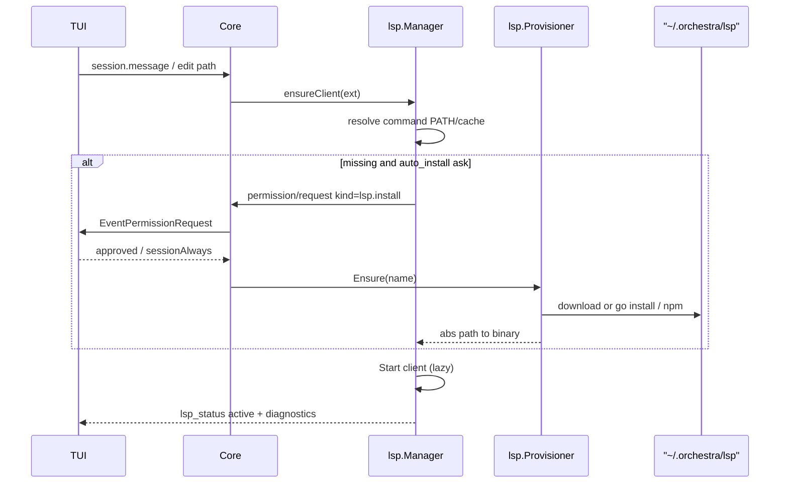

# ТЗ / план: LSP Auto-Provision (TUI-first)

**Проект:** Orchestra  
**Версия:** 0.1 (2026-08-06)  
**Статус:** фаза A ✅ · фаза B ✅ (gopls ensure + TUI consent) · C частично ✅ · D pending  
**Продуктовый фокус:** default UX = **TUI** (`orchestra` / `orchestra tui`), не CLI `apply`.  
**Связано:**
- [`semantic-dry-run-tz.md`](./semantic-dry-run-tz.md) — фазы 1–4 ✅; Phase 5+ polyglot defaults
- [`tui-chrome.md`](./tui-chrome.md) — status bar LSP ●/◐/○
- [`tui-pipeline.md`](./tui-pipeline.md) — `permission/request` path
- [`planner-worker.md`](./planner-worker.md) — validation loop опирается на готовый LSP
- `docs/tools-overview.md` §LSP
- Audit leftovers: C4 init timeout, crash retry (`docs/superpowers/plans/2026-05-19-post-audit-refactor.md`)

---

## 0. Проблема

Semantic dry-run (AST-Gate + Staging⇄LSP + diagnostics) **уже работает**, но language server:

1. Нужно **вручную** прописать в `.orchestra.yml` и **вручную** поставить бинарь.
2. Сейчас у многих пользователей (и в этом репо) в yaml только `gopls`, а `gopls` часто **нет в PATH** → TUI показывает `LSP ○`, tools/diagnostics пустые.
3. Новый проект «с нуля» в TUI не получает polyglot LS автоматически.

**Цель:** в TUI открыл проект / агент впервые тронул `.go`/`.ts`/`.py` → Orchestra **предложила** поставить нужный LS → после согласия скачала в user-cache → lazy spawn → diagnostics loop как сейчас.

**Non-goals этой волны:**
- Бандл gopls/tsserver/pyright внутрь `orchestra.exe`
- Silent download без consent (кроме явного `auto_install: true`)
- Полный VFS / enforced «не apply пока LSP красный»
- Planner–Worker (отдельный doc)
- Автоустановка **рантаймов** языка (`go`, `node`, `python`) — только language servers; runtime doctor отдельно

---

## 1. Как делают другие (кратко)

| Продукт | Механизм |
|---------|----------|
| VS Code / Cursor | Extension → prompt → install tool (`gopls` в `$GOPATH/bin`) |
| Zed | Detect файла → download LS в editor cache |
| Neovim + mason | Catalog + `ensure_installed` в `~/.local/share/...` |
| Agent CLI (Crush / Claude) | Часто только PATH; OpenCode — частичный auto-install |

**Общий паттерн:** registry рецептов → detect → resolve (PATH → cache → download) → lazy spawn.  
Orchestra уже имеет **lazy_start + TTL + multi-server yaml** — не хватает **registry + ensure + TUI consent**.

---

## 2. Целевой UX (TUI-first)

### 2.1 Happy path — проект с нуля

```
orchestra tui / orchestra
  → init/onboarding при необходимости
  → .orchestra.yml получает polyglot lsp.servers (имена из registry)
  → agent пишет main.go / index.ts
  → первый edit/write/lsp.* для языка
  → core: LS missing → permission/request (kind=lsp.install)
  → TUI modal (как shell ask):
        «Установить gopls (~15MB) в ~/.orchestra/lsp ?»
        [y] сейчас  [a] всегда auto  [n] пропустить
  → ensure + lazy spawn
  → status: LSP ○ → ◐ → ●
  → diagnostics в tool block как сегодня
```

### 2.2 Повторные сессии

- Уже стоит в cache/PATH → без modal, сразу spawn.
- `auto_install: true` (после `[a]` или prefs) → silent ensure.
- `auto_install: false` / CI → soft degrade, без сети.

### 2.3 Status bar / discoverability

| Состояние | Glyph | Смысл |
|-----------|-------|-------|
| нет servers / disabled | `LSP ○` (muted) | off |
| configured, ещё не трогали / после WarmupStart | `LSP ●` (green) | core warmup spawns clients |
| ensure/download / starting | `LSP ◐` (warning) + hint «ставлю gopls…» | installing |
| живой client | `LSP ●` (green) | active |
| failed | `LSP ○` + toast/system notice | soft degrade |

Hints в status (RU), не постоянная легенда — по [`tui-chrome.md`](./tui-chrome.md).

### 2.4 CLI — вторичный

CLI не primary UX, но нужен для CI/doctor:

```text
orchestra lsp list
orchestra lsp status
orchestra lsp ensure [go|typescript|python|rust|…]
orchestra lsp doctor
```

Headless `apply --via-core`: без TUI requester → `auto_install: true` или заранее `ensure`; иначе skip + empty diagnostics.

---

## 3. Архитектура



### 3.1 Пакеты

| Слой | Ответственность |
|------|-----------------|
| `internal/lsp/registry` | Built-in catalog: language, extensions, root markers, install recipe, checksum policy |
| `internal/lsp/provision` | Resolve PATH → `~/.orchestra/lsp/<name>/<ver>/`; Ensure; Doctor |
| `internal/lsp/manager.go` | Перед `Start`: Resolve; при miss → InstallGate (callback) |
| `internal/config` | `lsp.auto_install: ask\|true\|false`; polyglot defaults helper |
| `internal/permission` / core RPC | Расширить `PermissionRequest` kind (`exec` vs `lsp.install`) **или** отдельный `lsp/install_request` |
| `ui/tui` | Modal copy + `[y]/`[a]`/`[n]`; persist `ui.lsp_auto_install`; status/hints |
| `internal/cli` | `orchestra lsp …` (thin); `init` пишет активный polyglot блок |

### 3.2 Resolve order

1. Явный absolute `command[0]` из yaml (если path существует)  
2. `exec.LookPath(command[0])`  
3. Cache: `~/.orchestra/lsp/<serverID>/<version>/<bin>`  
4. Если miss + policy позволяет → Ensure  
5. Fail → soft degrade (AST-Gate остаётся; diagnostics `[]`; log + optional notice)

### 3.3 Install recipes (v1)

| ID | Extensions | Recipe (предпочитаемый) | Fallback |
|----|------------|-------------------------|----------|
| `gopls` | `.go` | `go install golang.org/x/tools/gopls@<pin>` → copy/link в cache | — |
| `typescript-language-server` | `.ts`.`.tsx`.`.js`.`.jsx` | npm pack / `npm i -g` в cache prefix | требует `node`+`npm` на PATH |
| `basedpyright` или `pyright` | `.py` | npm или pip в cache | требует runtime |
| `rust-analyzer` | `.rs` | GitHub release asset + sha256 | — |

Pin versions в registry (как vscode-go). Обновление — позже (`lsp ensure --upgrade`).

### 3.4 Consent / security

- Default **`ask`** — сеть и exec installer только после TUI `[y]` / `[a]`.
- Бинарники **только** в `~/.orchestra/lsp/` (не в project root).
- Checksums для GitHub assets; для `go install` / npm — trust toolchain (документировать).
- Не ставим языковые SDK автоматически; `doctor` говорит «нужен Node для tsserver».
- Аналогия trust: как `shell · ask` / `ui.allow_exec`.

### 3.5 Permission wire (рекомендация)

**Предпочтительно** расширить существующий `permission/request` (меньше новых RPC):

```json
{
  "kind": "lsp.install",
  "tool": "lsp.provision",
  "server": "gopls",
  "detail": "Install gopls 0.16.x into ~/.orchestra/lsp (~15MB). Needed for Go diagnostics."
}
```

Ответ как сейчас + опционально `always: true` → core/TUI пишет `lsp.auto_install: true` в `.orchestra.yml` / prefs.

Альтернатива: отдельный method `lsp/install_request` — только если kind ломает текущих клиентов; TUI — единственный first-party client → kind OK.

---

## 4. Конфиг

```yaml
lsp:
  enabled: true
  auto_install: ask          # ask | true | false  (NEW; default ask)
  lazy_start: true
  idle_ttl_seconds: 300
  diagnostics_timeout_ms: 5000
  servers:
    - language: go
      extensions: [".go"]
      command: ["gopls", "serve"]
    - language: typescript
      extensions: [".ts", ".tsx", ".js", ".jsx"]
      command: ["typescript-language-server", "--stdio"]
    - language: python
      extensions: [".py"]
      command: ["basedpyright-langserver", "--stdio"]
    # rust — optional / detect
```

`orchestra init`:
- Пишет **активный** (не commented-only) блок go + ts + py.
- Detect workspace markers (`go.mod`, `package.json`, `pyproject.toml`, `Cargo.toml`) → можно сузить список (фаза B).

Prefs / TUI `[a]`:
- `ui.lsp_auto_install: true` зеркалится в `lsp.auto_install: true` (один source of truth предпочтительно — только `lsp.auto_install`).

---

## 5. Фазы реализации

### Фаза A — Registry + Resolve + Doctor (без download)

**Сделать:**
- `internal/lsp/registry` — catalog
- Resolve PATH + cache dir layout (пусто)
- `orchestra lsp list|status|doctor`
- Manager логирует «gopls not found; run orchestra lsp ensure» / TUI toast
- Status bar остаётся честным

**Приёмка:**
- [x] `go test ./internal/lsp/...`
- [x] doctor на машине без gopls → явный missing
- [x] с gopls в PATH → status ok без yaml path hacks
- [x] `lsp.auto_install` в config (ask|true|false)

**Статус:** ✅ реализовано (2026-08-06).

### Фаза B — Ensure + TUI consent

**Сделать:**
- `provision.Ensure` для **gopls** (первый end-to-end)
- `auto_install` config
- `permission/request` kind `lsp.install`
- TUI modal `[y]`/`[a]`/`[n]` + persist
- Status ◐ «ставлю…» / toast on fail
- Soft degrade без блочного падения agent turn

**Приёмка:**
- [x] Unit: ask+approve → Ensure + resolve cache; ask+deny → error
- [x] `orchestra lsp ensure go`
- [x] TUI modal kind=lsp.install + `[a]` → `lsp.auto_install: true`
- [x] Automated: RPC diagnostics on edit tool blocks (`ui/tui/rpcclient/diagnostics_test.go`, `view/tool_block_diagnostics_test.go`)
- [ ] Manual smoke in TUI after rebuild (modal + status bar — чеклист `ui/tui/README.md`)

**Статус:** ✅ реализовано (2026-08-06) — gopls only; TS/Python = фаза C.

### Фаза C — Polyglot + init

**Сделать:**
- Ensure recipes: typescript-language-server, basedpyright (rust optional)
- `orchestra init` пишет активный polyglot servers
- Workspace detect: при первом touch только релевантный server
- Docs: tools-overview + README TUI LSP section

**Приёмка:**
- [x] `orchestra init` пишет активный `lsp.servers` (detect или go+ts+py fallback)
- [x] Ensure recipes: typescript-language-server, basedpyright (`internal/lsp/provision/ensure.go`)
- [x] TS-only проект: runtime merge оставляет только tsserver (`MergeServersForWorkspace`)
- [x] Go+TS monorepo: оба server'а lazy, spawn по touch `.go`/`.ts` (`WarmupStart no-op при lazy_start`)

### Фаза D — Hardening (можно параллельно / после)

- [x] C4: timeout на LSP `initialize` (`lsp.initialize_timeout_ms`, default 15s)
- [x] Crash → lazy restart + `reopenStaged` (H6, max 3 restarts)
- [x] Pin/upgrade CLI: `orchestra lsp upgrade [id]`, `orchestra lsp ensure --upgrade`
- Optional: progress events `%` для длинного download в status hints

---

## 6. Порядок коммитов (рекомендуемый)

| # | Commit | Фаза |
|---|--------|------|
| 1 | `feat(lsp): registry + resolve PATH/cache layout` | A |
| 2 | `feat(cli): orchestra lsp list/status/doctor` | A |
| 3 | `feat(lsp): provision Ensure for gopls` | B |
| 4 | `feat(core): permission kind lsp.install` | B |
| 5 | `feat(tui): LSP install modal + status installing` | B |
| 6 | `feat(lsp): ensure typescript + pyright` | C |
| 7 | `feat(cli): init writes active polyglot lsp.servers` | C |
| 8 | `fix(lsp): initialize timeout + restart on crash` | D |
| 9 | `docs: lsp-auto-provision + tools-overview` | — |

---

## 7. Риски

| Риск | Mitigation |
|------|------------|
| Нет `go`/`node` для installer | doctor; modal текст «нужен Go toolchain»; не притворяться успехом |
| Долгий download блокирует agent step | ensure в фоне + `diagnostics_pending` / retry next tool; или block step с ◐ + cancel Esc |
| Supply chain | pin + checksums; cache isolation |
| Windows PATH / npm.cmd | provision tests на Windows CI |
| Двойной modal (shell + lsp) | очередь permission requests (FIFO), как один pending сейчас |

**Решение по UX блокировки (зафиксировать в impl):**  
v1 — **синхронно** ждать ensure внутри `ensureClient` (проще, честный ◐); Esc cancel turn отменяет install ctx.  
v2 — async ensure + empty diagnostics once — если sync окажется слишком долгим.

---

## 8. Метрики успеха

| Метрика | Baseline | Target |
|---------|----------|--------|
| TUI на чистой машине с Go toolchain, без ручного gopls | LSP мёртв | после одного `[y]` — diagnostics в dry-run |
| Шагов до первого полезного LSP feedback | «прочитай docs + go install» | 1 modal |
| Eager RAM на старте TUI | 0 (lazy) | 0 (lazy + no ensure until touch) |
| Языки из коробки (init) | Go comment-only | Go + TS/JS + Python active yaml |

---

## 9. Связь с Planner–Worker

Planner–Worker **зависит** от стабильного LSP loop. Auto-provision — **prerequisite UX**, не часть planner doc.  
После фаз B–C можно возвращаться к [`planner-worker.md`](./planner-worker.md) без «сначала поставь gopls руками».

---

## 10. Решение зафиксировать до кода

1. **Primary surface:** TUI modal на `permission/request` (`kind=lsp.install`).  
2. **Default policy:** `auto_install: ask`.  
3. **Cache:** `~/.orchestra/lsp/<id>/<ver>/`.  
4. **Первый бинарь в B:** gopls only; C — ts + python.  
5. **Не бандлить** LS в release binary.  
6. **Init:** активный polyglot yaml (фаза C), не только comments.

После аппрува плана — реализация с фазы A.
