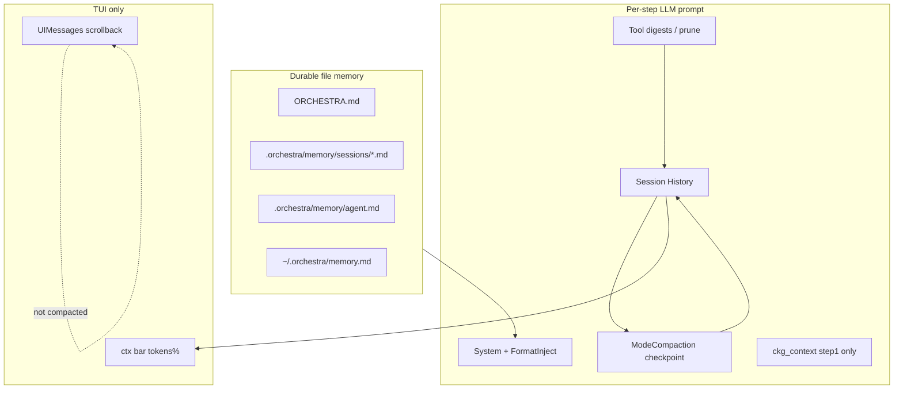

# Memory, context optimization, summarization

Канон слоёв памяти и компакции. Продуктовый обзор: [`docs/memory.md`](../memory.md).  
Как смотреть overflow / сравнение с Claude Code & OpenCode: [`context-overflow.md`](context-overflow.md). Roadmap phases ниже.

## Layers (do not mix)

| Layer | Purpose | Code |
|-------|---------|------|
| File memory | Durable facts (project/session/global) | `internal/memory/` |
| **Lessons (L1 episodic)** | Dept-scoped anti-patterns / fixes from workers | `.orchestra/memory/lessons/<dept>.md`, `internal/lessons/` |
| **Playbooks (L2/L3)** | Dept rules + local overlay → merge | `.orchestra/playbooks/`, `internal/playbooks/` |
| LLM history | Working turn memory | `internal/agent`, `session.History` |
| Tool digests / prune | Shrink large tool outputs | `internal/agent/digest`, `history/prune.go` |
| Working state / turn digest | Rule-based ledger + end-of-turn digest (no LLM) | `internal/agent/working` |
| Compaction | LLM summarize history → checkpoint | `internal/agent/compact.go` |
| TUI scrollback | Human view | `UIMessages` — independent of LLM compact |

## Compaction as-is

**Trigger** (`shouldCompactHistory`): history bytes **or** estimated/real prompt
tokens exceed `compact_threshold_pct` of the prompt budget. With the default
`compact_threshold_pct: 0` that percentage is derived from the model window
(`config.AutoCompactThresholdPct`): 60% below 32k tokens, 75% below 100k, 85%
above — a fixed 60% on a 200k model throws away working memory the run still had.

Budget is aligned with vLLM's wire check `prompt + max_tokens ≤ max_model_len`:
`PromptBudgetTokens(num_ctx, llm.max_tokens)` / `EffectiveMaxPromptBytes` (same reserve
in bytes). When the previous step's real `PromptTokens` already cannot leave room for
`max_tokens`, compaction fires immediately.

**Loop** (top of each agent step):
1. Retroactive prune (keep last N tool atoms full)
2. Soft path: digests already applied write-time
3. Hard path: `ModeCompaction` → `[Session checkpoint — structured summary]`
   over the **older** history only; the recent tail (`splitHistoryForCompaction`:
   30% of the prompt budget, min `history_prune_keep_recent` tool atoms, capped
   at half the history) is carried over verbatim
4. Guard: &lt;20% shrink or LLM fail → `truncateMessages`
5. Persist: session `ReplaceHistory(outHistory)` after turn (Phase 0)
6. Event `CONTEXT_COMPACTED` → TUI notice

**Sticky prefix** (Phase 1): checkpoint keeps original goal + recent tool atoms, not a single opaque blob.

**Usage trigger**: when last step reported real `PromptTokens`, prefer that over byte estimate.

## Session History invariant

After every `session.message` turn, `sess.History` **must equal** the agent `outHistory` (full rewrite). Append-only delta is wrong when compaction rewrites the prefix.

This includes **failed / soft-stopped turns** (`max_steps`, mid-turn errors that still return history). Previously `err != nil` skipped `ReplaceHistory`, so TUI `ui_sync` saved the chat while agent history stayed empty — reopen looked fine in UI but the model re-explored from scratch.

UIMessages stay full for the human; only LLM History is compacted.

## Learning stack (L0–L3)

Episodic learning is **file-backed** and separate from session compaction:

| Layer | Path | Who writes | Promote flow |
|-------|------|------------|--------------|
| L0 scratch | `.orchestra/depts/<instance>.md` | workers (auto-append) | — |
| L1 lessons | `.orchestra/memory/lessons/<dept>.md` | `memory_write` (dept Lead) / worker recorder | 3× same anti-pattern → `lesson_promote_suggestion` → `lesson_promote` → local overlay |
| L2 playbook | `.orchestra/playbooks/<dept>.md` | Dept Lead + merge | sealed overlay → `playbook_promote_suggestion` → `playbook_promote` (single User approval) |
| L3 global | `.orchestra/playbooks/conventions.md` | Docs Lead | out of scope for auto-promote |

Runtime injects `<explore_first_policy>` on worker spawn and gates `write`/`edit` until explore (read/grep/explore). After merge to L2, `.orchestra/playbooks/local/<dept>.md` is removed. Orchestra/Architecture Lead prompts also receive `<dept_lessons_all>` and `<dept_playbooks>` so lessons and L2 rules persist across sessions. `orchestra init` creates `.orchestra/memory/lessons/` and `.orchestra/playbooks/local/` (local overlays are gitignored).

`memory_read` layer `lessons` and `memory_search` rank hits with hybrid semantic scoring when `embed.model` is set in `.orchestra.yml`; otherwise substring match (see `internal/memory/semantic.go`).

UI: `child_done` agent/event may include `lesson_promote_suggestion` / `playbook_promote_suggestion` (VS Code subagent badge + TUI system notice).

## Gaps vs ideal (Cursor / Claude Code / OpenCode)

| Capability | Status |
|------------|--------|
| Tool digest + prune | Done |
| Structured in-prompt compact | Done |
| Persist compact across turns | Phase 0 |
| Sticky prefix + usage trigger + `/compact` | Phase 1 |
| Sticky facts / ModeSummary→memory / `memory_search` | Phase 2 (+ hybrid semantic when `embed.model` set) |
| UI collapse old turns / `/memory` / ctx source | Phase 3 |
| Tokenizer calibration + metrics | Phase 4 |

## Phases

### Phase 0 — Persist
`Session.ReplaceHistory(outHistory)` after agent run; regression test multi-turn. **Done.**

### Phase 1 — Quality
Sticky prefix in `compactHistory`; usage-based trigger; TUI `/compact` force. **Done.**

### Phase 2 — Memory bank
Post-turn `ModeSummary` → project memory (`auto_summary_memory`); pinned facts (`[pin]`); `memory_search`. **Done.**

### Phase 3 — UX
Collapse old turns in chat view; `/memory` list/read; ctx bar `~` for estimate. **Done.**

### Phase 4 — Hardening
`bytes_per_context_token` config; `CompactMetrics` on agent. **Done.**

## Non-goals
- Mixing UIMessages into LLM compaction
- Replacing digests with LLM-only compact
- Separate vector DB for memory before reusing CKG embed path
