# Orchestra — маршрутизация по AI Tiers (L1–L5)

**Статус:** design spec (2026-08) — Single Source of Truth для реализации на Go
**Основа для:** `orchestra_routing.yaml`, `internal/config/orchestra.go`, `internal/tasks`, `internal/prompt/files/`*
**Связано:** [planner-worker.md](./planner-worker.md) · [orchestra-vnext.md](./orchestra-vnext.md) · [modes.md](../modes.md)


| Раздел                                           | Содержание                                        |
| ------------------------------------------------ | ------------------------------------------------- |
| [0. Инварианты системы](#0-инварианты-системы)   | Что рантайм обязан гарантировать                  |
| [1. Матрица AI Tiers](#1-матрица-ai-tiers-l1l5)  | L1–L5, Router, сопоставление с текущим конфигом   |
| [2. Структура](#2-структура)                     | Компоненты, отделы, типы и инстансы, артефакты    |
| [3. Процесс](#3-процесс--этапы-06)               | Этапы 0 → 1 → 2 → 2.5 → 3 → 4 → 5 → 6a → 6b → 6c  |
| [4. Сессия пользователя](#4-сессия-пользователя) | Фазы, Question Barrier, гейты, spawn-контракты    |
| [5. Runtime-инварианты](#5-runtime-инварианты)   | Guards, verify, escalation, бюджет контекста      |
| [6. Playbooks и Briefs](#6-playbooks-и-briefs)   | L0/L1/L2, completeness gate, методология Security |
| [7. Контракты и схемы](#7-контракты-и-схемы)     | WorkOrder, Router, routing matrix, YAML           |
| [8. Roadmap](#8-roadmap-реализации)              | PR1–PR10, checklist                               |
| [9. ADR index](#9-adr-index)                     | Где в тексте реализовано каждое решение           |
| [10. Ссылки](#10-ссылки)                         | Пути в кодовой базе                               |


> **Диаграммы (SVG):** [orchestra-structure.svg](./orchestra-structure.svg) — компоненты · [orchestra-process.svg](./orchestra-process.svg) — этапы × отделы.
> Обе SVG отрисованы до введения этапа 2.5 и подлежат перегенерации в PR8. Актуальный источник процесса — раздел [3](#3-процесс--этапы-06).

---

## 0. Инварианты системы

Промпты задают намерение. Инвариант — это то, что проверяет **Go-рантайм**; всё, что нельзя проверить кодом, инвариантом не является и в этот список не входит.


| #   | Инвариант               | Механизм                                                           | Раздел                                     |
| --- | ----------------------- | ------------------------------------------------------------------ | ------------------------------------------ |
| 1   | **Tier, не model ID**   | Orchestrator оперирует `required_tier`; Router резолвит провайдера | [1](#1-матрица-ai-tiers-l1l5)              |
| 2   | **Zero Context Rot**    | Worker получает только WorkOrder JSON, без истории чата            | [2.2](#22-hub-and-spoke)                   |
| 3   | **Contract-first**      | Домен, NFR и OpenAPI v0 существуют **до** spawn отделов            | [3.5](#35-этап-25--contract-freeze)        |
| 4   | **Contract Epoch**      | WorkOrder несёт хэши контрактов; смена версии инвалидирует задачи  | [5.3](#53-contract-epoch-guard)            |
| 5   | **Relay — код, не LLM** | Вопросы и ответы ретранслирует рантайм, не L5-turn                 | [4.3](#43-question-barrier-и-decision-log) |
| 6   | **Artifact Verify**     | Ни один артефакт не уходит в handoff без машинной проверки         | [5.4](#54-verify-код-и-артефакты)          |
| 7   | **Fail-closed spawn**   | Фазовый guard блокирует worker вне `execution`/`maintenance`       | [5.1](#51-phase-guard)                     |
| 8   | **No dead ends**        | Каждый guard имеет документированный unblock path                  | [5.2](#52-guard--unblock-path)             |
| 9   | **Bounded hub context** | `state.md` ограничен, закрытые эпики архивируются                  | [5.7](#57-бюджет-контекста-l5)             |
| 10  | **Org freeze by type**  | 7 типов отделов + Platform; масштабирование инстансами             | [2.3](#23-отделы--типы-и-инстансы)         |


**Design goal:** перевести Orchestra из «промпт, вызывающий другие промпты» в операционную систему автономной разработки: tier-first routing, hub-and-spoke, детерминированная ретрансляция, контракт как версионируемый артефакт.

---

## 1. Матрица AI Tiers (L1–L5)

Уровни описывают **физику моделей** — глубину рассуждения, окно контекста, надёжность tool-calling, латентность, стоимость. Не бренд провайдера. Все последующие разделы оперируют этими обозначениями.

### 1.1 Обзор


| Tier   | Класс                  | Роль в Orchestra                                            | Ключ конфига                        |
| ------ | ---------------------- | ----------------------------------------------------------- | ----------------------------------- |
| **L5** | Ultra / Pro — флагманы | **Orchestrator** — декомпозиция, конфликты, фазовые решения | `roles.L5` / `planner`              |
| **L4** | Plus / Optimal         | Dept Leads, Product, Documentation, Platform, Verifier      | `roles.L4`, `L4_product`, `L4_docs` |
| **L3** | Heavy Local, 14B–35B   | Workers — исполнители по WorkOrder                          | `tiers.complex`, `tiers.focused`    |
| **L2** | Flash / Mini           | Explorer, компакция контекста, read-only Q&A                | `roles.L2` / `explore`              |
| **L1** | Nano / Edge, 1B–8B     | Micro Workers — правки в 1–2 строки                         | `tiers.micro`                       |


### 1.2 Полная матрица


| Уровень                    | Коммерческий класс           | Роль в Orchestra                                          | Главная сила                                                                                    | Ограничения                                                                 | Идеальные задачи                                                                      | Топ модели (2026-08)                                                                                                                                                                            |
| -------------------------- | ---------------------------- | --------------------------------------------------------- | ----------------------------------------------------------------------------------------------- | --------------------------------------------------------------------------- | ------------------------------------------------------------------------------------- | ----------------------------------------------------------------------------------------------------------------------------------------------------------------------------------------------- |
| **🔴 L5 Mastermind**       | Ultra / Pro *флагманы*       | **Orchestrator**                                          | Глубокое абстрактное мышление; макро-контекст; архитектурные компромиссы; надёжный tool calling | Дорого за токен; низкая скорость генерации                                  | Декомпозиция эпиков; фазовые решения; conflict resolution между владельцами контракта | **Anthropic** `claude-opus-4-7` **OpenAI** `o3`, `gpt-4.1` **Google** `gemini-2.5-pro` **DeepSeek** `deepseek-reasoner` **xAI** `grok-3`                                                        |
| **🟠 L4 Domain Expert**    | Plus / Optimal *оптимальные* | **Department Leads + Product + Documentation + Platform** | Сильная инженерия в одной области; PRD; playbooks; домен и OpenAPI; project docs                | «Плывут» на full-system design без Orchestrator L5                          | PRD; Domain_Model; схемы БД; OpenAPI; design review; verify по acceptance             | **Anthropic** `claude-sonnet-4-6` **OpenAI** `gpt-4.1-mini` **Qwen** `qwen3-235b-a22b` **Meta** `llama-3.3-70b-instruct` **DeepSeek** `deepseek-chat`                                           |
| **🟡 L3 Focused Coder**    | Heavy Local *14B – 35B*      | **Mid Workers**                                           | Код по строгому WorkOrder в 1–2 файла                                                           | Галлюцинируют без ТЗ и якорей; ломают вложенный JSON без schema-enforcement | Изолированные функции; UI-компоненты; CRUD-эндпоинты по WorkOrder                     | **Qwen** `qwen2.5-coder-32b`, `qwen-3-32b` **DeepSeek** `deepseek-coder-33b` **Mistral** `codestral-latest` **Meta** `llama-3.3-70b` *(quant)*                                                  |
| **🟢 L2 Context Explorer** | Flash / Mini *скауты*        | **Explore Agents + компакция state**                      | Большое окно контекста; скорость чтения                                                         | Урезана способность к сложному программированию                             | Парсинг логов; поиск по репозиторию; суммаризация; rolling summary для hub            | **Google** `gemini-2.5-flash`, `gemini-2.0-flash` **OpenAI** `gpt-4o-mini`, `gpt-4.1-nano` **Anthropic** `claude-haiku-4-5-20251001` **xAI** `grok-3-mini` **Moonshot** `kimi-k2-turbo-preview` |
| **🔵 L1 Micro Fixer**      | Nano / Edge *1B – 8B*        | **Micro Workers**                                         | Максимальная скорость; ~6–8 GB VRAM                                                             | Не думают системно; ненадёжны на tool-call с вложенным JSON                 | Фиксы линтера; правка импортов; rename — там, где нет детерминированного инструмента  | **Qwen** `qwen2.5-coder-7b` **Meta** `llama-3.1-8b-instant` **OpenAI** `gpt-4.1-nano` **Groq** `gemma2-9b-it` **Cerebras** `llama3.1-8b`                                                        |


### 1.3 Tier Router

Orchestrator не выбирает model ID — только `task_type` и `required_tier`. Router резолвит провайдера из конфига.

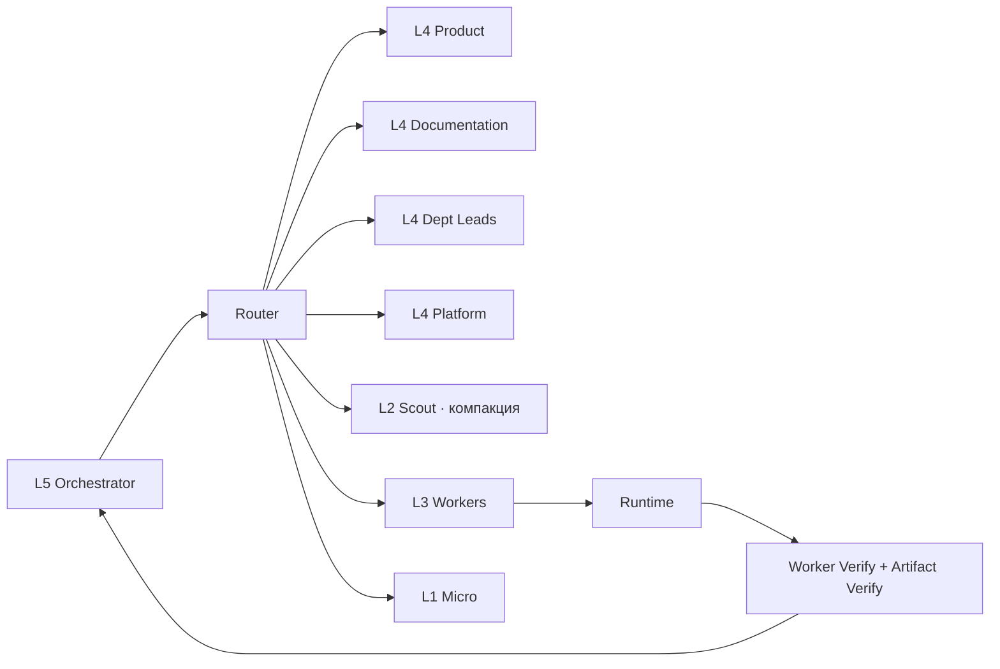
```mermaid
flowchart LR
    L5["L5 Orchestrator"] --> R["Router"]
    R --> L4P["L4 Product"]
    R --> L4D["L4 Documentation"]
    R --> L4["L4 Dept Leads"]
    R --> L4PL["L4 Platform"]
    R --> L2["L2 Scout · компакция"]
    R --> L3["L3 Workers"]
    R --> L1["L1 Micro"]
    L3 --> RT["Runtime"]
    RT --> VF["Worker Verify + Artifact Verify"]
    VF --> L5
```


Порядок резолва: `required_tier` → `orchestra_routing.yaml` / `orchestra.tiers` → `provider` + `model` → spawn subagent с узким промптом без истории чата.

### 1.4 Сопоставление с текущим конфигом

`.orchestra.yml` сегодня использует имена `planner`, `complex`, `focused`, `micro`. Схема L1–L5 — надмножество: explore и department leads выделены явно.


| Tier   | Ключ в YAML                                       | Subagent                       | Кто вызывает              |
| ------ | ------------------------------------------------- | ------------------------------ | ------------------------- |
| **L5** | `orchestra.planner`                               | — (top-level `mode=orchestra`) | User ↔ Orchestrator       |
| **L4** | `orchestra.departments.product` *(planned)*       | `product`                      | Orchestrator, этап 0      |
| **L4** | `orchestra.departments.documentation` *(planned)* | `documentation`                | Orchestrator, этап 1      |
| **L4** | `orchestra.departments.`* *(planned)*             | `architecture`, `debug`        | Orchestrator, этапы 2.5–4 |
| **L4** | `orchestra.platform` *(planned)*                  | Platform                       | Orchestrator, этап 6b     |
| **L3** | `orchestra.tiers.complex`                         | `worker` + `tier: complex`     | Dept Lead → Orchestrator  |
| **L3** | `orchestra.tiers.focused`                         | `worker` + `tier: focused`     | Dept Lead → Orchestrator  |
| **L1** | `orchestra.tiers.micro`                           | `worker` + `tier: micro`       | Dept Lead → Orchestrator  |
| **L2** | `orchestra.explore` *(planned)*                   | `explore`                      | Orchestrator / Dept Lead  |
| **L2** | `auto_router` / fast provider                     | `ask`                          | Tab / Orchestrator        |


Миграция: поле WorkOrder `"tier": "focused"` сохраняется; Router добавляет `"required_tier": "L3"` как канонический уровень.

---

## 2. Структура

Статическая карта системы: компоненты, отделы, артефакты. Динамика — в разделе [3](#3-процесс--этапы-06).

### 2.1 Слои и компоненты

Раздел содержит две схемы разного масштаба. **Контур управления** — полная хронология этапов 0 → 6c: кто кого запускает, какой артефакт открывает следующую фазу. **Контур исполнения** — увеличение этапов 4–6: как WorkOrder превращается в проверенный патч (Router, hash check по `EPOCH.yaml`, петля fail → hint). Этапы 0–2.5 выполняются один раз на проект, этапы 3–6c — циклом по эпикам ([3.1](#31-сквозной-pipeline)).

**Контур управления — полная хронология 0 → 1 → 2 → 2.5 → 3 → 4 → 5 → 6a → 6b → 6c**

Каждая секция — один этап. Внутри секции: кого Orchestrator спавнит и какой артефакт этот spawn обязан вернуть. Стрелка между секциями подписана условием, которое открывает следующий этап; пока условие не выполнено, рантайм отклоняет spawn следующей фазы ([5.1](#51-phase-guard)). Последовательность непрерывна — между ТЗ (этап 3) и delivery (6b) обязательно лежат WorkOrders (4), исполнение (5) и Verify (6a).

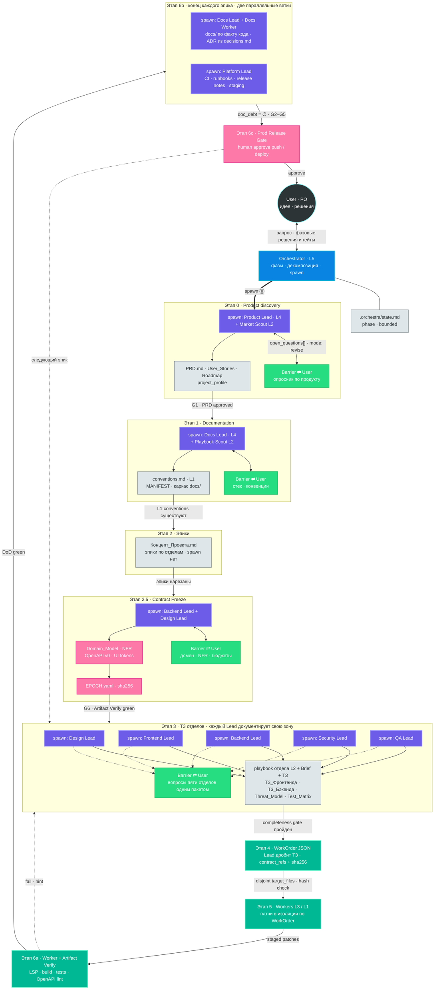
```mermaid
flowchart TB
    classDef user fill:#2d3436,stroke:#81ecec,stroke-width:2px,color:#fff
    classDef orch fill:#0984e3,stroke:#00cec9,stroke-width:2px,color:#fff
    classDef dept fill:#6c5ce7,stroke:#a29bfe,stroke-width:2px,color:#fff
    classDef artifact fill:#dfe6e9,stroke:#636e72,color:#2d3436
    classDef freeze fill:#fd79a8,stroke:#e84393,stroke-width:2px,color:#fff
    classDef next fill:#00b894,stroke:#55efc4,stroke-width:2px,color:#fff
    classDef rt fill:#26de81,stroke:#20bf6b,stroke-width:2px,color:#fff

    User(("User · PO<br>идея · решения")):::user
    Orch["Orchestrator · L5<br>фазы · декомпозиция · spawn"]:::orch
    State[".orchestra/state.md<br>phase · bounded"]:::artifact

    subgraph S0["Этап 0 · Product discovery"]
        PML["spawn: Product Lead · L4<br>+ Market Scout L2"]:::dept
        Q0["Barrier ⇄ User<br>опросник по продукту"]:::rt
        PRDdoc["PRD.md · User_Stories · Roadmap<br>project_profile"]:::artifact
        PML <-->|"open_questions[] · mode: revise"| Q0
        PML --> PRDdoc
    end

    subgraph S1["Этап 1 · Documentation"]
        DocsL["spawn: Docs Lead · L4<br>+ Playbook Scout L2"]:::dept
        Q1["Barrier ⇄ User<br>стек · конвенции"]:::rt
        DocsArt["conventions.md · L1<br>MANIFEST · каркас docs/"]:::artifact
        DocsL <--> Q1
        DocsL --> DocsArt
    end

    subgraph S2["Этап 2 · Эпики"]
        Concept["Концепт_Проекта.md<br>эпики по отделам · spawn нет"]:::artifact
    end

    subgraph S25["Этап 2.5 · Contract Freeze"]
        CFL["spawn: Backend Lead + Design Lead"]:::dept
        Q25["Barrier ⇄ User<br>домен · NFR · бюджеты"]:::rt
        CFA["Domain_Model · NFR<br>OpenAPI v0 · UI tokens"]:::freeze
        EPOCH["EPOCH.yaml · sha256"]:::freeze
        CFL <--> Q25
        CFL --> CFA --> EPOCH
    end

    subgraph S3["Этап 3 · ТЗ отделов · каждый Lead документирует свою зону"]
        L1["spawn: Design Lead"]:::dept
        L2["spawn: Frontend Lead"]:::dept
        L3["spawn: Backend Lead"]:::dept
        L4x["spawn: Security Lead"]:::dept
        L5x["spawn: QA Lead"]:::dept
        Q3["Barrier ⇄ User<br>вопросы пяти отделов одним пакетом"]:::rt
        Specs["playbook отдела L2 + Brief + ТЗ<br>ТЗ_Фронтенда · ТЗ_Бэкенда · Threat_Model · Test_Matrix"]:::artifact
        L1 --> Specs
        L2 --> Specs
        L3 --> Specs
        L4x --> Specs
        L5x --> Specs
        L1 -.-> Q3
        L2 -.-> Q3
        L3 -.-> Q3
        L4x -.-> Q3
        L5x -.-> Q3
    end

    S4["Этап 4 · WorkOrder JSON<br>Lead дробит ТЗ · contract_refs + sha256"]:::next
    S5["Этап 5 · Workers L3 / L1<br>патчи в изоляции по WorkOrder"]:::next
    S6a["Этап 6a · Worker + Artifact Verify<br>LSP · build · tests · OpenAPI lint"]:::next

    subgraph S6b["Этап 6b · конец каждого эпика · две параллельные ветки"]
        DocsL6["spawn: Docs Lead + Docs Worker<br>docs/ по факту кода · ADR из decisions.md"]:::dept
        Plat6["spawn: Platform Lead<br>CI · runbooks · release notes · staging"]:::dept
    end

    S6c["Этап 6c · Prod Release Gate<br>human approve push / deploy"]:::freeze

    User <-->|"запрос · фазовые решения и гейты"| Orch
    Orch --- State
    Orch ==>|"spawn ⓪"| PML

    PRDdoc -->|"G1 · PRD approved"| S1
    DocsArt -->|"L1 conventions существуют"| S2
    Concept -->|"эпики нарезаны"| S25
    EPOCH -->|"G6 · Artifact Verify green"| S3
    Specs -->|"completeness gate пройден"| S4
    S4 -->|"disjoint target_files · hash check"| S5
    S5 -->|"staged patches"| S6a
    S6a -->|"DoD green"| S6b
    S6a -.->|"fail · hint"| S3
    S6b -->|"doc_debt = ∅ · G2–G5"| S6c
    S6c -->|"approve"| User
    S6c -.->|"следующий эпик"| S3
```

Детализация этапов 4–6a — механика Router, hash check по `EPOCH.yaml`, staging и петля fail → hint — вынесена в контур исполнения ниже; здесь они сжаты до одного узла на этап, чтобы хронология читалась без разрыва. 6b обязан идти **после** 6a: Documentation и Platform работают только с кодом, прошедшим Verify, — связи Lead → Platform в обход верификации нет.

Как это читается:

- **Все узлы `spawn: …` запускает Orchestrator.** Subagent не может запустить subagent — единственное исключение Lead → Worker на этапах 4–5. Стрелка spawn нарисована только для этапа 0: если провести её во все секции, dagre поставит их на один ранг и хронологическая колонка развалится в горизонтальную ленту.
- **`Barrier ⇄ User` — это один компонент рантайма, а не пять.** Он показан внутри каждой секции, потому что диалог идёт на каждом этапе, но собирает вопросы всегда одинаково: subagent возвращает `open_questions[]` в `task_result`, рантайм показывает их пользователю одним пакетом, ответы уходят в `decisions.md` и инжектируются во все последующие spawn. Orchestrator в этой цепочке не участвует — механика в [2.2](#22-hub-and-spoke) и [4.3](#43-question-barrier-и-decision-log).
- **Стрелки между секциями — фазовые гейты**, их проверяет рантайм, а не модель. Пока условие не выполнено, spawn следующей фазы отклоняется ([5.1](#51-phase-guard)).
- **Каждый Lead документирует свою зону сам** — на этапе 3 Lead пишет и ТЗ отдела, и playbook своих Workers (слой L2). За Documentation остаётся только слой L1: кросс-отдельные конвенции, которые обязаны совпадать у всех пяти отделов ([6.1](#61-три-слоя-playbooks)). В середине цикла отдел не участвует и возвращается на 6b, когда код зафиксирован, чтобы писать `docs/` по факту, а не по ТЗ.

**Контур исполнения — детализация этапов 4 → 5 → 6: Router, hash check, петля fail**


```mermaid
flowchart LR
    classDef user fill:#2d3436,stroke:#81ecec,stroke-width:2px,color:#fff
    classDef orch fill:#0984e3,stroke:#00cec9,stroke-width:2px,color:#fff
    classDef router fill:#74b9ff,stroke:#0984e3,color:#2d3436
    classDef dept fill:#6c5ce7,stroke:#a29bfe,stroke-width:2px,color:#fff
    classDef scout fill:#fdcb6e,stroke:#ffeaa7,stroke-width:2px,color:#2d3436
    classDef worker fill:#00b894,stroke:#55efc4,stroke-width:2px,color:#fff
    classDef platform fill:#636e72,stroke:#b2bec3,stroke-width:2px,color:#fff
    classDef rt fill:#26de81,stroke:#20bf6b,stroke-width:2px,color:#fff
    classDef tracker fill:#e17055,stroke:#d63031,stroke-width:2px,color:#fff
    classDef artifact fill:#dfe6e9,stroke:#636e72,color:#2d3436
    classDef freeze fill:#fd79a8,stroke:#e84393,stroke-width:2px,color:#fff

    Orch["Orchestrator · L5"]:::orch
    Router["Tier Router<br>required_tier → provider"]:::router
    Leads["Dept Leads · L4"]:::dept
    Specs["ТЗ · Brief"]:::artifact
    Tracker[("Эпики · Tasks")]:::tracker
    Scout["Explorer · L2"]:::scout
    WO["④ WorkOrder JSON<br>contract_refs · acceptance_checks"]:::artifact
    EPOCH["EPOCH.yaml"]:::freeze
    W["⑤ Workers · L3 / L1"]:::worker
    Runtime["Core runtime<br>spawn · LSP · staging"]:::platform
    Gate["⑥a Worker Verify<br>+ Artifact Verify"]:::rt
    Verifier["Verifier · L4<br>goal-backward"]:::rt
    Docs6["⑥b Documentation · L4<br>docs/ + ADR"]:::dept
    Plat["⑥b Platform Lead · L4<br>CI · runbooks · release"]:::rt
    User(("User · PO")):::user

    Orch --> Router
    Router --> Leads
    Router --> Scout
    Router --> W
    Leads --- Scout
    Leads --> Specs
    Specs --- Tracker
    Leads --> WO
    Tracker --- WO
    EPOCH -.->|"hash check · stale → reject"| WO
    WO --> W
    W --> Runtime
    Runtime --> Gate
    Gate -->|"fail · hint"| Leads
    Gate --> Verifier
    Verifier --> Docs6
    Verifier --> Plat
    Docs6 -->|"⑥c release gate"| User
    Plat -->|"⑥c release gate"| User
    Docs6 -.->|"следующий эпик"| Leads
```


**Уровень детализации.** Обе схемы показывают топологию: кто кого спавнит, какие артефакты гейтят переходы фаз и где проходит граница между LLM и рантаймом. Внутренняя анатомия отделов не раскрывается, потому что она одинакова для всех восьми типов:

`Dept Lead L4 → Scout L2 (read-only) → Workers L3 / L1 → артефакты отдела`

Отличия — только в составе Scout и Workers (Product использует market scout вместо code explorer, Security добавляет Auditor L4 и Pentest L3, Platform работает без Scout). Полный состав каждого отдела — [2.3](#23-отделы--типы-и-инстансы); ниже таблица перечисляет все компоненты системы, включая тех, кто на схеме скрыт внутри отделов.


| Компонент                       | Tier    | Subagent / mode                                       | Назначение                                                                               |
| ------------------------------- | ------- | ----------------------------------------------------- | ---------------------------------------------------------------------------------------- |
| Пользователь (Product Owner)    | —       | —                                                     | Идея, approve PRD (G1), approve contract (G6), approve release (6c), waiver (G7)         |
| **Orchestrator**                | L5      | `mode=orchestra`                                      | Фазовые решения, декомпозиция, spawn, разрешение конфликтов владельцев контракта         |
| **Question Barrier**            | —       | Go runtime                                            | Сбор `open_questions[]`, вызов `question`, запись `decisions.md`                         |
| **Product Lead**                | L4–L5   | `product` / skill `product_analyst` *(planned)*       | Discovery: PRD, конкуренты — этап 0                                                      |
| **Docs Lead (Documentation)**   | L4      | `documentation` / skill `playbook_writer` *(planned)* | L1 `conventions.md` + `MANIFEST.md` + каркас `docs/` — этап 1; `docs/` и ADR — 6b        |
| **Playbook Scout**              | L2      | `explore`, `read`                                     | Stack detect, разбор существующего `docs/` в brownfield                                  |
| **Docs Worker**                 | L3      | [`docs_writer`](../examples/skills/docs_writer.md)    | 6b: контент `docs/` по коду, ADR из `decisions.md`, закрытие `doc_debt`                  |
| **Market Scout**                | L2      | `websearch`, `webfetch`                               | Competitive analysis                                                                     |
| Tier Router                     | —       | ядро                                                  | `required_tier` → provider/model                                                         |
| Department Lead                 | L4      | `architecture`, `debug`                               | Brief → ТЗ → WorkOrders, этапы 2.5–4                                                     |
| Explorer (Scout)                | L2      | `explore`                                             | Read-only поиск в коде                                                                   |
| Worker                          | L3 / L1 | `worker` + tier                                       | Атомарный патч по WorkOrder, этап 5                                                      |
| Verifier                        | L4      | `verifier`                                            | Goal-backward проверка acceptance                                                        |
| Worker Verify + Artifact Verify | —       | runtime hook                                          | LSP, build, тесты, lint артефактов — этап 6a                                             |
| **Platform Lead**               | L4      | planned                                               | CI, docs sync, release checklist — 6a–6b                                                 |
| Platform Worker                 | L3      | `ci_doctor`, `pr_writer`, `git_curator`               | CI, runbooks, release notes под Platform Lead                                            |
| Task Tracker                    | —       | `.orchestra/`                                         | Эпики, tasks, `product/`, `contract/`, `playbooks/`, `docs/`, `state.md`, `decisions.md` |
| Core Runtime                    | —       | `internal/core`, `internal/tasks`                     | Spawn, guard, verify, apply                                                              |


> **Именование:** в ранних черновиках L5 назывался «CTO». Актуальное имя — **Orchestrator**: единая точка принятия решений, а не техдиректор.

### 2.2 Hub-and-spoke

Диалог с User проходит через два канала, и они разделены намеренно.

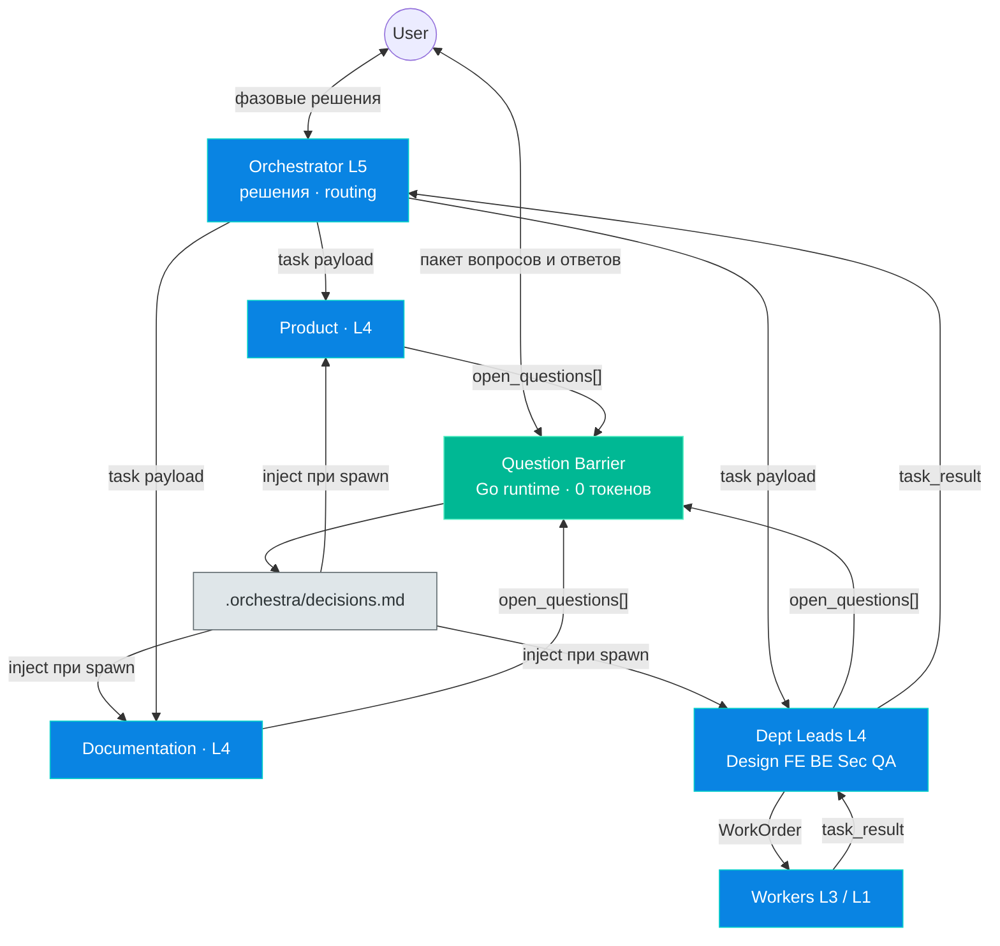
```mermaid
flowchart TB
    classDef rt fill:#00b894,stroke:#55efc4,color:#fff
    classDef llm fill:#0984e3,stroke:#00cec9,color:#fff
    classDef art fill:#dfe6e9,stroke:#636e72,color:#2d3436

    User(("User"))
    Orch["Orchestrator L5<br>решения · routing"]:::llm
    BAR["Question Barrier<br>Go runtime · 0 токенов"]:::rt
    DEC[".orchestra/decisions.md"]:::art
    PM["Product · L4"]:::llm
    Docs["Documentation · L4"]:::llm
    DL["Dept Leads L4<br>Design FE BE Sec QA"]:::llm
    W["Workers L3 / L1"]:::llm

    User <-->|"фазовые решения"| Orch
    User <-->|"пакет вопросов и ответов"| BAR
    PM -->|"open_questions[]"| BAR
    Docs -->|"open_questions[]"| BAR
    DL -->|"open_questions[]"| BAR
    BAR --> DEC
    DEC -->|"inject при spawn"| PM
    DEC -->|"inject при spawn"| Docs
    DEC -->|"inject при spawn"| DL
    Orch -->|"task payload"| PM
    Orch -->|"task payload"| Docs
    Orch -->|"task payload"| DL
    DL -->|"WorkOrder"| W
    W -->|"task_result"| DL
    DL -->|"task_result"| Orch
```


| Участник                            | `question` напрямую      | История чата User | `decisions.md`     |
| ----------------------------------- | ------------------------ | ----------------- | ------------------ |
| Orchestrator                        | ✅                        | ✅ полная          | ✅                  |
| Product / Documentation / Dept Lead | ❌ · только через Barrier | ❌ только payload  | ✅ inject при spawn |
| Worker                              | ❌                        | ❌                 | ❌ только WorkOrder |


**Orchestrator не переводит и не пересказывает вопросы.** Lead формулирует `open_questions[]` в `task_result`; рантайм агрегирует их по всем активным subagent'ам фазы и показывает User одним пакетом; ответы записываются в append-only лог и инжектируются во все последующие spawn. L5 участвует только тогда, когда требуется **решение** — нарезка эпиков, выбор фазы, конфликт владельцев контракта. Механика — [4.3](#43-question-barrier-и-decision-log).

### 2.3 Отделы — типы и инстансы

Организационная структура **заморожена по типам**: 7 функциональных отделов + Platform. Новые типы не добавляются; вертикали закрываются профилями проекта, playbook-ами и **инстансами**.

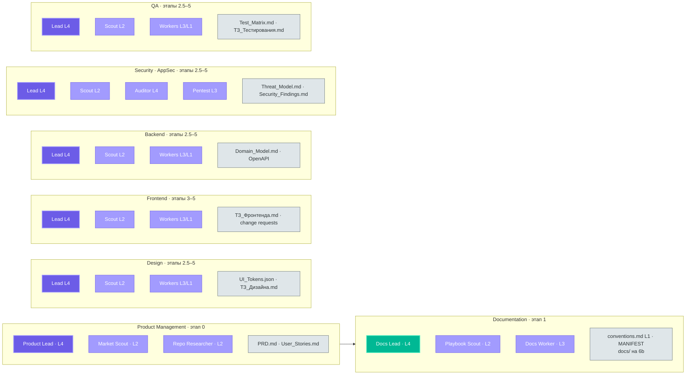
```mermaid
flowchart LR
    classDef dept fill:#6c5ce7,stroke:#a29bfe,stroke-width:2px,color:#fff
    classDef docs fill:#00b894,stroke:#55efc4,stroke-width:2px,color:#fff
    classDef role fill:#a29bfe,stroke:#6c5ce7,color:#fff
    classDef artifact fill:#dfe6e9,stroke:#636e72,color:#2d3436

    subgraph PRODUCT["Product Management · этап 0"]
        direction TB
        P0["Product Lead · L4"]:::dept
        P0s["Market Scout · L2"]:::role
        P0r["Repo Researcher · L2"]:::role
        PA["PRD.md · User_Stories.md"]:::artifact
    end

    subgraph DOCUMENTATION["Documentation · этап 1"]
        direction TB
        DOC1["Docs Lead · L4"]:::docs
        DOC2["Playbook Scout · L2"]:::role
        DOC3["Docs Worker · L3"]:::role
        DOCA["conventions.md L1 · MANIFEST<br>docs/ на 6b"]:::artifact
    end

    subgraph DESIGN["Design · этапы 2.5–5"]
        direction TB
        D1["Lead L4"]:::dept
        D2["Scout L2"]:::role
        D3["Workers L3/L1"]:::role
        DA["UI_Tokens.json · ТЗ_Дизайна.md"]:::artifact
    end

    subgraph FRONTEND["Frontend · этапы 3–5"]
        direction TB
        F1["Lead L4"]:::dept
        F2["Scout L2"]:::role
        F3["Workers L3/L1"]:::role
        FA["ТЗ_Фронтенда.md · change requests"]:::artifact
    end

    subgraph BACKEND["Backend · этапы 2.5–5"]
        direction TB
        B1["Lead L4"]:::dept
        B2["Scout L2"]:::role
        B3["Workers L3/L1"]:::role
        BA["Domain_Model.md · OpenAPI"]:::artifact
    end

    subgraph SECURITY["Security · AppSec · этапы 2.5–5"]
        direction TB
        S1["Lead L4"]:::dept
        S2["Scout L2"]:::role
        S3["Auditor L4"]:::role
        S4["Pentest L3"]:::role
        SA["Threat_Model.md · Security_Findings.md"]:::artifact
    end

    subgraph QA["QA · этапы 2.5–5"]
        direction TB
        Q1["Lead L4"]:::dept
        Q2["Scout L2"]:::role
        Q3["Workers L3/L1"]:::role
        QA_A["Test_Matrix.md · ТЗ_Тестирования.md"]:::artifact
    end

    PRODUCT --> DOCUMENTATION
```


| Отдел                  | Lead (L4)     | Scout (L2)          | Workers             | Ключевые артефакты                                          |
| ---------------------- | ------------- | ------------------- | ------------------- | ----------------------------------------------------------- |
| **Product Management** | Product Lead  | market + repo scout | —                   | [2.3.1](#231-product-management)                            |
| **Documentation**      | Docs Lead     | playbook scout      | Docs Worker L3      | [2.3.2](#232-documentation)                                 |
| **Design**             | Design Lead   | explore             | L3 / L1             | `UI_Tokens.json`, `ТЗ_Дизайна.md`                           |
| **Frontend**           | Frontend Lead | explore             | L3 / L1             | `ТЗ_Фронтенда.md`, change requests к контракту              |
| **Backend**            | Backend Lead  | explore             | L3 / L1             | `Domain_Model.md`, `OpenAPI_Contract.yaml`, `ТЗ_Бэкенда.md` |
| **Security**           | Security Lead | explore + auditor   | auditor L4 / fix L3 | [2.3.4](#234-security-appsec)                               |
| **QA**                 | QA Lead       | explore             | L3 / L1             | `Test_Matrix.md`, `ТЗ_Тестирования.md`                      |
| **Platform**           | Platform Lead | —                   | docs/release L3     | [2.3.5](#235-platform--delivery)                            |


#### Типы и инстансы

Freeze действует на **типы**. Один тип может иметь **N инстансов** — это разные контексты исполнения внутри одной дисциплины, а не новые мандаты.


|               | Dept **type**                      | Dept **instance**                                         |
| ------------- | ---------------------------------- | --------------------------------------------------------- |
| Что это       | дисциплина                         | контекст исполнения внутри дисциплины                     |
| Количество    | ровно 7, frozen                    | N, создаёт Orchestrator на этапе 2                        |
| Идентификатор | `frontend`                         | `frontend@web`, `frontend@mobile`                         |
| Playbook L2   | `.orchestra/playbooks/frontend.md` | `.orchestra/playbooks/frontend@mobile.md`, наследует base |
| Scratchpad    | —                                  | `.orchestra/depts/frontend@mobile.md`                     |
| Lead          | —                                  | отдельный L4 subagent со своим контекстом                 |


**Критерий инстанса** — отдельное окно контекста: свой стек, свой build, свой набор контрактов.


| Проект              | Инстансы                             | Почему не новый тип                                                       |
| ------------------- | ------------------------------------ | ------------------------------------------------------------------------- |
| web + iOS + Android | `frontend@web`, `frontend@mobile`    | Один мандат (UI), три стека; один Lead не удержит три набора токенов и CI |
| monorepo, 3 сервиса | `backend@billing`, `backend@catalog` | Один мандат (API и данные), три OpenAPI и три схемы                       |
| SPA + admin panel   | `frontend@app`, `frontend@admin`     | Разные токены и роли доступа                                              |


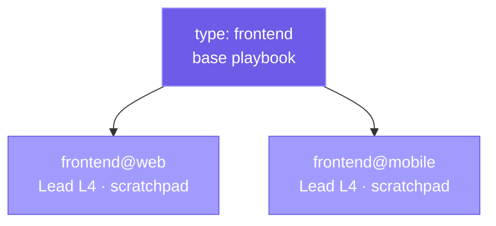
```mermaid
flowchart TB
    classDef t fill:#6c5ce7,stroke:#a29bfe,color:#fff
    classDef i fill:#a29bfe,stroke:#6c5ce7,color:#fff

    FE["type: frontend<br>base playbook"]:::t
    W["frontend@web<br>Lead L4 · scratchpad"]:::i
    M["frontend@mobile<br>Lead L4 · scratchpad"]:::i

    FE --> W
    FE --> M
```


Инстанс наследует base playbook и может только **сужать** его ([6.1](#61-три-слоя-playbooks)). Инстансы работают параллельно и подчиняются правилам disjoint `target_files` наравне с отделами ([5.6](#56-batch-spawn-и-параллелизм)).

#### Профили проекта

Профиль меняет строгость playbook и набор эпиков, но не оргструктуру.


| PRD `project_profile` | Что выглядит как «8-й отдел» | Решение                                                            |
| --------------------- | ---------------------------- | ------------------------------------------------------------------ |
| `default`             | —                            | 7 типов as-is                                                      |
| `mobile`              | Mobile dept                  | инстанс `frontend@mobile` + playbook variant                       |
| `data_platform`       | Data / ETL                   | Backend epic «Data» + секции `etl`, `schema`, `lineage` в playbook |
| `enterprise`          | Compliance / GRC             | Security playbook ASVS L3 + human gate G5                          |
| `realtime`            | Graphics / Client            | Design + FE briefs (WebSocket, state sync)                         |
| `embedded`            | Firmware                     | вне области Orchestra — другой toolchain                           |


```yaml
# .orchestra/product/PRD.md — frontmatter (planned)
---
status: approved
project_profile: default   # default | mobile | data_platform | enterprise | realtime
optional_gates:
  compliance_signoff: false
---
```

Новый **тип** отдела оправдан только при одновременном выполнении четырёх условий: другой алгоритм, другие артефакты, другой gate до workers, невозможность выразить это через playbook и brief существующего Lead. Иначе — расширение `.orchestra/playbooks/{dept}.md`.

#### Что остаётся runtime или skill, а не отделом


| Функция                 | Где реализована                 | Причина                          |
| ----------------------- | ------------------------------- | -------------------------------- |
| System architecture     | Orchestrator L5 + ADR в `docs/` | Отдел дублировал бы Orchestrator |
| Code review             | Verifier L4 + Security Auditor  | Skills и hooks                   |
| DoD (LSP, build, тесты) | Worker Verify, этап 6a          | Runtime hook                     |
| Explore / CKG           | Scout L2 внутри отдела          | Утилита                          |
| Refactor / debug        | Lead + `debug` worker           | Subagent                         |
| Performance / load      | QA playbook + staging URL       | Расширение QA                    |
| a11y / i18n             | FE brief + Design tokens        | Поля brief                       |
| UX research             | PM stories + Design ТЗ          | Discovery и дизайн               |


#### Data / ML — вне конвейера

`data_platform` покрывает ETL и pipelines: детерминированный код с compile и тестами. **Machine Learning в конвейер не входит**, и это вопрос не playbook, а применимости инвариантов.


| Инвариант Orchestra        | Почему неприменим к ML                                               |
| -------------------------- | -------------------------------------------------------------------- |
| Worker Verify = DoD        | LSP и build зелёные при accuracy 0.4                                 |
| WorkOrder = атомарный патч | Единица работы ML — эксперимент, не файл                             |
| `acceptance_checks`        | Проверка требует прогона на датасете: минуты–часы, не секунды        |
| Contract Epoch             | Контракт ML — распределение данных; sha256 файла не ловит data drift |


`project_profile: ml` не поддерживается. ML подключается как внешний артефакт (обученная модель + inference API) и далее взаимодействует с Backend по обычному OpenAPI-контракту.

#### 2.3.1 Product Management

Роли отрасли: Product Manager, Product Owner, Product Analyst. В Orchestra: **Product Lead (L4)** плюс scouts; **Product Owner — это User**, утверждающий PRD.

Product не пишет код и не дублирует Orchestrator. Задача — discovery: рынок, конкуренты, MVP, user stories — до эпиков и контрактов.

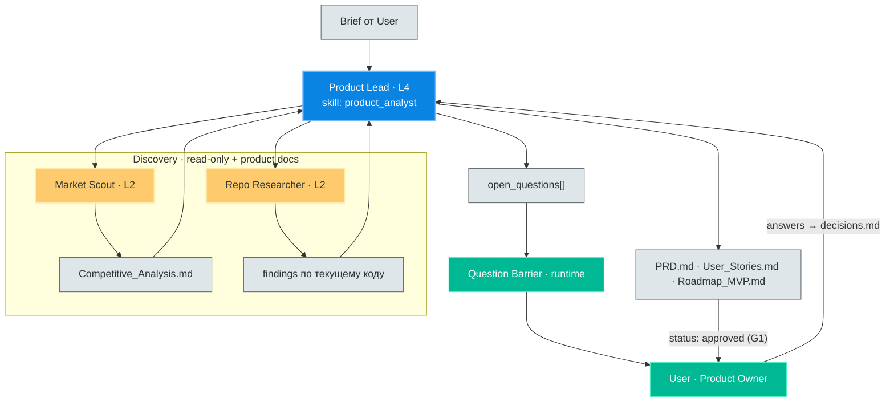
```mermaid
flowchart TB
    classDef pm fill:#0984e3,stroke:#74b9ff,stroke-width:2px,color:#fff
    classDef scout fill:#fdcb6e,stroke:#ffeaa7,stroke-width:2px,color:#2d3436
    classDef artifact fill:#dfe6e9,stroke:#636e72,color:#2d3436
    classDef rt fill:#00b894,stroke:#55efc4,color:#fff

    Brief["Brief от User"]:::artifact
    Lead["Product Lead · L4<br>skill: product_analyst"]:::pm

    subgraph DISCOVERY["Discovery · read-only + product docs"]
        MS["Market Scout · L2"]:::scout
        CA["Competitive_Analysis.md"]:::artifact
        RR["Repo Researcher · L2"]:::scout
        RF["findings по текущему коду"]:::artifact
    end

    PRD["PRD.md · User_Stories.md · Roadmap_MVP.md"]:::artifact
    OQ["open_questions[]"]:::artifact
    BAR["Question Barrier · runtime"]:::rt
    PO["User · Product Owner"]:::rt

    Brief --> Lead
    Lead --> MS --> CA --> Lead
    Lead --> RR --> RF --> Lead
    Lead --> PRD
    Lead --> OQ --> BAR --> PO
    PO -->|"answers → decisions.md"| Lead
    PRD -->|"status: approved (G1)"| PO
```


| Роль                | Tier                                     | Режим / skill                                                                                 | Что делает                                                    |
| ------------------- | ---------------------------------------- | --------------------------------------------------------------------------------------------- | ------------------------------------------------------------- |
| **Product Lead**    | L4 *(greenfield со сложным рынком — L5)* | skill `[product_analyst](../examples/skills/product_analyst.md)`, `spec_writer`, `roadmapper` | PRD, MoSCoW, метрики, синтез отчётов scouts                   |
| **Market Scout**    | L2                                       | `websearch`, `webfetch`                                                                       | Конкуренты, pricing, feature matrix; без выводов «что кодить» |
| **Repo Researcher** | L2                                       | skill `[researcher](../examples/skills/researcher.md)`                                        | Brownfield: что уже есть, gaps vs PRD draft                   |
| **Product Owner**   | —                                        | User                                                                                          | Approve / reject PRD                                          |


| Класс инструмента  | Tools / skills                            | Когда                                               |
| ------------------ | ----------------------------------------- | --------------------------------------------------- |
| Market intel       | `websearch`, `webfetch`                   | Greenfield, новая ниша                              |
| Codebase facts     | `researcher`, `explore`, `read`           | Доработка существующего продукта                    |
| Product docs write | `write` только под `.orchestra/product/*` | PRD, stories, analysis                              |
| Clarifications     | `open_questions[]` в `task_result`        | Уходят в Question Barrier, не в `question` напрямую |


**Артефакты** (`.orchestra/product/`):


| Файл                      | Содержание                                                         |
| ------------------------- | ------------------------------------------------------------------ |
| `Competitive_Analysis.md` | 3–7 конкурентов: фичи, pricing, сильные и слабые стороны, URL      |
| `PRD.md`                  | Problem, personas, goals, MVP scope, out of scope, success metrics |
| `User_Stories.md`         | `US-001`: As a… / I want… / So that… + acceptance на уровне фичи   |
| `Roadmap_MVP.md`          | MoSCoW для v1                                                      |
| `PRD.md` frontmatter      | `status`, `version`, `approved_at`, `project_profile`              |


```markdown
---
status: draft
version: 1
product_owner: user
project_profile: default
---

# PRD: <название>

## Problem
Какую боль решаем; для кого.

## Personas
- …

## Goals (v1)
1. …

## Out of scope
- …

## Success metrics
- …

## Epics (черновик для Orchestrator)
| Epic | Отдел | Priority |
|------|-------|----------|
| … | Backend | Must |
```

**Разграничение ролей:**


|          | Product        | Documentation                | Orchestrator             | Dept Lead                |
| -------- | -------------- | ---------------------------- | ------------------------ | ------------------------ |
| Вопрос   | **что** строим | **как** документируем        | **как** режем и spawn'им | **как** реализуем в коде |
| Горизонт | продукт / MVP  | конвенции + `docs/`             | эпики / фазы             | файл / API                      |
| Артефакт | PRD            | `conventions.md`, `docs/`, MANIFEST | `state.md`, эпики   | Brief, ТЗ, playbook отдела L2   |


**Вход:** идея User + ответы из `decisions.md`. **Выход:** `PRD.md` со `status: approved`.

#### 2.3.2 Documentation

Два мандата и ровно два касания с пайплайном.

**Этап 1 — конвенции проекта (playbook L1).** Один файл `conventions.md`: стек, формат ошибок, naming, коммиты, definition of done — то, что обязано совпадать у всех отделов. Это не документация для человека, а конфигурация контекста агентов: её читают Leads, поэтому она обязана существовать до кода и блокирует этап 2.5. Playbook собственного отдела (слой L2) пишет сам Dept Lead на этапе 3 — обоснование разделения в [6.1](#61-три-слоя-playbooks).

**Этап 6b — project documentation.** `docs/` в репозитории (onboarding, архитектура, ADR, API index) по факту смёрженного кода эпика; блокирует 6c. Без этого после работы Orchestra остаются только служебные файлы в `.orchestra/`, чего недостаточно для сопровождения.

**На этапах 2 – 5 отдел не спавнится.** Причина не в экономии токенов: документация, написанная по ТЗ до Worker Verify, описывает состояние, которое гейт 6a ещё может отклонить (`fail → hint → повторный патч`). На 6b код зафиксирован, и Docs Worker пишет, читая файлы, а не ТЗ. Контекст решений при этом не теряется — он детерминированно копится в append-only `decisions.md` и на 6b разворачивается в ADR.

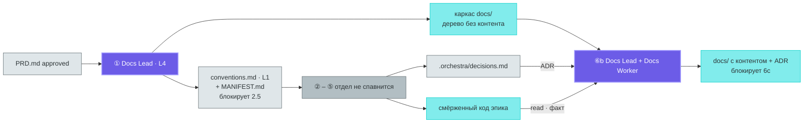
```mermaid
flowchart LR
    classDef dept fill:#6c5ce7,stroke:#a29bfe,stroke-width:2px,color:#fff
    classDef artifact fill:#dfe6e9,stroke:#636e72,color:#2d3436
    classDef repo fill:#81ecec,stroke:#00cec9,color:#2d3436
    classDef gate fill:#26de81,stroke:#20bf6b,color:#fff
    classDef off fill:#b2bec3,stroke:#636e72,color:#2d3436

    PRD["PRD.md approved"]:::artifact
    Docs1["① Docs Lead · L4"]:::dept
    PB["conventions.md · L1<br>+ MANIFEST.md<br>блокирует 2.5"]:::artifact
    Skel["каркас docs/<br>дерево без контента"]:::repo
    Dev["② – ⑤ отдел не спавнится"]:::off
    Dec[".orchestra/decisions.md"]:::artifact
    Code["смёрженный код эпика"]:::repo
    Docs6["⑥b Docs Lead + Docs Worker"]:::dept
    Tree["docs/ с контентом + ADR<br>блокирует 6c"]:::repo

    PRD --> Docs1
    Docs1 --> PB
    Docs1 --> Skel
    PB --> Dev
    Dev --> Dec
    Dev --> Code
    Skel --> Docs6
    Dec -->|"ADR"| Docs6
    Code -->|"read · факт"| Docs6
    Docs6 --> Tree
```

Владение сквозное: у каждого пути ровно один владелец, пересечения с Platform нет.


| Путь                                                             | Владелец            | Этап                     |
| ---------------------------------------------------------------- | ------------------- | ------------------------ |
| `.orchestra/playbooks/conventions.md` — L1                       | Docs Lead L4        | 1                        |
| `.orchestra/playbooks/{dept}.md` — L2                            | Dept Lead L4        | 3                        |
| `.orchestra/docs/MANIFEST.md`                                    | Docs Lead L4        | 1, ревизия на 6b         |
| каркас `docs/` — дерево каталогов                                | Docs Lead L4        | 1                        |
| `docs/architecture/*`, `docs/development/*`, `docs/api/README.md` | Docs Worker L3      | 6b                       |
| `docs/architecture/adr/*`                                        | Docs Worker L3      | 6b, источник — решения   |
| `docs/operations/runbooks/*`                                     | Platform Lead L4    | 6b                       |
| `README.md`, `CHANGELOG.md` в корне                              | Platform Lead L4    | 6b, release notes        |
| `OpenAPI.v0.yaml` и генерация API docs                           | Backend Lead L4     | 2.5, регенерация на 6b   |


**Каркас `docs/` не блокирует контракт и код.** Единственный потребитель каркаса — gate 6b. Слой L1 блокирует этап 2.5, потому что `conventions.md` читают Leads при спавне.

```
docs/
  README.md                 # оглавление документации проекта
  architecture/
    overview.md             # из Концепт + PRD summary
    adr/                    # ADR-0001-title.md
  development/
    setup.md                # локальный запуск, env
    contributing.md
  operations/
    runbooks/               # deploy, rollback, incident
  api/
    README.md               # ссылка на OpenAPI / generated docs
.orchestra/
  product/                  # PM
  contract/                 # Domain_Model, NFR, OpenAPI v0, EPOCH.yaml
  playbooks/                # Docs — методология
  specs/                    # Leads — brief + ТЗ
  depts/                    # scratchpad инстансов
  decisions.md              # append-only лог решений
  archive/                  # закрытые эпики
  docs/
    MANIFEST.md             # файл → владелец → trigger обновления
```


`MANIFEST.md` хранит для каждого файла владельца из таблицы выше и **триггер** — изменение в коде, после которого файл считается устаревшим.


| Файл                            | Триггер устаревания                                   |
| ------------------------------- | ----------------------------------------------------- |
| `docs/architecture/overview.md` | Закрытый эпик, меняющий состав компонентов            |
| `docs/architecture/adr/*`       | Новая запись в `decisions.md`: waiver или assumption  |
| `docs/development/setup.md`     | Смена stack, зависимостей или CI                      |
| `docs/api/*`                    | Изменение `OpenAPI.v0.yaml` → новая Contract Epoch    |
| `docs/operations/runbooks/*`    | Изменение deploy или rollback                         |
| `README.md`, `CHANGELOG.md`     | Каждый release                                        |


| Роль               | Tier | Skill / mode                                       | Этап | Что делает                                       |
| ------------------ | ---- | -------------------------------------------------- | ---- | ------------------------------------------------ |
| **Docs Lead**      | L4   | `documentation` / `playbook_writer` *(planned)*    | 1    | L1 `conventions.md`, `MANIFEST.md`, каркас `docs/` |
| **Playbook Scout** | L2   | `explore`, `read`                                  | 1    | Stack detect, разбор brownfield `docs/`          |
| **Docs Lead**      | L4   | `documentation`                                    | 6b   | План документации эпика по `doc_debt`, ADR index |
| **Docs Worker**    | L3   | [`docs_writer`](../examples/skills/docs_writer.md) | 6b   | Контент `docs/` по коду, ADR из `decisions.md`   |


**Write scope Docs Lead:** `.orchestra/playbooks/conventions.md`, `.orchestra/docs/MANIFEST.md`, `docs/` за вычетом `operations/runbooks/`. Не production-код, не PRD, не контракт и **не playbooks отделов** — те принадлежат своим Lead'ам.

**Правило поддержки.** При изменении public surface (CLI flags, HTTP API, config schema) рантайм помечает соответствующий файл из `MANIFEST.md` как `doc_debt: true`. Долг не спавнит отдел немедленно — он накапливается до конца эпика и передаётся в 6b одним списком. Незакрытый `doc_debt` блокирует 6c. Brownfield: Docs Lead не затирает существующий `docs/`, а дополняет MANIFEST.


| Этап    | Роль отдела                                                            | Блокирует |
| ------- | ---------------------------------------------------------------------- | --------- |
| 1       | L1 `conventions.md`, `MANIFEST.md`, каркас `docs/`                     | 2.5       |
| 2 – 5   | Не спавнится; решения копятся в `decisions.md`, долг — в `doc_debt`    | —         |
| 6b      | Контент `docs/` по коду эпика + ADR из `decisions.md`, закрытие долга | 6c        |


#### 2.3.3 Design, Frontend, Backend, QA

Общий шаблон работы: **Implementation Brief → completeness gate → ТЗ → WorkOrders**. Детали шаблонов — [6.2](#62-implementation-brief). Отличия по отделам:


| Отдел        | Вход этапа 2.5     | Вклад в контракт                                   | Основной артефакт этапа 3                         |
| ------------ | ------------------ | -------------------------------------------------- | ------------------------------------------------- |
| **Backend**  | PRD, User_Stories  | **владелец** `Domain_Model.md` и `OpenAPI.v0.yaml` | `ТЗ_Бэкенда.md`, `OpenAPI v1`                     |
| **Design**   | PRD, personas      | **владелец** `UI_Tokens.skeleton.json`             | `ТЗ_Дизайна.md`, `UI_Tokens.json` v1              |
| **Frontend** | контракт целиком   | `contract_change_request` на дельты API            | `ТЗ_Фронтенда.md`                                 |
| **QA**       | PRD + Domain_Model | —                                                  | `Test_Matrix.md` (acceptance-уровень с этапа 2.5) |


#### 2.3.4 Security (AppSec)

Security не дублирует Backend и QA. Задача — найти уязвимости собственными инструментами, зафиксировать findings, при необходимости выполнить controlled pentest. Правки кода идут отдельными WorkOrder.

**Threat model строится от `Domain_Model.md` и `NFR.md` на этапе 2.5** — до того, как реализована модель аутентификации. Аудит кода выполняется на этапе 5, DAST — после появления staging.

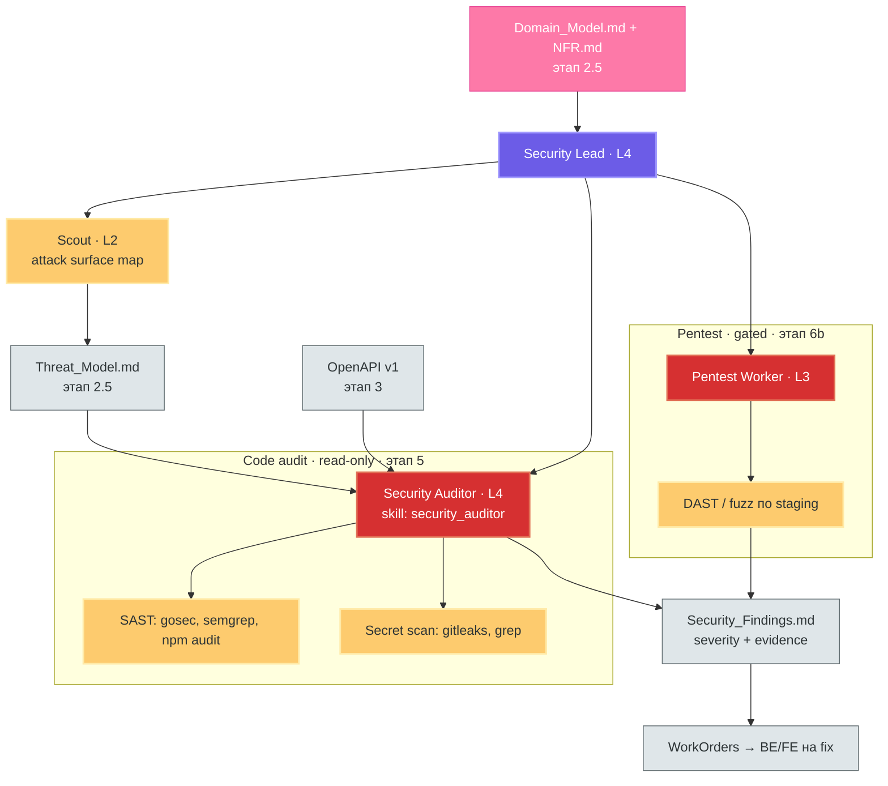
```mermaid
flowchart TB
    classDef dept fill:#6c5ce7,stroke:#a29bfe,stroke-width:2px,color:#fff
    classDef audit fill:#d63031,stroke:#e17055,stroke-width:2px,color:#fff
    classDef tool fill:#fdcb6e,stroke:#ffeaa7,stroke-width:2px,color:#2d3436
    classDef artifact fill:#dfe6e9,stroke:#636e72,color:#2d3436
    classDef freeze fill:#fd79a8,stroke:#e84393,color:#fff

    DM["Domain_Model.md + NFR.md<br>этап 2.5"]:::freeze
    Lead["Security Lead · L4"]:::dept
    Scout["Scout · L2<br>attack surface map"]:::tool
    TM["Threat_Model.md<br>этап 2.5"]:::artifact
    API["OpenAPI v1<br>этап 3"]:::artifact

    subgraph AUDIT["Code audit · read-only · этап 5"]
        Auditor["Security Auditor · L4<br>skill: security_auditor"]:::audit
        SAST["SAST: gosec, semgrep, npm audit"]:::tool
        Secrets["Secret scan: gitleaks, grep"]:::tool
    end

    subgraph PENTEST["Pentest · gated · этап 6b"]
        PT["Pentest Worker · L3"]:::audit
        DAST["DAST / fuzz по staging"]:::tool
    end

    Findings["Security_Findings.md<br>severity + evidence"]:::artifact
    WO_fix["WorkOrders → BE/FE на fix"]:::artifact

    DM --> Lead --> Scout --> TM
    TM --> Auditor
    API --> Auditor
    Lead --> Auditor
    Auditor --> SAST
    Auditor --> Secrets
    Auditor --> Findings
    Lead --> PT --> DAST --> Findings
    Findings --> WO_fix
```


| Роль                 | Tier | Режим / skill                                                                 | Что делает                                                                                                     |
| -------------------- | ---- | ----------------------------------------------------------------------------- | -------------------------------------------------------------------------------------------------------------- |
| **Security Lead**    | L4   | `architecture` / dedicated prompt                                             | Threat model, scope аудита, приоритизация, WorkOrders на fix                                                   |
| **Scout**            | L2   | `explore`                                                                     | Карта attack surface: endpoints, auth, file IO, exec, deps                                                     |
| **Security Auditor** | L4   | skill `[security_auditor](../examples/skills/security_auditor.md)`, read-only | Алгоритм из [playbook](../examples/playbooks/security_methodology.md) + `@refs/security-checklist`, без патчей |
| **Pentest Worker**   | L3   | `debug`, allowExec-gated                                                      | Ограниченные пробы по staging (не prod)                                                                        |
| **Fix Worker**       | L3   | `worker`                                                                      | Узкий патч по approved finding                                                                                 |


| Класс инструмента | Примеры                                           | Когда                                                      |
| ----------------- | ------------------------------------------------- | ---------------------------------------------------------- |
| SAST / static     | `gosec`, `semgrep`, `npm audit`, `govulncheck`    | Каждый прогон аудита по scope                              |
| Secret scan       | `gitleaks`, grep по `api_key`, `password`, `.env` | Repo + diff перед merge                                    |
| Dependency CVE    | `npm audit`, `go list -m`, OSV                    | После изменений зависимостей                               |
| DAST / pentest    | `curl`/fuzz по staging, OpenAPI-driven probes     | После стабильного API; только с `--allow-exec` или sandbox |
| Policy            | `@refs/security-checklist`                        | Чеклист для Auditor                                        |


| Артефакт               | Содержание                                                         |
| ---------------------- | ------------------------------------------------------------------ |
| `Threat_Model.md`      | STRIDE-lite, потоки данных, границы доверия — от `Domain_Model.md` |
| `Security_Findings.md` | Critical/High/Medium + file:line + сценарий эксплуатации           |
| `Pentest_Report.md`    | Запросы, ответы, воспроизведение (опционально)                     |
| WorkOrders на fix      | Ссылка на finding ID; исполняет BE/FE Worker или Security Fix L3   |


**Выход в общий pipeline:** findings проходят через Worker Verify (код) и security gate — аудит должен быть зелёным либо риск явно принят через `accepted_risk` + G5.

#### 2.3.5 Platform — delivery

Platform закрывает всё после merge в git. Prod и секреты — human gate.


| Роль               | Tier | Skill / mode               | Что делает                                                  |
| ------------------ | ---- | -------------------------- | ----------------------------------------------------------- |
| **Platform Lead**  | L4   | `architecture`             | CI yaml, env matrix, runbooks, release checklist            |
| **CI Worker**      | L3   | `ci_doctor`                | Правки workflow, docker, env matrix                         |
| **Release Worker** | L3   | `pr_writer`, `git_curator` | Draft PR, release notes (включая `assumptions[]` и waivers) |


| Подэтап             | Кто                 | Автоматизация                                                 |
| ------------------- | ------------------- | ------------------------------------------------------------- |
| **6a Repo ready**   | Verify + Platform   | ИИ: тесты, docs, CI yaml, локальный commit                    |
| **6b Staging**      | Platform + Security | ИИ частично: CI, docker local, staging URL при наличии токена |
| **6c Prod release** | User                | Human approve push/deploy                                     |


**Documentation и Platform не пересекаются.** Оба работают на 6b, но по разным путям: Documentation владеет содержимым `docs/` (архитектура, ADR, setup, API index), Platform — `docs/operations/runbooks/`, корневыми `README.md` и `CHANGELOG.md`, CI и release notes. Общего файла нет, поэтому 6b выполняется двумя параллельными spawn без арбитража Orchestrator.

### 2.4 Артефакты и хранилища


| Артефакт                                          | Владелец                   | Этап создания | Хэшируется            |
| ------------------------------------------------- | -------------------------- | ------------- | --------------------- |
| `.orchestra/product/PRD.md`                       | Product Lead               | 0             | —                     |
| `.orchestra/playbooks/conventions.md` — L1        | Docs Lead                  | 1             | —                     |
| `.orchestra/playbooks/{dept}.md` — L2             | Dept Lead                  | 3             | —                     |
| `.orchestra/docs/MANIFEST.md`                     | Docs Lead                  | 1             | —                     |
| `docs/**` — каркас                                | Docs Lead                  | 1             | —                     |
| `docs/**` — контент                               | Docs Worker                | **6b**        | —                     |
| `docs/operations/runbooks/**`                     | Platform Lead              | **6b**        | —                     |
| `Концепт_Проекта.md`                              | Orchestrator               | 2             | —                     |
| `**.orchestra/contract/Domain_Model.md**`         | Backend Lead               | **2.5**       | ✅                     |
| `**.orchestra/contract/NFR.md**`                  | Orchestrator               | **2.5**       | ✅                     |
| `**.orchestra/contract/OpenAPI.v0.yaml**`         | Backend Lead               | **2.5**       | ✅                     |
| `**.orchestra/contract/UI_Tokens.skeleton.json**` | Design Lead                | **2.5**       | ✅                     |
| `**.orchestra/contract/EPOCH.yaml**`              | Runtime                    | **2.5**       | —                     |
| `.orchestra/specs/{dept}/*Brief*.md`              | Dept Lead                  | 3             | —                     |
| WorkOrder JSON                                    | Dept Lead                  | 4             | несёт `contract_refs` |
| `.orchestra/decisions.md`                         | **Runtime** (append-only)  | 0–6           | —                     |
| `.orchestra/state.md`                             | Orchestrator, компакция L2 | 0–6           | —                     |
| `.orchestra/depts/{instance}.md`                  | Dept Lead                  | 3–5           | —                     |
| `.orchestra/archive/epics/*`                      | Runtime                    | 5–6           | —                     |


---

## 3. Процесс — этапы 0–6

Хронология едина для всего документа: **0 → 1 → 2 → 2.5 → 3 → 4 → 5 → 6a → 6b → 6c**. Прямых связей в обход этапов нет: выходы Лидов (3) попадают к Platform (6b) только через WorkOrders (4), исполнение Workers (5) и автоверификацию (6a).

### 3.1 Сквозной pipeline

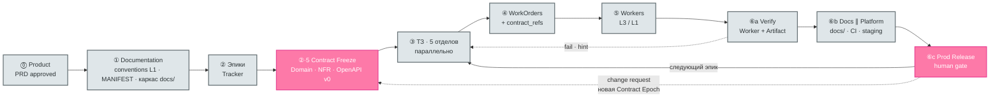
```mermaid
flowchart LR
    classDef phase fill:#dfe6e9,stroke:#636e72,stroke-width:2px,color:#2d3436
    classDef freeze fill:#fd79a8,stroke:#e84393,stroke-width:2px,color:#fff

    P0["⓪ Product<br>PRD approved"]:::phase
    P1["① Documentation<br>conventions L1 · MANIFEST · каркас docs/"]:::phase
    P2["② Эпики<br>Tracker"]:::phase
    P25["②·5 Contract Freeze<br>Domain · NFR · OpenAPI v0"]:::freeze
    P3["③ ТЗ · 5 отделов<br>параллельно"]:::phase
    P4["④ WorkOrders<br>+ contract_refs"]:::phase
    P5["⑤ Workers<br>L3 / L1"]:::phase
    P6a["⑥a Verify<br>Worker + Artifact"]:::phase
    P6b["⑥b Docs ∥ Platform<br>docs/ · CI · staging"]:::phase
    P6c["⑥c Prod Release<br>human gate"]:::freeze

    P0 --> P1 --> P2 --> P25 --> P3 --> P4 --> P5 --> P6a --> P6b --> P6c
    P6a -.->|"fail · hint"| P3
    P6c -->|"следующий эпик"| P3
    P6c -.->|"change request<br>новая Contract Epoch"| P25
```

**Этапы 0 – 2.5 выполняются один раз на проект; этапы 3 – 6 — цикл по эпикам.** «Документация в конце» означает конец каждого эпика, а не конец проекта: 6b наступает столько раз, сколько закрыто эпиков, поэтому объём документации за одну итерацию ограничен одним эпиком и помещается в контекст L4. Изменение контракта внутри цикла возвращает поток на 2.5 и поднимает Contract Epoch, инвалидируя WorkOrder'ы со старым хэшем ([5.3](#53-contract-epoch-guard)).


| #       | Этап                           | Участники                                      | Выход                                                                                   | Блокирует переход дальше |
| ------- | ------------------------------ | ---------------------------------------------- | --------------------------------------------------------------------------------------- | ------------------------ |
| 0       | **Product discovery**          | User, Product Lead L4, Market Scout L2         | `PRD.md` approved                                                                       | G1                       |
| 1       | **Documentation**              | Orchestrator, Docs Lead L4, Playbook Scout L2  | L1 `conventions.md`, `MANIFEST.md`, каркас `docs/`                                      | наличие L1               |
| 2       | **Эпики**                      | Orchestrator L5, Tracker                       | Эпики по отделам и инстансам                                                            | —                        |
| **2.5** | **Contract & Domain Freeze**   | Orchestrator L5, Backend Lead, Design Lead     | `Domain_Model.md`, `NFR.md`, `OpenAPI.v0.yaml`, `UI_Tokens.skeleton.json`, `EPOCH.yaml` | Artifact Verify + G6     |
| 3       | **ТЗ отделов** *(параллельно)* | Leads L4, Scouts L2                            | Implementation Brief + ТЗ                                                               | brief completeness gate  |
| 4       | **Атомарный трекинг**          | Leads L4, Tracker                              | Tasks, WorkOrder + `contract_refs`                                                      | валидация WorkOrder      |
| 5       | **Исполнение**                 | Workers L3/L1, Runtime                         | Staged patches, `task_result`                                                           | Worker Verify            |
| 6       | **Delivery**                   | Verify, Security gate, Docs L4 и Platform L4 на 6b, User на 6c | 6a–6b автоматически, 6c — approve; `docs/` и ADR закрывают `doc_debt` | G2–G5, `doc_debt` пуст   |


**Три зоны цикла:** этапы 0–2.5 — до кода (документы и контракты); этапы 3–6a — код; этапы 6b–6c — после merge.

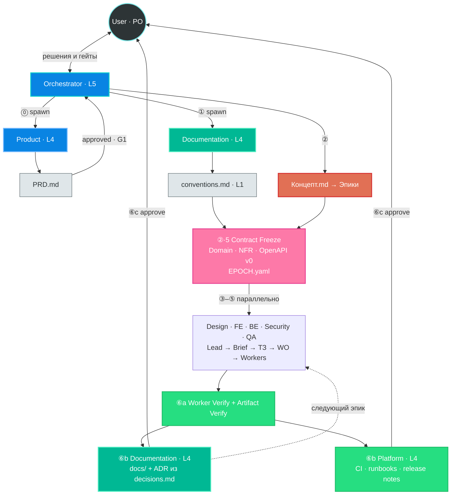
```mermaid
flowchart TB
    classDef user fill:#2d3436,stroke:#81ecec,stroke-width:2px,color:#fff
    classDef orch fill:#0984e3,stroke:#00cec9,stroke-width:2px,color:#fff
    classDef pm fill:#0984e3,stroke:#74b9ff,stroke-width:2px,color:#fff
    classDef docs fill:#00b894,stroke:#55efc4,stroke-width:2px,color:#fff
    classDef tracker fill:#e17055,stroke:#d63031,stroke-width:2px,color:#fff
    classDef release fill:#26de81,stroke:#20bf6b,stroke-width:2px,color:#fff
    classDef artifact fill:#dfe6e9,stroke:#636e72,color:#2d3436
    classDef freeze fill:#fd79a8,stroke:#e84393,stroke-width:2px,color:#fff

    User(("User · PO")):::user
    Orchestrator["Orchestrator · L5"]:::orch

    User <-->|"решения и гейты"| Orchestrator
    Orchestrator -->|"⓪ spawn"| PM["Product · L4"]:::pm
    PM --> PRD["PRD.md"]:::artifact
    PRD -->|"approved · G1"| Orchestrator
    Orchestrator -->|"① spawn"| Docs["Documentation · L4"]:::docs
    Docs --> PB["conventions.md · L1"]:::artifact
    Orchestrator -->|"②"| Scope["Концепт.md → Эпики"]:::tracker
    PB --> Freeze
    Scope --> Freeze["②·5 Contract Freeze<br>Domain · NFR · OpenAPI v0<br>EPOCH.yaml"]:::freeze
    Freeze -->|"③–⑤ параллельно"| Depts["Design · FE · BE · Security · QA<br>Lead → Brief → ТЗ → WO → Workers"]
    Depts --> Gate["⑥a Worker Verify + Artifact Verify"]:::release
    Gate --> Docs6["⑥b Documentation · L4<br>docs/ + ADR из decisions.md"]:::docs
    Gate --> Plat["⑥b Platform · L4<br>CI · runbooks · release notes"]:::release
    Docs6 -->|"⑥c approve"| User
    Plat -->|"⑥c approve"| User
    Docs6 -.->|"следующий эпик"| Depts
```


### 3.2 Этап 0 — Product discovery

Вход: идея User. Выход: `PRD.md` со `status: approved`, `User_Stories.md`, `Roadmap_MVP.md`, `project_profile`.

Product Lead формулирует `open_questions[]`; вопросы уходят в Question Barrier, ответы записываются в `decisions.md` и возвращаются в payload следующего вызова (`mode: revise`). Итерации продолжаются, пока PRD не утверждён, но не более `max_clarification_rounds` ([5.2](#52-guard--unblock-path)).

Повторный вызов Product:


| Триггер                            | Действие                                              |
| ---------------------------------- | ----------------------------------------------------- |
| Новый проект                       | Полный discovery                                      |
| «Добавим оплату»                   | PRD delta, повторный G1                               |
| Orchestrator обнаружил scope creep | Вопрос через Barrier: «Обновить PRD?» → spawn Product |
| Hotfix одной строки                | Product не вызывается; см. `phase: maintenance`       |


### 3.3 Этап 1 — Documentation

Вход: `PRD.md` approved. Выход: `.orchestra/playbooks/conventions.md` (слой L1), `MANIFEST.md`, каркас `docs/` — дерево каталогов и оглавления без контента.

Отдел выпускает **один** playbook — кросс-отдельные конвенции проекта. Playbook отдельного отдела (`{dept}.md`, слой L2) пишет сам Dept Lead на этапе 3, потому что его адресат — Workers этого отдела ([6.1](#61-три-слоя-playbooks)). Контент `docs/` появляется на 6b каждого эпика ([2.3.2](#232-documentation)); между этими двумя точками отдел не спавнится.

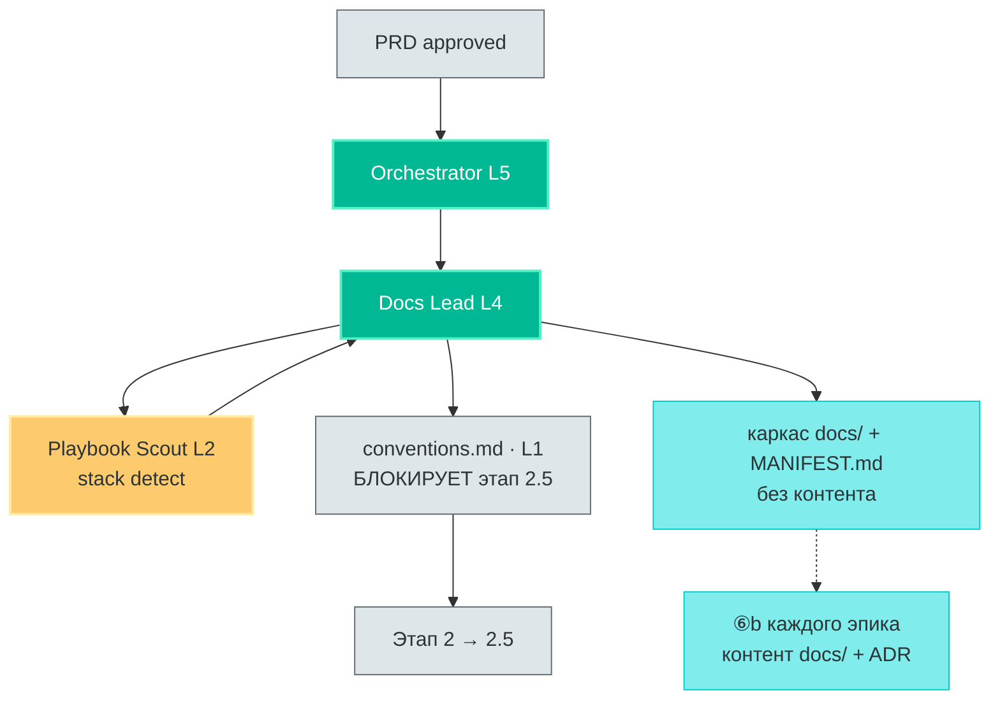
```mermaid
flowchart TB
    classDef docs fill:#00b894,stroke:#55efc4,stroke-width:2px,color:#fff
    classDef scout fill:#fdcb6e,stroke:#ffeaa7,stroke-width:2px,color:#2d3436
    classDef artifact fill:#dfe6e9,stroke:#636e72,color:#2d3436
    classDef repo fill:#81ecec,stroke:#00cec9,color:#2d3436

    PRD["PRD approved"]:::artifact
    Orch["Orchestrator L5"]:::docs
    DL["Docs Lead L4"]:::docs
    Scout["Playbook Scout L2<br>stack detect"]:::scout
    PB["conventions.md · L1<br>БЛОКИРУЕТ этап 2.5"]:::artifact
    Tree["каркас docs/ + MANIFEST.md<br>без контента"]:::repo
    Next["Этап 2 → 2.5"]:::artifact
    Later["⑥b каждого эпика<br>контент docs/ + ADR"]:::repo

    PRD --> Orch --> DL
    DL --> Scout --> DL
    DL --> PB --> Next
    DL --> Tree
    Tree -.-> Later
```


### 3.4 Этап 2 — эпики

Orchestrator L5 читает PRD, playbooks и `decisions.md`, формирует `Концепт_Проекта.md` и эпики по отделам. Здесь же определяется состав **инстансов** отделов ([2.3](#23-отделы--типы-и-инстансы)) исходя из `project_profile` и числа платформ или сервисов.

### 3.5 Этап 2.5 — Contract Freeze

**Назначение.** Зафиксировать общий язык и общие границы до того, как отделы начнут писать ТЗ. Без этого этапа: имена сущностей расходятся между отделами, инженерные ограничения не существуют ни в одном артефакте, а Frontend вынужден описывать требования к API, не владея доменом.

**Обязательные артефакты** — в `.orchestra/contract/`:


| Артефакт                  | Владелец        | Содержание                                                                               | Проверка                                                           |
| ------------------------- | --------------- | ---------------------------------------------------------------------------------------- | ------------------------------------------------------------------ |
| `Domain_Model.md`         | Backend Lead    | Глоссарий, сущности, связи, инварианты данных. **Имена канонические для всех отделов**   | покрытие всех сущностей из `User_Stories.md`, отсутствие синонимов |
| `NFR.md`                  | Orchestrator L5 | Latency p95, RPS, объём данных, платформы и браузеры, offline, data residency, retention | обязательные секции непусты                                        |
| `OpenAPI.v0.yaml`         | Backend Lead    | Ресурсы, методы, схемы, коды ошибок, модель auth                                         | `spectral lint` / `openapi-validate`                               |
| `UI_Tokens.skeleton.json` | Design Lead     | Палитра, типографика, spacing, breakpoints                                               | JSON Schema                                                        |


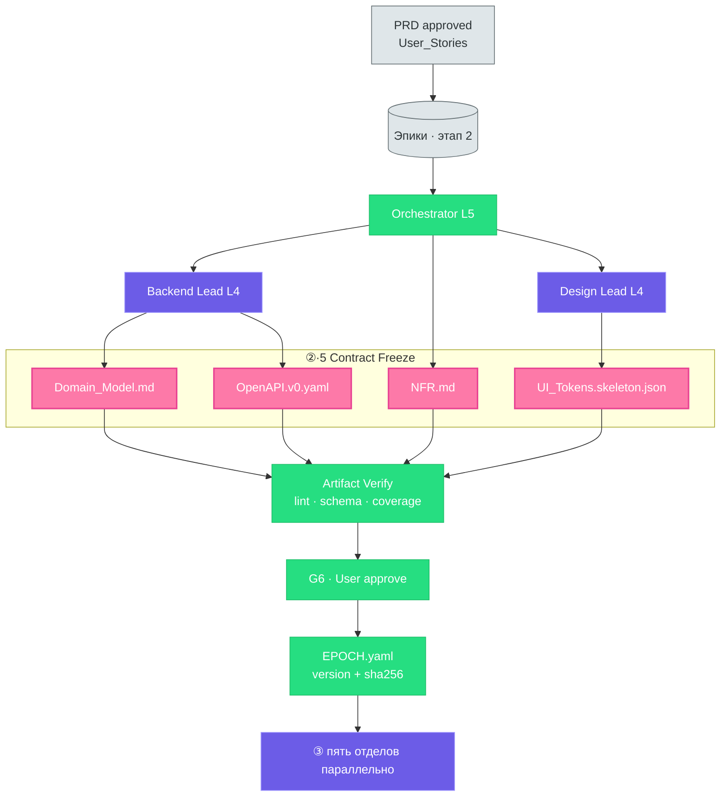
```mermaid
flowchart TB
    classDef freeze fill:#fd79a8,stroke:#e84393,stroke-width:2px,color:#fff
    classDef artifact fill:#dfe6e9,stroke:#636e72,color:#2d3436
    classDef gate fill:#26de81,stroke:#20bf6b,color:#fff
    classDef dept fill:#6c5ce7,stroke:#a29bfe,color:#fff

    PRD["PRD approved<br>User_Stories"]:::artifact
    Epics[("Эпики · этап 2")]:::artifact
    Orch["Orchestrator L5"]:::gate
    BE["Backend Lead L4"]:::dept
    DS["Design Lead L4"]:::dept

    subgraph FREEZE["②·5 Contract Freeze"]
        DM["Domain_Model.md"]:::freeze
        NFR["NFR.md"]:::freeze
        API["OpenAPI.v0.yaml"]:::freeze
        TOK["UI_Tokens.skeleton.json"]:::freeze
    end

    AV["Artifact Verify<br>lint · schema · coverage"]:::gate
    G6["G6 · User approve"]:::gate
    EPOCH["EPOCH.yaml<br>version + sha256"]:::gate
    DEPTS["③ пять отделов параллельно"]:::dept

    PRD --> Epics --> Orch
    Orch --> BE --> DM
    BE --> API
    Orch --> NFR
    Orch --> DS --> TOK
    DM --> AV
    NFR --> AV
    API --> AV
    TOK --> AV
    AV --> G6 --> EPOCH --> DEPTS
```


**Правила этапа:**

- `guardSpawn` отклоняет `architecture` и `worker`, пока фаза `contract` не завершена ([5.1](#51-phase-guard)).
- Имена сущностей `Domain_Model.md` каноничны. Lead, вводящий новое имя для существующей сущности, обязан оформить `contract_change_request`.
- `NFR.md` инжектируется в payload каждого Lead-spawn — единственный источник инженерных ограничений для этапов 3–5.
- Security строит `Threat_Model.md` от `Domain_Model.md` и `NFR.md` здесь же, не дожидаясь `OpenAPI v1`.
- QA строит acceptance-уровень `Test_Matrix.md` от PRD и `Domain_Model.md`; API-уровень достраивается на этапе 3.
- По завершении рантайм пишет `EPOCH.yaml` — версии и sha256 всех четырёх артефактов ([5.3](#53-contract-epoch-guard)).

**Ослабления:**


| Режим                           | Требование                                                   |
| ------------------------------- | ------------------------------------------------------------ |
| `fast_path` (спайк менее суток) | только `Domain_Model.md` в минимальном виде (глоссарий)      |
| `phase: maintenance`            | этап не выполняется; используются существующие хэши          |
| `project_profile: enterprise`   | `NFR.md` обязан содержать секции compliance и data residency |
| Недостижимо иначе               | `waiver: contract` от User + запись `assumptions[]`          |


### 3.6 Этап 3 — ТЗ отделов, параллельно

После заморозки контракта Design, Frontend, Backend, Security и QA стартуют **одновременно**, опираясь на одни и те же артефакты и их хэши.

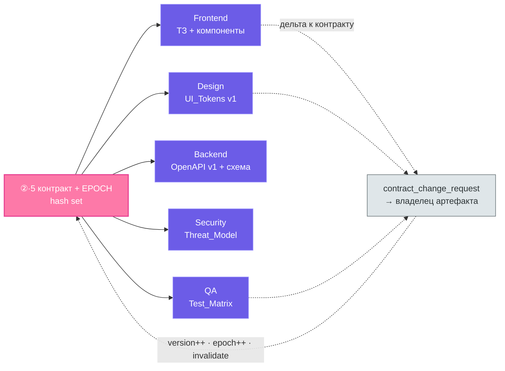
```mermaid
flowchart LR
    classDef freeze fill:#fd79a8,stroke:#e84393,stroke-width:2px,color:#fff
    classDef dept fill:#6c5ce7,stroke:#a29bfe,color:#fff
    classDef artifact fill:#dfe6e9,stroke:#636e72,color:#2d3436

    C["②·5 контракт + EPOCH<br>hash set"]:::freeze
    D["Design<br>UI_Tokens v1"]:::dept
    FE["Frontend<br>ТЗ + компоненты"]:::dept
    BE["Backend<br>OpenAPI v1 + схема"]:::dept
    SEC["Security<br>Threat_Model"]:::dept
    QA["QA<br>Test_Matrix"]:::dept
    CCR["contract_change_request<br>→ владелец артефакта"]:::artifact

    C --> D
    C --> FE
    C --> BE
    C --> SEC
    C --> QA
    FE -.->|"дельта к контракту"| CCR
    D -.-> CCR
    QA -.-> CCR
    CCR -.->|"version++ · epoch++ · invalidate"| C
```


| Шаг | От → К                       | Передаётся                                                                       | Блокирующий    |
| --- | ---------------------------- | -------------------------------------------------------------------------------- | -------------- |
| 0   | Contract Freeze → все отделы | `Domain_Model.md`, `NFR.md`, `OpenAPI.v0.yaml`, `UI_Tokens.skeleton.json` + хэши | ✅              |
| 1   | Design → Frontend            | `UI_Tokens.json` v1 — детализация skeleton                                       | инкрементально |
| 2   | Frontend → Backend           | `contract_change_request` — дельта к `OpenAPI v0`                                | ❌ async        |
| 3   | Backend → Security           | `OpenAPI v1` + staging URL для DAST                                              | ❌ async        |
| 4   | Backend → QA                 | `OpenAPI v1`                                                                     | ❌ async        |
| 5   | Security → BE/FE             | WorkOrder на каждый finding, отдельно от задачи аудита                           | ❌              |


Прежняя схема, в которой Frontend писал `Требования_к_API.md`, а Backend выводил из них OpenAPI, устранена: источник контракта — этап 2.5, а требования Frontend становятся change request к существующему контракту.

**Процесс внутри отдела:**

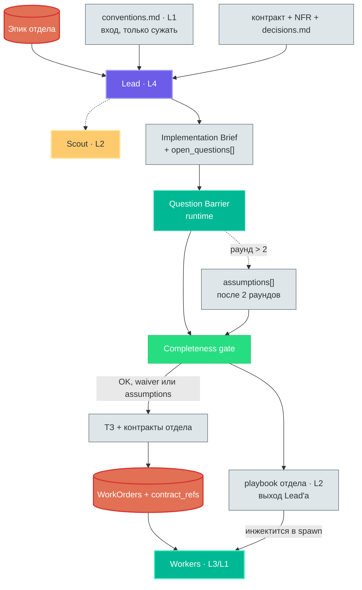
```mermaid
flowchart TB
    classDef tracker fill:#e17055,stroke:#d63031,stroke-width:2px,color:#fff
    classDef dept fill:#6c5ce7,stroke:#a29bfe,stroke-width:2px,color:#fff
    classDef scout fill:#fdcb6e,stroke:#ffeaa7,stroke-width:2px,color:#2d3436
    classDef worker fill:#00b894,stroke:#55efc4,stroke-width:2px,color:#fff
    classDef artifact fill:#dfe6e9,stroke:#636e72,color:#2d3436
    classDef gate fill:#26de81,stroke:#20bf6b,color:#fff
    classDef rt fill:#00b894,stroke:#55efc4,color:#fff

    Epic[("Эпик отдела")]:::tracker
    PB["conventions.md · L1<br>вход, только сужать"]:::artifact
    Contract["контракт + NFR + decisions.md"]:::artifact
    PB2["playbook отдела · L2<br>выход Lead'а"]:::artifact
    Lead["Lead · L4"]:::dept
    Scout["Scout · L2"]:::scout
    Brief["Implementation Brief<br>+ open_questions[]"]:::artifact
    BAR["Question Barrier<br>runtime"]:::rt
    Complete["Completeness gate"]:::gate
    Assume["assumptions[]<br>после 2 раундов"]:::artifact
    TZ["ТЗ + контракты отдела"]:::artifact
    Tasks[("WorkOrders + contract_refs")]:::tracker
    Workers["Workers · L3/L1"]:::worker

    Epic --> Lead
    PB --> Lead
    Contract --> Lead
    Lead -.-> Scout
    Lead --> Brief --> BAR
    BAR --> Complete
    BAR -.->|"раунд > 2"| Assume --> Complete
    Complete -->|"OK, waiver или assumptions"| TZ
    Complete --> PB2
    TZ --> Tasks --> Workers
    PB2 -->|"инжектится в spawn"| Workers
```

Playbook отдела (`{dept}.md`, слой L2) — выход этого же этапа: Lead фиксирует в нём правила для своих Workers, сужая `conventions.md`. Расширить L1 он не может; расхождение с конвенциями оформляется как `accepted_risk` с approve User ([6.1](#61-три-слоя-playbooks)).


### 3.7 Этап 4 — WorkOrders

Lead дробит ТЗ на WorkOrder и возвращает их массивом `batch_workorders[]` в `task_result`. Каждый WorkOrder обязан содержать `contract_refs[]` с хэшами и, где это формализуемо, `acceptance_checks[]`. Рантайм проверяет disjoint `target_files` и спавнит воркеров параллельно ([5.6](#56-batch-spawn-и-параллелизм)).

### 3.8 Этап 5 — исполнение

Worker L3/L1 получает только WorkOrder JSON. Перед spawn рантайм сверяет `contract_refs` с `EPOCH.yaml`; при смене epoch во время исполнения задача отменяется, staged-патчи отбрасываются, WorkOrder возвращается Lead на перегенерацию.

При повторных неудачах действует эскалация тира ([5.5](#55-tier-escalation)).

### 3.9 Этап 6 — delivery

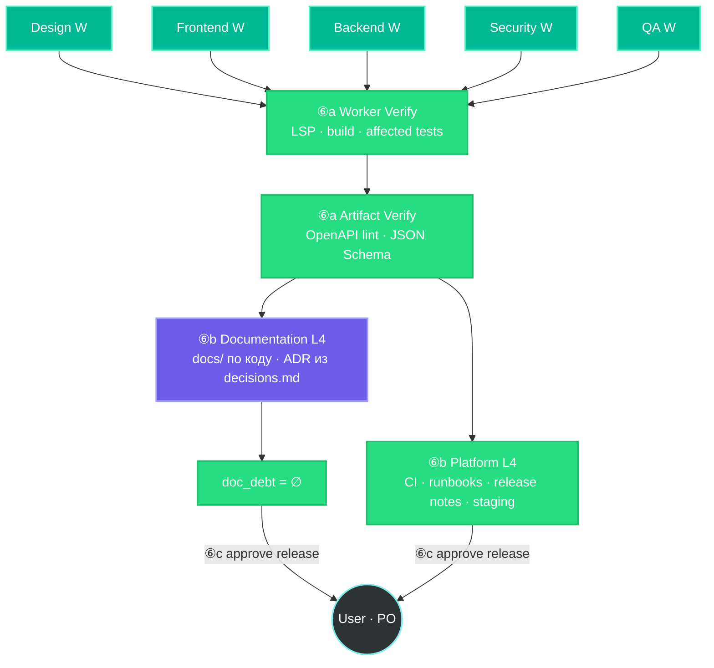
```mermaid
flowchart TB
    classDef worker fill:#00b894,stroke:#55efc4,stroke-width:2px,color:#fff
    classDef release fill:#26de81,stroke:#20bf6b,stroke-width:2px,color:#fff
    classDef docs fill:#6c5ce7,stroke:#a29bfe,stroke-width:2px,color:#fff
    classDef user fill:#2d3436,stroke:#81ecec,stroke-width:2px,color:#fff

    W1["Design W"]:::worker
    W2["Frontend W"]:::worker
    W3["Backend W"]:::worker
    W4["Security W"]:::worker
    W5["QA W"]:::worker
    Gate["⑥a Worker Verify<br>LSP · build · affected tests"]:::release
    AGate["⑥a Artifact Verify<br>OpenAPI lint · JSON Schema"]:::release
    Docs["⑥b Documentation L4<br>docs/ по коду · ADR из decisions.md"]:::docs
    Plat["⑥b Platform L4<br>CI · runbooks · release notes · staging"]:::release
    Debt["doc_debt = ∅"]:::release
    User(("User · PO")):::user

    W1 --> Gate
    W2 --> Gate
    W3 --> Gate
    W4 --> Gate
    W5 --> Gate
    Gate --> AGate
    AGate --> Docs
    AGate --> Plat
    Docs --> Debt
    Debt -->|"⑥c approve release"| User
    Plat -->|"⑥c approve release"| User
```

**6b — две параллельные ветки.** Documentation пишет содержимое `docs/`, читая смёрженный код эпика, и разворачивает записи `decisions.md` в ADR. Platform закрывает CI, runbooks и release notes. Пути не пересекаются ([2.3.2](#232-documentation)), арбитраж Orchestrator не нужен. Переход на 6c закрыт, пока список `doc_debt` эпика не пуст.


---

## 4. Сессия пользователя

Пользователь видит один чат. Product, Documentation, Contract Freeze и Platform работают внутри, без собственной истории диалога.

### 4.1 Фазы


| `orchestra.phase`             | Отображение для User | Кто работает внутри                       |
| ----------------------------- | -------------------- | ----------------------------------------- |
| `discovery`                   | badge *Product*      | Product Lead subagent                     |
| `documentation` *(planned)*   | badge *Docs*         | Docs Lead — L1 conventions + `docs/`      |
| `**contract**` *(planned)*    | badge *Contract*     | Orchestrator + Backend Lead + Design Lead |
| `execution`                   | badge *Orchestrator* | Orchestrator L5 + Dept Leads + Workers    |
| `delivery`                    | badge *Release*      | Platform L4 + Verify                      |
| `**maintenance**` *(planned)* | badge *Maintenance*  | Lead или Worker напрямую, без PRD-гейта   |


Subagent не является «вторым промптом в том же вызове»: это отдельный child-агент со своим system prompt, без истории чата, получающий только payload и ссылки на артефакты.

### 4.2 Машина состояний

```yaml
# .orchestra/state.md — frontmatter
---
orchestra:
  phase: discovery         # discovery | documentation | contract | execution | delivery | maintenance
  prd_status: draft        # draft | approved
  contract_epoch: 0        # инкремент при смене любого контрактного артефакта
  clarification_rounds: 0  # сбрасывается при смене фазы
  state_bytes: 0           # текущий размер инжекта
---
## Goal
…
```

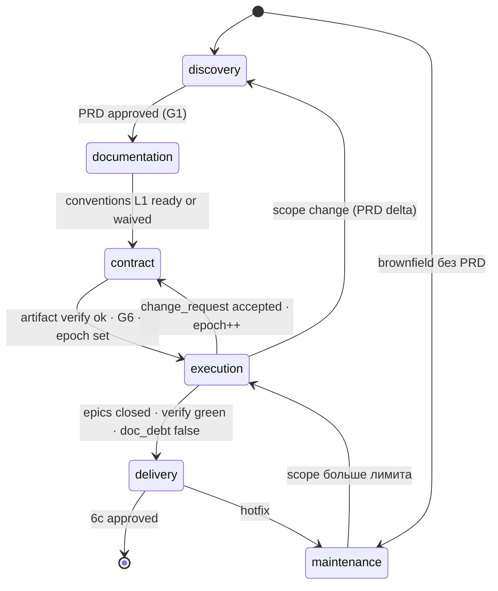
```mermaid
stateDiagram-v2
    [*] --> discovery
    discovery --> documentation: PRD approved (G1)
    documentation --> contract: conventions L1 ready or waived
    contract --> execution: artifact verify ok · G6 · epoch set
    execution --> delivery: epics closed · verify green · doc_debt false
    delivery --> [*]: 6c approved
    delivery --> maintenance: hotfix
    maintenance --> execution: scope больше лимита
    execution --> discovery: scope change (PRD delta)
    execution --> contract: change_request accepted · epoch++
    [*] --> maintenance: brownfield без PRD
```


| Переход                  | Условие                                                   | Кто выполняет                          | Unblock, если условие недостижимо           |
| ------------------------ | --------------------------------------------------------- | -------------------------------------- | ------------------------------------------- |
| → `discovery`            | новая идея или scope change                               | Orchestrator либо User                 | —                                           |
| → `documentation`        | `PRD.md` approved                                         | Orchestrator, spawn Docs Lead          | `phase: maintenance`                        |
| → `contract`             | L1 `conventions.md` существует                            | Orchestrator после `task_result` Docs  | `waiver: playbooks` — работа на L0 defaults |
| → `execution`            | контрактные артефакты прошли Artifact Verify, G6 approved | Orchestrator, `contract_epoch++`       | `waiver: contract` + `assumptions[]`        |
| → `execution` (повторно) | принят `contract_change_request`                          | владелец артефакта, `contract_epoch++` | —                                           |
| → `delivery`             | эпики закрыты, verify зелёный, `doc_debt: false`          | Orchestrator                           | `waiver: doc_debt`                          |
| → `maintenance`          | brownfield без PRD либо hotfix в пределах лимита          | User либо Orchestrator                 | сам является unblock path                   |


### 4.3 Question Barrier и Decision Log

**Ретрансляция вопросов и ответов выполняется рантаймом.** Orchestrator не формулирует вопросы отделов от своего имени и не интерпретирует ответы User: текст проходит дословно.

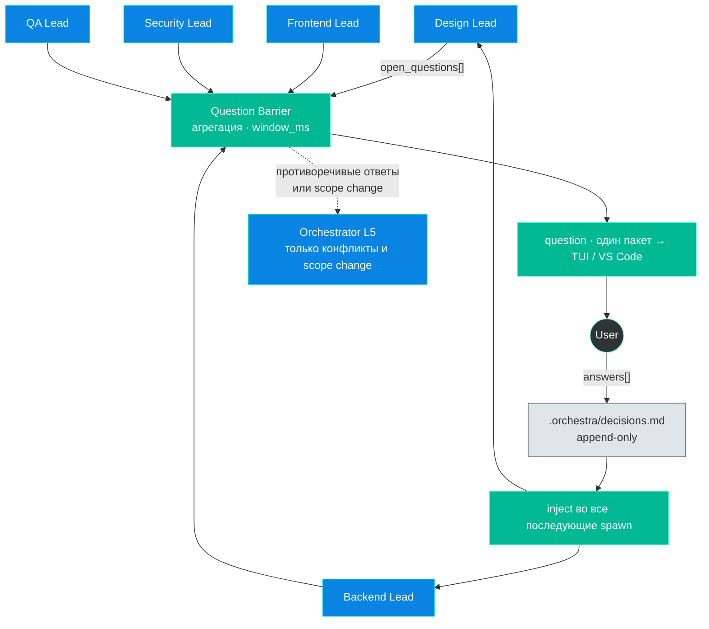
```mermaid
flowchart TB
    classDef rt fill:#00b894,stroke:#55efc4,color:#fff
    classDef llm fill:#0984e3,stroke:#00cec9,color:#fff
    classDef art fill:#dfe6e9,stroke:#636e72,color:#2d3436
    classDef user fill:#2d3436,stroke:#81ecec,color:#fff

    LD["Design Lead"]:::llm
    LF["Frontend Lead"]:::llm
    LB["Backend Lead"]:::llm
    LS["Security Lead"]:::llm
    LQ["QA Lead"]:::llm

    BAR["Question Barrier<br>агрегация · window_ms"]:::rt
    Q["question · один пакет → TUI / VS Code"]:::rt
    U(("User")):::user
    DEC[".orchestra/decisions.md<br>append-only"]:::art
    NEXT["inject во все последующие spawn"]:::rt
    ORCH["Orchestrator L5<br>только конфликты и scope change"]:::llm

    LD -->|"open_questions[]"| BAR
    LF --> BAR
    LB --> BAR
    LS --> BAR
    LQ --> BAR
    BAR --> Q --> U
    U -->|"answers[]"| DEC
    DEC --> NEXT
    NEXT --> LD
    NEXT --> LB
    BAR -.->|"противоречивые ответы<br>или scope change"| ORCH
```


**Протокол:**

```text
1. Orchestrator → task(<subagent>, payload)                  // решение L5
2. Subagent → task_result({ open_questions:[…], artifacts:[…] })
3. RUNTIME  → агрегирует open_questions всех активных subagent'ов фазы
4. RUNTIME  → question({questions:[…]})  → TUI                // без turn'а L5
5. User отвечает одним пакетом
6. RUNTIME  → append в .orchestra/decisions.md
7. RUNTIME  → task(<subagent>, payload={answers, decisions_ref, mode:"revise"})
8. Повтор шагов 2–7 не более max_clarification_rounds
9. Orchestrator → следующая фаза                              // решение L5
```


| Шаг        | Исполнитель | Стоимость |
| ---------- | ----------- | --------- |
| 3, 4, 6, 7 | Go runtime  | 0 токенов |
| 1, 9       | L5          | 1 turn    |


**Контракт `open_questions[]`:**

```json
{
  "open_questions": [
    {
      "id": "be-q1",
      "dept": "backend@billing",
      "text": "Хранить историю платежей вечно или 24 месяца?",
      "options": ["вечно", "24 мес", "настраивается"],
      "blocking": true,
      "affects": ["Domain_Model.md", "NFR.md"],
      "assumption_if_unanswered": "24 мес — соответствует retention по умолчанию из NFR"
    }
  ]
}
```

Поле `assumption_if_unanswered` обязательно при `blocking: true`; его отсутствие — ошибка валидации `task_result`, а не предупреждение.

**Формат `.orchestra/decisions.md`** — append-only:

```markdown
## D-014 · 2026-08-12T09:31Z · phase: contract
**Q** (backend@billing, be-q1): Хранить историю платежей вечно или 24 месяца?
**A** (user): 24 мес
**affects:** Domain_Model.md, NFR.md
**kind:** answer
```


| `kind`            | Смысл                                                                   |
| ----------------- | ----------------------------------------------------------------------- |
| `answer`          | Прямой ответ User                                                       |
| `assumption`      | Допущение Lead после исчерпания раундов; попадает в release notes и ADR |
| `waiver`          | User принудительно пропустил gate                                       |
| `contract_change` | Принятый `contract_change_request`                                      |


**Инварианты:**

- `QuestionAsker` по-прежнему существует только у parent-агента, но **вызывает его рантайм**, а не модель.
- Запись в `decisions.md` неизменяема; корректировка оформляется новой записью со ссылкой `superseded_by`.
- Payload любого Lead-spawn содержит `decisions_ref` и все записи, пересекающиеся по `affects`.

### 4.4 Human gates

Автоматика не выполняет тихий push в prod. Gate реализуется вызовом `question` из рантайма.


| Gate                                       | Вопрос User                                                | Если «нет»                |
| ------------------------------------------ | ---------------------------------------------------------- | ------------------------- |
| **G1 PRD**                                 | «Утвердить PRD v1?»                                        | остаёмся в `discovery`    |
| **G2 Commit**                              | «Создать commit с N файлами?»                              | только staged, без commit |
| **G3 Push**                                | «Push в origin/main?»                                      | локальная ветка           |
| **G4 Deploy**                              | «Deploy на staging/prod?»                                  | stop                      |
| **G5 Compliance** *(profile `enterprise`)* | «Security audit и compliance checklist пройдены?»          | stop до 6c                |
| **G6 Contract Freeze**                     | «Домен, NFR и OpenAPI v0 зафиксированы — стартуем отделы?» | остаёмся в `contract`     |
| **G7 Waiver**                              | «Gate X не проходится: пропустить под запись допущения?»   | gate остаётся закрытым    |


**Waiver** — единственный легальный способ пройти зависший gate. Право только у User, только через G7, всегда с записью в `decisions.md`:

```json
{
  "kind": "waiver",
  "gate": "contract",
  "granted_by": "user",
  "reason": "спайк на один день, домен тривиален",
  "assumptions": ["одна сущность Booking", "без multi-tenant"],
  "expires": "session"
}
```

`expires: session | epic | permanent`, по умолчанию `session` — waiver не должен становиться молчаливым дефолтом проекта. Orchestrator и Lead waive выполнять не могут; попытка — ошибка рантайма.

```yaml
orchestra:
  gates:
    prd_approve: required
    contract_freeze: required      # G6
    git_push: required
    deploy_prod: required
    compliance_signoff: optional   # G5 — project_profile: enterprise
  waiver:
    authority: user
    log: .orchestra/decisions.md
    waivable: [playbooks, contract, doc_debt, brief_completeness]
    non_waivable: [prd_approve, worker_verify, git_push, deploy_prod]
```

### 4.5 Промпты


| Агент         | Файл                                      | Статус                                                      |
| ------------- | ----------------------------------------- | ----------------------------------------------------------- |
| Orchestrator  | `internal/prompt/files/orchestra.txt`     | ✅ есть — требует правок под фазы `contract` и `maintenance` |
| Product Lead  | `internal/prompt/files/product.txt`       | 🔲 planned                                                  |
| Docs Lead     | `internal/prompt/files/documentation.txt` | 🔲 planned                                                  |
| Platform Lead | `internal/prompt/files/platform.txt`      | 🔲 planned                                                  |
| Worker        | `internal/prompt/files/worker.txt`        | ✅ есть                                                      |


**Product prompt:** `websearch` разрешён, `write` только в `.orchestra/product/`*, вопросы — исключительно через `open_questions[]`. Запрещены правки production-кода, WorkOrders и эпиков.

**Orchestrator prompt:** после approve PRD — spawn Documentation; после L1 `conventions.md` — фаза `contract`; spawn Dept Lead и Worker запрещён до заморозки контракта. Orchestrator **не формулирует вопросы отделов от своего имени** — ретрансляцией занимается рантайм.

### 4.6 Spawn-контракты

**Documentation:**

```json
{
  "task_type": "conventions_scaffold",
  "required_tier": "L4",
  "subagent_type": "documentation",
  "payload": {
    "prd_path": ".orchestra/product/PRD.md",
    "decisions_ref": ".orchestra/decisions.md",
    "output_conventions": ".orchestra/playbooks/conventions.md",
    "output_docs": "docs",
    "manifest_path": ".orchestra/docs/MANIFEST.md"
  }
}
```

```json
{
  "artifacts": [
    ".orchestra/playbooks/conventions.md",
    "docs/README.md",
    ".orchestra/docs/MANIFEST.md"
  ],
  "conventions_path": ".orchestra/playbooks/conventions.md",
  "doc_debt": false
}
```

Playbooks отделов в этом spawn не создаются: `{dept}.md` появляется на этапе 3 в `task_result` соответствующего Lead'а вместе с Brief.

**Product:**

```json
{
  "task_type": "product_discovery",
  "required_tier": "L4",
  "subagent_type": "product",
  "payload": {
    "user_request": "…",
    "answers": ["…"],
    "decisions_ref": ".orchestra/decisions.md",
    "output_dir": ".orchestra/product",
    "mode": "draft | revise"
  }
}
```

```json
{
  "artifacts": ["Competitive_Analysis.md", "PRD.md"],
  "open_questions": [{ "id": "pm-q1", "text": "…", "blocking": true, "assumption_if_unanswered": "…" }],
  "mvp_summary": "3 bullets",
  "needs_user_approve": true
}
```

**Contract Freeze:**

```json
{
  "task_type": "domain_model",
  "required_tier": "L4",
  "subagent_type": "architecture",
  "payload": {
    "dept": "backend",
    "prd_path": ".orchestra/product/PRD.md",
    "stories_path": ".orchestra/product/User_Stories.md",
    "decisions_ref": ".orchestra/decisions.md",
    "output": ".orchestra/contract/Domain_Model.md",
    "also_produce": ".orchestra/contract/OpenAPI.v0.yaml"
  }
}
```

**Dept Lead (этап 3):**

```json
{
  "task_type": "architecture_review",
  "required_tier": "L4",
  "subagent_type": "architecture",
  "payload": {
    "dept": "frontend@web",
    "epic_id": "EPIC-12",
    "playbook_ref": ".orchestra/playbooks/frontend@web.md",
    "contract_refs": [
      { "path": ".orchestra/contract/OpenAPI.v0.yaml", "sha256": "e5f6…" },
      { "path": ".orchestra/contract/Domain_Model.md", "sha256": "a1b2…" },
      { "path": ".orchestra/contract/NFR.md", "sha256": "c3d4…" }
    ],
    "decisions_ref": ".orchestra/decisions.md",
    "scratchpad": ".orchestra/depts/frontend@web.md"
  }
}
```

### 4.7 Техническая реализация

Модель hub-and-spoke опирается на существующий механизм `task` / `task_spawn`: Orchestrator — parent, отделы — child-агенты без доступа к истории чата.

**Слой 1 — parent:**


| Компонент   | Путь                                  | Роль                                                    |
| ----------- | ------------------------------------- | ------------------------------------------------------- |
| Prompt      | `internal/prompt/files/orchestra.txt` | Правила delegate, фазы, WorkOrder                       |
| Mode        | `mode=orchestra`                      | Parent loop, полный tool surface                        |
| User dialog | tool `question`                       | RPC `question/ask` → UI (`internal/core/question.go`)   |
| State       | `.orchestra/state.md`                 | `phase`, goal, epoch — инжект в каждый turn, с бюджетом |


**Слой 2 — child subagent:**

```go
// internal/tasks/tasks.go
task({
  "prompt": "<JSON payload>",
  "subagent_type": "explore | architecture | worker | verifier | product | documentation",
  "description": "Domain model",
  "tier": "focused"  // только worker
})
```


| `subagent_type`             | Mode                | Диалог с User   | Типичная роль                 |
| --------------------------- | ------------------- | --------------- | ----------------------------- |
| `explore`                   | `ModeExplore`       | ❌               | Scout L2                      |
| `architecture`              | `ModeArchitecture`  | ❌ через Barrier | Dept Lead L4, Contract Freeze |
| `worker`                    | `ModeWorker`        | ❌               | Workers L3/L1                 |
| `verifier`                  | `ModeVerifier`      | ❌               | Verify / QA gate              |
| `product` *(planned)*       | `ModeProduct`       | ❌ через Barrier | Product L4                    |
| `documentation` *(planned)* | `ModeDocumentation` | ❌ через Barrier | Docs Lead L4                  |


Child не видит parent chat (`SkipMemoryInject`); результат сжимается в один блок через `FormatSubagentResult(subagentType, goal, hist, taskResult, digestBudget)`. Отсюда требование к структурированному `task_result` JSON.

**Артефакт на диске — единственная память отдела.** Child stateless между вызовами: при `mode: revise` он получает `answers[]` и `decisions_ref`, но не своё предыдущее рассуждение. Всё, что должно пережить раунд, обязано быть записано в артефакт или scratchpad.

**Слой 3 — UI:**


| Событие           | Есть                        | Planned                                         |
| ----------------- | --------------------------- | ----------------------------------------------- |
| Subagent progress | `OnChildEvent` в `runChild` | badge по `subagent_type`, включая *Contract*    |
| User questions    | `question/ask` RPC          | пакетная карточка Question Barrier, гейты G1–G7 |
| Артефакты         | `.orchestra/` + `docs/`     | preview PRD, контракта, playbooks, ТЗ в sidebar |


Новый JSON-RPC метод не требуется — достаточно `task`, `question`, `task_result`.

---

## 5. Runtime-инварианты

Промпты задают намерение, Go-рантайм — инварианты. Без перечисленного система остаётся best-effort LLM, а не fail-closed средой.

### 5.1 Phase Guard

```go
// internal/tasks/tasks.go — TaskRunner.Spawn, перед runChild
func (r *TaskRunner) guardSpawn(subagentType string, wo *WorkOrder) error {
    state := loadOrchestraState(r.projectRoot)

    // maintenance — легальный обход PRD и contract gate
    if state.Phase == PhaseMaintenance {
        return r.checkContractRefs(wo)
    }
    if !isExecuting(subagentType) { // explore и ask не ограничены
        return nil
    }
    if state.Phase == PhaseDiscovery || !prdApproved(r.projectRoot) {
        return fmt.Errorf("runtime_guard: PRD.md status != approved; " +
            "unblock: spawn product | phase=maintenance | user waiver")
    }
    if state.Phase == PhaseContract {
        return fmt.Errorf("runtime_guard: contract not frozen; " +
            "unblock: complete Domain_Model+NFR+OpenAPI v0 | user waiver 'contract'")
    }
    return r.checkContractRefs(wo)
}
```

```yaml
orchestra:
  phase_enforcement: strict   # strict | prompt_only
```

Текст любой ошибки guard обязан содержать unblock path — иначе Orchestrator уходит в бесконечный replan.

### 5.2 Guard → unblock path

> Любой guard, способный заблокировать выполнение, обязан иметь документированный и достижимый путь разблокировки. Guard без unblock path — дефект.


| Guard                   | Условие блокировки                        | Unblock path                                                         | Кто                 |
| ----------------------- | ----------------------------------------- | -------------------------------------------------------------------- | ------------------- |
| PRD gate                | `PRD.status != approved`                  | `phase: maintenance`, spawn Product либо waiver                      | User / Orchestrator |
| Playbook L1             | `conventions.md` отсутствует              | `waiver: playbooks` — работа на L0 defaults                          | User                |
| Contract freeze         | артефакт отсутствует или не прошёл verify | `waiver: contract` + `assumptions[]`, epoch от существующих файлов   | User                |
| Brief completeness      | обязательные поля не заполнены            | исчерпание `max_clarification_rounds` → `assumptions[]` → продолжить | Lead автоматически  |
| Contract epoch mismatch | хэш WorkOrder не совпадает                | перегенерация WorkOrder у Lead                                       | Runtime → Lead      |
| Worker Verify           | LSP, build или тесты красные              | escalation L3→L4 → replan → blocked к User                           | Runtime             |
| `doc_debt`              | public surface изменён без docs           | 6b: spawn Documentation по списку долга либо `waiver: doc_debt`      | Orchestrator / User |
| Security gate           | открыты Critical/High findings            | fix WorkOrder либо `accepted_risk` + G5                              | Lead / User         |
| Phase guard             | `phase ∉ {execution, maintenance}`        | переход по условиям [4.2](#42-машина-состояний)                      | Orchestrator        |


**Non-waivable:** `worker_verify`, `git_push`, `deploy_prod`, `prd_approve` для greenfield.

`**phase: maintenance**` снимает противоречие между требованием approved PRD и допустимостью hotfix. В brownfield-репозитории, где PRD отсутствует, без этого режима ни один worker не может стартовать.

```yaml
orchestra:
  phase: maintenance
  maintenance:
    reason: "hotfix: nil pointer в auth middleware"
    max_files: 3              # больше — требуется выход в execution
    contract_refs: existing   # хэши берутся из EPOCH.yaml как есть
    expires_after_tasks: 5    # авто-возврат, режим не становится постоянным
```


| Разрешено в `maintenance`                 | Запрещено                   |
| ----------------------------------------- | --------------------------- |
| Spawn worker без PRD                      | Создание эпиков             |
| WorkOrder с существующими `contract_refs` | Изменение контракта         |
| Worker Verify в полном объёме             | Waive Worker Verify         |
| Правка в пределах `max_files`             | Реализация новых фич из PRD |


`**max_clarification_rounds**` превращает потенциальный бесконечный цикл уточнений в fail-forward:

```yaml
orchestra:
  question_barrier:
    enabled: true
    window_ms: 3000
    max_clarification_rounds: 2
    decisions_log: .orchestra/decisions.md
    relay_via_llm: false
```

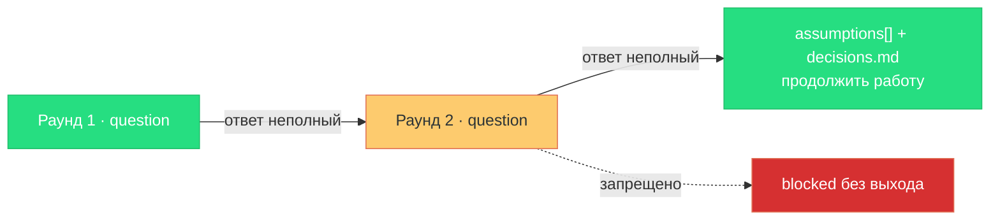
```mermaid
flowchart LR
    classDef ok fill:#26de81,stroke:#20bf6b,color:#fff
    classDef warn fill:#fdcb6e,stroke:#e17055,color:#2d3436
    classDef bad fill:#d63031,stroke:#e17055,color:#fff

    Q1["Раунд 1 · question"]:::ok
    Q2["Раунд 2 · question"]:::warn
    A["assumptions[] + decisions.md<br>продолжить работу"]:::ok
    D["blocked без выхода"]:::bad

    Q1 -->|"ответ неполный"| Q2
    Q2 -->|"ответ неполный"| A
    Q2 -.->|"запрещено"| D
```


По исчерпании раундов Lead обязан взять `assumption_if_unanswered`, записать его в `assumptions[]` брифа и в `decisions.md` (`kind: assumption`), после чего продолжить. Допущение попадает в release notes и в `docs/architecture/adr/`.

**Таймауты и таксономия:**

```yaml
orchestra:
  phase_timeouts:
    discovery_s: 900
    contract_s: 900
    lead_brief_s: 600
    blocked_escalate_s: 300   # blocked дольше → принудительный вопрос к User
```

`blocked_reason` — закрытый список: `stale_contract | missing_answer | verify_failed | permission_denied | tier_exhausted | dependency_unmet`. Свободный текст не маршрутизируется автоматически.

### 5.3 Contract Epoch Guard

Хэширование контрактов — расширение существующего механизма `conditions.file_hash` ops-applier с файлов кода на артефакты проектирования.

```yaml
# .orchestra/contract/EPOCH.yaml — ведёт рантайм, не модель
epoch: 7
artifacts:
  Domain_Model.md:         { version: 3, sha256: "a1b2…", owner: "backend" }
  NFR.md:                  { version: 1, sha256: "c3d4…", owner: "orchestrator" }
  OpenAPI.v0.yaml:         { version: 5, sha256: "e5f6…", owner: "backend" }
  UI_Tokens.skeleton.json: { version: 2, sha256: "0789…", owner: "design" }
```

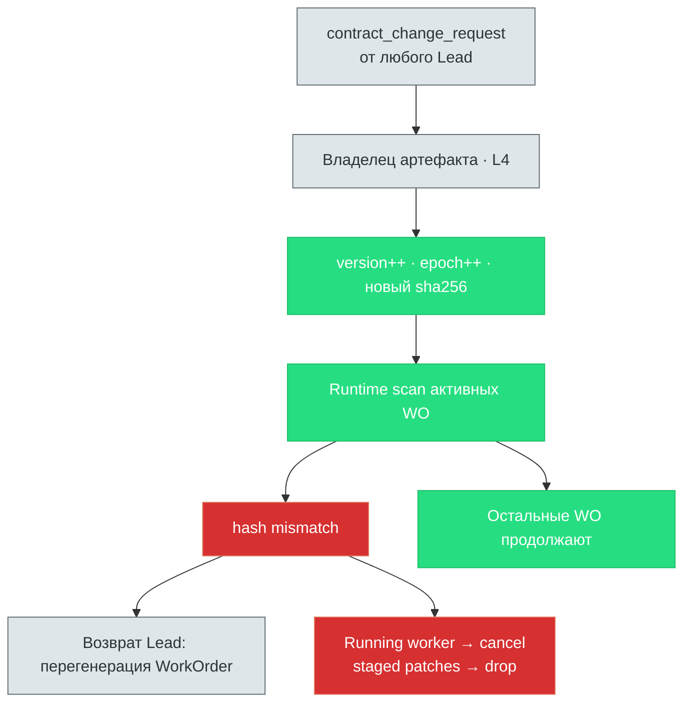
```mermaid
flowchart TB
    classDef gate fill:#26de81,stroke:#20bf6b,color:#fff
    classDef bad fill:#d63031,stroke:#e17055,color:#fff
    classDef art fill:#dfe6e9,stroke:#636e72,color:#2d3436

    CCR["contract_change_request<br>от любого Lead"]:::art
    Owner["Владелец артефакта · L4"]:::art
    Bump["version++ · epoch++ · новый sha256"]:::gate
    Scan["Runtime scan активных WO"]:::gate
    Inv["hash mismatch"]:::bad
    Back["Возврат Lead: перегенерация WorkOrder"]:::art
    Kill["Running worker → cancel<br>staged patches → drop"]:::bad
    OK["Остальные WO продолжают"]:::gate

    CCR --> Owner --> Bump --> Scan
    Scan --> Inv --> Back
    Inv --> Kill
    Scan --> OK
```


| Точка проверки                | Действие                                                                                                    |
| ----------------------------- | ----------------------------------------------------------------------------------------------------------- |
| `guardSpawn(worker)`          | Хэши `contract_refs` совпадают с `EPOCH.yaml`, иначе spawn отклоняется                                      |
| Во время исполнения           | Смена epoch → `task_cancel` + drop staged patches (dry-run overlay позволяет это без последствий для диска) |
| `task_result(success)`        | Повторная сверка: контракт мог смениться за время работы                                                    |
| WorkOrder без `contract_refs` | Невалиден в `execution`; допустим только в `maintenance`                                                    |


**Изменять контракт может только владелец** из `EPOCH.yaml`. Остальные оформляют запрос:

```json
{
  "kind": "contract_change_request",
  "artifact": ".orchestra/contract/OpenAPI.v0.yaml",
  "current_sha256": "e5f6…",
  "requester": "frontend@web",
  "delta": "GET /bookings — добавить query param status",
  "rationale": "экран списка брони, PRD US-014"
}
```

Владелец принимает (version++, epoch++, запись `kind: contract_change`) либо отклоняет с обоснованием. Конфликт двух владельцев — единственный случай, когда арбитром выступает Orchestrator L5.

### 5.4 Verify: код и артефакты


| Объект            | Проверка                                                            | Инструмент                           | Что блокирует                  |
| ----------------- | ------------------------------------------------------------------- | ------------------------------------ | ------------------------------ |
| `OpenAPI.*.yaml`  | Валидность спеки, разрешимость схем, описанные коды ошибок          | `spectral lint` / `openapi-validate` | handoff в FE, QA, Security     |
| `UI_Tokens*.json` | JSON Schema, обязательные группы токенов                            | встроенный validator                 | handoff во Frontend            |
| `Domain_Model.md` | Покрытие сущностей из `User_Stories.md`, отсутствие дубликатов имён | coverage-скрипт                      | переход `contract → execution` |
| `NFR.md`          | Обязательные секции непусты                                         | frontmatter check                    | переход `contract → execution` |
| `*_Brief_*.md`    | `brief_required_fields` из playbook                                 | completeness gate                    | spawn workers                  |
| WorkOrder         | Схема + наличие `contract_refs`                                     | `workorder_validate.go`              | spawn worker                   |
| **Код**           | LSP diagnostics, build, **affected tests**, **typecheck FE**        | Worker Verify                        | `task_result(success)`         |


```yaml
orchestra:
  artifact_verify:
    openapi: spectral
    json_schema: builtin
    domain_coverage: true
    brief_required_fields: true
  worker_verify:
    lsp: true
    build: true
    affected_tests: true
    frontend_typecheck: true
    timeout_s: 180
```

**Машинно-проверяемые критерии приёмки.** Текстовые `acceptance_criteria` проверяются L4-verifier — суждение поверх суждения. Формализуемая часть выносится в исполняемое поле:

```json
{
  "acceptance_criteria": [
    "Форма брони отправляет POST /bookings и показывает ошибку валидации"
  ],
  "acceptance_checks": [
    { "cmd": "go test ./internal/booking/... -run TestCreate", "expect_exit": 0 },
    { "cmd": "curl -s -o /dev/null -w '%{http_code}' $STAGING/bookings -X POST -d @fixtures/booking.json",
      "expect_stdout": "201" }
  ]
}
```


| Правило                                           | Обоснование                                     |
| ------------------------------------------------- | ----------------------------------------------- |
| `acceptance_checks` исполняет рантайм             | Устраняет самооценку модели                     |
| Требуют `--allow-exec` либо `exec.confirm: false` | Совпадает с политикой `exec.run`                |
| Пустой список допустим                            | Не всё формализуемо; тогда работает L4-verifier |
| Красный check → `task_result(success)` запрещён   | Тот же fail-closed, что у LSP                   |


**Арбитраж:**

1. `acceptance_checks` красный → blocked; приоритет над мнением verifier.
2. Checks зелёные, verifier красный → `task_result(needs_review)`; Lead решает, чинить код или исправлять критерий.
3. `verified_success` выставляет рантайм и только при зелёных обеих сторонах. Модель это поле не пишет.

### 5.5 Tier escalation


| Попытка | Действие                                        |
| ------- | ----------------------------------------------- |
| 1–2     | Retry L3 с verification hint                    |
| 3       | Escalate: тот же WorkOrder, `required_tier: L4` |
| L4 fail | Orchestrator: `blocked` + replan                |


```yaml
orchestra:
  tier_escalation:
    enabled: true
    worker_failures_before_l4: 2
    max_l4_retries: 1
```

Эскалация не должна срабатывать на невалидный JSON от локальной модели: `task_result` принимается как schema-enforced tool call с repair-retry, иначе tier поднимается по причине формата, а не качества кода.

### 5.6 Batch spawn и параллелизм

Lead возвращает `batch_workorders[]` в `task_result`. Рантайм проверяет disjoint `target_files` — как между воркерами одного отдела, так и между отделами и инстансами — и запускает spawn через `errgroup`. Пересечение множеств файлов → сериализация конфликтующих задач.

### 5.7 Бюджет контекста L5

`.orchestra/state.md` инжектируется в каждый turn parent-агента и без ограничения растёт монотонно. Деградация в этом случае выглядит как «Orchestrator забывает», а не как явная ошибка.

```yaml
orchestra:
  context_budget:
    state_max_bytes: 16384
    warn_at_bytes: 12288
    epic_digest_max_bytes: 512
    archive_closed_epics: true    # → .orchestra/archive/epics/
    rolling_summary: true
    compaction_model_tier: L2
```


| Секция `state.md`           | Лимит     | Политика                                 |
| --------------------------- | --------- | ---------------------------------------- |
| `## Goal`                   | 500 B     | Не вытесняется                           |
| `## Phase / contract_epoch` | 200 B     | Не вытесняется                           |
| `## Active epics`           | 512 B × N | Только открытые эпики                    |
| `## Rolling summary`        | 2 KB      | Сжатие вытесненного, выполняет **L2**    |
| `## Recent decisions`       | 2 KB      | Последние N записей; полный лог на диске |
| `## Archive pointer`        | 100 B     | Путь к `.orchestra/archive/`             |


**Инварианты:**

- Превышение `state_max_bytes` до отправки в LLM запускает принудительную компакцию, а не молчаливое усечение хвоста.
- Компакцию выполняет L2 — сжатие не является задачей для флагманской модели.
- Закрытый эпик переносится в `.orchestra/archive/epics/{id}.md` целиком; в state остаётся строка результата.
- `decisions.md` на диске не сжимается никогда; сжимается только его проекция в state.
- Digest child-агента ограничен `epic_digest_max_bytes` — существующий `digestBudget`, привязанный к общему бюджету.

### 5.8 Dept scratchpads

`.orchestra/state.md` — Orchestrator. `.orchestra/depts/{instance}.md` — Leads, по одному на инстанс. `.orchestra/product/*` — Product. `.orchestra/decisions.md` — общий, read-only для Leads, пишет рантайм.

---

## 6. Playbooks и Briefs

### 6.1 Три слоя playbooks

Форма и алгоритм берутся из playbook; факты проекта — из PRD, контракта и `decisions.md`; свобода модели ограничена содержимым полей brief и ТЗ.

```mermaid
flowchart TB
    classDef l0 fill:#74b9ff,stroke:#0984e3,color:#2d3436
    classDef l1 fill:#a29bfe,stroke:#6c5ce7,color:#fff
    classDef l2 fill:#55efc4,stroke:#00b894,color:#2d3436

    L0["L0 · Orchestra defaults<br>docs/examples/playbooks/"]:::l0
    L1["L1 · Конвенции проекта<br>.orchestra/playbooks/conventions.md<br>Docs Lead · этап 1"]:::l1
    L2["L2 · Playbook отдела + Brief + ТЗ<br>.orchestra/playbooks/{dept}.md<br>Dept Lead · этап 3"]:::l2
    WO["WorkOrder → Workers L3 / L1"]:::l2

    L0 -->|"Docs Lead сужает под проект"| L1
    L1 -->|"Dept Lead сужает под дисциплину"| L2
    L2 --> WO
```


| Слой   | Путь                                                                                     | Кто пишет      | Когда  | Содержание                                                             |
| ------ | ---------------------------------------------------------------------------------------- | -------------- | ------ | ---------------------------------------------------------------------- |
| **L0** | `docs/examples/playbooks/*.md`                                                           | Orchestra repo | всегда | Инженерные дефолты, не зависящие от проекта                            |
| **L1** | `.orchestra/playbooks/conventions.md`                                                    | Docs Lead      | этап 1 | Кросс-отдельные правила: стек, формат ошибок, naming, коммиты, DoD     |
| **L2** | `.orchestra/playbooks/{dept}.md`, `{dept}@{instance}.md`, `.orchestra/specs/{dept}/…`    | Dept Lead      | этап 3 | Дисциплинарные правила отдела и инструкции его Workers, Brief, ТЗ      |

**Override policy:** каждый слой может только **сужать** предыдущий. Ослабление — через `accepted_risk` и approve User. Greenfield: L1 обязателен до этапа 2.5. Brownfield: Docs Lead объединяет L0 с существующими соглашениями репозитория.

**Почему L1 пишет Docs Lead, а L2 — сам Lead.** Разделение проходит не по компетенции, а по адресату правила.

L2 адресован Workers отдела, и его должен писать Lead: он знает дисциплину лучше универсала L4, а пересказ чужой дисциплины даёт ту же деградацию смысла, из-за которой из системы убран Relay через L5.

L1 адресован самим Lead'ам и потому не может писать Lead. Во-первых, самореференция: playbook инжектится в промпт при спавне Lead'а, поэтому правило, написанное этим же Lead'ом в этом же контексте, ничего не ограничивает — оно лишь фиксирует уже принятое решение. Во-вторых, согласованность: формат ошибок, naming, структура тестов и коммиты обязаны совпадать у всех отделов, а пять L4 работают в изолированных контекстах без общей истории диалога ([2.2](#22-hub-and-spoke)) и разойдутся к третьему эпику. В-третьих, stack detect в brownfield — одна операция по всему репозиторию, а не пять независимых.


| Подход                 | Плюсы                                          | Минусы                                                |
| ---------------------- | ---------------------------------------------- | ----------------------------------------------------- |
| Только LLM             | Быстрый старт                                  | Каждый epic — новый процесс; Security без методологии |
| Жёсткие правила в коде | Детерминизм                                    | Не масштабируется на разные стеки                     |
| **Гибрид (принят)**    | Структура фиксирована, содержание генерируется | Требует Docs Lead и шаблонов                          |


### 6.2 Implementation Brief

Brief — анкета достаточности, а не замена ТЗ. Lead заполняет поля, неизвестное уходит в `open_questions[]`, после ответов (или после `max_clarification_rounds` и записи `assumptions[]`) completeness gate разрешает выпуск WorkOrders.

**Frontend** — `[frontend_implementation_brief.template.md](../examples/playbooks/frontend_implementation_brief.template.md)`:


| Секция                           | Required | Назначение                               |
| -------------------------------- | -------- | ---------------------------------------- |
| Routes / screens                 | ✅        | Scope воркеров                           |
| State management                 | ✅        | Архитектурный контракт                   |
| API contract ref                 | ✅        | Ссылка на `OpenAPI` + sha256             |
| Design tokens ref                | ✅        | Ссылка на `UI_Tokens` + sha256           |
| NFR ref                          | ✅        | Платформы, браузеры, offline из `NFR.md` |
| a11y / i18n                      | 🟡       | Default из L1 playbook                   |
| Error / loading UX               | 🟡       |                                          |
| `open_questions` / `assumptions` | —        | Barrier и fail-forward                   |


**Backend** — `[backend_implementation_brief.template.md](../examples/playbooks/backend_implementation_brief.template.md)`:


| Секция                                           | Required |
| ------------------------------------------------ | -------- |
| Domain entities ref (`Domain_Model.md` + sha256) | ✅        |
| API style (REST / GraphQL / RPC)                 | ✅        |
| AuthN/AuthZ модель                               | ✅        |
| Migrations / schema strategy                     | ✅        |
| NFR ref (latency, RPS, retention)                | ✅        |
| OpenAPI path (выходной артефакт)                 | ✅        |
| Observability                                    | 🟡       |


**Design и QA** — аналогичные шаблоны в L0; структура фиксируется в L1.

```yaml
# .orchestra/playbooks/frontend.md — frontmatter
brief_required_fields:
  - routes
  - state_management
  - api_contract_ref
  - design_tokens_ref
  - nfr_ref
min_open_questions_resolved: true   # либо зафиксированы assumptions[]
```

Lead не спавнит воркеров, пока gate красный: возвращает `blocked_need_clarification` — но не более `max_clarification_rounds`, после чего обязан продолжить с явными допущениями.

### 6.3 Security: методология вместо общих указаний

1. **Scope** — attack surface map по `Domain_Model.md` (Scout L2), этап 2.5
2. **Threat model** — STRIDE-lite → `Threat_Model.md`, этап 2.5
3. **Static audit** — buckets из `[security-checklist.md](../examples/refs/security-checklist.md)` и `[security_methodology.md](../examples/playbooks/security_methodology.md)`, этап 5
4. **Deps / secrets** — gosec, npm audit, gitleaks
5. **DAST** *(gated)* — только staging, OpenAPI-driven probes, этап 6b
6. **Findings** → WorkOrder на fix, отдельно от задачи аудита

```yaml
# .orchestra/playbooks/security.md
asvs_level: 2          # enterprise → 3
forbidden_patterns:
  - exec from agent output
  - skip file_hash on write
pentest_allowed_hosts:
  - staging.example.com
accepted_risks: []     # только с approve User
waive_buckets: []      # enterprise → пусто, injection/auth не waive
```

Auditor подключает project playbook и L0 checklist через `@include` и не определяет порядок шагов самостоятельно.

### 6.4 Владение артефактами


| Артефакт                      | Владелец                             | Назначение                     |
| ----------------------------- | ------------------------------------ | ------------------------------ |
| `PRD.md`                      | Product                              | Что строим                     |
| `.orchestra/contract/*`       | Backend / Design / Orchestrator      | Общий язык и границы           |
| `.orchestra/playbooks/conventions.md` | Docs Lead                    | Конвенции, общие для всех отделов |
| `.orchestra/playbooks/{dept}.md`      | Dept Lead                    | Как работает свой отдел        |
| `docs/**`                     | Docs Lead (каркас) + Leads (контент) | Поддержка проекта              |
| `.orchestra/docs/MANIFEST.md` | Docs Lead                            | Карта владельцев и триггеров   |
| `.orchestra/specs/*`          | Dept Leads                           | Brief и ТЗ эпика               |
| `.orchestra/decisions.md`     | Runtime                              | Решения, waivers, допущения    |
| `README.md` sync              | Platform 6b                          | Актуальность относительно кода |
| `Security_Findings.md`        | Security Auditor                     | Результат аудита               |


| Тип документации                               | Публикуется в repo    | Только internal                       |
| ---------------------------------------------- | --------------------- | ------------------------------------- |
| Product (summary в `overview.md`)              | ✅                     | PRD полностью — `.orchestra/product/` |
| Architecture (ADR, C4-lite)                    | ✅                     | —                                     |
| Development (setup, contributing)              | ✅                     | —                                     |
| Operations (runbooks)                          | ✅                     | секреты — никогда                     |
| API (OpenAPI, `docs/api/`)                     | ✅                     | —                                     |
| Orchestra runtime (playbooks, specs, contract) | опциональные выдержки | ✅ `.orchestra/`                       |


### 6.5 Ослабление правил


| Ситуация                    | Policy                                                                      |
| --------------------------- | --------------------------------------------------------------------------- |
| Spike / prototype (< 1 дня) | `fast_path`: skip L1, минимальный brief, `Domain_Model.md` в виде глоссария |
| Single-file fix             | `phase: maintenance`, worker без brief, ТЗ = inline WorkOrder               |
| Enterprise / regulated      | L1 обязателен, ASVS L3, G5; Security L1 не подлежит waive                   |


Default для нового продукта: L0 + L1 + Brief обязательны для FE, BE и Security до выпуска WorkOrders.

---

## 7. Контракты и схемы

### 7.1 Матрица маршрутизации

Orchestrator указывает `task_type` и `required_tier`; model ID выбирает Router.


| task_type                                                | Tier  | Subagent                    | Примечание                                                              |
| -------------------------------------------------------- | ----- | --------------------------- | ----------------------------------------------------------------------- |
| `product_discovery`, `competitive_analysis`, `prd_draft` | L4    | `product` *(planned)*       | Только `.orchestra/product/`*; websearch разрешён                       |
| `prd_revise`                                             | L4    | `product`                   | После ответов из `decisions.md`                                         |
| `conventions_scaffold`, `project_docs_init`              | L4    | `documentation` *(planned)* | Этап 1: L1 `conventions.md`, каркас `docs/`, MANIFEST                   |
| `dept_playbook_write`                                    | L4    | `architecture` (Dept Lead)  | Этап 3: L2 `{dept}.md` вместе с Brief; может только сужать L1           |
| `docs_content_update`                                    | L3    | `docs_writer`               | 6b: контент `docs/` и ADR по факту кода                                 |
| `user_intake`, `system_design`, `conflict_resolution`    | L5    | orchestra                   | Эпики, фазовые решения                                                  |
| `**domain_model`, `nfr_definition**`                     | L4–L5 | `architecture`              | **Этап 2.5**                                                            |
| `**openapi_draft_v0**`                                   | L4    | `architecture` (Backend)    | Этап 2.5; verify — `spectral`                                           |
| `**ui_tokens_skeleton**`                                 | L4    | `architecture` (Design)     | Этап 2.5; verify — JSON Schema                                          |
| `**contract_change_review**`                             | L4    | владелец артефакта          | Приём или отклонение change request; epoch++                            |
| `**contract_conflict**`                                  | L5    | orchestra                   | Конфликт двух владельцев контракта                                      |
| `architecture_review`, `openapi_design`, `schema_design` | L4    | `architecture`              | Этап 3; только plan/md                                                  |
| `root_cause_analysis`                                    | L4    | `debug`                     | Evidence и узкий fix                                                    |
| `multi_file_refactor`                                    | L3    | `worker` (`tier: complex`)  | WorkOrder + CKG refs                                                    |
| `write_function`, `single_file_edit`                     | L3    | `worker` (`tier: focused`)  | Основная полоса воркеров                                                |
| `lint_fix`, `import_cleanup`, `rename_symbol`            | L1    | `worker` (`tier: micro`)    | 1–2 строки; при наличии детерминированного инструмента предпочитать его |
| `explore_codebase`, `summarize_logs`, `repo_map`         | L2    | `explore`                   | Без write                                                               |
| `state_compaction`                                       | L2    | `explore`                   | Rolling summary для `state.md`                                          |
| `explain_code`, `answer_question`                        | L2    | `ask`                       | Read-only                                                               |
| `verify_acceptance`                                      | L4    | `verifier`                  | После worker                                                            |
| `security_audit`, `sast_scan`, `secret_scan`             | L4    | `security_auditor`          | Read-only; findings                                                     |
| `pentest_staging`                                        | L3    | `debug` + exec gate         | Controlled probes                                                       |
| `security_fix`                                           | L3    | `worker`                    | Патч по одному finding                                                  |
| `ci_pipeline`, `release_notes`, `runbook_update`         | L3–L4 | Platform                    | 6b: CI, release notes, runbooks                                         |


### 7.2 Контракт Router

Логический контракт между Orchestrator и Core (не wire-формат JSON-RPC).

```json
{
  "task_type": "explore_codebase",
  "required_tier": "L2",
  "subagent_type": "explore",
  "payload": "Найди все использования функции ProcessPayment"
}
```

```json
{
  "task_type": "write_function",
  "required_tier": "L3",
  "subagent_type": "worker",
  "tier": "focused",
  "payload": {
    "task_id": "add_jwt_check",
    "intent": "…",
    "instructions": ["…"],
    "target_files": ["internal/auth/middleware.go"],
    "contract_refs": [
      { "path": ".orchestra/contract/OpenAPI.v0.yaml", "sha256": "e5f6…" },
      { "path": ".orchestra/contract/Domain_Model.md", "sha256": "a1b2…" }
    ],
    "acceptance_criteria": ["Запрос без токена возвращает 401"],
    "acceptance_checks": [
      { "cmd": "go test ./internal/auth/... -run TestJWT", "expect_exit": 0 }
    ]
  }
}
```

Порядок обработки в ядре: прочитать `required_tier` → найти binding в `orchestra_routing.yaml` / `orchestra.tiers` → подставить `provider` и `model` → проверить `guardSpawn` (фаза, PRD, contract epoch) → спавнить subagent с узким промптом без истории чата.

### 7.3 `orchestra_routing.yaml`

```yaml
# orchestra_routing.yaml — tier → provider/model bindings
# Меняются только bindings; агенты оперируют L1–L5.

version: 1

roles:
  L5:
    label: "Orchestrator"
    provider: anthropic
    model: claude-opus-4-7

  L4_product:
    label: "Product Lead"
    provider: anthropic
    model: claude-sonnet-4-6
    subagent_type: product

  L4_docs:
    label: "Documentation Lead"
    provider: anthropic
    model: claude-sonnet-4-6
    subagent_type: documentation

  L4_platform:
    label: "Platform Lead"
    provider: anthropic
    model: claude-sonnet-4-6

  L4:
    label: "Department Lead"
    provider: anthropic
    model: claude-sonnet-4-6

  L3:
    label: "Focused worker"
    provider: lmstudio-coder
    model: qwen2.5-coder-32b
    # cloud fallback: deepseek-chat @ together

  L2:
    label: "Context explorer"
    provider: google
    model: gemini-2.5-flash

  L1:
    label: "Micro fixer"
    provider: lmstudio-fast
    model: qwen2.5-coder-7b

legacy_map:
  planner: L5
  complex: L3
  focused: L3
  micro: L1
  explore: L2

routing:
  explore_codebase:    { required_tier: L2, subagent_type: explore }
  state_compaction:    { required_tier: L2, subagent_type: explore }
  domain_model:        { required_tier: L4, subagent_type: architecture }
  openapi_draft_v0:    { required_tier: L4, subagent_type: architecture }
  architecture_review: { required_tier: L4, subagent_type: architecture }
  write_function:      { required_tier: L3, subagent_type: worker, tier: focused }
  multi_file_refactor: { required_tier: L3, subagent_type: worker, tier: complex }
  lint_fix:            { required_tier: L1, subagent_type: worker, tier: micro }
```

Эквивалент в текущем `.orchestra.yml`:

```yaml
orchestra:
  planner:
    provider: anthropic
    model: claude-opus-4-7
  tiers:
    - name: complex
      provider: lmstudio-coder
      model: deepseek-coder-33b
    - name: focused
      provider: lmstudio-mid
      model: qwen2.5-coder-32b
    - name: micro
      provider: lmstudio-fast
      model: qwen2.5-coder-7b
  default_tier: focused
  max_worker_retries: 3
  worker_verify_enabled: true
```

### 7.4 Сводный конфиг инвариантов

```yaml
orchestra:
  phase: discovery
  phase_enforcement: strict

  contract:
    dir: .orchestra/contract
    required: [Domain_Model.md, NFR.md, OpenAPI.v0.yaml, UI_Tokens.skeleton.json]
    epoch_file: .orchestra/contract/EPOCH.yaml
    enforce_refs_on_spawn: true
    cancel_running_on_epoch_change: true

  question_barrier:
    enabled: true
    window_ms: 3000
    max_clarification_rounds: 2
    decisions_log: .orchestra/decisions.md
    relay_via_llm: false

  artifact_verify:
    openapi: spectral
    json_schema: builtin
    domain_coverage: true
    brief_required_fields: true

  worker_verify:
    lsp: true
    build: true
    affected_tests: true
    frontend_typecheck: true

  tier_escalation:
    enabled: true
    worker_failures_before_l4: 2
    max_l4_retries: 1

  gates:
    prd_approve: required
    contract_freeze: required
    git_push: required
    deploy_prod: required
    compliance_signoff: optional

  waiver:
    authority: user
    waivable: [playbooks, contract, doc_debt, brief_completeness]
    non_waivable: [prd_approve, worker_verify, git_push, deploy_prod]

  phase_timeouts:
    discovery_s: 900
    contract_s: 900
    lead_brief_s: 600
    blocked_escalate_s: 300

  context_budget:
    state_max_bytes: 16384
    archive_closed_epics: true
    rolling_summary: true
    compaction_model_tier: L2
```

---

## 8. Roadmap реализации


| PR       | Фокус                        | Изменения                                                                                                                       |
| -------- | ---------------------------- | ------------------------------------------------------------------------------------------------------------------------------- |
| **PR1**  | Tier config                  | `orchestra_routing.yaml`, L1–L5 в `internal/config/orchestra.go`, обратная совместимость с `planner`/`focused`/`micro`          |
| **PR2**  | Product subagent             | `product.txt`, `ModeProduct`, tools только `.orchestra/product/`*, `websearch`/`webfetch`                                       |
| **PR3**  | Phase + human gates          | `guardSpawn`, `prdApproved`, G1–G4 в UI                                                                                         |
| **PR4**  | Tier escalation              | `tier_escalation` + retry L4 в `runWorkerWithVerification`                                                                      |
| **PR5**  | Batch spawn                  | `batch_workorders` + disjoint check + `errgroup`                                                                                |
| **PR6**  | Dept scratchpads             | `.orchestra/depts/`* в промптах Lead                                                                                            |
| **PR7**  | Playbooks и project docs     | Docs Lead этапа 1 (L1 `conventions.md`), L0 templates, `docs/` scaffold, MANIFEST, `doc_debt`; L2 `{dept}.md` в выходе Lead'а; Docs на 6b |
| **PR8**  | **Contract layer**           | `phase: contract`, `.orchestra/contract/`*, `EPOCH.yaml`, `contract_refs`, инвалидация, Artifact Verify, G6                     |
| **PR9**  | **Runtime relay и breakers** | Question Barrier в Go, `decisions.md`, `phase: maintenance`, waiver G7, `max_clarification_rounds`, таксономия `blocked_reason` |
| **PR10** | **Scale и context**          | Dept instances, архив эпиков, rolling summary, `state_max_bytes`                                                                |


### Checklist


| #   | Задача                                                       | Статус | PR    |
| --- | ------------------------------------------------------------ | ------ | ----- |
| 1   | L1–L5 в спецификации и runtime                               | ✅      | —     |
| 2   | Orchestrator: `required_tier` + фазы + spawn Product         | ✅      | PR2   |
| 3   | `orchestra_routing.yaml` schema + merge                      | ✅      | PR1   |
| 4   | Runtime Router: `task_type` → tier → LLM                     | ✅      | PR1   |
| 5   | UI settings: tier labels                                     | ✅      | PR1   |
| 6   | E2E: смена L3 без изменения WorkOrder                        | ✅      | PR1   |
| 7   | Security: auditor + pentest sandbox                          | 🔲     | —     |
| 8   | Product: PRD gate + skill                                    | 🟡     | PR2–3 |
| 9   | Platform: 6a–6b + гейты G2–G4                                | 🟡     | PR3   |
| 10  | Phase guard (fail-closed)                                    | ✅      | PR3   |
| 11  | Tier escalation L3→L4→replan                                 | ✅      | PR4   |
| 12  | Batch parallel workers                                       | ✅      | PR5   |
| 13  | Dept scratchpads                                             | ✅      | PR6   |
| 14  | Docs dept: L0 templates + L1 `conventions.md` на этапе 1     | ✅      | PR7   |
| 14b | L2 `{dept}.md` в `task_result` Lead'а + проверка «только сужать» | ✅ | PR7   |
| 14c | Documentation на 6b: `docs/` по коду + ADR из `decisions.md`  | ✅      | PR7   |
| 15  | FE/BE Implementation Brief + completeness gate               | ✅     | PR7   |
| 16  | Security methodology L1 override + ASVS                      | ✅      | PR7   |
| 17  | Project `docs/` scaffold + MANIFEST + `doc_debt`             | ✅     | PR7   |
| 18  | `project_profile` в PRD + playbook overrides                 | ✅     | PR7   |
| 19  | Фаза `contract` + 4 артефакта + G6                           | ✅     | PR8   |
| 20  | `EPOCH.yaml` + `contract_refs` + инвалидация running workers | ✅     | PR8   |
| 21  | Artifact Verify: openapi lint, JSON Schema, domain coverage  | ✅     | PR8   |
| 22  | `acceptance_checks` + арбитраж двух verify                   | ✅     | PR8   |
| 23  | Worker Verify += affected tests + FE typecheck               | ✅     | PR8   |
| 24  | Question Barrier в Go (`relay_via_llm: false`)               | ✅     | PR9   |
| 25  | `.orchestra/decisions.md` + inject во все Lead spawn         | ✅     | PR9   |
| 26  | `phase: maintenance` + waiver G7 + non_waivable              | ✅     | PR9   |
| 27  | `max_clarification_rounds` → `assumptions[]`                 | ✅     | PR9   |
| 28  | Таксономия `blocked_reason` + phase timeouts                 | ✅     | PR9   |
| 29  | Dept instances + scratchpad на инстанс                       | ✅     | PR6   |
| 30  | `state_max_bytes` + архив эпиков + rolling summary (L2)      | 🟡     | PR10  |
| 31  | Schema-enforced `task_result` для локальных L3               | ✅     | PR4   |
| 32  | Перегенерация SVG-диаграмм под этап 2.5                      | ✅     | PR8   |


---

## 9. ADR index

Решения интегрированы в текст спецификации; таблица указывает, где именно.


| ADR       | Решение                                                                                                             | Разделы                                                                                                                                           |
| --------- | ------------------------------------------------------------------------------------------------------------------- | ------------------------------------------------------------------------------------------------------------------------------------------------- |
| **ADR-1** | Этап 2.5 Contract & Domain Freeze: `Domain_Model.md`, `NFR.md`, `OpenAPI v0`, `UI_Tokens skeleton` до spawn отделов | [2.4](#24-артефакты-и-хранилища), [3.1](#31-сквозной-pipeline), [3.5](#35-этап-25--contract-freeze), [4.1](#41-фазы), [4.2](#42-машина-состояний) |
| **ADR-2** | Детерминированный relay, Question Barrier, `decisions.md`                                                           | [2.2](#22-hub-and-spoke), [4.3](#43-question-barrier-и-decision-log), [4.5](#45-промпты), [5.2](#52-guard--unblock-path)                          |
| **ADR-3** | Contract Epoch: хэши контрактов в WorkOrder, инвалидация                                                            | [3.6](#36-этап-3--тз-отделов-параллельно), [3.8](#38-этап-5--исполнение), [5.3](#53-contract-epoch-guard), [7.2](#72-контракт-router)             |
| **ADR-4** | Artifact Verify + расширенный DoD + `acceptance_checks`                                                             | [3.9](#39-этап-6--delivery), [5.4](#54-verify-код-и-артефакты)                                                                                    |
| **ADR-5** | Deadlock breakers: `phase: maintenance`, waiver G7, `max_clarification_rounds`                                      | [4.2](#42-машина-состояний), [4.4](#44-human-gates), [5.1](#51-phase-guard), [5.2](#52-guard--unblock-path)                                       |
| **ADR-6** | Dept instances; ML вне конвейера                                                                                    | [2.3](#23-отделы--типы-и-инстансы)                                                                                                                |
| **ADR-7** | Бюджет контекста L5, архивация эпиков, компакция на L2                                                              | [5.7](#57-бюджет-контекста-l5)                                                                                                                    |


Матрица «отказ → инвариант»:


| Отказ                                              | Ловит | Реакция рантайма                                |
| -------------------------------------------------- | ----- | ----------------------------------------------- |
| Frontend пишет клиент к переименованному эндпоинту | ADR-3 | Spawn отклонён либо running worker отменён      |
| Невалидный OpenAPI ушёл в три отдела               | ADR-4 | Handoff заблокирован на lint                    |
| Ответ User потерян между отделами                  | ADR-2 | `decisions.md` инжектируется всем               |
| Lead кружит на уточнениях                          | ADR-5 | Два раунда → `assumptions[]` → продолжение      |
| Hotfix в репозитории без PRD                       | ADR-5 | `phase: maintenance`                            |
| Разные имена одной сущности в BE/FE/QA             | ADR-1 | Канонический `Domain_Model.md` + coverage check |
| Security находит дыру в готовом auth               | ADR-1 | Threat model строится до реализации             |
| Orchestrator «забыл» решение                       | ADR-7 | Компакция вместо усечения; лог на диске         |
| Один FE Lead на три стека                          | ADR-6 | Инстансы с раздельным контекстом                |
| Зелёный pipeline при нерабочей ML-модели           | ADR-6 | ML вне конвейера, явный отказ                   |


---

## 10. Ссылки


| Компонент                 | Путь                                                                                               |
| ------------------------- | -------------------------------------------------------------------------------------------------- |
| Contract dir              | `.orchestra/contract/` — `Domain_Model.md`, `NFR.md`, `OpenAPI.v0.yaml`, `UI_Tokens.skeleton.json` |
| Contract epoch            | `.orchestra/contract/EPOCH.yaml`                                                                   |
| Decision log              | `.orchestra/decisions.md` — append-only, пишет рантайм                                             |
| Archive                   | `.orchestra/archive/epics/`                                                                        |
| Orchestrator prompt       | `internal/prompt/files/orchestra.txt`                                                              |
| Product prompt            | `internal/prompt/files/product.txt` *(planned)*                                                    |
| Documentation prompt      | `internal/prompt/files/documentation.txt` *(planned)*                                              |
| Worker prompt             | `internal/prompt/files/worker.txt`                                                                 |
| Playbooks L0              | `docs/examples/playbooks/`                                                                         |
| Project docs MANIFEST     | `docs/examples/playbooks/project_docs_MANIFEST.template.md`                                        |
| FE/BE brief templates     | `docs/examples/playbooks/*_implementation_brief.template.md`                                       |
| Security methodology      | `docs/examples/playbooks/security_methodology.md`                                                  |
| Orchestra config          | `internal/config/orchestra.go`                                                                     |
| Spawn и guards            | `internal/tasks/tasks.go`                                                                          |
| Worker verify             | `internal/tasks/worker_verify.go`                                                                  |
| WorkOrder validation      | `internal/tasks/workorder_validate.go`                                                             |
| Subagent digest           | `internal/agent/history/subagent.go`                                                               |
| Runtime roles UI          | `internal/core/runtime_orchestra.go`                                                               |
| Cloud model catalog (TUI) | `ui/tui/view/dialog_model.go`                                                                      |


