# Orchestra — маршрутизация по AI Tiers (L1–L5)

**Статус:** design spec (2026-08) — основа для `orchestra_routing.yaml`  
**Связано:** [planner-worker.md](./planner-worker.md) · [orchestra-vnext.md](./orchestra-vnext.md) · [modes.md](../modes.md)

> **Диаграммы (SVG):** закрой вкладку и открой файл заново, если была ошибка загрузки.
> - [orchestra-structure.svg](./orchestra-structure.svg) — **A · структура** (компоненты)
> - [orchestra-process.svg](./orchestra-process.svg) — **B · процесс** (этапы 0–6 × отделы)

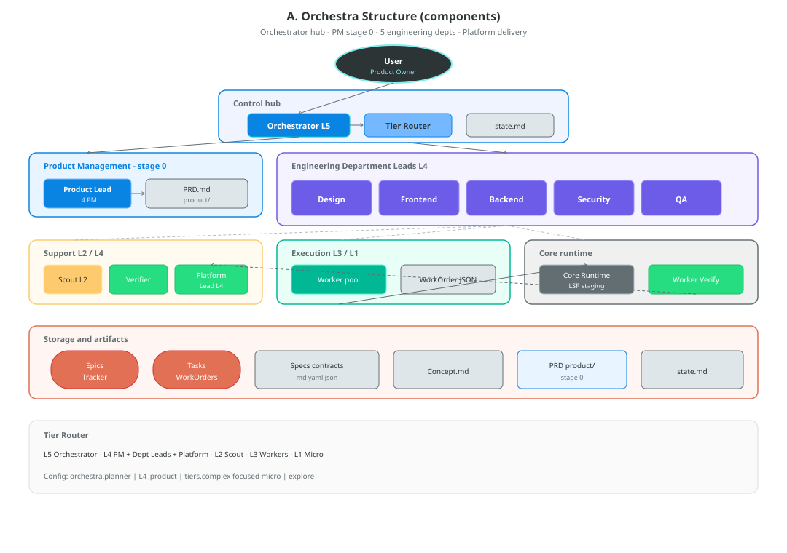

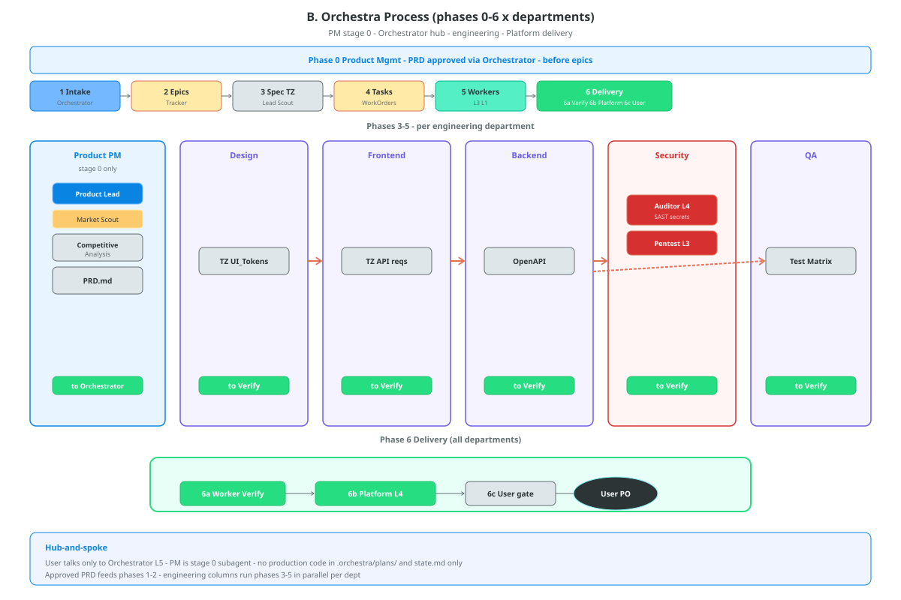

---

## Зачем отдельная матрица

Режим `orchestra` уже реализует **Lead → Worker** (см. [planner-worker.md](./planner-worker.md)). Следующий шаг — **не привязывать логику к конкретным моделям**, а оперировать **уровнями способностей (Tiers)**.

| Принцип | Смысл |
|---------|--------|
| **Tier, не model ID** | Orchestrator и Router говорят `required_tier: L3`, ядро подставляет модель из конфига |
| **Эластичность** | Нет GPU → L3 = облако; есть LM Studio → L3 = локальный Qwen 32B |
| **Стабильный контракт** | WorkOrder, subagent spawn и промпты не меняются при смене провайдера |

---

## A. Структура — что есть в системе

Статическая карта: **компоненты** (Orchestrator, PM, Platform), **отделы**, **tier-роли**, **артефакты**, **этапы 0–6**. Процесс — в [разделе B](#b-процесс--как-текёт-работа).


### A.1 Слои и компоненты

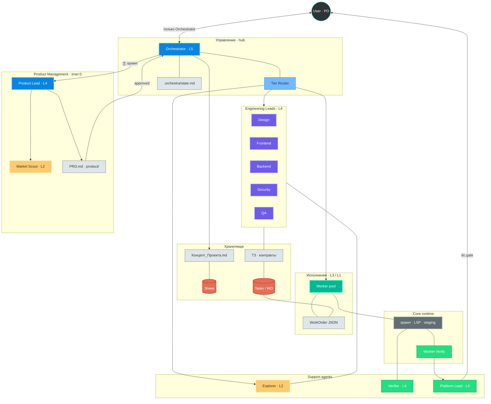

| Компонент | Tier | Subagent / mode | Назначение |
|-----------|:----:|-----------------|------------|
| Пользователь (Product Owner) | — | — | Идея, **approve PRD**, **approve release** (6c) |
| **Orchestrator** *(Orchestra Lead)* | L5 | `mode=orchestra` | **Единственный агент в чате с User.** Relay `question`, spawn PM и отделов, scratchpad |
| **Product Lead (PM)** | L4–L5 | `product` / skill `product_analyst` *(planned)* | Discovery: PRD, конкуренты — **этап 0**, только через Orchestrator |
| **Market Scout** | L2 | `websearch`, `webfetch` | Competitive analysis для PM |
| Tier Router | — | ядро | `required_tier` → provider/model |
| Department Lead | L4 | `architecture`, `debug` | ТЗ отдела, эпик → tasks *(этапы 3–4)* |
| Explorer (Scout) | L2 | `explore` | Read-only поиск в коде |
| Worker | L3 / L1 | `worker` + tier | Атомарный патч по WorkOrder *(этап 5)* |
| Verifier | L4 | `verifier` | Goal-backward проверка |
| Worker Verify (DoD) | L4 | runtime hook | LSP + build/test *(этап 6a)* |
| **Platform Lead** | L4 | planned | CI, docs sync, release checklist *(6a–6b)* |
| Platform Worker | L3 | `docs_writer`, `ci_doctor` | Правки workflow/README под Platform Lead |
| Task Tracker | — | `.orchestra/` | Эпики, tasks, `product/`, `state.md` |
| Core Runtime | — | `internal/core`, `tasks` | Spawn, verify, apply |

**Worker Verify** (*Definition of Done*) — не отдельный «Gatekeeper»-агент, а **автоматическая проверка после Worker** (подэтап **6a**), уже в коде:

- `worker_verify_enabled` — LSP на изменённых файлах + `go build` (см. `internal/tasks/worker_verify.go`)
- Worker не может `task_result(success)`, пока на staged-файлах висят LSP errors (`worker_task_result.go`)
- опционально subagent `verifier` (L4) — goal-backward по `acceptance_criteria` из WorkOrder

Пока verify красный — патч не считается «готовым»; Orchestrator видит `verified_success` или retry/blocked. **Platform Lead** (CI, docs, release draft) — planned, после зелёного **6a**; **push/deploy** — human gate **6c**.

> **Именование:** в ранних черновиках L5 назывался «CTO». Сейчас — **Orchestrator**: не «техдиректор», а **единая точка диалога** User ↔ отделы. Отделы **не чатятся с User напрямую** — только через Orchestrator (hub-and-spoke).

### A.1.1 Hub-and-spoke (как ходит диалог)

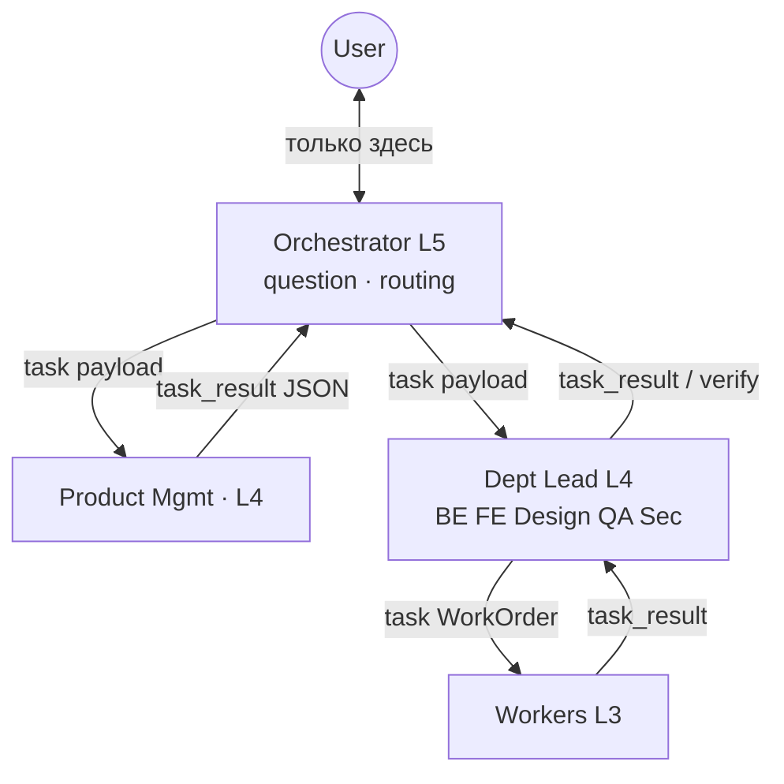

| Участник | `question` к User | История чата User |
|----------|:-----------------:|:-----------------:|
| Orchestrator | ✅ | ✅ полная |
| Product / Dept Lead / Worker | ❌ *(MVP)* | ❌ только payload от Orchestrator |

Dept Lead **формулирует** вопросы в `task_result`; Orchestrator **задаёт** их User через tool `question` и **передаёт ответы** следующим spawn.

### A.2 Отделы (org structure)

Пять **инженерных** направлений + **Product Management (PM)** (этап 0, до кода) + **Platform** (после merge). У **Security** — audit/pentest; у **PM** — discovery без кода; у Design/FE/BE/QA — Lead → Scout → Workers.

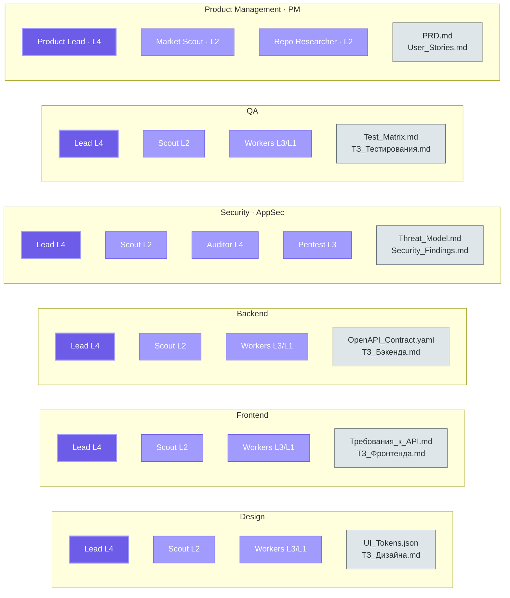

| Отдел | Lead (L4) | Scout (L2) | Workers | Ключевые артефакты |
|-------|-----------|------------|---------|-------------------|
| **Product Management (PM)** | Product Lead | market + repo scout | — *(без coders)* | см. [A.2.2](#a22-отдел-product-management-pm) |
| Design | Design Lead | explore | L3 / L1 | `ТЗ_Дизайна.md`, `UI_Tokens.json` |
| Frontend | Frontend Lead | explore | L3 / L1 | `ТЗ_Фронтенда.md`, `Требования_к_API.md` |
| Backend | Backend Lead | explore | L3 / L1 | `ТЗ_Бэкенда.md`, `OpenAPI_Contract.yaml` |
| Security | Security Lead | explore + **auditor** | auditor L4 / fix L3 | см. [A.2.1](#a21-отдел-security-appsec) |
| QA | QA Lead | explore | L3 / L1 | `ТЗ_Тестирования.md`, `Test_Matrix.md` |

### A.2.1 Отдел Security (AppSec)

Security **не дублирует Backend/QA**. Задача — найти уязвимости **своими инструментами**, зафиксировать findings, при необходимости запустить controlled pentest; правки кода — отдельным этапом через Workers или другие отделы.

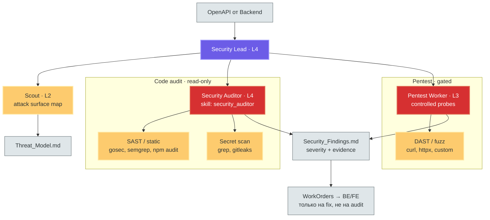

| Роль | Tier | Режим / skill | Что делает |
|------|:----:|---------------|------------|
| **Security Lead** | L4 | `architecture` / dedicated prompt | Threat model, scope audit, prioritization, WorkOrders на fix |
| **Scout** | L2 | `explore` | Карта attack surface: endpoints, auth, file IO, exec, deps |
| **Security Auditor** | L4 | skill [`security_auditor`](../../examples/skills/security_auditor.md), subagent read-only | OWASP-style обход, **без патчей** — только findings |
| **Pentest Worker** | L3 | `debug` / allowExec-gated | Ограниченные пробы по staging/local (не prod); отчёт в findings |
| **Fix Worker** | L3 | `worker` | Только после approved finding — узкий патч (как у BE/FE) |

**Инструменты отдела** (поверх общих `grep` / `read` / `explore`):

| Класс | Примеры | Когда |
|-------|---------|--------|
| **SAST / static** | `gosec`, `semgrep`, `npm audit`, `govulncheck` | Каждый audit-прогон по scope |
| **Secret scan** | `gitleaks`, `grep` по `api_key`, `password`, `.env` | Repo + diff перед merge |
| **Dependency CVE** | `npm audit`, `go list -m`, OSV | После изменений deps |
| **DAST / pentest** | `curl`/fuzz по **staging**, OpenAPI-driven probes | После стабильного Backend API; только с `--allow-exec` / sandbox |
| **Policy** | `@refs/security-checklist` | Чеклист для Auditor |

**Артефакты** (отличие от «обычного» ТЗ):

| Файл | Содержание |
|------|------------|
| `Threat_Model.md` | STRIDE/данные/границы доверия по OpenAPI |
| `Security_Findings.md` | Critical/High/Medium + file:line + exploit scenario |
| `Pentest_Report.md` | Запросы, ответы, воспроизведение (optional) |
| WorkOrders на fix | Ссылка на finding ID; исполняет BE/FE Worker или Security Fix L3 |

**Вход:** `OpenAPI_Contract.yaml` от Backend (этап 3). **Выход в общий pipeline:** findings проходят через **Worker Verify** (код) + отдельный security gate (audit must be green или accepted risk) перед Release.

> Сегодня в коде: skill `security_auditor` и `verifier` есть; отдельный `mode=security` и pentest sandbox — **planned** (см. checklist ниже).

### A.2.2 Отдел Product Management (PM)

**Как в компаниях:** отдел **Product** / **Product Management**. Роли: **Product Manager (PM)**, **Product Owner (PO)**, иногда **Product Analyst**. В Orchestra: **Product Lead (L4)** + scouts; **PO = User** (утверждает PRD через Orchestrator).

Product **не дублирует Orchestrator и не пишет код**. Задача — **discovery**: рынок, конкуренты, MVP, user stories — **до** эпиков и ТЗ инженерных отделов.

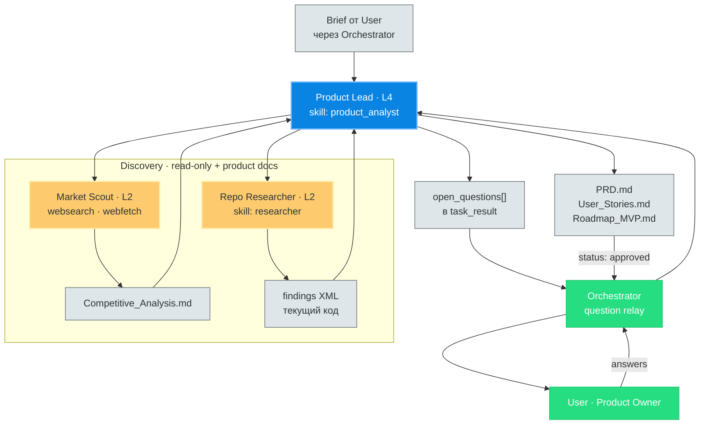

| Роль | Tier | Режим / skill | Что делает |
|------|:----:|---------------|------------|
| **Product Lead (PM)** | L4 *(greenfield / сложный рынок — L5)* | skill [`product_analyst`](../../examples/skills/product_analyst.md), `spec_writer`, `roadmapper` | PRD, приоритеты MoSCoW, метрики, синтез отчётов scouts |
| **Market Scout** | L2 | `websearch`, `webfetch` | Конкуренты, pricing, feature matrix, ссылки — **без выводов «что кодить»** |
| **Repo Researcher** | L2 | skill [`researcher`](../../examples/skills/researcher.md) | Brownfield: что уже есть в repo, gaps vs PRD draft |
| **Product Owner** | — | **User** | Approve / reject PRD; финальное «что в v1» — не PM |

**Инструменты отдела:**

| Класс | Tools / skills | Когда |
|-------|----------------|--------|
| **Market intel** | `websearch`, `webfetch` | Greenfield, новая ниша, competitive analysis |
| **Codebase facts** | `researcher`, `explore`, `read` | Доработка существующего продукта |
| **Product docs write** | `write` только под `.orchestra/product/*` | PRD, stories, analysis |
| **Clarifications** | `open_questions` в `task_result` → Orchestrator → `question` | PM **не** вызывает `question` напрямую *(MVP hub-and-spoke)* |

**Артефакты** (`.orchestra/product/`):

| Файл | Содержание |
|------|------------|
| `Competitive_Analysis.md` | 3–7 конкурентов: фичи, pricing, сильные/слабые стороны, URLs |
| `PRD.md` | Problem, personas, goals, **MVP scope**, **out of scope**, success metrics |
| `User_Stories.md` | `US-001`: As a… / I want… / So that… + acceptance (уровень **фичи**) |
| `Roadmap_MVP.md` | MoSCoW: Must / Should / Could / Won't для v1 |
| `PRD.md` frontmatter | `status: draft \| approved`, `version`, `approved_at` |

**Шаблон `PRD.md` (минимум):**

```markdown
---
status: draft
version: 1
product_owner: user
---

# PRD: <название>

## Problem
Какую боль решаем; для кого.

## Personas
- …

## Goals (v1)
1. …

## Out of scope
- …

## Success metrics
- …

## Epics (черновик для Orchestrator)
| Epic | Отдел | Priority |
|------|-------|----------|
| … | Backend | Must |
```

**Отличия от соседних ролей:**

| | Product (PM) | Orchestrator | spec_writer | Dept Lead (BE/FE) |
|---|-------------|--------------|-------------|-------------------|
| Вопрос | **Что** строим | **Как** режем и spawn | Уточнить **одну** задачу | **Как** реализовать в коде |
| Горизонт | Продукт / MVP | Эпики / pipeline | Feature spec | File / API level |
| Артефакт | PRD | state.md, epics | `<spec>` XML | ТЗ, OpenAPI |

**Вход:** идея User + optional answers (relay от Orchestrator).  
**Выход:** `PRD.md` с `status: approved` → **Orchestrator L5** → `Концепт_Проекта.md` + эпики → Department Leads (этап 3).

> Сегодня в коде: `researcher`, `roadmapper`, `spec_writer` есть; `subagent_type: product` и skill `product_analyst` — **planned** (checklist #8).

### A.2.3 Platform (post-merge · delivery)

Platform закрывает **«после merge в git»** — инженерную доставку. **Prod и секреты** — human gate (см. [C.4](#c4-human-gates-после-merge)).

| Роль | Tier | Skill / mode | Что делает |
|------|:----:|--------------|------------|
| **Platform Lead** | L4 | `architecture` + `ci_doctor` | CI yaml, env matrix, release checklist |
| **Docs Worker** | L3 | [`docs_writer`](../../examples/skills/docs_writer.md) | README, CHANGELOG, API docs vs код |
| **Release Worker** | L3 | `pr_writer`, `git_curator` | Draft PR, release notes |

| Подэтап | Кто | Автоматизация |
|---------|-----|---------------|
| **6a Repo ready** | Verify + Platform | ✅ ИИ: tests, docs, CI yaml, local commit |
| **6b Staging** | Platform + Security | 🟡 ИИ частично (CI, docker local; staging URL если есть token) |
| **6c Prod release** | User | ❌ Human approves push/deploy |

### A.3 Этапы (фазы проекта)

Этап — **именованная фаза** с фиксированным набором участников и артефактов. Порядок и переходы — в [процессе](#b-процесс--как-текёт-работа).

| # | Этап | Кто участвует | Что появляется на выходе |
|:-:|------|---------------|--------------------------|
| 0 | **Product discovery** *(до кода)* | User (PO), **Product Mgmt L4**, Market Scout L2 | `PRD.md`, `Competitive_Analysis.md` — **approved** |
| 1 | **Orchestration intake** | User, **Orchestrator L5** | `Концепт_Проекта.md` ← из PRD, не «с нуля из головы» |
| 2 | **Верхнеуровневый трекинг** | Orchestrator L5, Task Tracker | Эпики по отделам |
| 3 | **Создание ТЗ лидами** | Leads L4, Scout L2 | ТЗ + контракты отдела |
| 4 | **Атомарный трекинг** | Leads L4, Task Tracker | Tasks, WorkOrder JSON |
| 5 | **Исполнение воркерами** | Workers L3/L1, Runtime | Staged patches, `task_result` |
| 6 | **Delivery** *(после merge)* | Verify, Security gate, **Platform L4**; User на **6c** | 6a–6b автомат; 6c — explicit approve |

**Три зоны цикла:** этап **0** = до кода · **2–5** = код · **6** = после merge (см. [раздел C](#c-сессия-пользователя-product--orchestrator--release)).

### A.4 Tier Router (ядро)

Orchestrator оперирует **tier**, не model ID:

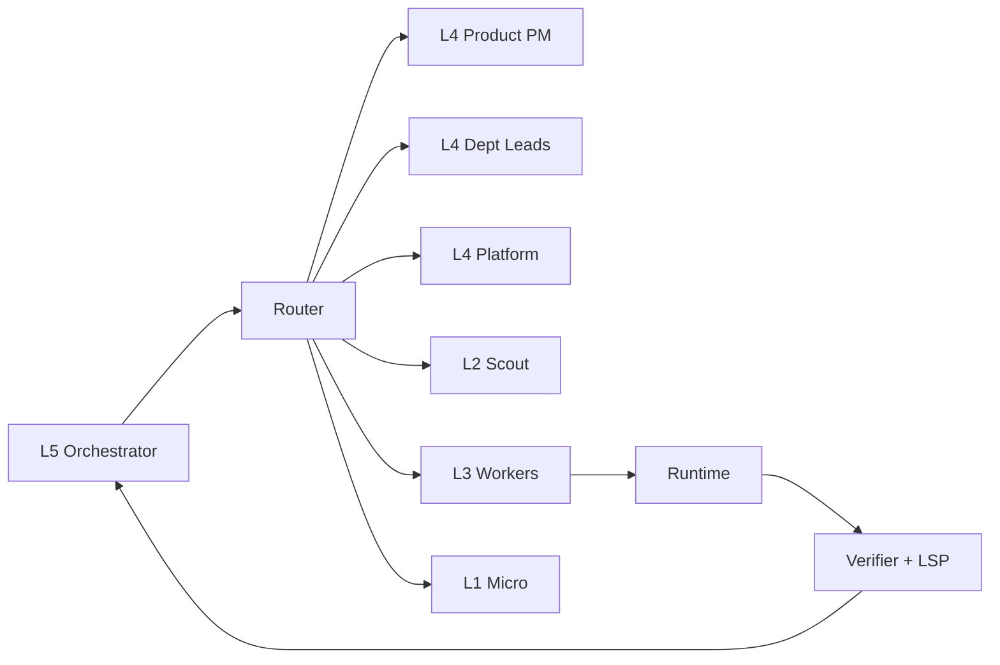

| Tier | Роль в структуре | YAML / config |
|:----:|------------------|---------------|
| L5 | Orchestrator, orchestrator Lead | `orchestra.planner` |
| L4 | Dept Leads, **Product Lead (PM)**, verifier, Platform | `orchestra.departments.*`, `L4_product` |
| L3 | Focused / complex workers | `tiers.focused`, `tiers.complex` |
| L2 | Explorer, ask | `explore`, fast provider |
| L1 | Micro workers | `tiers.micro` |

---

## B. Процесс — как текёт работа

Динамика: **порядок этапов**, **поток внутри отдела**, **handoff между отделами**, **финальная сборка**. Структура компонентов — в [разделе A](#a-структура--что-есть-в-системе).


### B.1 Сквозной pipeline (этапы 0–6)

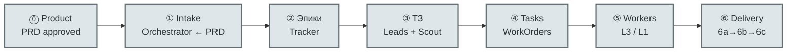

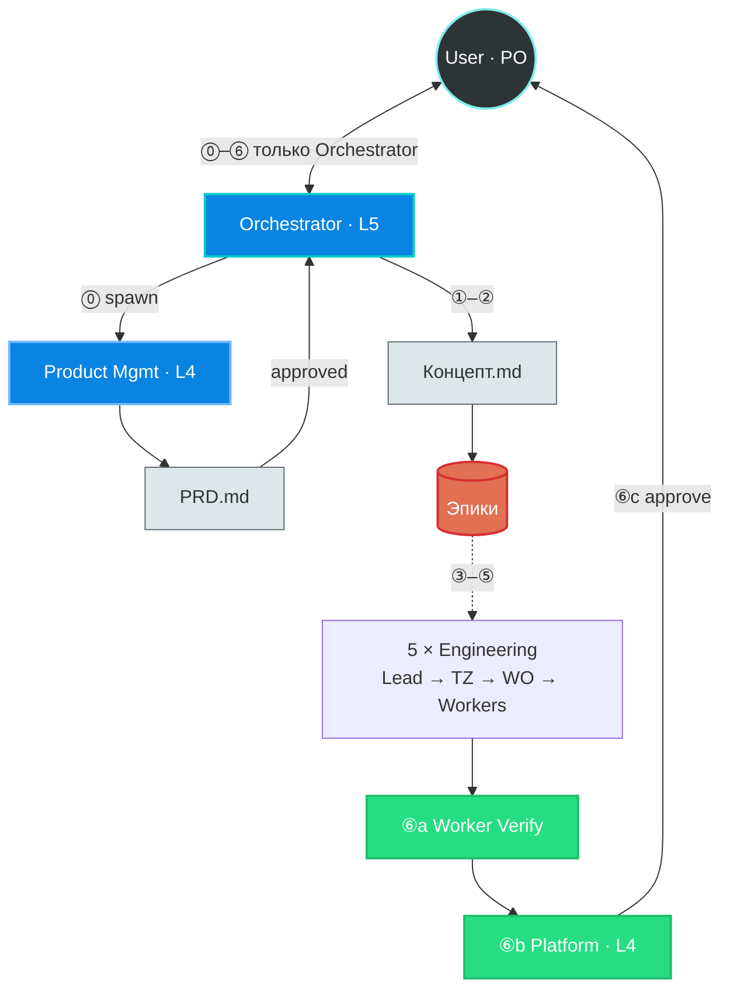

### B.2 Процесс внутри отдела (этапы 3–5)

**Product Management (этап 0)** — discovery **до** эпиков; диалог с User только через Orchestrator:

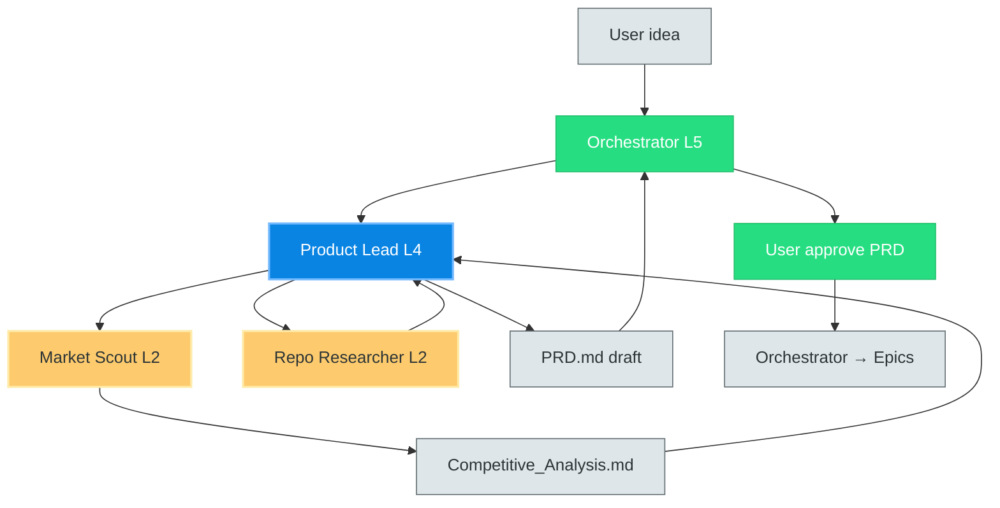

**Design / Frontend / Backend / QA** — общий шаблон:

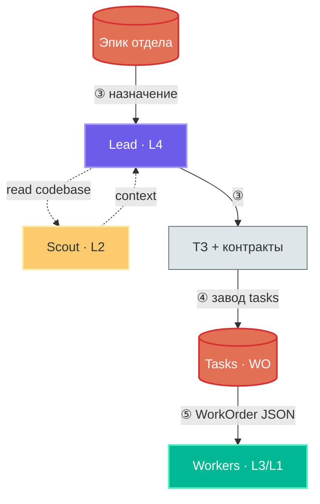

**Security (этапы 3–5)** — другой поток: сначала **audit read-only**, потом optional **pentest**, fixes — отдельными WO:

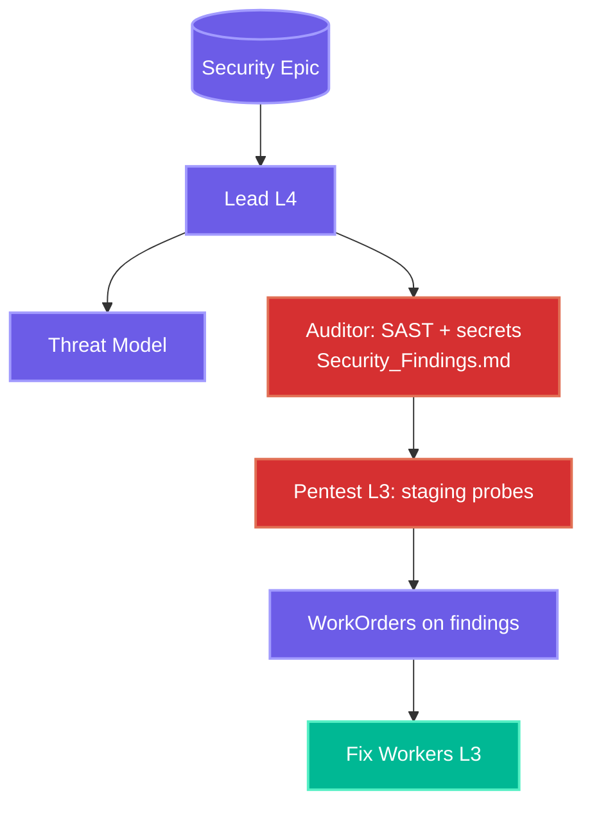

### B.3 Handoff между отделами (контракты)

**Старт pipeline:** Product Management → Orchestrator → инженерные отделы.

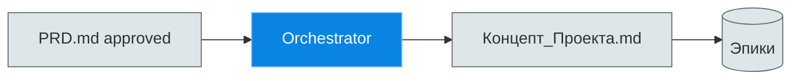

| Шаг | От → К | Передаётся |
|:---:|--------|------------|
| 0 | Product (PM) → Orchestrator | `PRD.md`, `User_Stories.md`, `Roadmap_MVP.md` (`status: approved`) |
| 0b | Orchestrator → все Leads | `Концепт_Проекта.md`, эпики per dept из таблицы PRD |

Цепочка **Design → Frontend → Backend**; от Backend **параллельно** в Security и QA.

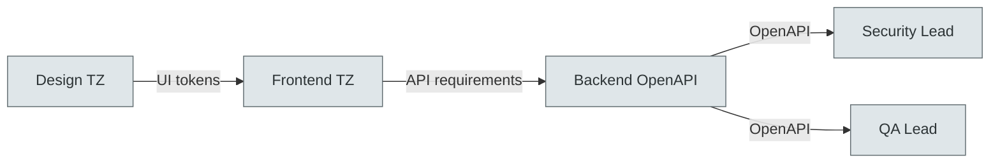

| Шаг | От → К | Передаётся |
|:---:|--------|------------|
| 1 | Design → Frontend | `UI_Tokens.json`, layout |
| 2 | Frontend → Backend | `Требования_к_API.md` |
| 3 | Backend → Security | `OpenAPI_Contract.yaml` + staging URL для DAST |
| 4 | Backend → QA | `OpenAPI_Contract.yaml` |
| 5 | Security → BE/FE | WorkOrder per finding (fix), не смешивать с audit task |

### B.4 Финал: Workers → Verify → Platform → User

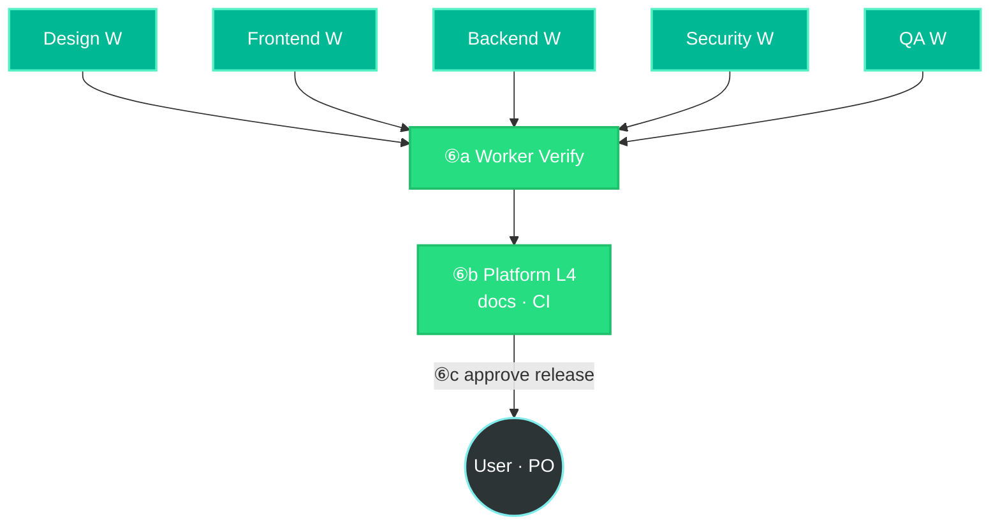

| Этап процесса | Tier | Действие |
|:-------------:|:----:|----------|
| ⓪ | L4–L5 | Product (PM): discovery → `PRD.md` → User **approve** (PO) |
| ① | L5 | Orchestrator читает PRD, уточняет через `question`, пишет концепт |
| ② | L5 | Orchestrator создаёт эпики в трекере |
| ③ | L4 + L2 | Lead + Scout → ТЗ отдела |
| ④ | L4 | Lead дробит ТЗ на WorkOrders |
| ⑤ | L3 / L1 | Workers + Runtime |
| ⑥ | L4 + User | 6a verify/docs/CI · 6b staging · **6c User approves release** |

---

## C. Сессия пользователя: Product → Orchestrator → Release

Как это **реально идёт в чате** — не два отдельных приложения, а **state machine** + spawn subagents. Пользователь в MVP видит **один чат**; Product и Platform работают **внутри**, без своей истории диалога.

### C.1 Кто говорит с User

| Фаза `orchestra.phase` | Лицо для User | Кто работает внутри |
|------------------------|---------------|---------------------|
| `discovery` | Orchestra (badge *Product*) или тот же чат | **Product Lead** subagent |
| `execution` | Orchestra (badge *Orchestrator*) | **Orchestrator L5** + Department Leads |
| `delivery` | Orchestra (badge *Release*) | **Platform L4** + Verify |
| `discovery` снова | — | только при **scope change** (новый PRD delta) |

**Не два промпта подряд в одном LLM-call.** Product — **отдельный subagent** (`task` sync): свой system prompt, **без** истории чата Orchestrator, только payload (идея User + пути артефактов).

### C.2 MVP: один чат, Orchestrator как диспетчер (рекомендуется сейчас)

Пока нет `mode=product` в core — **Orchestrator остаётся единственным агентом в UI**, но prompt Orchestrator обязывает:

```
IF .orchestra/product/PRD.md missing OR status != approved
  → spawn Product (skill product_analyst / L4)
  → НЕ создавать эпики и НЕ spawn worker
ELSE phase = execution
  → читать PRD.md + state.md
  → эпики, Leads, Workers
```

**Последовательность сообщений (пример):**

```text
Turn 1  User:     «Хочу SaaS для бронирования столиков»
Turn 2  Orchestrator:      «Запускаю product discovery…» 
                  [внутри: task → Product subagent, websearch]
Turn 3  Orchestrator:      «Черновик PRD готов. Вопросы: (1) только рестораны? (2) оплата в v1?»
                  [question tool → User]
Turn 4  User:     «Да рестораны, оплата позже»
Turn 5  Orchestrator:      [task → Product с ответами → обновлённый PRD.md]
Turn 6  Orchestrator:      «MVP: бронь + SMS. Out of scope: оплата. Утверждаете PRD?»
                  [question approve/reject]
Turn 7  User:     «Approve»
Turn 8  Orchestrator:      PRD.status=approved, phase=execution
                  «Режу на эпики: Design, BE, FE, QA, Security…»
Turn 9+ Orchestrator:      spawn Leads / Workers как сейчас
```

User **не переключается** на другой промпт вручную — Orchestrator **орchestrates** Product так же, как spawn'ит `explore` или `worker`.

### C.3 Target: явные фазы в state

В `.orchestra/state.md` (или frontmatter сессии):

```yaml
---
orchestra:
  phase: discovery   # discovery | execution | delivery
  prd_status: draft  # draft | approved
---
## Goal
…
```

| Переход | Условие | Кто меняет |
|---------|---------|------------|
| → `discovery` | новая идея / scope change | Orchestrator или User «пересмотреть PRD» |
| → `execution` | `PRD.md` + `prd_status: approved` | Orchestrator после `question` approve |
| → `delivery` | все dept epics closed + verify green | Orchestrator |
| → `execution` | hotfix после release | User |

Runtime *(planned)* может **блокировать** `task_spawn worker`, пока `phase != execution` — fail-closed как Worker Verify.

### C.4 Human gates (после merge)

ИИ **не** делает тихий push в prod. Platform останавливается на `question`:

| Gate | Текст для User | Если «нет» |
|------|----------------|------------|
| **G1 PRD** | «Утвердить PRD v1?» | остаёмся в discovery |
| **G2 Commit** | «Создать commit с N файлами?» | только staged, без commit |
| **G3 Push** | «Push в origin/main?» | локальная ветка |
| **G4 Deploy** | «Deploy на staging/prod?» | stop |

Конфиг *(planned)*:

```yaml
orchestra:
  gates:
    prd_approve: required
    git_push: required      # human
    deploy_prod: required   # human
```

### C.5 Промпты (файлы)

| Агент | Файл | Статус |
|-------|------|--------|
| Orchestrator / Orchestra Lead | `internal/prompt/files/orchestra.txt` | ✅ есть — добавить правила phase + spawn Product |
| Product Lead | `internal/prompt/files/product.txt` | 🔲 planned |
| Platform Lead | `internal/prompt/files/platform.txt` | 🔲 planned |

**Product prompt (суть):** websearch allowed, write только `.orchestra/product/*`, `question` к User через **return payload Orchestrator** (Product subagent не видит весь чат). **Запрет:** `edit` production paths, WorkOrders, эпики.

**Orchestrator prompt (дополнение):** после approve PRD — **запрет** повторного product research без явного scope change; читать `PRD.md` как source of truth для эпиков.

### C.6 Spawn contract (Product)

Логический вызов Orchestrator → Core *(как для worker)*:

```json
{
  "task_type": "product_discovery",
  "required_tier": "L4",
  "subagent_type": "product",
  "payload": {
    "user_request": "…",
    "answers": ["…"],
    "output_dir": ".orchestra/product",
    "mode": "draft | revise"
  }
}
```

Ответ subagent → Orchestrator (compact, без web dump):

```json
{
  "artifacts": ["Competitive_Analysis.md", "PRD.md"],
  "open_questions": ["…"],
  "mvp_summary": "3 bullets",
  "needs_user_approve": true
}
```

Orchestrator показывает User **summary + open_questions**, не сырой output Product.

### C.7 Когда снова зовётся Product

| Триггер | Действие |
|---------|----------|
| Новый проект | full discovery |
| User: «добавим оплату» | PRD delta, re-approve G1 |
| Orchestrator detect scope creep в чате | `question`: «Обновить PRD?» → spawn Product |
| Hotfix одной строки | **не** Product — сразу Worker |

### C.8 Техническая реализация (что уже есть в коде)

Модель **hub-and-spoke** уже заложена в `task` / `task_spawn`: Orchestrator — parent agent, отделы — child agents без доступа к истории чата User.

#### Слой 1 — Orchestrator (parent)

| Компонент | Путь | Роль |
|-----------|------|------|
| Prompt | `internal/prompt/files/orchestra.txt` | Правила delegate, WorkOrder, `question` |
| Mode | `mode=orchestra` | Parent loop, полный tool surface + subtasks |
| User dialog | tool `question` | RPC `question/ask` → VS Code UI (`internal/core/question.go`) |
| State | `.orchestra/state.md` | `phase`, goal, done — inject в каждый turn parent |

Только parent получает `QuestionAsker` — поэтому **отделы физически не могут** спросить User напрямую, пока не дать им отдельную сессию *(не MVP)*.

#### Слой 2 — Отдел = child subagent

```go
// internal/tasks/tasks.go — уже работает
task({
  "prompt": "<JSON payload или текст цели>",
  "subagent_type": "explore | architecture | worker | product",
  "description": "Product discovery",
  "tier": "focused"  // только worker
})
```

| `subagent_type` | Mode (`modeForSubagent`) | Диалог с User | Типичный отдел |
|-----------------|--------------------------|:-------------:|----------------|
| `explore` | `ModeExplore` | ❌ | Scout L2 |
| `architecture` | `ModeArchitecture` | ❌ | Dept Lead L4 (ТЗ, plan md) |
| `worker` | `ModeWorker` | ❌ | Workers L3 — только WorkOrder JSON |
| `verifier` | `ModeVerifier` | ❌ | Verify / QA gate |
| `product` *(planned)* | `ModeProduct` | ❌ | Product L4 |

Child **не видит** parent chat (`SkipMemoryInject`, workers без working state) — см. `runChild` в `internal/tasks/tasks.go`.

Результат child сжимается в один блок для parent:

```go
// internal/agent/history/subagent.go
FormatSubagentResult(subagentType, goal, hist, taskResult, digestBudget)
```

Orchestrator видит **digest**, не полный лог child — отсюда требование **structured `task_result` JSON** от Product/Lead.

#### Слой 3 — «Диалог отдела через Orchestrator»

Паттерн **relay** (реализуется промптами, без нового wire protocol):

```text
1. Orchestrator → task(product, payload={user_request, answers:[]})
2. Product → task_result({
     "open_questions":[{"id":"q1","text":"…","options":["A","B"]}],
     "artifacts":[".orchestra/product/PRD.md"],
     "mvp_summary":"…"
   })
3. Orchestrator → question({questions: open_questions})  // единственный UI
4. User отвечает
5. Orchestrator → task(product, payload={answers:[…], mode:"revise"})
6. … пока prd_status != approved
7. Orchestrator → task(architecture, payload={dept:"backend", prd_ref, epic_id})
8. Backend Lead → task_result({tz_path, open_questions?}) 
9. Если open_questions → снова question → relay
10. Backend Lead → task_spawn(worker, WorkOrder) × N  // Lead может spawn workers как child-of-child? 
```

**Dept Lead spawn workers:** сегодня workers spawn'ит **Orchestrator** напрямую. Target: Lead возвращает **список WorkOrders** в `task_result`, Orchestrator batch-spawn'ит — проще и без nested parent chain.

#### Слой 4 — Phase gate *(planned)*

```go
// internal/tasks/tasks.go — перед Spawn worker
if subagentType == "worker" && !prdApproved(projectRoot) {
    return "", fmt.Errorf("orchestra: PRD not approved")
}
```

`prdApproved` читает `.orchestra/product/PRD.md` frontmatter или `.orchestra/state.md`.

#### Слой 5 — UI (VS Code)

| Событие | Уже есть | Planned |
|---------|----------|---------|
| Subagent progress | `OnChildEvent` в `runChild` | badge «Product» / «Backend» по `subagent_type` |
| User questions | `question/ask` RPC | карточки approve PRD / push / deploy |
| Dept artifacts | файлы в `.orchestra/` | preview PRD / TZ в sidebar |

#### Минимальный план внедрения (3 PR)

| PR | Изменения |
|----|-----------|
| **1 Naming + prompts** | `orchestra.txt` → роль Orchestrator; правила relay + phase; `product.txt` |
| **2 Subagent type** | `ModeProduct`, `ListToolsForMode("product")`, register в `modeForSubagent` |
| **3 Gates** | `prdApproved()` + optional `orchestra.gates` в config; UI approve cards |

Новый JSON-RPC метод **не нужен** — достаточно существующих `task`, `question`, `task_result`.

---

## Матрица AI Tiers (сводная)

Уровни описывают **физику моделей** (reasoning depth, context window, tool-calling, latency, cost) — не бренд провайдера.

### Обзор (компактно)

| Tier | Emoji | Коммерческий класс | Роль в Orchestra | Ключ конфига |
|:-----|:-----:|--------------------|------------------|--------------|
| **L5** | 🔴 | Ultra / Pro — флагманы | **Orchestrator** | `roles.L5` / `planner` |
| **L4** | 🟠 | Plus / Optimal — оптимальные | Dept Leads + **Product Lead (PM)** | `roles.L4`, `L4_product` |
| **L3** | 🟡 | Heavy Local — 14B–35B | Mid Workers — исполнители | `tiers.complex`, `tiers.focused` |
| **L2** | 🟢 | Flash / Mini — скауты | Explore Agents — ридеры | `roles.L2` / `explore` |
| **L1** | 🔵 | Nano / Edge — 1B–8B | Micro Workers — джуны | `tiers.micro` |

### Полная матрица

<table>
<thead>
<tr>
<th>Уровень</th>
<th>Коммерческий класс</th>
<th>Роль в Orchestra</th>
<th>Главная сила</th>
<th>Ограничения</th>
<th>Идеальные задачи</th>
<th>Топ модели (2026-08)</th>
</tr>
</thead>
<tbody>
<tr>
<td><strong>🔴 L5 Mastermind</strong></td>
<td>Ultra / Pro<br><em>флагманы</em></td>
<td><strong>Orchestrator (L5)</strong></td>
<td>Глубокое абстрактное мышление; макро-контекст; архитектурные компромиссы; надёжный tool calling</td>
<td>Дорого за токен; низкая скорость генерации</td>
<td>Steering после PRD; декомпозиция эпиков; spawn отделов; conflict resolution</td>
<td>
<strong>Anthropic</strong> <code>claude-opus-4-7</code><br>
<strong>OpenAI</strong> <code>o3</code>, <code>gpt-4.1</code><br>
<strong>Google</strong> <code>gemini-2.5-pro</code><br>
<strong>DeepSeek</strong> <code>deepseek-reasoner</code><br>
<strong>xAI</strong> <code>grok-3</code>
</td>
</tr>
<tr>
<td><strong>🟠 L4 Domain Expert</strong></td>
<td>Plus / Optimal<br><em>оптимальные</em></td>
<td><strong>Department Leads + Product (PM)</strong><br><em>BE / FE / QA / PM / Security</em></td>
<td>Сильная инженерия в одной области; PRD и OpenAPI; product discovery</td>
<td>«Плывут» на full-system design без Orchestrator L5</td>
<td>PRD и competitive analysis; схемы БД; OpenAPI; design review</td>
<td>
<strong>Anthropic</strong> <code>claude-sonnet-4-6</code><br>
<strong>OpenAI</strong> <code>gpt-4.1-mini</code><br>
<strong>Qwen</strong> <code>qwen3-235b-a22b</code><br>
<strong>Meta</strong> <code>llama-3.3-70b-instruct</code><br>
<strong>DeepSeek</strong> <code>deepseek-chat</code>
</td>
</tr>
<tr>
<td><strong>🟡 L3 Focused Coder</strong></td>
<td>Heavy Local<br><em>14B – 35B</em></td>
<td><strong>Mid Workers</strong><br><em>исполнители</em></td>
<td>«Печатные машинки»: код по строгому WorkOrder в 1–2 файла</td>
<td>Галлюцинируют без ТЗ и якорей</td>
<td>Изолированные функции; UI-компоненты; CRUD-эндпоинты по WorkOrder</td>
<td>
<strong>Qwen</strong> <code>qwen2.5-coder-32b</code>, <code>qwen-3-32b</code><br>
<strong>DeepSeek</strong> <code>deepseek-coder-33b</code><br>
<strong>Mistral</strong> <code>codestral-latest</code><br>
<strong>Meta</strong> <code>llama-3.3-70b</code> <em>(quant)</em>
</td>
</tr>
<tr>
<td><strong>🟢 L2 Context Explorer</strong></td>
<td>Flash / Mini<br><em>скауты</em></td>
<td><strong>Explore Agents</strong><br><em>ридеры</em></td>
<td>Огромное окно контекста (до 1–2M tok); феноменальная скорость чтения</td>
<td>Урезана способность к сложному логическому программированию</td>
<td>Парсинг логов; поиск по репозиторию (grep); суммаризация документации; repo map</td>
<td>
<strong>Google</strong> <code>gemini-2.5-flash</code>, <code>gemini-2.0-flash</code><br>
<strong>OpenAI</strong> <code>gpt-4o-mini</code>, <code>gpt-4.1-nano</code><br>
<strong>Anthropic</strong> <code>claude-haiku-4-5-20251001</code><br>
<strong>xAI</strong> <code>grok-3-mini</code><br>
<strong>Moonshot</strong> <code>kimi-k2-turbo-preview</code>
</td>
</tr>
<tr>
<td><strong>🔵 L1 Micro Fixer</strong></td>
<td>Nano / Edge<br><em>1B – 8B</em></td>
<td><strong>Micro Workers</strong><br><em>джуны</em></td>
<td>Максимальная скорость; ~6–8 GB VRAM</td>
<td>Не думают системно</td>
<td>«Умный regex»: автокомплит; фиксы линтера; правка импортов; rename</td>
<td>
<strong>Qwen</strong> <code>qwen2.5-coder-7b</code><br>
<strong>Meta</strong> <code>llama-3.1-8b-instant</code><br>
<strong>OpenAI</strong> <code>gpt-4.1-nano</code><br>
<strong>Groq</strong> <code>gemma2-9b-it</code><br>
<strong>Cerebras</strong> <code>llama3.1-8b</code>
</td>
</tr>
</tbody>
</table>

---

## Сопоставление с текущим конфигом Orchestra

Сегодня в `.orchestra.yml` используются имена **`planner`** и worker tiers **`complex`**, **`focused`**, **`micro`**. Целевая схема L1–L5 — **надмножество** (explore и department leads выделены явно).

| Tier | Ключ в YAML | Subagent | Кто вызывает |
|:----:|-------------|----------|--------------|
| **L5** | `orchestra.planner` | — (top-level `mode=orchestra`) | User ↔ **Orchestrator** |
| **L4** | `orchestra.departments.product` *(planned)* | `product` | Orchestrator (этап 0) |
| **L4** | `orchestra.departments.*` *(planned)* | `architecture`, `debug` | Orchestrator |
| **L4** | `orchestra.platform` *(planned)* | Platform / `docs_writer` | Orchestrator (этап 6) |
| **L3** | `orchestra.tiers.complex` | `worker` + `tier: complex` | Orchestrator / Dept Lead |
| **L3** | `orchestra.tiers.focused` | `worker` + `tier: focused` | Orchestrator / Dept Lead |
| **L1** | `orchestra.tiers.micro` | `worker` + `tier: micro` | Orchestrator / Dept Lead |
| **L2** | `orchestra.explore` *(planned)* | `explore` | Orchestrator / Dept Lead |
| **L2** | `auto_router` / fast provider | `ask` (read-only Q&A) | Tab / Orchestrator |

Миграция: поле WorkOrder `"tier": "focused"` остаётся; Router добавляет `"required_tier": "L3"` как канонический уровень.

---

## Матрица маршрутизации (Task → Tier)

Orchestrator **не выбирает model ID** — только `task_type` и `required_tier`. Router резолвит провайдера.

| task_type | Tier | Subagent | Примечание |
|-----------|:----:|----------|------------|
| `product_discovery`, `competitive_analysis`, `prd_draft` | L4 | `product` *(planned)* | Только `.orchestra/product/*`; websearch ok |
| `prd_revise` | L4 | `product` | После ответов User на open_questions |
| `user_intake`, `system_design`, `conflict_resolution` | L5 | orchestra / Orchestrator | **После** approved PRD — эпики, spawn |
| `architecture_review`, `openapi_design`, `schema_design` | L4 | `architecture` | Только plan md |
| `root_cause_analysis` | L4 | `debug` | Evidence + узкий fix |
| `multi_file_refactor` | L3 | `worker` (tier: complex) | WorkOrder + CKG refs |
| `write_function`, `single_file_edit` | L3 | `worker` (tier: focused) | Default worker band |
| `lint_fix`, `import_cleanup`, `rename_symbol` | L1 | `worker` (tier: micro) | 1–2 строки |
| `explore_codebase`, `summarize_logs`, `repo_map` | L2 | `explore` | Без write |
| `explain_code`, `answer_question` | L2 | `ask` | Read-only |
| `verify_acceptance` | L4 | `verifier` | После worker; опционально L5 |
| `security_audit`, `sast_scan`, `secret_scan` | L4 | `security_auditor` skill | Read-only; findings md |
| `pentest_staging` | L3 | `debug` + exec gate | Controlled probes; pentest report |
| `security_fix` | L3 | `worker` | Patch по одному finding |
| `docs_sync`, `ci_pipeline`, `release_notes` | L3–L4 | `docs_writer` / Platform | Этап 6a–6b; push/deploy — gate |

---

## Контракт Router (Orchestrator → Core)

Внутренний запрос (не wire JSON-RPC — логический контракт для Orchestrator prompt и будущего Router):

```json
{
  "task_type": "explore_codebase",
  "required_tier": "L2",
  "subagent_type": "explore",
  "payload": "Найди все использования функции ProcessPayment"
}
```

```json
{
  "task_type": "write_function",
  "required_tier": "L3",
  "subagent_type": "worker",
  "tier": "focused",
  "payload": { "task_id": "add_jwt_check", "intent": "…", "instructions": ["…"] }
}
```

Ядро:

1. Читает `required_tier`
2. Смотрит `orchestra_routing.yaml` / `orchestra.tiers`
3. Подставляет `provider` + `model` для роли
4. Спавнит subagent с узким промптом (без истории чата Orchestrator / User)

---

## Пример конфигурации (`orchestra_routing.yaml`)

Черновик целевого файла (может жить как секция в `.orchestra.yml` или отдельный include):

```yaml
# orchestra_routing.yaml — tier → provider/model bindings
# Меняй только bindings; агенты оперируют L1–L5.

version: 1

roles:
  L5:
    label: "Orchestrator"
    provider: anthropic
    model: claude-opus-4-7

  L4_product:
    label: "Product Lead"
    provider: anthropic
    model: claude-sonnet-4-6
    subagent_type: product

  L4_platform:
    label: "Platform Lead"
    provider: anthropic
    model: claude-sonnet-4-6

  L4:
    label: "Department Lead"
    provider: anthropic
    model: claude-sonnet-4-6

  L3:
    label: "Focused worker"
    provider: lmstudio-coder
    model: qwen2.5-coder-32b
    # cloud fallback: deepseek-chat @ together

  L2:
    label: "Context explorer"
    provider: google
    model: gemini-2.5-flash

  L1:
    label: "Micro fixer"
    provider: lmstudio-fast
    model: qwen2.5-coder-7b

# Обратная совместимость с orchestra.tiers
legacy_map:
  planner: L5
  complex: L3
  focused: L3
  micro: L1
  explore: L2

routing:
  explore_codebase: { required_tier: L2, subagent_type: explore }
  write_function:   { required_tier: L3, subagent_type: worker, tier: focused }
  multi_file_refactor: { required_tier: L3, subagent_type: worker, tier: complex }
  lint_fix:         { required_tier: L1, subagent_type: worker, tier: micro }
  architecture_review: { required_tier: L4, subagent_type: architecture }
```

Эквивалент в **текущем** `.orchestra.yml` (MVP):

```yaml
orchestra:
  planner:
    provider: anthropic
    model: claude-opus-4-7
  tiers:
    - name: complex
      provider: lmstudio-coder
      model: deepseek-coder-33b
    - name: focused
      provider: lmstudio-mid
      model: qwen2.5-coder-32b
    - name: micro
      provider: lmstudio-fast
      model: qwen2.5-coder-7b
  default_tier: focused
  max_worker_retries: 3
  worker_verify_enabled: true
```

Orchestrator на L5 держит scratchpad (`.orchestra/state.md`) и **не пишет production-код** — см. [orchestra-vnext.md](./orchestra-vnext.md).

---

## Что дальше (implementation checklist)

| # | Задача | Статус |
|---|--------|--------|
| 1 | Зафиксировать L1–L5 в docs | ✅ этот файл |
| 2 | Orchestrator prompt: `required_tier` + phase + spawn Product | 🔲 |
| 3 | `orchestra_routing.yaml` schema + merge в config | 🔲 |
| 4 | Runtime Router: `task_type` → tier → LLM client | 🔲 |
| 5 | UI settings: tier labels вместо raw model names | 🟡 partial (`runtime_orchestra.go`) |
| 6 | E2E: смена L3 local→cloud без смены WorkOrder | 🔲 |
| 7 | Security: `security_auditor` в orchestra spawn + pentest sandbox | 🔲 |
| 8 | Product: `product.txt` + skill [`product_analyst`](../../examples/skills/product_analyst.md) + PRD gate | 🔲 |
| 9 | Platform: delivery 6a–6b + human gates (G2–G4) | 🔲 |
| 10 | Runtime: `orchestra.phase` блокирует worker до approved PRD | 🔲 |

---

## Ссылки

| Компонент | Путь |
|-----------|------|
| Orchestrator prompt | `internal/prompt/files/orchestra.txt` |
| Product prompt | `internal/prompt/files/product.txt` *(planned)* |
| Worker prompt | `internal/prompt/files/worker.txt` |
| Orchestra config | `internal/config/orchestra.go` |
| Runtime roles UI | `internal/core/runtime_orchestra.go` |
| Cloud model catalog (TUI) | `ui/tui/view/dialog_model.go` |
| WorkOrder validation | `internal/tasks/workorder_validate.go` |
