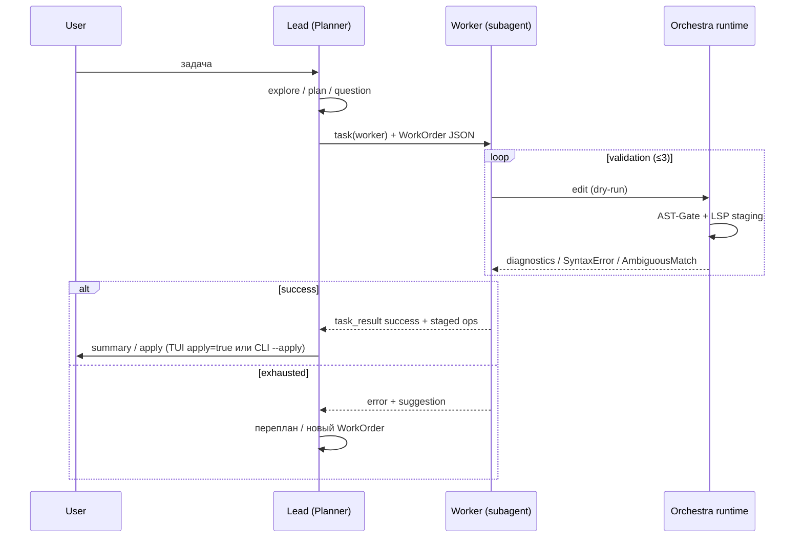

# Planner–Worker: целевой режим Orchestra (локальные модели)

**Статус:** MVP ✅ — см. также [orchestra-vnext.md](./orchestra-vnext.md) (6 улучшений автономии).
**Связано:** [semantic-dry-run-tz.md](./semantic-dry-run-tz.md), [modes.md](../modes.md), [architecture-uml.md](../architecture-uml.md)

---

## 1. Зачем это нужно

Один агент с полной историей чата и картой проекта **не масштабируется** на локальные квантованные модели (Q6/Q8, 7B–20B, 50–70 tok/s):

- размывается фокус — модель забывает инструкции из начала промпта;
- растёт галлюцинация в коде и «болтовня» вместо патча;
- каждый шаг дорог по latency и контексту.

**Целевой паттерн:** **Planner–Worker** (Router–Actor, Lead–Implementer).

| Роль | Модель | Контекст | Пишет код? |
|------|--------|----------|------------|
| **Lead / Planner** | reasoning-флагман или сильная локальная | диалог с пользователем, архитектура, декомпозиция | **нет** |
| **Worker** | быстрая coder-модель (DeepSeek-Coder, Llama, Qwen…) | **микро-контекст** на одну атомарную задачу | **да** (через `edit`/`write` + validation loop) |

Это **основной режим работы**, который мы намерены сделать default для локального стека (TUI + `build-local` + subagents), а не опциональный эксперимент.

---

## 2. Как это ложится на Orchestra **сегодня**

Уже есть кирпичи — их нужно **связать в контракт**, а не переписывать с нуля.

| Концепция Planner–Worker | Уже в Orchestra | Пробел |
|--------------------------|-----------------|--------|
| Lead не пишет код | `plan` mode (read-only + plan file) | Planner должен **делегировать** через `task`, а не сам `final.patches` |
| Worker изолирован | `general` subagent (`task` / `task_spawn`) | Нет **узкого** worker-промпта и JSON-контракта Planner→Worker |
| Микро-контекст | CKG `explore`, `symbols`, `read` | Planner собирает контекст **до** spawn, Worker не видит историю чата |
| Validation loop | AST-Gate + LSP dry-run + `LSP_ERRORS` hint | Worker loop **внутри** subagent (≤3 попытки), эскалация Planner'у |
| Толерантный патч | Resolver: exact → trimmed → indent | ✅ без fuzzy/Levenshtein |
| Fail fast | `AmbiguousMatch`, `StaleContent`, `SyntaxError` | Нужны **шаблоны ошибок** для Worker (см. §5) |
| Детерминированный вывод | `build-local.txt`, prefilling `{` (planned) | Worker mode + few-shot в промпте |

**Сегодняшний `build` mode** = монолит (Planner+Worker в одной модели). **Целевое состояние:** пользователь общается с Lead; Lead спавнит Workers; Workers крутятся в semantic dry-run до зелёного LSP или лимита попыток.

### CKG / semantic_search (Phase 11)

Перед широкими задачами Lead (`repo_map`, `semantic_search`, «найди где…»):

```bash
orchestra ckg embed --rebuild   # индекс эмбеддингов CKG; нужен embed.model в .orchestra.yml
```

Без индекса `semantic_search` недоступен; Lead должен опираться на `repo_map` → `explore` → `grep`.

---

## 3. Роли и ответственность

### 3.1 Lead Agent (Planner)

**Задачи:**

- диалог с пользователем, уточнение требований (`question`);
- архитектура и декомпозиция (может использовать `plan` или plan-файл);
- сбор контекста для Worker: CKG skeleton, LSP types, exact snippet;
- spawn Worker'ов (`task` sync или `task_spawn` parallel);
- **перепланирование** при эскалации Worker (после 3 неудач validation loop).

**Не делает:** `edit`/`write` на production-код (опционально — только plan/markdown).

**Выход:** JSON **WorkOrder** (см. §4), один заказ = одна функция / один атомарный патч.

### 3.2 Worker Agent

**Задачи:**

- получить WorkOrder без истории чата;
- выполнить **одну** атомарную правку через `edit` (preferred) или `write`;
- пройти **Validation Loop**: staging → AST-Gate → LSP sync → diagnostics;
- при ошибке — расширить `search`, исправить синтаксис, повторить (≤N попыток);
- вернуть **WorkerResult** (success / error + тип).

**Не знает:** о чём говорили три сообщения назад; видит только WorkOrder + текущий файл (staging overlay).

**Модель:** `build-local` / отдельный `worker` mode; system prompt = API-контракт + 1–2 few-shot.

---

## 4. JSON-контракты (API между агентами)

Промпты между Lead и Worker — **не prose**, а **структурированные payload'ы**. Это часть протокола Orchestra, не «пожелания модели».

### 4.1 WorkOrder (Lead → Worker)

```json
{
  "task_id": "refactor_handler_auth",
  "target_file": "internal/api/handler.go",
  "target_symbol": "GetUser",
  "intent": "Добавить проверку JWT перед обработкой запроса",
  "context": {
    "ast_skeleton": "func (h *Handler) GetUser(w http.ResponseWriter, r *http.Request)",
    "lsp_types": "type Claims struct { UserID string `json:\"user_id\"` }",
    "exact_snippet_to_replace": "func (h *Handler) GetUser(...) {\n\tuserID := r.URL.Query().Get(\"id\")\n\t..."
  },
  "instructions": [
    "Импортируй github.com/golang-jwt/jwt/v5",
    "Проверь заголовок Authorization",
    "При невалидном токене — http.StatusUnauthorized",
    "Остальную логику функции не меняй"
  ],
  "constraints": [
    "Один патч, одна функция",
    "search-блок должен быть уникальным в target_symbol scope",
    "Отступы как в файле (tabs vs spaces)"
  ]
}
```

| Поле | Зачем |
|------|--------|
| `intent` | одно предложение — фокус слабой модели |
| `target_symbol` | **AST scoping** для резолвера (см. §6) |
| `ast_skeleton` | сигнатура без 1000 строк файла |
| `lsp_types` | Planner заранее подтягивает типы (`lsp.hover` / CKG) |
| `exact_snippet_to_replace` | якорь для staging + `edit.search` |
| `instructions[]` | bullet-points, не абзацы |

### 4.2 WorkerResult (Worker → Lead / system)

**Успех** — через нативный `edit`/`write` response (path, file_hash, diagnostics=[]):

```json
{
  "status": "success",
  "path": "internal/api/handler.go",
  "file_hash": "sha256:…",
  "attempts": 2
}
```

**Ошибка** (после исчерпания попыток или unrecoverable):

```json
{
  "status": "error",
  "error_type": "ValidationExhausted",
  "message": "3 попытки: SyntaxError → LSP error → AmbiguousMatch",
  "last_diagnostics": [ … ],
  "suggestion_for_planner": "Разбить задачу: сначала добавить import, затем middleware"
}
```

Worker **не обязан** возвращать сырой search/replace JSON — Orchestra уже нормализует через `edit` tool + resolver. Альтернативный «patch-only» JSON (как в обсуждении) — опциональный fast-path для headless Worker без tool loop; **не Phase 1**.

---

## 5. Validation Loop (Worker inner loop)

Связка с [semantic-dry-run-tz.md](./semantic-dry-run-tz.md) (фазы 1–3 ✅):

```
Worker edit/write (dry-run)
  → AST-Gate (tree-sitter)     — SyntaxError → retry hint
  → staging overlay
  → LSP SyncStaged + diagnostics
  → LSP_ERRORS hint в history (если errors)
  → retry edit (≤ max_worker_retries, default 3)
  → success: staged op; Lead решает apply / следующий Worker
  → fail: WorkerResult.error → Lead перепланирует
```

**Lead не участвует** в каждой LSP-итерации — только Worker и Orchestra runtime.

---

## 6. Резолвер + AST: что уже есть и что добавить

### 6.1 Каскад патчей (✅ сегодня)

`patch/resolver`: **exact → trimmed → indent**. Не fuzzy/Levenshtein — безопасно для локальных моделей (прощаем пробелы/отступы, не «угадываем» код).

### 6.2 AST-Gate (✅ Phase 1)

Staging отклоняет синтаксически битый контент до LSP.

### 6.3 AmbiguousMatch — Fail Fast (✅ + улучшить промпты)

При `bytes.Count(search) > 1` → **отклонить**, вернуть алгоритмичную инструкцию:

> Расширь `search`: добавь 2–3 уникальные строки до/после (сигнатура функции, уникальный комментарий).

Зашить в Worker system prompt + few-shot.

### 6.4 AST Scoping (✅ Phase 5)

Если WorkOrder содержит `target_symbol`:

1. CKG находит границы символа (startLine–endLine);
2. Resolver ищет `search` **только в этом диапазоне**;
3. Короткий `if err != nil` перестаёт быть ambiguous **внутри функции**.

Снимает когнитивную нагрузку с Worker — уникальность в scope функции, не всего файла.

---

## 7. Инженерные трюки для локальных моделей

| Приём | Где | Статус |
|-------|-----|--------|
| **Few-shot** в Worker prompt | `worker.txt` / `build-local.txt` | ✅ |
| **Prefilling** `{` assistant prefix | `internal/agent` worker mode | ✅ |
| **Атомарность** 1 WorkOrder = 1 symbol | Lead prompt + spawn policy | ✅ |
| **Отдельная модель** Worker в config | `orchestra.tiers` | ✅ |
| **Узкий tool surface** Worker | `read`, `edit`, `grep`, `symbols`, `lsp.*`, `task_result` — без nested spawn | ✅ (`ListToolsForMode("worker")`) |
| **Preflight context** только от Planner | WorkOrder.context | частично (JSON поле есть; Lead prompt — best-effort) |

---

## 8. Целевой flow (TUI / session)



---

## 9. Roadmap реализации (порядок)

| # | Задача | Зависимости | Приоритет |
|---|--------|-------------|-----------|
| P0 | Зафиксировать этот doc + ссылка из `modes.md` / ROADMAP | — | ✅ doc |
| P1 | **`worker` mode** (промпт + tool surface + `build-local` fork) | subagent infra | ✅ |
| P2 | **WorkOrder schema** в `task` prompt + валидация JSON | P1 | ✅ |
| P3 | Worker **retry budget** + эскалация в `task_result` | semantic dry-run ✅ | ✅ |
| P4 | **AmbiguousMatch** hints в Worker prompt + agent format | resolver ✅ | ✅ |
| P5 | **AST scoping** в resolver (`target_symbol` + CKG range) | CKG | ✅ |
| P6 | **Prefilling** + few-shot examples в `worker.txt` | llm client | ✅ |
| P7 | **Отдельный LLM profile** для Worker (`orchestra.tiers`) | config | ✅ |
| P8 | Lead prompt: «не edit сам — только task + WorkOrder» | P1–P2 | ✅ |
| P9 | E2E: Lead spawns Worker, local model, dry-run LSP green | TUI | ✅ |

**Не в scope ближайших фаз:** VFS as SoT для grep/CKG (см. semantic-dry-run §9), полная замена `edit` на patch-only JSON Worker output.

---

## 10. Отличие от текущих modes

| Mode | Сейчас | В Planner–Worker |
|------|--------|------------------|
| `build` | монолит: модель всё делает сама | **Lead** default: plan + delegate |
| `plan` | read-only план | часть Lead pipeline (или pre-phase) |
| `general` | subagent с полным контекстом родителя | эволюционирует в **`worker`**: без истории, WorkOrder in |
| `explore` | read-only search | Lead использует для сбора контекста **до** spawn |

---

## 11. Критерии приёмки (контрольная точка)

- [x] Lead на reasoning/сильной модели **не вызывает** `edit` на `.go` файлах — только `task` с WorkOrder (runtime guard + orchestra tool surface).
- [x] Worker на локальной модели (≤20B Q6) выполняет типовую правку за ≤3 LSP-итерации в dry-run (`tests/e2e_agent/e2e_worker_lsp_iterations_test.go` CI; `tests/e2e_real_llm/worker_lsp_iterations_test.go` при `ORCH_E2E_LLM=1`).
- [x] `AmbiguousMatch` rate < 10% при `target_symbol` scoping (`tests/e2e_agent/e2e_ambiguous_match_eval_test.go`).
- [x] TUI показывает LSP diagnostics на Worker tool blocks (`ui/tui/view/diagnostics.go`, `tool_block_diagnostics_test.go`; manual smoke LSP install — см. `lsp-auto-provision.md`).
- [x] Dry-run staging → explicit apply без сюрпризов на disk (`tests/e2e_agent/e2e_staging_apply_test.go`; hash conditions + backup). TUI: `apply=true` auto-commit pipeline.

---

## 12. Ссылки на код

| Компонент | Путь |
|-----------|------|
| Subagent spawn | `internal/tasks/`, `task` tool |
| Modes / prompts | `internal/agent/options.go`, `internal/prompt/files/` |
| Resolver cascade | `internal/resolver/` |
| AST-Gate | `internal/ckg/syntax.go`, `internal/tools/staging.go` |
| LSP dry-run | `internal/lsp/manager.go`, `docs/architecture/semantic-dry-run-tz.md` |
| AmbiguousMatch | `protocol/errors.go`, `patch/resolver/` |
| Local prompts | `internal/prompt/files/build-local.txt` |
