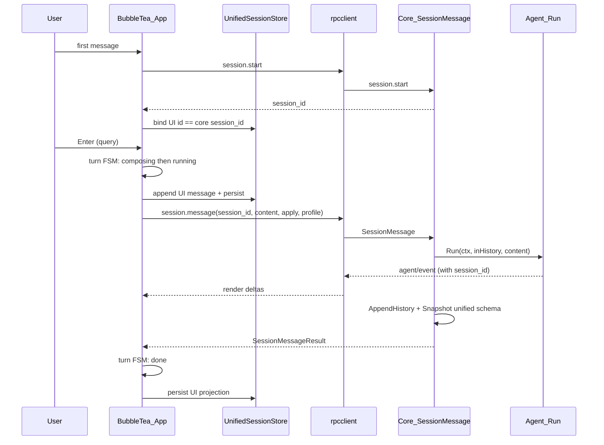
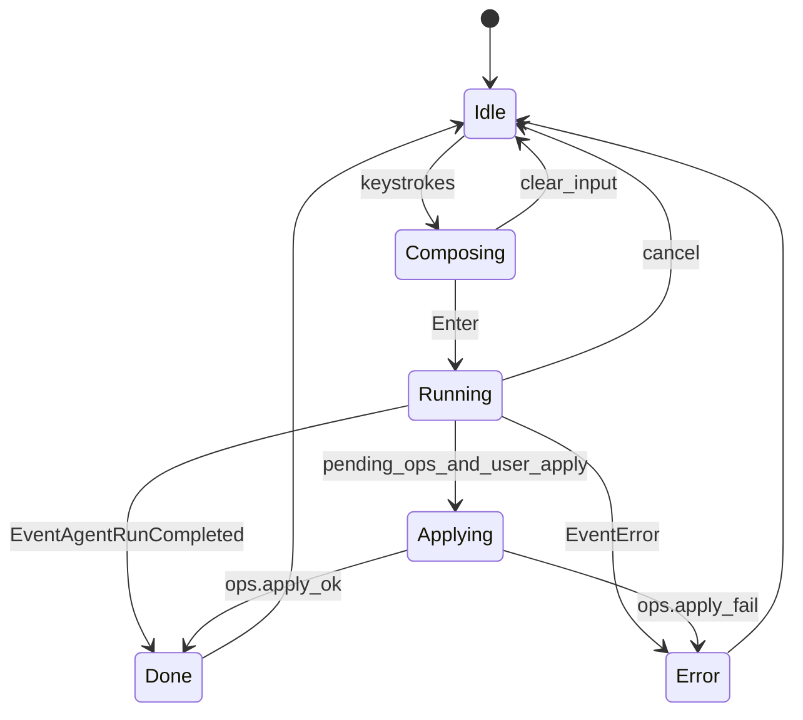

# TUI Pipeline — To-Be Architecture

Целевая архитектура и план миграции TUI↔core. **M1–M4 реализованы** (см. [tui-pipeline.md](./tui-pipeline.md) §10). Patch Mode и Adaptive Profiles — в коде с 2026-08-05.

## 1. Сравнение паттернов

| Паттерн | Как уже проявляется в Orchestra | Что добавить |
|---------|----------------------------------|--------------|
| Actor Model | Bubble Tea: single-threaded `Update` + Cmd; Core — один процесс на workspace | Явная модель «Session Actor» на стороне core (один writer истории) |
| Event-Driven | JSON-RPC notifications `agent/event`, `exec/output_chunk`, workflow stages | Единый event envelope с `session_id` + `turn_id` |
| State machine | `TurnFSM` в `ui/tui/state` (M3) | Опционально: `session_id` + `turn_id` в event envelope |
| CQRS-lite | Dry-run = query/preview; `--apply` = command | Patch Mode как третья команда: «материализовать unified diff без write» |

Вывод: не нужна полная переписка на actors/broker. Нужно **соединить** существующий multi-turn core path с TUI и **убрать** дублирование session stores.

## 2. Целевая схема



### Unified session file (v2)

Один файл `.orchestra/sessions/<id>.json`:

```json
{
  "version": 2,
  "id": "...",
  "title": "...",
  "model": "...",
  "created_at": "...",
  "updated_at": "...",
  "ui_messages": [ /* projection for chat viewport */ ],
  "history": [ /* llm.Message — agent memory */ ],
  "todos": [],
  "pending_ops": [],
  "plan_path": "",
  "profile": "fast|precision|",
  "apply_output": "disk|patch"
}
```

Правила:

- Core — writer durable state (`history`, todos, pending_ops).
- TUI — writer `ui_messages` / title; при конфликте merge по `updated_at` + version field.
- Load session восстанавливает **и** UI, **и** agent history (через `session.start` с known id / `LoadOrCreate`).

### Turn state machine (TUI)



Заменяет ad-hoc `agentBusy` + modal flags как единственный источник истины для input gating.

## 3. Application strategies (реализовано)

```yaml
apply:
  output: disk   # or patch
  patch_dir: .orchestra/patches
```

| Mode | Поведение |
|------|-----------|
| `disk` (default) | Как сейчас: dry-run без `--apply`; с `--apply` — write + `.orchestra.bak` |
| `patch` | Agent всегда считает dry-run для диска; после получения diffs — запись unified `.patch` (`git apply`-совместимый) в `patch_dir` |

CLI: `--output-patch [path]` перекрывает конфиг. Не путать с `--mode plan` и skill PATCH-ONLY.

## 4. Adaptive execution profiles (реализовано)

```yaml
agent:
  profile: ""   # fast | precision | empty=defaults
```

| Profile | MaxSteps | Context | Timeout | Tools | ResponseFormat |
|---------|----------|---------|---------|-------|----------------|
| *(empty)* | config defaults (24) | `limits.context_kb` | `llm.timeout_s` | mode toolset | config |
| `fast` | 10 | 32 KiB | 60s | без LSP/browser | без schema force |
| `precision` | 36 | 128 KiB | 300s | полный + LSP | `json_schema` если доступно |

Приоритет: CLI `--profile` > named `agents:` override > `agent.profile` config > defaults.

Поля `profile` / `apply_output` зеркалятся в `AgentRunParams` / `SessionMessageParams`.

## 5. План миграции (вне текущего эпика)

### Phase M1 — Wire TUI to session.* — DONE upstream (`2bd96e6`)

1. ~~На старте TUI: `session.start`~~ — реализовано (`ensureCoreSession`).
2. ~~Заменить `AgentRun` на `SessionMessage`~~ — реализовано в `app_session.go` / `rpcclient`.
3. Cancel / fallback на `agent.run` при отсутствии session id — на месте.
4. Тесты multi-turn — желательно добить в follow-up.

### Phase M2 — Unify session schema — DONE

1. `internal/sessionfile` — v2 snapshot + migrator v0/v1→v2.
2. Core persist/load via v2; RPC `session.get`, `session.list`, `session.ui_sync`; `session.start(session_id?)`.
3. TUI: unified id, `session.ui_sync`, reopen restores history.
4. `ProtocolVersion` 6; `sessionstore` — thin helper (List, NewID, offline Save).

### Phase M3 — Turn FSM + polish — DONE

1. `ui/tui/state/turn.go` — `TurnFSM`: idle → composing → running → applying.
2. Input/cancel/apply gated via FSM (`app_turn.go`); replaces `agentBusy`.
3. Delta coalesce in `rpcclient` when events channel is saturated.

### Phase M4 — Hardening — DONE

1. `SessionMessage` + `SessionApplyPending` under `runMu` / staging contract (same as `AgentRun`).
2. Cross-process flock: `.orchestra/apply.lock` (POSIX flock / Windows LockFileEx) — see `internal/applier/ops_applier.go`.
3. Race tests: `internal/core/runmu_test.go`, `internal/core/session/manager_race_test.go`; CI runs `go test -race ./...`.

## 6. Не-цели текущего эпика

- Удаление dual path `final.patches` vs `edit`/`write` (см. ROADMAP).
