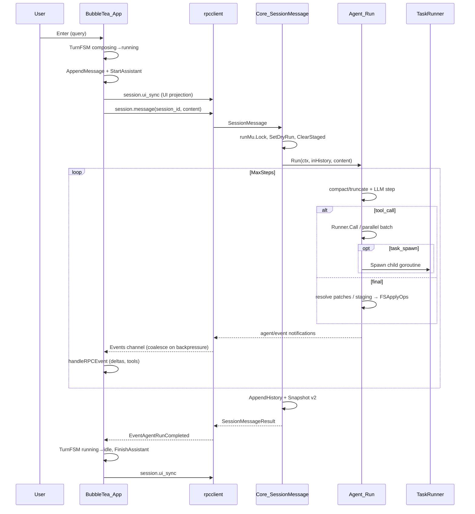
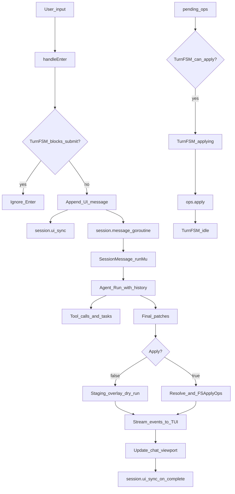

# TUI Pipeline — As-Is Architecture

Аудит пайплайна: чат → контекст/память → таски → применение изменений.
Дата аудита: 2026-08-05 (обновлено после M2–M4). Источник истины — код в `ui/tui`, `internal/core`, `internal/agent`, `internal/tasks`.

## 1. Компоненты

| Слой | Пакет / файлы | Роль |
|------|---------------|------|
| TUI | `ui/tui` (Bubble Tea) | Интерактивный чат; default-команда `orchestra` / `orchestra tui` |
| UI session | `internal/sessionstore` + `internal/sessionfile` | Thin helpers + unified v2 on-disk schema |
| RPC client | `ui/tui/rpcclient` | Спавн `orchestra core`, `session.*`, события `agent/event` |
| Core | `internal/core` | JSON-RPC handler; `AgentRun`, `SessionMessage`, `runMu` |
| Core sessions | `internal/core/session` | Multi-turn LLM history + todos + pending ops |
| Agent loop | `internal/agent` | LLM ↔ tools ↔ final patches |
| Tasks | `internal/tasks` | Child agents (`task_spawn` / `wait` / `cancel`) |
| Patches → ops | `patch/patches`, `patch/resolver`, `patch/ops`, `patch/applier` | Двухслойное применение изменений |
| Staging | `internal/tools/staging.go` | Overlay для dry-run |

## 2. Data flow (текущий TUI-путь)



### Flowchart (упрощённо)



## 3. Unified session (v2, M2)

Один файл `.orchestra/sessions/<id>.json`, schema **version 3** (`internal/sessionfile`):
chronological `ui_messages[].segments` (assistant parts). Flat text/reasoning/tool_blocks remain as projections.

- `history` — LLM-память (writer: core после `session.message`)
- `ui_messages` — TUI projection (writer: `session.ui_sync`)
- `pending_ops`, `todos`, `plan_path`, `profile`, `apply_output`

**ID:** sortable `20260805T150405-7f3a` — `currentSessionID == coreSessionID`.

**TUI flow:** `session.start(session_id?)` → turns via `session.message` → persist via `session.ui_sync`. Reopen из picker: load UI с диска + `session.start(id)` восстанавливает agent history.

Legacy v0 (sessionstore-only) и v1 (core-only) мигрируют автоматически при load.

## 5. Task engine

`internal/tasks.TaskRunner`:

1. `task_spawn` → `Spawn` → `task_id`, `go runChild`
2. Child: `agent.New(..., IsChild: true, SubtaskRunner: nil)` — без рекурсии
3. Завершение через `task_result` / timeout / error
4. `task_wait` блокируется на `entry.done`
5. Sync `task` = spawn + wait

Параллельные tool calls родителя: `runParallelToolBatch` (semaphore + WaitGroup). Глобальной очереди/брокера нет.

## 6. Concurrency map

| Место | Примитив | Назначение |
|-------|----------|------------|
| TUI `handleEnter` | `go func` + `context.WithCancel` | Фоновый `session.message` / workflow / skill |
| `rpcclient` | `events` chan (buf 64), coalesce deltas on full | Streaming UI |
| Core | `runMu` | Сериализация Runner: `AgentRun`, `SessionMessage`, `SessionApplyPending`, `OpsApply`, workflow/skill |
| Core | `initMu` | Initialize handshake |
| Core session | `Session.mu`, `Manager.mu` | History / busy / cancel |
| TUI | `state.TurnFSM` | idle → composing → running → applying |
| TaskRunner | `mu` + map + `done` chan | Child lifecycle |
| Applier | `applyMu` + `.orchestra/apply.lock` | H9: in-process + cross-process flock (fail-closed) |
| Bubble Tea | single-threaded `Update` | UI mutations |

## 7. Application of changes (единый semantic pipeline)

```
edit/write (during turn) → staging overlay → AST-Gate → LSP SyncAndDiagnose
  → agent LSP_ERRORS hint loop (model fixes until green or gives up)
  → final step → FSApplyOps (commit when apply=true)
```

| Entry | `apply` flag | Поведение |
|-------|--------------|-----------|
| **TUI** | always `true` | staging + LSP во время хода; **commit на final** (без PREVIEW/LIVE toggle) |
| `orchestra apply` | default `false` | dry-run, артефакты в `.orchestra/`, диск не трогается |
| `orchestra apply --apply` | `true` | staging + LSP во время хода; commit на final |

**Удалено из TUI:** `/live`, `/preview`, `ui.auto_apply` — один пайплайн, модель сама завершает через `final`.

Артефакты CLI: `plan.json`, `diff.txt`, `last_result.json`, `last_run.jsonl`.

## 8. Реестр проблем

| ID | Severity | Описание | Где |
|----|----------|----------|-----|
| P1 | **Resolved upstream (2bd96e6)** | TUI now uses `session.start` + `session.message` for multi-turn agent history (`ui/tui/app_session.go`, `rpcclient.SessionMessage`). One-shot `agent.run` remains as fallback when core session id is missing. | was: `handleEnter` → `AgentRun` only |
| P2 | **Resolved (M2)** | Unified v2 schema in `internal/sessionfile`; core owns disk writes; TUI uses `session.ui_sync` | was: dual schema overwrite |
| P3 | **Resolved (M2)** | `loadSession` + `session.start(session_id)` restore UI **and** agent history | was: UI-only restore |
| P4 | Medium | `events` chan coalesce-on-backpressure for token/tool-arg deltas (merged instead of dropped) | `rpcclient/client.go` |
| P5 | Low (mitigated) | H9 concurrent `.orchestra.bak` — in-process `applyMu` + `.orchestra/apply.lock` flock | `patch/applier/ops_applier.go` |
| P6 | **Resolved** | Docs updated: `patch/patches` + `patch/applier` | docs |
| P7 | **Resolved (M4)** | `SessionMessage` / `SessionApplyPending` hold `runMu` for full turn like `AgentRun` | `core.go` |
| P8 | **Resolved (M3)** | Turn lifecycle via `TurnFSM` (idle/composing/running/applying) replaces ad-hoc `agentBusy` | `ui/tui/state/turn.go` |

### Race / leak notes

- Persist из tea.Cmd делает snapshot `Messages` до goroutine — корректно против мутаций UI.
- Отмена: `clearActiveCancel` на `EventAgentRunCompleted` / Error — ок.
- Полный `go test -race` по `internal/agent`/`core` на данной Windows-машине без C toolchain не прогонялся (tree-sitter/cgo). UI-пакеты без cgo: `ok`.

## 9. Modes vs profiles

**Modes** (typed agent behaviour):

- `build` / `plan` / `explore` / `general` / …
- `ListToolsForMode`, config `agents:` + `providers:` + `llm.router`

**Profiles** (`agent.profile`, `--profile`, `SessionMessageParams.profile`):

- `fast` — меньше steps/context, без LSP/browser
- `precision` — больше steps/context, json_schema если доступно
- Реализация: `internal/agent/profiles.go`, `agent.ApplyProfile`

**Apply output** (`apply.output`, `--output-patch`):

- `disk` (default) — dry-run staging / `--apply` write + `.orchestra.bak`
- `patch` — unified `.patch` в `patch_dir`, без write на диск
- Реализация: `patch/applier/patch_export.go`, `config.Apply.Output`

## 10. Migration status (M1–M4)

| Phase | Статус | Ключевые артефакты |
|-------|--------|-------------------|
| M1 Wire TUI → session.* | DONE | `ui/tui/app_session.go`, `session.message` |
| M2 Unified schema v2 | DONE | `internal/sessionfile`, ProtocolVersion **6**, `session.ui_sync` |
| M3 Turn FSM | DONE | `ui/tui/state/turn.go`, `app_turn.go`, delta coalesce in `rpcclient` |
| M4 Hardening | DONE | `SessionMessage`/`SessionApplyPending` under `runMu`, race tests |

Миграция M1–M4 завершена (2026-08). Исторический to-be doc удалён; актуальный контракт — этот файл + `tui-chat-segments.md`.
