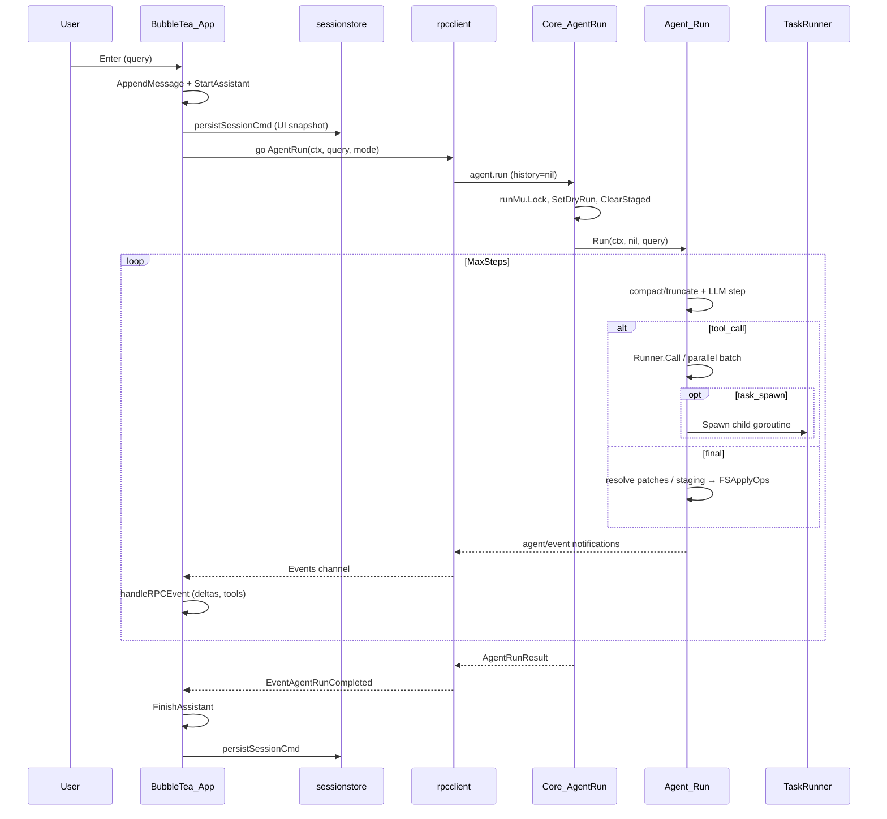
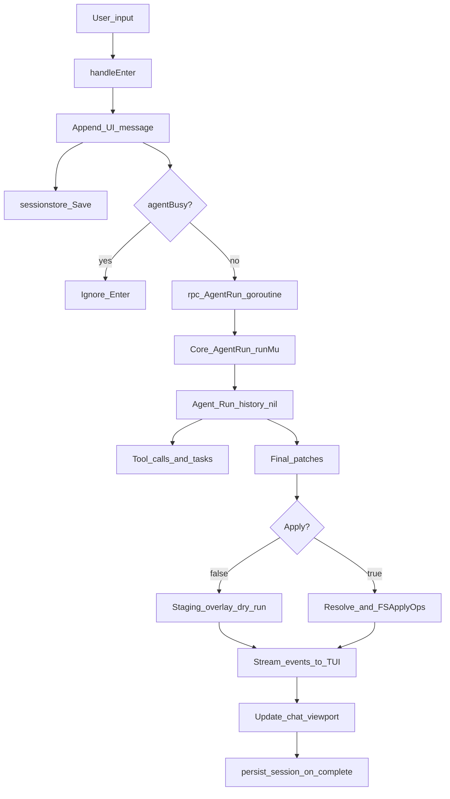

# TUI Pipeline — As-Is Architecture

Аудит пайплайна: чат → контекст/память → таски → применение изменений.
Дата аудита: 2026-08-05. Источник истины — код в `ui/tui`, `internal/core`, `internal/agent`, `internal/tasks`.

## 1. Компоненты

| Слой | Пакет / файлы | Роль |
|------|---------------|------|
| TUI | `ui/tui` (Bubble Tea) | Интерактивный чат; default-команда `orchestra` / `orchestra tui` |
| UI session store | `internal/sessionstore` | Persist UI-сообщений в `.orchestra/sessions/<id>.json` |
| RPC client | `ui/tui/rpcclient` | Спавн `orchestra core`, `agent.run`, события `agent/event` |
| Core | `internal/core` | JSON-RPC handler; `AgentRun`, `SessionMessage`, `runMu` |
| Core sessions | `internal/core/session` | Multi-turn LLM history + todos + pending ops |
| Agent loop | `internal/agent` | LLM ↔ tools ↔ final patches |
| Tasks | `internal/tasks` | Child agents (`task_spawn` / `wait` / `cancel`) |
| Patches → ops | `internal/patches`, `internal/resolver`, `internal/ops`, `internal/applier` | Двухслойное применение изменений |
| Staging | `internal/tools/staging.go` | Overlay для dry-run |

## 2. Data flow (текущий TUI-путь)



### Flowchart (упрощённо)



## 3. Два мира сессий

Оба пишут в **один каталог** `.orchestra/sessions/<id>.json`, но с **разными JSON-схемами**:

### A) TUI `sessionstore` (`internal/sessionstore/store.go`)

```json
{
  "id": "20260805T072426-e95a",
  "title": "...",
  "model": "...",
  "created_at": "...",
  "updated_at": "...",
  "msg_count": N,
  "messages": [{ "role": "user|assistant|system", "text": "...", ... }]
}
```

- Пишется из `ui/tui/app_session.go` (`persistSessionCmd`).
- Restore (`loadSession`) **явно** сообщает: agent has no memory of this history.
- Используется только для отображения чата пользователю.

### B) Core `internal/core/session` (`persist.go`)

```json
{
  "version": 1,
  "id": "...",
  "history": [ /* llm.Message */ ],
  "created_at": "...",
  "last_activity": "...",
  "pending_ops": [...],
  "todos": [...],
  "plan_path": "..."
}
```

- Multi-turn через RPC: `session.start` → `session.message` → `session.history` / `cancel` / `apply_pending` / `close`.
- **TUI сейчас вызывает `session.message`** (с `2bd96e6`): `ensureCoreSession` → `session.start`, затем `SessionMessage` с `coreSessionID`. Fallback на `agent.run` только если session id пуст. UI-persist через `sessionstore` по-прежнему отделён от core snapshot schema (P2).

Между Enter’ами агент **видит** историю через core session; UI chat history в `sessionstore` — для экрана / reopen UX.

## 5. Task engine

`internal/tasks.TaskRunner`:

1. `task_spawn` → `Spawn` → `task_id`, `go runChild`
2. Child: `agent.New(..., IsChild: true, SubtaskRunner: nil)` — без рекурсии
3. Завершение через `task_result` / timeout / error
4. `task_wait` блокируется на `entry.done`
5. Sync `task` = spawn + wait

Параллельные tool calls родителя: `runParallelToolBatch` (semaphore + WaitGroup). Глобальной очереди/брокера нет.

## 6. Concurrency map

| Место | Примитив | Назначение |
|-------|----------|------------|
| TUI `handleEnter` | `go func` + `context.WithCancel` | Фоновый `AgentRun` |
| `rpcclient` | `events` chan (buf 64), drop on full | Streaming UI |
| Core | `runMu` | Сериализация mutate Runner (dry-run/staging) |
| Core | `initMu` | Initialize handshake |
| Core session | `Session.mu`, `Manager.mu` | History / busy / cancel |
| TaskRunner | `mu` + map + `done` chan | Child lifecycle |
| Applier | `applyMu` + flock | H9: защита `.orchestra.bak` in-process |
| Bubble Tea | single-threaded `Update` | UI mutations |

## 7. Application of changes (As-Is)

```
LLM final.patches (internal/patches)
  → dry-run: ApplyPatchesToStaged → StagedOps → FSApplyOps(DryRun=true)
  → apply:   ResolveExternalPatches → FSApplyOps(DryRun=false, Backup)
```

Артефакты CLI (`writeApplyArtifacts`): `plan.json`, `diff.txt` (before/after, **не** unified patch), `last_result.json`, `last_run.jsonl`.

Отдельного режима «только `.patch` для review» **нет**.

## 8. Реестр проблем

| ID | Severity | Описание | Где |
|----|----------|----------|-----|
| P1 | **Resolved upstream (2bd96e6)** | TUI now uses `session.start` + `session.message` for multi-turn agent history (`ui/tui/app_session.go`, `rpcclient.SessionMessage`). One-shot `agent.run` remains as fallback when core session id is missing. | was: `handleEnter` → `AgentRun` only |
| P2 | **High** | Две несовместимые схемы в `.orchestra/sessions/*.json` — риск перезаписи/нечитаемости при пересечении ID | `sessionstore` vs `core/session/persist.go` |
| P3 | Medium | Load session в TUI восстанавливает только UI; пользователь может думать, что агент «помнит» диалог | `app_session.go` 45–68 |
| P4 | Medium | `events` chan drop-on-backpressure: при высокой частоте токенов UI может пропустить deltas (осознанный trade-off) | `rpcclient/client.go` ~295 |
| P5 | Low (mitigated) | H9 concurrent `.orchestra.bak` — in-process `applyMu` + flock; cross-process race всё ещё возможен | `internal/applier/ops_applier.go` |
| P6 | Low | Docs/CLAUDE всё ещё упоминают `internal/externalpatch`; факт: `internal/patches` + `internal/applier` | docs / CLAUDE.md |
| P7 | Medium | `SessionMessage` **не** берёт `runMu` так же, как `AgentRun` на всём пути (см. код: staging/dry-run на shared Runner) — concurrent `agent.run` + `session.message` теоретически опасны; на практике `runMu` держит `AgentRun` целиком, а session path строит свой agent без явного `runMu` вокруг всего turn | `core.go` SessionMessage vs AgentRun |
| P8 | Low | Повторный Enter во время busy игнорируется (`agentBusy`); cancel через `activeCancel` — ок, но нет явной стейт-машины turn lifecycle | `app_update.go` 817–818 |

### Race / leak notes

- Persist из tea.Cmd делает snapshot `Messages` до goroutine — корректно против мутаций UI.
- Отмена: `clearActiveCancel` на `EventAgentRunCompleted` / Error — ок.
- Полный `go test -race` по `internal/agent`/`core` на данной Windows-машине без C toolchain не прогонялся (tree-sitter/cgo). UI-пакеты без cgo: `ok`.

## 9. Modes vs profiles (As-Is)

Существует:

- Typed modes: `build` / `plan` / `explore` / `general` / …
- `ListToolsForMode`
- Config `agents:` + `providers:` + `llm.router`
- `agent.Options` knobs: MaxSteps, MaxPromptBytes, timeouts, retries, Apply/Backup

**Не существует:**

- `profile: fast|precision`
- `apply.output: patch|disk` / `--output-patch`

См. целевой дизайн: [tui-pipeline-to-be.md](./tui-pipeline-to-be.md).
