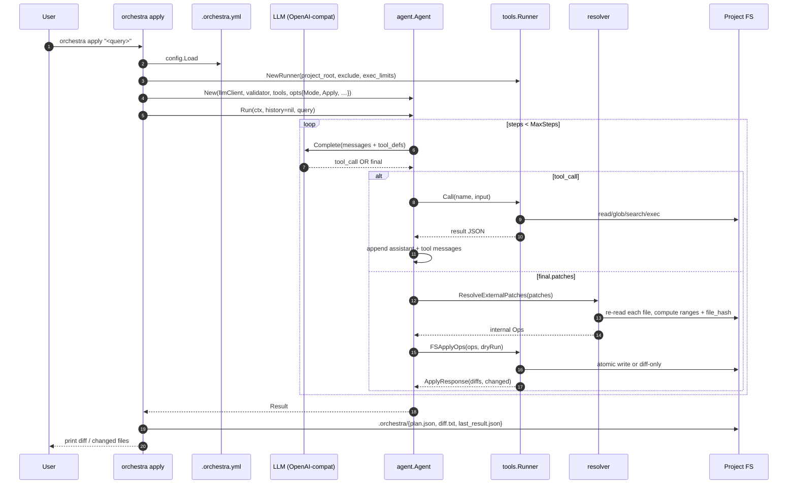
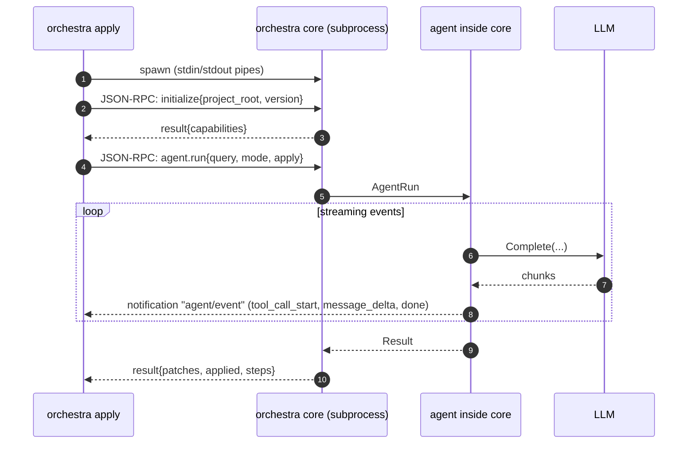
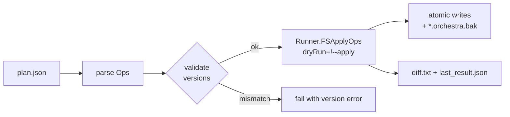
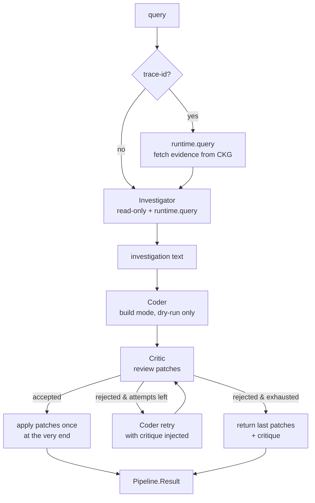
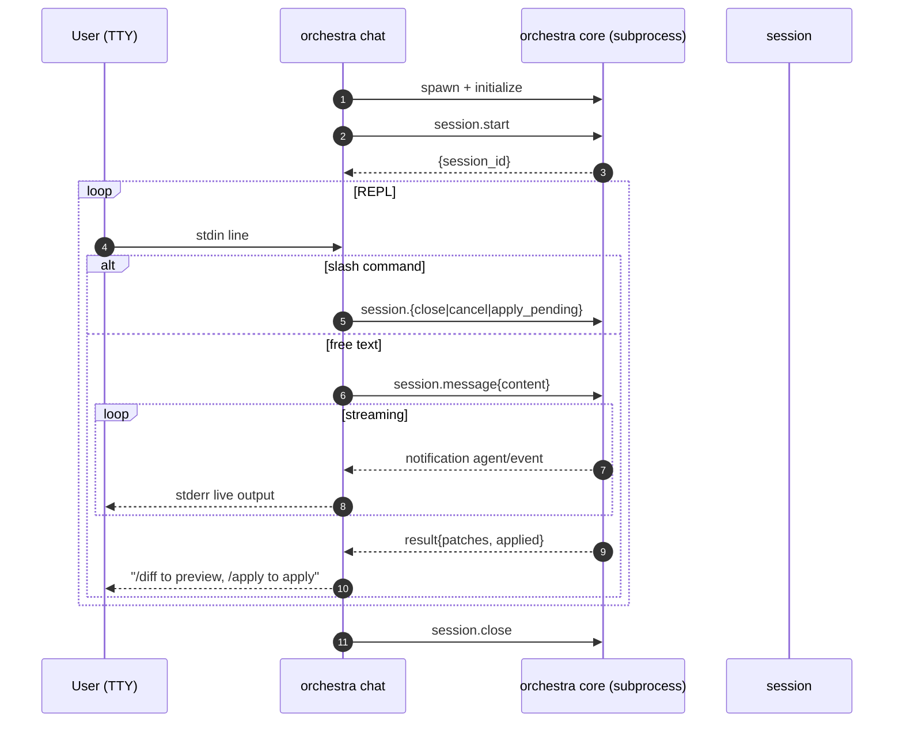
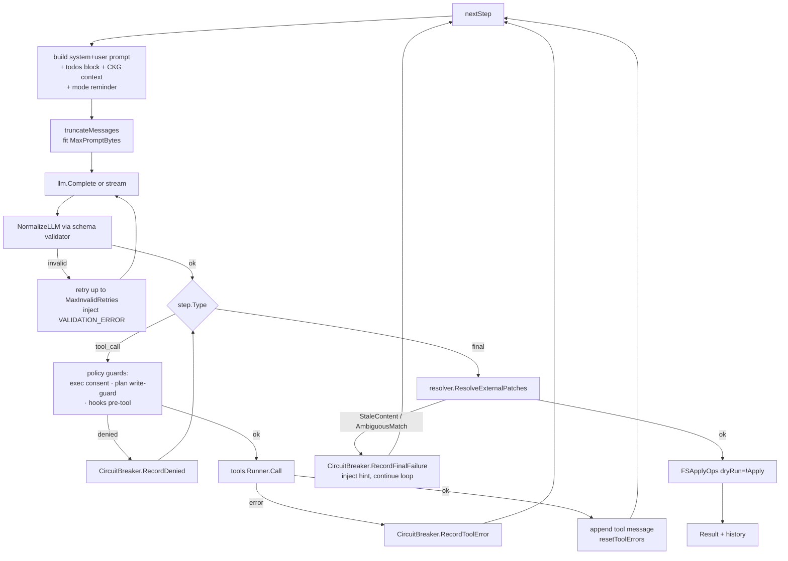

# Команды, режимы и пайплайны Orchestra

Документ фиксирует **текущее** состояние CLI Orchestra на момент `master` (vNext-транзиция):
команды, режимы агента, набор инструментов, сценарии запуска и сравнение с
референсной TypeScript-реализацией [OpenCode](https://opencode.ai)
(локальный fork — `_opencode/`).

Источники правды:
- `internal/cli/*.go` — все команды CLI;
- `internal/agent/agent.go` — режимы и цикл агента;
- `internal/tools/registry.go` — набор инструментов;
- `internal/core/rpc_handler.go` — JSON-RPC методы;
- `internal/pipeline/pipeline.go` — мульти-агентный пайплайн.

---

## 1. CLI-команды Orchestra

### 1.1. `orchestra init`
Создаёт `.orchestra.yml` в текущей директории. Пишет дефолтный конфиг
(`internal/config/config.go`) с `LLM.APIBase = http://localhost:8000/v1`
и моделью `qwen2.5-coder-7b`. Идемпотентно отказывает, если файл уже есть.

### 1.2. `orchestra core`
Запускает ядро как **JSON-RPC 2.0 сервер поверх stdio** (LSP-style framing).
Это основная точка интеграции с IDE/редактором.

| Флаг | Назначение |
|---|---|
| `--workspace-root` | Рабочая директория (по умолчанию — `cwd`) |
| `--debug` | Логи в stderr |
| `--http` | Дополнительный отладочный HTTP-сервер на 127.0.0.1 |
| `--http-port`, `--http-token` | Настройки отладочного HTTP |

Поддерживаемые JSON-RPC методы (`internal/core/rpc_handler.go`):
`core.health`, `initialize`, `agent.run`, `tool.call`, `session.start`,
`session.message`, `session.history`, `session.cancel`, `session.close`,
`session.apply_pending`. До `initialize` доступны только `core.health` и
`initialize` — остальные возвращают `NotInitialized`.

### 1.3. `orchestra apply [query]`
Главный сценарий «один шот»: `query` → план изменений → (опционально) запись.
Это самая сложная команда — собрала в себе три режима исполнения.

| Флаг | Поведение |
|---|---|
| `--apply` | Реально применить (по умолчанию dry-run) |
| `--plan-only` | Не звать LLM-edit, только plan |
| `--from-plan plan.json` | Воспроизвести сохранённый план без LLM |
| `--via-core` | Запустить агента в подпроцессе `orchestra core` через JSON-RPC |
| `--mode plan\|build` | Режим агента (см. §2) |
| `--pipeline` | Многоагентный пайплайн Investigator → Coder → Critic |
| `--pipeline-attempts N` | Лимит циклов Coder ↔ Critic |
| `--trace-id <id>` | Префетч runtime-evidence из CKG для пайплайна |
| `--allow-exec` | Разрешить tool `exec.run` (по умолчанию запрещён) |
| `--git-strict` | Падать если репозиторий грязный |
| `--git-commit` | Создать коммит после применения (нужен `--apply`) |
| `--debug` | Метрики и подробные логи |

Артефакты пишутся в `.orchestra/`: `plan.json`, `diff.txt`, `last_run.jsonl`,
`last_result.json`, `llm_log.jsonl`. На запись делается `*.orchestra.bak`.

### 1.4. `orchestra chat`
Интерактивный REPL. Под капотом запускает `orchestra core` подпроцессом
(`internal/cli/corechild.go`), вызывает `session.start`, и в цикле читает
строки stdin → `session.message`. Команды:
- `/exit`, `/clear` (закрыть/перезапустить сессию);
- `/diff`, `/apply` (показать/применить накопленные патчи);
- `/cancel` (прервать текущий ход через `session.cancel`).

| Флаг | |
|---|---|
| `--workspace` | Рабочая директория |
| `--allow-exec` | Разрешить `exec.run` |
| `--apply` | Авто-apply после каждого хода |

### 1.5. `orchestra daemon`
Локальный HTTP-демон v0.3 (legacy, остаётся для совместимости с командой
`search`). Жёстко биндится на `127.0.0.1`. Сервит сканирование/кэш файлов.

| Флаг | |
|---|---|
| `--project-root` (обязателен) | Корень проекта |
| `--address`, `--port` | Адрес/порт |
| `--scan-interval` | Интервал периодического скана, секунды |

### 1.6. `orchestra search <query>`
Текстовый поиск по проекту с уважением `exclude_dirs` из конфига. Если рядом
поднят `daemon` — ходит через него (быстрее за счёт кэша); иначе — прямой
скан (`internal/search`).

| Флаг | |
|---|---|
| `-i`, `--insensitive` | Регистронезависимо |
| `--max-per-file` | Лимит совпадений на файл (10 по умолчанию) |

### 1.7. `orchestra llm-ping`
Smoke-test провайдера LLM. Шлёт минимальный запрос (`messages: [{role:"user",
content:"ping"}]`), без tool-defs. Замеряет латентность, парсит код ошибки
из сообщения. Результат пишется в `.orchestra/llm_ping_result.json`.

### 1.8. `orchestra runtime ingest <file>`
Загружает OTel JSON-трейс в SQLite-хранилище CKG (`.orchestra/ckg.db`),
связывает spans с узлами графа (Sub-project 2, Runtime Observability Bridge).

### 1.9. `orchestra ckg-ui`
Запускает HTTP-сервер визуализатора CKG (по умолчанию `:6061`). Перед
стартом обновляет граф через `ckg.Orchestrator.UpdateGraph`.

### 1.10. `orchestra demo tiny-go`
Создаёт временный Go-проект и прогоняет через него заранее заготовленный
набор `ops` (создание пакета, atomic write, search/replace в нескольких
файлах). Используется для smoke-теста пайплайна патчей без LLM.

### 1.11. `orchestra eval [tasks-dir]`
Прогон YAML-тасков из `tests/eval/tasks` против сконфигурированного LLM.
Каждый таск — отдельный `core.AgentRun`. Печатает таблицу `PASS/FAIL/ERROR`.

| Флаг | |
|---|---|
| `--apply` (default `true`) | Реально применять изменения |
| `--model` | Override модели из конфига |
| `--timeout` | Таймаут на таск, секунд |

---

## 2. Режимы агента

Режим выбирается флагом `--mode` команды `apply`, либо параметром в
`agent.run` через JSON-RPC. Реализация — `internal/agent/agent.go` (константы
`ModeBuild/ModePlan/ModeExplore`) и `internal/tools/registry.go::ListToolsForMode`.

### 2.1. `build` (по умолчанию)
Полный набор инструментов: чтение, запись, edit, exec (если разрешён),
sub-tasks, todo, plan_enter. Это «рабочий» режим — агент пишет код.

Доступные tools:
`fs.list`, `fs.read`, `fs.glob`, `fs.write`, `fs.edit`,
`search.text`, `code.symbols`, `explore_codebase`, `runtime.query`,
`todo.write`, `todo.read`, `plan_enter`,
`exec.run` (опционально), `task.spawn|wait|cancel` (если включён
`SubtaskRunner`), `question` (если есть `QuestionAsker`).

### 2.2. `plan` (read-only анализ)
Запись запрещена везде, **кроме `.orchestra/plan.md`** — это
жёстко проверяется в `agent.go:441` (`Plan-mode write guard`). `fs.edit`
заблокирован полностью; `fs.write` пропускается только для `plan.md`.
Вместо `plan_enter` агент видит `plan_exit` — единственный способ выйти из
режима. Реализован в недавнем коммите `016b459`.

`plan_exit` спрашивает пользователя через `QuestionAsker`: переключиться ли
в `build` для применения. Если да — агент возвращает `Result.SwitchToBuild=true`,
и вызывающий код перезапускает агент в режиме `build` с флагом
`JustSwitchedFromPlan`, который инжектит одноразовый reminder.

Используется для безопасного исследования кодовой базы и составления
плана-документа без риска что-либо испортить.

### 2.3. `explore` (subagent для поиска)
Минимальный набор только для чтения: `fs.list`, `fs.read`, `fs.glob`,
`search.text`, `code.symbols`, плюс `task.result` для сообщения родителю.
Не пишет, не выполняет команды, не порождает дальнейшие subtasks.
Используется как ребёнок в `task.spawn`.

### 2.4. Скрытые служебные роли (через `pipeline`, не отдельный режим)
В пайплайне (`internal/pipeline/pipeline.go`):
- **Investigator** — собирает evidence (read-only + `runtime.query`);
- **Coder** — пишет патчи (build-режим, всегда dry-run внутри);
- **Critic** — проверяет результат, может развернуть в новый цикл.

---

## 3. Сравнение с OpenCode

Источник: `_opencode/packages/opencode/src/agent/agent.ts` (определение
агентов) и `_opencode/packages/opencode/src/cli/cmd/` (команды CLI).

### 3.1. Режимы / агенты

| Агент | OpenCode | Orchestra | Комментарий |
|---|---|---|---|
| `build` | ✅ primary | ✅ default | Совпадает |
| `plan` | ✅ primary | ✅ `--mode plan` | Совпадает по сути; в OpenCode переключение по `Tab`, у нас — флагом |
| `explore` | ✅ subagent | ✅ Mode `explore` (только как child) | Совпадает |
| `general` | ✅ subagent | ❌ | Нет универсального «делай-всё-в-параллели» субагента — есть только `task.spawn` с произвольной целью |
| `compaction` | ✅ hidden | ❌ | Нет авто-сжатия истории; только `truncateMessages` по байтовому бюджету |
| `title` | ✅ hidden | ❌ | Нет автогенерации заголовков сессии |
| `summary` | ✅ hidden | ❌ | Нет автосаммари |
| Кастомные агенты в конфиге | ✅ (`cfg.agent`) | ❌ | OpenCode позволяет описать агента в конфиге; у нас режимы захардкожены |
| Permission-rules per tool/glob | ✅ | ⚠️ частично | У нас только `exec.allow/deny` + write-guard для plan |

### 3.2. CLI-команды

| Возможность | OpenCode | Orchestra |
|---|---|---|
| Запуск TUI | `opencode tui` | ❌ нет TUI |
| Headless server | `opencode serve` | ✅ `orchestra core` (stdio) + `--http` |
| Один-шот запуск | `opencode run <prompt>` | ✅ `orchestra apply` |
| Интерактивный chat | TUI | ✅ `orchestra chat` (REPL) |
| Управление провайдерами | `opencode providers`, `models`, `auth` | ❌ конфигурируется только через `.orchestra.yml` |
| Импорт/экспорт сессий | `import`, `export` | ❌ |
| GitHub-интеграция | `opencode github`, `pr` | ❌ |
| MCP | `opencode mcp` (CLI команды управления) | ⚠️ есть `internal/mcp`, но без отдельной CLI |
| Веб-консоль / Console | `opencode web`, `console` | ❌ |
| Удалённый share | `share` | ❌ |
| Git worktrees | первоклассно (`worktree/`) | ❌ |
| LSP-интеграция в tools | `tool/lsp.ts` (диагностика, hover) | ❌ |
| WebFetch/WebSearch | ✅ | ❌ |
| Skills (намёки) | ✅ (`tool/skill.ts`, `src/skill`) | ❌ |
| Plugins | ✅ (`src/plugin`) | ❌ |
| Auto-upgrade | `opencode upgrade` | ❌ |
| Stats / heap-debug | `stats`, `heap` | частично через `metrics.go` |
| **CKG (Code Knowledge Graph)** | ❌ | ✅ `orchestra ckg-ui`, `runtime ingest` |
| **Runtime Observability Bridge** | ❌ | ✅ — наша уникальная фича |
| **Eval-харнес** | ❌ (есть тесты, не CLI) | ✅ `orchestra eval` |
| **Dry-run + savable plan** | через permission ask | ✅ `--from-plan` |
| **Pipeline Investigator→Coder→Critic** | ❌ (один агент) | ✅ `--pipeline` |

**Что у OpenCode есть, а у нас нет** (приоритезированный список «дыр»):
1. **TUI** — основной их UX. У нас нет ни Bubble Tea, ни Charmbracelet.
2. **Compaction/title/summary** — авто-сжатие истории, заголовки сессий.
3. **Кастомные агенты в `cfg.agent`** — описать роль через конфиг, без правки кода.
4. **Permission ruleset per tool + glob** — у них fine-grained `allow/ask/deny`, у нас лишь `--allow-exec`.
5. **WebFetch / WebSearch** — модель не может сходить в интернет.
6. **LSP-tools** — нет диагностики/hover/symbols через LSP-сервер языка.
7. **GitHub / PR-команды** — нет инструментов для работы с PR.
8. **Worktree-first** — нет встроенного управления git worktrees.
9. **MCP-CLI** — backend есть, но управления через CLI нет.
10. **Plugins / Skills** — нет точки расширения «снаружи».
11. **Multi-provider auth** (`opencode auth`) — нет менеджера ключей.

**Что у нас есть, а у OpenCode нет:**
1. **CKG** (Code Knowledge Graph) — символьный граф проекта в SQLite.
2. **Runtime Observability Bridge** — связывание OTel-трейсов с узлами CKG.
3. **Pipeline-режим** — детерминированный Investigator→Coder→Critic.
4. **Saved-plan / from-plan** — план как самостоятельный артефакт, который
   можно воспроизводить без LLM (важно для детерминизма E2E).
5. **Eval-харнес как первоклассная CLI**.
6. **Двухслойная схема патчей** (External vs Internal Ops с `file_hash`-условиями).

### 3.3. Инструменты агента — именование

В моём предыдущем сообщении мы выяснили: то, что я в разделе 1 описал как
«CLI-команды», и то, что агент вызывает через `tool_call` — это два разных
слоя. Посмотрим, как они называются у нас и у OpenCode, и какой из подходов
объективно лучше.

| Орчестра (`internal/tools/registry.go`) | OpenCode (`packages/opencode/src/tool/<name>.ts`) | Назначение |
|---|---|---|
| `fs.read` | `read` | прочитать файл |
| `fs.list` (+ pattern) | `glob` | листинг файлов / маски |
| `search.text` | `grep` | regex-поиск в содержимом |
| `code.symbols` | `lsp` (definitions/references/hover) | символьный поиск |
| `exec.run` | `bash` | shell-команды |
| внешний патч `file.search_replace` | `edit` | прицельная замена |
| внешний патч `file.unified_diff` | `apply_patch` | unified diff |
| внешний патч `file.write_atomic` | `write` | полная перезапись |
| `agent.question` | `question` | уточняющий вопрос пользователю |
| `runtime.query` | — | запрос к Runtime Observability Bridge |
| `explore_codebase` | `task` | делегирование под-агенту |
| `todo` | `todowrite` (+ `todo` структура) | TODO-лист сессии |
| — | `webfetch`, `websearch` | сеть |
| — | `skill` | загрузка скилла |
| — | `plan_exit` | выход из plan-режима (у нас — флаг режима) |

**Кто называет лучше?**

OpenCode: короткие, одно-словные, совпадают с конвенцией Claude Code / Cursor /
Cline. LLM такие имена уже видели в обучающей выборке десятки тысяч раз —
first-shot tool-calling точнее. Минусы: `bash` вводит в заблуждение под
Windows (по факту запускается `cmd.exe`/`pwsh`), `edit` неоднозначно (это
search/replace или diff?), `write` по умолчанию деструктивно перезаписывает.

Orchestra: namespaced (`fs.*`, `search.*`, `code.*`, `exec.*`, `agent.*`,
`runtime.*`). Когда инструментов будет 30-50, namespace спасает от коллизий
и позволяет легко делить permission-наборы по неймспейсам. Минусы: точка в
имени не разрешена в OpenAI tool-name regex (`^[a-zA-Z0-9_-]+$`), мы фактически
конвертируем `fs.list` → `fs_list` на стыке, что добавляет один шаг
рассинхронизации; LLM-ы хуже узнают эти имена «из коробки».

**Вывод**: для тулов, которые видит модель, имена OpenCode объективно
выгоднее (выше first-shot accuracy). Наша namespaced-схема лучше для
внутреннего API и масштабирования. Разумный путь — оставить namespaced
имена внутри (`internal/tools`), но в `ListToolsForMode` отдавать LLM
«короткие» алиасы (`read`, `glob`, `grep`, `bash`, `edit`, `apply_patch`,
`write`, `question`, `task`). Тонкий compatibility-слой на регистре, без
переписывания логики.

### 3.4. Инструменты агента — реализация

Здесь честно сравним, не заглядываясь на бренд.

#### Edit / search-replace — самая большая разница

**OpenCode (`tool/edit.ts`, ~710 строк)**: при поиске `oldString` в файле
последовательно прогоняет 9 стратегий-«реплейсеров» — `Simple` →
`LineTrimmed` → `BlockAnchor` (с Levenshtein-подобием) →
`WhitespaceNormalized` → `IndentationFlexible` → `EscapeNormalized` →
`TrimmedBoundary` → `ContextAware` → `MultiOccurrence`. Если LLM сбила отступы
или вставила лишний `\n` — патч всё равно ляжет. Также: per-file `Semaphore`
лок, `ctx.ask({ permission: "edit", … })` для интерактивного запроса
разрешения, и после записи прогоняется LSP-диагностика, ошибки которой
попадают обратно в ответ модели как «LSP errors detected, please fix».

**Orchestra (`internal/tools/fs_edit.go` + `internal/resolver/external_patches.go`)**:
строгий контракт. `search` должен встречаться в файле ровно один раз. Если
ноль вхождений — `StaleContent`; если больше одного — `AmbiguousMatch`.
Хард-фейл, без fuzzy-fallback. Перед записью проверяется `file_hash` против
зачитанной версии. Если файл был модифицирован параллельно — снова
`StaleContent`.

| Критерий | OpenCode | Orchestra |
|---|---|---|
| Прощает форматирование LLM | ✅ (9 стратегий) | ❌ (строго) |
| First-shot success rate | выше | ниже |
| Риск «фуззи в чужой блок» | ненулевой (Levenshtein@0.3) | 0 |
| Per-file lock | ✅ Semaphore | ❌ (один процесс, atomic write) |
| Hash-проверка устаревания | ⚠ только «обязан был Read раньше в сессии» | ✅ обязательный `file_hash` параметр |
| LSP-фидбэк после правки | ✅ | ❌ (есть CKG, но не в feedback-loop) |
| Permission-prompt в момент edit | ✅ | ❌ (только глобальный `--apply`) |

Здесь нельзя сказать «у одного лучше» — это **компромисс**. OpenCode
ориентирован на то, чтобы агент не зацикливался из-за пропущенного пробела;
Orchestra — на то, чтобы патч либо лёг точно, либо вернул понятный диагностик
до записи. Для CI/eval-сценариев (детерминизм важнее) — наш подход; для
интерактивной работы — их.

**Что стоит позаимствовать**: первые две-три forgiving-стратегии
(`LineTrimmed`, `IndentationFlexible`) — добавить как опциональный
второй проход в резолвере, если строгий поиск дал `StaleContent`.
Это сократит число «ребоунсов» к LLM, не теряя гарантий — `file_hash`
по-прежнему отсекает реальные конфликты.

#### Read

| Критерий | OpenCode | Orchestra |
|---|---|---|
| Префикс номеров строк в выдаче | ✅ `1: foo` | ❌ |
| Image / PDF как attachments | ✅ | ❌ |
| Хеш-возврат для anti-staleness | ❌ | ✅ |
| Truncation длинных строк | 2000 символов | по байтам |

Префикс номеров — мелочь, но **сильно** улучшает следующий `edit`: модель
ссылается на строки, а не угадывает их. Стоит прикрутить нам тоже (через
флаг ответа, чтобы не ломать существующих потребителей).

#### Glob / Grep

OpenCode оборачивает `ripgrep` (`Ripgrep.Service` из `@opencode-ai/core`) —
быстрее на крупных репах, сортировка по mtime «из коробки». У нас —
go-native walk + кастомный glob-матчер (поддерживает `**`). Без внешних
зависимостей, работает где угодно, но на репозитории в десятки тысяч файлов
будет медленнее.

Идея: при наличии `rg` в PATH — использовать его, иначе fallback на
go-native. У нас уже есть `internal/cli/search.go`, можно поднять туда же.

#### Bash / Exec

OpenCode (`tool/bash.txt`, 119 строк): persistent shell session, `workdir`
параметр, output дампится в файл при превышении лимита (модель потом читает
через `read`). Текстовое описание тула содержит **встроенные инструкции по
git-workflow** (как делать commit, PR, не использовать `--no-verify`, и т.д.) —
фактически кусок системного промпта спрятан в `description`.

Orchestra (`internal/tools/exec.go`, 215 строк): one-shot exec, hard timeout,
output cap, обязательный `--allow-exec`. Никаких git-инструкций в
description нет.

Здесь у нас чище. OpenCode-овский подход «зашить guidelines в description
тула» — антипаттерн: эти инструкции релевантны контексту (нужно ли вообще
делать commit), но прибиты к каждому вызову. Нашим решением «git-флоу — это
отдельный workflow» легче управлять.

Persistent session vs one-shot — спорно. Persistent даёт `cd && export X &&
run` без повторов, но усложняет sandboxing (никогда не знаешь, в каком
состоянии shell). Для нашего safety-first подхода one-shot оправдан.

#### Двухслойная схема патчей (External → Resolver → Internal Ops)

Это **единственное архитектурное решение, в котором мы строго впереди**.
OpenCode пишет в файл прямо из `edit.ts` / `write.ts` / `apply_patch.ts`
(там логика и применения, и валидации, и LSP-фидбэка перемешана). У нас:

1. LLM возвращает `final.patches` в одном из трёх внешних форматов
   (`file.search_replace`, `file.unified_diff`, `file.write_atomic`).
2. `internal/resolver` пере-читает файлы, считает 0-based ranges,
   вытаскивает якоря, валидирует уникальность — превращает в типизированные
   `ops.AnyOp`.
3. `internal/applier` применяет op'ы детерминированно, проверяя `file_hash`
   условие непосредственно перед записью (atomic temp → fsync → rename
   + `.orchestra.bak`).

Что это даёт:
- **План — отдельный артефакт**: `plan.json` сохраняется и может быть
  применён через `--from-plan` без LLM.
- **Точка ре-валидации**: между «модель сказала» и «диск изменился» есть
  слой, где можно вставить любую дополнительную проверку (мы это уже
  делаем для file-hash, но место подходит и для типчекинга, и для policy).
- **Аудит**: `last_run.jsonl` пишет именно нормализованные op'ы, а не
  сырые LLM-выдачи.

OpenCode так не умеет в принципе — у них нет «плана» как объекта. Это наша
архитектурная фишка, и в UML она выделена не зря (см. `architecture-uml.md`,
раздел 4 и 6).

#### LSP

OpenCode имеет `tool/lsp.ts` + интеграцию в `edit.ts` (диагностика после
правки). Мы — нет. У нас вместо этого CKG + Runtime Observability Bridge.
Это **разные ставки**:

- LSP — живой и точный, но локальный для языка и привязан к процессу
  language-server'а.
- CKG — холодный (требует индексации), но кросс-языковой и кросс-репозиторный,
  и его легко связывать с runtime-данными (трейсами, ошибками).

Не «лучше / хуже». Скорее: на горизонте 6 мес. стоит добавить LSP-тул как
**дополнение** к CKG — для feedback-loop'а сразу после edit'ов. Но не
вместо CKG.

#### Сводная таблица: «у кого реализация выигрывает»

| Аспект | Победитель | Почему |
|---|---|---|
| Forgiving edit (whitespace/indent) | OpenCode | 9 fallback-стратегий |
| Per-file локирование | OpenCode | Semaphore из `effect` |
| Permission в момент действия | OpenCode | `ctx.ask` интерактив |
| LSP feedback после правки | OpenCode | replan по диагностике |
| Skill для UX чтения файла (нумерация строк) | OpenCode | LLM проще ссылаться |
| ripgrep по умолчанию | OpenCode | скорость на крупных репах |
| Image/PDF в `read` | OpenCode | мульти-модальность |
| **Двухслойная архитектура патчей** | **Orchestra** | Replayability, аудит, типизация |
| **`file_hash` как обязательный contract** | **Orchestra** | Hard-проверка устаревания |
| **Чистота `exec`** | **Orchestra** | Без git-промпта в description |
| **Детерминизм edit'а** | **Orchestra** | 0 шансов «фуззи в чужой блок» |
| **Plan как самостоятельный артефакт** | **Orchestra** | `--from-plan` без LLM |
| **CKG / Runtime Bridge** | **Orchestra** | Уникальная фича |
| **Намeнование тулов** | **OpenCode** | LLM-конвенция, выше accuracy |
| Pipeline Investigator→Coder→Critic | Orchestra | Архитектурный уровень, не тул |
| Compaction/title/summary | OpenCode | UX-фичи поверх агента |

**Итог**: OpenCode выигрывает на UX-слое (forgiving edit, ripgrep, LSP-фидбэк,
имена). Orchestra — на архитектурном (две-слойные патчи, контрактные хеши,
plan как объект, CKG). Если совсем грубо: они дальше «вглубь UX», мы дальше
«вглубь корректности и аудита». Ни у кого нет «всего» — это разные ставки.

**Топ-5 заимствований, которые имеют смысл нам сделать без потери своей
философии:**
1. **Короткие алиасы тулов** в `ListToolsForMode` (`read`/`glob`/`grep`/
   `bash`/`edit`/`apply_patch`/`write`) — поверх namespaced API.
2. **LineTrimmed + IndentationFlexible fallback** в резолвере — после
   первого `StaleContent`, прежде чем возвращать ошибку модели.
3. **Префикс номеров строк** в `fs.read` (опционально через флаг).
4. **ripgrep-detection** в `search.text` — использовать `rg`, если есть.
5. **LSP-тул** как комплимент к CKG — для feedback-loop сразу после edit'а
   (не замена CKG, а второй сигнал).

---

## 4. Текущие пайплайны работы

### 4.1. One-shot: `orchestra apply`

Базовый поток без `--via-core` и без `--pipeline`
(`internal/cli/apply.go::runApply`, mode = `direct`):

### 4.2. Через subprocess: `orchestra apply --via-core`

Запускается изолированный процесс `orchestra core` (`corechild.go`),
агент крутится внутри него, наружу торчит JSON-RPC поверх stdio.
Используется E2E-тестами и сценариями, где важна изоляция.

### 4.3. Воспроизведение плана: `--from-plan plan.json`

LLM не вызывается совсем. План загружается с диска, его `Ops` пропускаются
через `tools.Runner.FSApplyOps` напрямую. Это «детерминированный режим» —
ровно тот же путь применения, что и в обычном `apply`, но без агента.

### 4.4. Многоагентный пайплайн: `--pipeline`

`internal/pipeline/pipeline.go::Run`. Detached от стандартного `agent.Run`:
оркестрирует три отдельных запуска агента с инжекцией результатов между
стадиями.

State между стадиями передаётся **строкой в goal** следующего агента:
- `<runtime_evidence>...</runtime_evidence>` — для Investigator/Critic;
- `<investigation>...</investigation>` — для Coder;
- `<critique>...</critique>` — для повторного Coder.

### 4.5. Интерактивный chat: `orchestra chat`

### 4.6. Цикл одного шага агента (детальный)

То, что происходит внутри `Agent.Run` за один проход цикла —
важно, чтобы понимать circuit breaker и обработку ошибок.

Hard-stops (`circuit_breaker.go`): `MaxDeniedToolRepeats=2`,
`MaxToolErrorRepeats=6`, `MaxFinalFailures=6`, `MaxInvalidRetries=3`,
плюс глобальный `MaxSteps=24` и `LLMStepTimeout=25s` на шаг.
