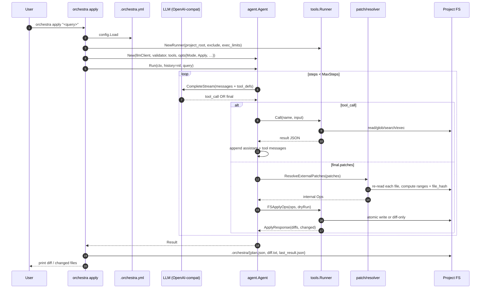
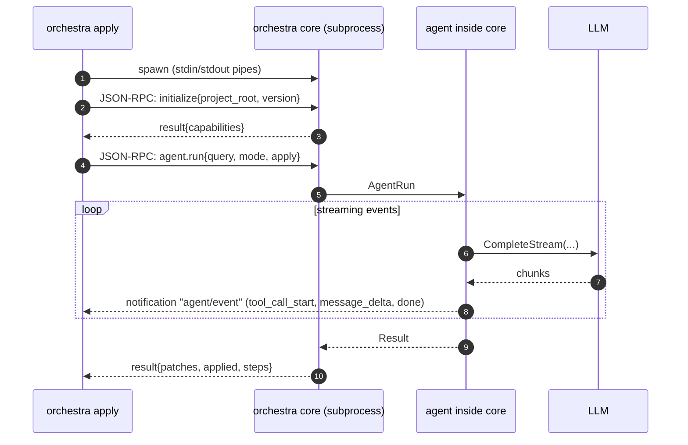
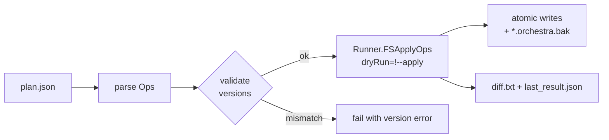
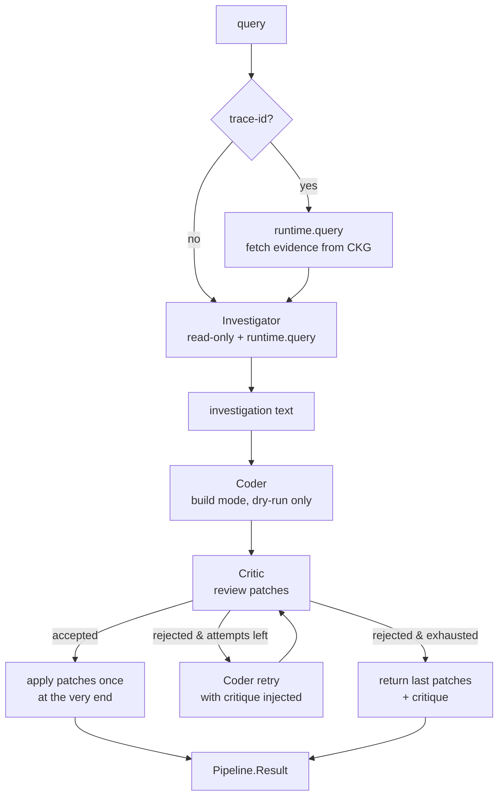
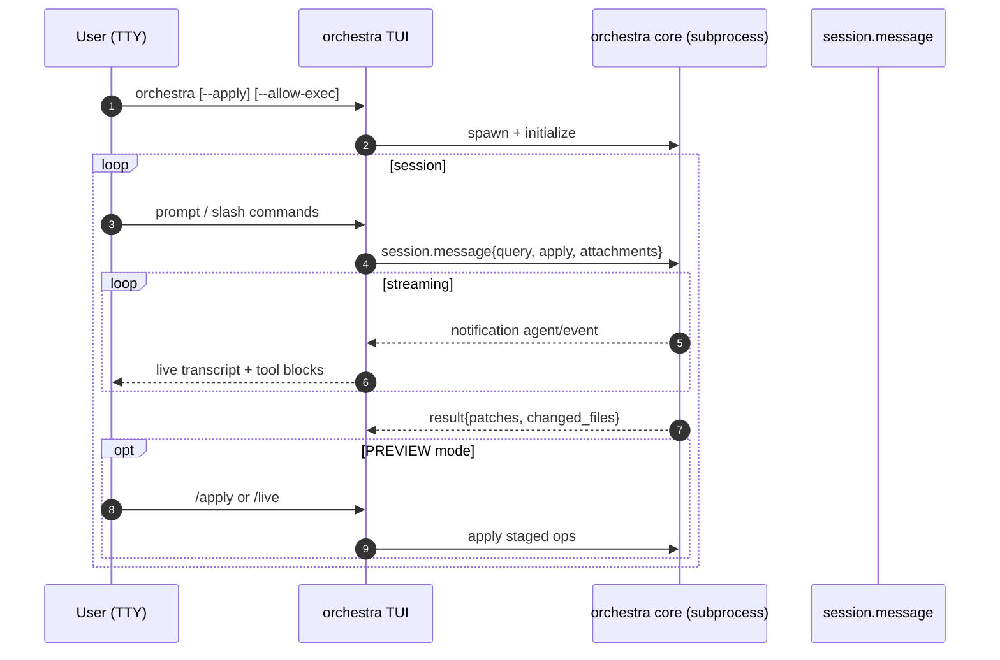
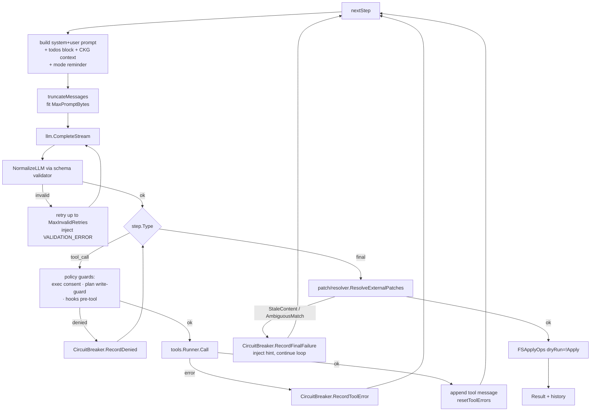

# Команды, режимы и пайплайны Orchestra

> **Режимы агента:** authoritative источник — [`modes.md`](./modes.md) (`build`, `plan`, `orchestra`, `worker`, …).  
> Этот документ — CLI/RPC справочник; §3 сравнение с OpenCode синхронизировано с кодом (2026-08-10).

Документ фиксирует **текущее** состояние CLI Orchestra (vNext):
команды, режимы агента, набор инструментов, сценарии запуска и сравнение с
референсной TypeScript-реализацией [OpenCode](https://opencode.ai)
(локальный fork — `_opencode/`).

Источники правды:
- `internal/cli/*.go` — все команды CLI;
- [`modes.md`](./modes.md) — режимы агента (authoritative);
- [`tools-status.md`](./tools-status.md) — сводка CLI + tools;
- [`architecture/paths.md`](./architecture/paths.md) — карта пакетов vNext;
- `internal/agent/` — цикл агента;
- `internal/tools/registry.go` — набор инструментов;
- `internal/core/rpc_handler.go` — JSON-RPC методы;
- `patch/resolver/`, `patch/applier/` — External → Internal Ops;
- `internal/pipeline/pipeline.go` — мульти-агентный пайплайн.

---

## 1. CLI-команды Orchestra

### 1.1. `orchestra init`
Создаёт `.orchestra.yml` в текущей директории. Пишет дефолтный конфиг
(`internal/config/config.go`) с `LLM.APIBase = http://localhost:8000/v1`
и моделью `qwen2.5-coder-7b`. Идемпотентно отказывает, если файл уже есть.

### 1.2. `orchestra core`
Запускает ядро как **JSON-RPC 2.0 сервер поверх stdio** (LSP-style framing).
Это основная точка интеграции с IDE/редактором.

| Флаг | Назначение |
|---|---|
| `--workspace-root` | Рабочая директория (по умолчанию — `cwd`) |
| `--debug` | Логи в stderr |
| `--http` | Дополнительный отладочный HTTP-сервер на 127.0.0.1 |
| `--http-port`, `--http-token` | Настройки отладочного HTTP |

Поддерживаемые JSON-RPC методы (`internal/core/rpc_handler.go`):
`core.health`, `initialize`, `agent.run`, `tool.call`, `ops.apply`,
`session.start`, `session.get`, `session.list`, `session.message`,
`session.history`, `session.ui_sync`, `session.compact`, `session.rewind`,
`session.cancel`, `session.close`, `session.apply_pending`,
`runtime.set_model`, `runtime.list_models`, `runtime.list_providers`,
`runtime.get_llm`, `runtime.configure_llm`,
`runtime.get_system_prompt`, `runtime.set_system_prompt`,
`mcp.list`, `mcp.upsert`, `mcp.delete`, `mcp.set_disabled`, `mcp.test`,
`agents.list`, `agents.upsert`, `agents.delete`,
`index.status`, `index.configure`, `index.rebuild`, `index.embed`,
`workflow.list`, `workflow.run`, `skill.list`, `skill.invoke`.
До `initialize` доступны только `core.health` и `initialize` — остальные
возвращают `NotInitialized`.

### 1.3. `orchestra apply [query]`
Главный сценарий «один шот»: `query` → план изменений → (опционально) запись.
Это самая сложная команда — собрала в себе три режима исполнения.

| Флаг | Поведение |
|---|---|
| `--apply` | Реально применить (по умолчанию dry-run) |
| `--plan-only` | Не звать LLM-edit, только plan |
| `--from-plan plan.json` | Воспроизвести сохранённый план без LLM |
| `--via-core` | Запустить агента в подпроцессе `orchestra core` через JSON-RPC |
| `--mode <name>` | Режим агента или кастомный agent из `agents:` (см. §2, [`modes.md`](./modes.md)) |
| `--provider <name>` | Override LLM-провайдера из `providers:` в `.orchestra.yml` |
| `--skill <name>` | Запуск с file-based skill из `.orchestra/skills/` |
| `--image <path>` | Вложение изображения к user message (multimodal LLM); repeatable |
| `--profile fast\|precision` | Adaptive execution presets |
| `--output-patch [path]` | Экспорт unified `.patch` без записи в workspace |
| `--allow-web` | Разрешить `webfetch` / `websearch` |
| `--allow-browser` | Разрешить `browser.*` (Playwright MCP) |
| `--pipeline` | Многоагентный пайплайн Investigator → Coder → Critic |
| `--pipeline-attempts N` | Лимит циклов Coder ↔ Critic |
| `--trace-id <id>` | Префетч runtime-evidence из CKG для пайплайна |
| `--allow-exec` | Разрешить `bash` / `exec.run` (по умолчанию запрещён) |
| `--git-strict` | Падать если репозиторий грязный |
| `--git-commit` | Создать коммит после применения (нужен `--apply`) |
| `--debug` | Метрики и подробные логи |
| `--stream` | Стримить токены в stdout (в pipe/CI); в TTY — на stderr |

LLM всегда ходит через SSE (`CompleteStream`); `OnEvent` управляет только отображением.
Подробнее: `docs/architecture/streaming.md`.

Артефакты пишутся в `.orchestra/`: `plan.json`, `diff.txt`, `last_run.jsonl`,
`last_result.json`, `llm_log.jsonl`. На запись делается `*.orchestra.bak`.

### 1.4. `orchestra` (TUI, по умолчанию)
Интерактивный консольный агент (Bubbletea TUI). Запуск без subcommand открывает UI;
`orchestra tui` — alias. Под капотом спавнит `orchestra core` подпроцессом и
общается через stdio JSON-RPC (`ui/tui/`).

| Флаг | |
|---|---|
| `--apply` | LIVE: сразу писать изменения на диск (иначе PREVIEW/staging) |
| `--allow-exec` | Разрешить `bash` / `exec.run` в agent runs |

Настройки UI также читаются из `.orchestra.yml`: `ui.auto_apply`, `ui.allow_exec`, `ui.theme`.

### 1.5. `orchestra search <query>`
Текстовый поиск по проекту с уважением `exclude_dirs` из конфига (`internal/search`).

| Флаг | |
|---|---|
| `-i`, `--insensitive` | Регистронезависимо |
| `--max-per-file` | Лимит совпадений на файл (10 по умолчанию) |

### 1.6. `orchestra llm-ping`
Smoke-test провайдера LLM. Шлёт минимальный запрос (`messages: [{role:"user",
content:"ping"}]`), без tool-defs. Замеряет латентность, парсит код ошибки
из сообщения. Результат пишется в `.orchestra/llm_ping_result.json`.

### 1.7. Дополнительные CLI-команды

Полная сводка — [`tools-status.md`](./tools-status.md). Кратко:

| Команда | Назначение |
|---|---|
| `orchestra skills list\|show\|install\|uninstall` | File-based skills (`~/.orchestra/skills/`, `.orchestra/skills/`) |
| `orchestra mcp list-tools` | Introspect MCP-серверов из конфига |
| `orchestra workflow list\|show\|run` | YAML-workflows из `.orchestra/workflows/` |
| `orchestra model select\|status` | Выбор модели LM Studio + `num_ctx` в `.orchestra.yml` |
| `orchestra lsp list\|status\|doctor\|ensure\|upgrade` | Управление language servers |
| `orchestra ckg embed` | Эмбеддинги CKG для `semantic_search` |
| `orchestra repo-map` | Repo map для промпта (CKG snapshot) |
| `orchestra usage` | Статистика токенов последних прогонов |
| `orchestra instrument [dir]` | Авто-инструментация OTel для проекта |
| `orchestra auth list\|set-key` | API-ключи провайдеров (E2 lite) |
| `orchestra session list\|export\|import` | Бэкап/перенос сессий (`orchestra.session.v1`) |
| `orchestra worktree list\|add\|remove\|prune\|path` | Git worktrees под `.orchestra/worktrees/` (E3) |

> **Нет** отдельного `orchestra chat` REPL и **нет** `orchestra daemon` — multi-turn UX через TUI / VS Code (`session.*`).

### 1.8. `orchestra runtime ingest <file>`
Загружает OTel JSON-трейс в SQLite-хранилище CKG (`.orchestra/ckg.db`),
связывает spans с узлами графа (Sub-project 2, Runtime Observability Bridge).

### 1.9. `orchestra ckg-ui`
Запускает HTTP-сервер визуализатора CKG (по умолчанию `:6061`). Перед
стартом обновляет граф через `ckg.Orchestrator.UpdateGraph`.

### 1.10. `orchestra demo tiny-go`
Создаёт временный Go-проект и прогоняет через него заранее заготовленный
набор `ops` (создание пакета, atomic write, search/replace в нескольких
файлах). Используется для smoke-теста пайплайна патчей без LLM.

### 1.11. `orchestra eval [tasks-dir]`
Прогон YAML-тасков из `tests/eval/tasks` против сконфигурированного LLM.
Каждый таск — отдельный `core.AgentRun`. Печатает таблицу `PASS/FAIL/ERROR`.

| Флаг | |
|---|---|
| `--apply` (default `true`) | Реально применять изменения |
| `--model` | Override модели из конфига |
| `--timeout` | Таймаут на таск, секунд |

---

## 2. Режимы агента

Authoritative описание каждого режима — [`modes.md`](./modes.md). Здесь — краткая карта.

Режим задаётся `--mode` в `apply`, `mode` в `agent.run` / `session.message`, или
именем кастомного agent из `agents:` в `.orchestra.yml` (+ RPC `agents.*`).

Реализация: `internal/agent/` (`Mode*`), `internal/tools/registry.go::ListToolsForMode`.

### 2.1. Top-level режимы (Tab / `--mode`)

| Режим | Назначение |
|---|---|
| `build` (default) | Полный цикл: read + write/edit + tools |
| `plan` | Read-only анализ; write только в `.orchestra/plans/*.md`; выход через `plan_exit` |
| `explore` | Read-only subagent (child через `task`) |
| `ask` | Read-only Q&A по коду |
| `debug` | Root cause + точечный фикс |
| `architecture` | Архитектурный обзор без правок |
| `orchestra` | Lead-режим: делегирование через `task` / `worker` |
| `agent` | Alias orchestration surface (см. `modes.md`) |

### 2.2. Child / internal режимы

| Режим | Назначение |
|---|---|
| `general` | Универсальный child: read+write, завершение через `task_result` |
| `worker` | Исполнитель с `tier` (fast/precision) для Lead |
| `compaction` | Internal: сжатие истории (`session.compact`, auto-threshold) |
| `title`, `summary` | Internal: заголовок сессии / autosummary в memory |

### 2.3. `build` — инструменты (короткие имена LLM)

`ls`, `read`, `glob`, `write`, `edit`, `grep`, `symbols`, `explore`, `runtime_query`,
`todowrite`, `todoread`, `bash` (если `--allow-exec`), `task` + spawn/wait/cancel
(если SubtaskRunner), `question`, LSP (`lsp.*`), git read-only + mutating (exec-gated),
`gh.pr.*` / `gh.issue.*`, `webfetch`/`websearch` (`--allow-web`), `skill_invoke`,
MCP tools (`mcp:<server>:<tool>`), browser.* (`--allow-browser`).

Полный per-tool статус: [`tools-status.md`](./tools-status.md).

### 2.4. `plan` — ограничения

Запись запрещена везде, **кроме `.orchestra/plans/*.md`** (и legacy `.orchestra/plan.md`).
`edit` заблокирован; `write` пропускается только для plan-файла. Вместо `plan_enter`
агент видит `plan_exit`. При одобрении пользователя core перезапускает прогон в `build`
с `JustSwitchedFromPlan`.

### 2.5. Pipeline-роли (не отдельные Tab-режимы)

В `--pipeline` (`internal/pipeline/pipeline.go`):
- **Investigator** — read-only + `runtime.query`;
- **Coder** — build, dry-run внутри;
- **Critic** — review, цикл Coder ↔ Critic.

---

## 3. Сравнение с OpenCode

Источник: `_opencode/packages/opencode/src/agent/agent.ts` (определение
агентов) и `_opencode/packages/opencode/src/cli/cmd/` (команды CLI).

### 3.1. Режимы / агенты

| Агент | OpenCode | Orchestra | Комментарий |
|---|---|---|---|
| `build` | ✅ primary | ✅ default | Совпадает |
| `plan` | ✅ primary | ✅ `--mode plan` | Совпадает по сути; в OpenCode переключение по `Tab`, у нас — флагом |
| `explore` | ✅ subagent | ✅ Mode `explore` (только как child) | Совпадает |
| `general` | ✅ subagent | ✅ `task` + `subagent_type: general` | Параллельный child с read/write |
| `compaction` | ✅ hidden | ⚠️ internal + `session.compact` | Нет OpenCode-style auto-compaction в TUI; есть threshold + ручной RPC |
| `title` | ✅ hidden | ⚠️ internal | Заголовки сессий — частично (не полный UX OpenCode) |
| `summary` | ✅ hidden | ⚠️ internal + `auto_summary_memory` | Autosummary в project memory после длинных turn'ов |
| Кастомные агенты в конфиге | ✅ (`cfg.agent`) | ✅ `agents:` в `.orchestra.yml` + RPC `agents.*` | Свой prompt, tools[], model, provider |
| Permission-rules per tool/glob | ✅ allow/ask/deny | ⚠️ `permissions.rules` allow/deny | Нет интерактивного `ask` в CLI; deny/allow по tool+glob |

### 3.2. CLI-команды

| Возможность | OpenCode | Orchestra |
|---|---|---|
| Запуск TUI | `opencode tui` | ✅ `orchestra` (default) / `orchestra tui` |
| Headless server | `opencode serve` | ✅ `orchestra core` (stdio) + `--http` |
| Один-шот запуск | `opencode run <prompt>` | ✅ `orchestra apply` |
| Интерактивный chat | TUI | ✅ `orchestra` (Bubbletea TUI) |
| Управление провайдерами | `opencode providers`, `models`, `auth` | ⚠️ `.orchestra.yml` `providers:` + `--provider` + RPC `runtime.*`; `orchestra model select` (LM Studio) |
| Импорт/экспорт сессий | `import`, `export` | ✅ `orchestra session export/import` |
| GitHub-интеграция | `opencode github`, `pr` | ⚠️ tools `gh.pr.*`, `gh.issue.*` + `git.*` (не отдельный GitHub CLI) |
| MCP | `opencode mcp` | ⚠️ `orchestra mcp list-tools` + RPC `mcp.*`; config in `.orchestra.yml` |
| Веб-консоль / Console | `opencode web`, `console` | ❌ |
| Удалённый share | `share` | ❌ |
| Git worktrees | первоклассно (`worktree/`) | ✅ `orchestra worktree`, `git.worktree.*`, `--apply --worktree` |
| LSP-интеграция в tools | `tool/lsp.ts` | ✅ `lsp.*` + `orchestra lsp` CLI |
| WebFetch/WebSearch | ✅ | ✅ `--allow-web` |
| Skills | ✅ | ✅ `orchestra skills`, `skill_invoke`, `~/.orchestra/skills/` |
| Auto-upgrade | `opencode upgrade` | ❌ |
| Stats / heap-debug | `stats`, `heap` | ⚠️ `orchestra usage`, debug metrics |
| **CKG (Code Knowledge Graph)** | ❌ | ✅ `orchestra ckg-ui`, `runtime ingest` |
| **Runtime Observability Bridge** | ❌ | ✅ — наша уникальная фича |
| **Eval-харнес** | ❌ (есть тесты, не CLI) | ✅ `orchestra eval` |
| **Dry-run + savable plan** | через permission ask | ✅ `--from-plan` |
| **Pipeline Investigator→Coder→Critic** | ❌ (один агент) | ✅ `--pipeline` |

**Что у OpenCode есть, а у нас нет** (актуальный список «дыр», 2026-08):

1. **Интерактивный permission `ask`** — fine-grained allow/ask/deny в момент действия (`ctx.ask`); у нас `permissions.rules` + глобальные gates.
2. **Multi-provider auth CLI** (`opencode auth`) — у нас `orchestra auth set-key` + конфиг + RPC runtime, без OAuth-flow CLI.
3. **Plugins SDK** — у нас skills + MCP, не general plugins.
4. **Web console / remote share** — нет.
5. **Auto-upgrade CLI** — нет.
6. **9-strategy forgiving edit** — ✅ 9-pass (fuzzy-block + double-anchor); без multi-occurrence replace-all.

> TUI, LSP, WebFetch/WebSearch, GitHub tools, skills, MCP, eval, pipeline, attachments — **у нас есть**. См. §1, [`tools-status.md`](./tools-status.md), [`architecture/paths.md`](./architecture/paths.md).

**Что у нас есть, а у OpenCode нет:**
1. **CKG** (Code Knowledge Graph) — символьный граф проекта в SQLite.
2. **Runtime Observability Bridge** — связывание OTel-трейсов с узлами CKG.
3. **Pipeline-режим** — детерминированный Investigator→Coder→Critic.
4. **Saved-plan / from-plan** — план как самостоятельный артефакт, который
   можно воспроизводить без LLM (важно для детерминизма E2E).
5. **Eval-харнес как первоклассная CLI**.
6. **Двухслойная схема патчей** (External vs Internal Ops с `file_hash`-условиями).

### 3.3. Инструменты агента — именование

LLM видит **короткие имена** (Claude Code / Cursor convention). Canonical FQN —
в `Runner.Call`. Сводка: [`tools-status.md`](./tools-status.md). Короткие алиасы — default (ToolsVersion 3).

| Orchestra (LLM) | Canonical (Runner) | OpenCode | Назначение |
|---|---|---|---|
| `read` | `fs.read` | `read` | файл + line numbers + `file_hash` |
| `ls` | `fs.list` | — | листинг |
| `glob` | `fs.glob` | `glob` | маски файлов |
| `grep` | `search.text` | `grep` | regex (rg fallback) |
| `symbols` | `code.symbols` | `lsp` (частично) | символы / CKG |
| `bash` | `exec.run` | `bash` | shell |
| `edit` | `fs.edit` | `edit` | search-and-replace |
| `write` | `fs.write` | `write` | перезапись |
| `question` | `agent.question` | `question` | вопрос пользователю |
| `runtime_query` | `runtime.query` | — | Runtime Bridge |
| `task` | `explore_codebase` / spawn | `task` | subagent |
| `todowrite` | `todo.write` | `todowrite` | TODO |
| `webfetch`, `websearch` | `web.*` | same | сеть |
| `skill_invoke` | `skill.invoke` | `skill` | skills |
| `plan_exit` | `plan.exit` | `plan_exit` | выход из plan |
| `lsp.*` | `lsp.*` | via `lsp.ts` | LSP tools |

### 3.4. Инструменты агента — реализация

Здесь честно сравним, не заглядываясь на бренд.

#### Edit / search-replace — самая большая разница

**OpenCode (`tool/edit.ts`, ~710 строк)**: при поиске `oldString` в файле
последовательно прогоняет 9 стратегий-«реплейсеров» — `Simple` →
`LineTrimmed` → `BlockAnchor` (с Levenshtein-подобием) →
`WhitespaceNormalized` → `IndentationFlexible` → `EscapeNormalized` →
`TrimmedBoundary` → `ContextAware` → `MultiOccurrence`. Если LLM сбила отступы
или вставила лишний `\n` — патч всё равно ляжет. Также: per-file `Semaphore`
лок, `ctx.ask({ permission: "edit", … })` для интерактивного запроса
разрешения, и после записи прогоняется LSP-диагностика, ошибки которой
попадают обратно в ответ модели как «LSP errors detected, please fix».

**Orchestra (`internal/tools/fs/edit.go` + `patch/resolver/external_patches.go`)**:
three-pass matching (exact → `lineTrimmedFind` → `indentFlexibleFind`), затем
строгий контракт уникальности. Ноль вхождений — `StaleContent`; больше одного —
`AmbiguousMatch`. Обязательный `file_hash` перед записью. После `edit`/`write`
LSP-диагностика возвращается в tool result и инжектится в history как
`LSP_ERRORS` hint (`internal/agent/tool_dispatch.go`).

| Критерий | OpenCode | Orchestra |
|---|---|---|
| Прощает форматирование LLM | ✅ (9 стратегий) | ⚠️ (3-pass, не 9) |
| First-shot success rate | выше | средний |
| Риск «фуззи в чужой блок» | ненулевой (Levenshtein@0.3) | 0 (после match) |
| Per-file lock | ✅ Semaphore | ❌ (один процесс, atomic write) |
| Hash-проверка устаревания | ⚠ session Read-gate | ✅ обязательный `file_hash` |
| LSP-фидбэк после правки | ✅ | ✅ (inject + diag fingerprint streak) |
| Permission-prompt в момент edit | ✅ `ctx.ask` | ⚠️ `permissions.rules` + `--apply` |

Компромисс: OpenCode прощает больше ошибок форматирования; Orchestra —
детерминизм + `file_hash` + audit. Three-pass резолвер уже закрывает типичные
whitespace/indent промахи.

#### Read

| Критерий | OpenCode | Orchestra |
|---|---|---|
| Префикс номеров строк в выдаче | ✅ `1: foo` | ✅ (`addLineNumbers` в `fs.read`) |
| Image / PDF attachments | ✅ | ✅ v13: `apply --image`, TUI `/attach`, RPC attachments |
| Хеш-возврат для anti-staleness | ❌ | ✅ |
| Truncation длинных строк | 2000 символов | по байтам |

#### Glob / Grep

`grep` / `search.text` автоматически использует `rg` при наличии в PATH
(`internal/search/`), иначе go-native. OpenCode быстрее на очень крупных monorepo
за счёт Ripgrep service + mtime sort из `@opencode-ai/core`.

#### Bash / Exec

OpenCode (`tool/bash.txt`, 119 строк): persistent shell session, `workdir`
параметр, output дампится в файл при превышении лимита (модель потом читает
через `read`). Текстовое описание тула содержит **встроенные инструкции по
git-workflow** (как делать commit, PR, не использовать `--no-verify`, и т.д.) —
фактически кусок системного промпта спрятан в `description`.

Orchestra (`internal/tools/exec/`): one-shot `bash` + optional background
helpers (`bash_background`, `bash_output`, `bash_kill`), hard timeout, output cap,
`--allow-exec`. Отдельные `git.*` / `gh.*` tools вместо git-инструкций в bash description.

Здесь у нас чище. OpenCode-овский подход «зашить guidelines в description
тула» — антипаттерн: эти инструкции релевантны контексту (нужно ли вообще
делать commit), но прибиты к каждому вызову. Нашим решением «git-флоу — это
отдельный workflow» легче управлять.

Persistent session vs one-shot — спорно. Persistent даёт `cd && export X &&
run` без повторов, но усложняет sandboxing (никогда не знаешь, в каком
состоянии shell). Для нашего safety-first подхода one-shot оправдан.

#### Двухслойная схема патчей (External → Resolver → Internal Ops)

Это **единственное архитектурное решение, в котором мы строго впереди**.
OpenCode пишет в файл прямо из `edit.ts` / `write.ts` / `apply_patch.ts`
(там логика и применения, и валидации, и LSP-фидбэка перемешана). У нас:

1. LLM возвращает `final.patches` в одном из трёх внешних форматов
   (`file.search_replace`, `file.unified_diff`, `file.write_atomic`).
2. `patch/resolver` пере-читает файлы, считает 0-based ranges,
   вытаскивает якоря, валидирует уникальность — превращает в типизированные
   `ops.AnyOp`.
3. `patch/applier` применяет op'ы детерминированно, проверяя `file_hash`
   условие непосредственно перед записью (atomic temp → fsync → rename
   + `.orchestra.bak`).

Что это даёт:
- **План — отдельный артефакт**: `plan.json` сохраняется и может быть
  применён через `--from-plan` без LLM.
- **Точка ре-валидации**: между «модель сказала» и «диск изменился» есть
  слой, где можно вставить любую дополнительную проверку (мы это уже
  делаем для file-hash, но место подходит и для типчекинга, и для policy).
- **Аудит**: `last_run.jsonl` пишет именно нормализованные op'ы, а не
  сырые LLM-выдачи.

OpenCode так не умеет в принципе — у них нет «плана» как объекта. Это наша
архитектурная фишка, и в UML она выделена не зря (см. `architecture-uml.md`,
раздел 4 и 6).

#### LSP + CKG

OpenCode: `tool/lsp.ts` + post-edit diagnostics. Orchestra: **`lsp.*` tools**
(`internal/tools/toolslsp/`), auto-inject `LSP_ERRORS` после `edit`/`write`,
**плюс** CKG + Runtime Observability Bridge. LSP — feedback loop; CKG — уникальный
static+runtime слой; оба coexist.

#### Сводная таблица: «у кого реализация выигрывает»

| Аспект | Победитель | Почему |
|---|---|---|
| Forgiving edit (whitespace/indent) | OpenCode | 9 vs 3-pass |
| Per-file локирование | OpenCode | Semaphore |
| Permission в момент действия | OpenCode | `ctx.ask` |
| LSP feedback после правки | ≈ parity | оба inject diagnostics |
| Line numbers в `read` | ≈ parity | оба |
| ripgrep | ≈ parity | rg auto-fallback |
| Image/PDF attachments | ≈ parity | v13 + TUI `/attach` |
| **Двухслойная архитектура патчей** | **Orchestra** | Replayability, аудит, типизация |
| **`file_hash` как обязательный contract** | **Orchestra** | Hard-проверка устаревания |
| **Чистота `exec`** | **Orchestra** | Без git-промпта в description |
| **Детерминизм edit'а** | **Orchestra** | 0 шансов «фуззи в чужой блок» |
| **Plan как самостоятельный артефакт** | **Orchestra** | `--from-plan` без LLM |
| **CKG / Runtime Bridge** | **Orchestra** | Уникальная фича |
| **Короткие имена тулов** | ≈ parity | ToolsVersion 3 |
| Pipeline Investigator→Coder→Critic | Orchestra | Архитектурный уровень |
| Compaction/title/summary UX | OpenCode | richer session UX |

**Итог (2026-08):** паритет по tool UX (aliases, LSP loop, rg, line numbers,
attachments). Orchestra впереди по patch architecture, `file_hash`, plan replay,
CKG/Runtime. OpenCode — forgiving edit depth, interactive permissions, worktrees.

> Исторические roadmap-закрытия (2026-05): см. CHANGELOG. Таблицы §3 синхронизированы с кодом на 2026-08-10.

---

## 4. Текущие пайплайны работы

### 4.1. One-shot: `orchestra apply`

Базовый поток без `--via-core` и без `--pipeline`
(`internal/cli/apply.go::runApply`, mode = `direct`):

```mermaid
sequenceDiagram
    autonumber
    participant U as User
    participant CLI as orchestra apply
    participant Cfg as .orchestra.yml
    participant LLM as LLM (OpenAI-compat)
    participant Ag as agent.Agent
    participant Tools as tools.Runner
    participant Res as patch/resolver
    participant FS as Project FS

    U->>CLI: orchestra apply "<query>"
    CLI->>Cfg: config.Load
    CLI->>Tools: NewRunner(project_root, exclude, exec_limits)
    CLI->>Ag: New(llmClient, validator, tools, opts{Mode, Apply, …})
    CLI->>Ag: Run(ctx, history=nil, query)
    loop steps < MaxSteps
        Ag->>LLM: CompleteStream(messages + tool_defs)
        LLM-->>Ag: tool_call OR final
        alt tool_call
            Ag->>Tools: Call(name, input)
            Tools->>FS: read/glob/search/exec
            Tools-->>Ag: result JSON
            Ag->>Ag: append assistant + tool messages
        else final.patches
            Ag->>Res: ResolveExternalPatches(patches)
            Res->>FS: re-read each file, compute ranges + file_hash
            Res-->>Ag: internal Ops
            Ag->>Tools: FSApplyOps(ops, dryRun)
            Tools->>FS: atomic write or diff-only
            Tools-->>Ag: ApplyResponse(diffs, changed)
        end
    end
    Ag-->>CLI: Result
    CLI->>FS: .orchestra/{plan.json, diff.txt, last_result.json}
    CLI-->>U: print diff / changed files
```

### 4.2. Через subprocess: `orchestra apply --via-core`

Запускается изолированный процесс `orchestra core` (`corechild.go`),
агент крутится внутри него, наружу торчит JSON-RPC поверх stdio.
Используется E2E-тестами и сценариями, где важна изоляция.

```mermaid
sequenceDiagram
    autonumber
    participant CLI as orchestra apply
    participant Child as orchestra core (subprocess)
    participant Ag as agent inside core
    participant LLM as LLM

    CLI->>Child: spawn (stdin/stdout pipes)
    CLI->>Child: JSON-RPC: initialize{project_root, version}
    Child-->>CLI: result{capabilities}
    CLI->>Child: JSON-RPC: agent.run{query, mode, apply}
    Child->>Ag: AgentRun
    loop streaming events
        Ag->>LLM: CompleteStream(...)
        LLM-->>Ag: chunks
        Ag-->>CLI: notification "agent/event" (tool_call_start, message_delta, done)
    end
    Ag-->>Child: Result
    Child-->>CLI: result{patches, applied, steps}
```

### 4.3. Воспроизведение плана: `--from-plan plan.json`

LLM не вызывается совсем. План загружается с диска, его `Ops` пропускаются
через `tools.Runner.FSApplyOps` напрямую. Это «детерминированный режим» —
ровно тот же путь применения, что и в обычном `apply`, но без агента.

```mermaid
flowchart LR
    A[plan.json] --> B[parse Ops]
    B --> C{validate<br/>versions}
    C -- ok --> D[Runner.FSApplyOps<br/>dryRun=!--apply]
    D --> E[atomic writes<br/>+ *.orchestra.bak]
    D --> F[diff.txt + last_result.json]
    C -- mismatch --> X[fail with version error]
```

### 4.4. Многоагентный пайплайн: `--pipeline`

`internal/pipeline/pipeline.go::Run`. Detached от стандартного `agent.Run`:
оркестрирует три отдельных запуска агента с инжекцией результатов между
стадиями.

```mermaid
flowchart TB
    Q[query] --> RE{trace-id?}
    RE -- yes --> RUN[runtime.query<br/>fetch evidence from CKG]
    RE -- no --> INV
    RUN --> INV[Investigator<br/>read-only + runtime.query]
    INV --> INV_TXT[investigation text]
    INV_TXT --> COD[Coder<br/>build mode, dry-run only]
    COD --> CRIT[Critic<br/>review patches]
    CRIT -->|accepted| APPLY[apply patches once<br/>at the very end]
    CRIT -->|rejected & attempts left| COD2[Coder retry<br/>with critique injected]
    COD2 --> CRIT
    CRIT -->|rejected & exhausted| FAIL[return last patches<br/>+ critique]
    APPLY --> RESULT[Pipeline.Result]
    FAIL --> RESULT
```

State между стадиями передаётся **строкой в goal** следующего агента:
- `<runtime_evidence>...</runtime_evidence>` — для Investigator/Critic;
- `<investigation>...</investigation>` — для Coder;
- `<critique>...</critique>` — для повторного Coder.

### 4.5. Интерактивный TUI: `orchestra`

```mermaid
sequenceDiagram
    autonumber
    participant U as User (TTY)
    participant TUI as orchestra TUI
    participant Core as orchestra core (subprocess)
    participant Agent as session.message

    U->>TUI: orchestra [--apply] [--allow-exec]
    TUI->>Core: spawn + initialize
    loop session
        U->>TUI: prompt / slash commands
        TUI->>Core: session.message{query, apply, attachments}
        loop streaming
            Core-->>TUI: notification agent/event
            TUI-->>U: live transcript + tool blocks
        end
        Core-->>TUI: result{patches, changed_files}
        opt PREVIEW mode
            U->>TUI: /apply or /live
            TUI->>Core: apply staged ops
        end
    end
```

### 4.6. Цикл одного шага агента (детальный)

То, что происходит внутри `Agent.Run` за один проход цикла —
важно, чтобы понимать circuit breaker и обработку ошибок.

```mermaid
flowchart TD
    S[nextStep] --> P[build system+user prompt<br/>+ todos block + CKG context<br/>+ mode reminder]
    P --> T[truncateMessages<br/>fit MaxPromptBytes]
    T --> L[llm.CompleteStream]
    L --> N[NormalizeLLM via schema validator]
    N -- invalid --> RETRY[retry up to MaxInvalidRetries<br/>inject VALIDATION_ERROR]
    N -- ok --> SW{step.Type}
    SW -- tool_call --> POL[policy guards:<br/>exec consent · plan write-guard<br/>· hooks pre-tool]
    POL -- denied --> CB1[CircuitBreaker.RecordDenied]
    POL -- ok --> CALL[tools.Runner.Call]
    CALL -- error --> CB2[CircuitBreaker.RecordToolError]
    CALL -- ok --> APPEND[append tool message<br/>resetToolErrors]
    SW -- final --> RES[patch/resolver.ResolveExternalPatches]
    RES -- StaleContent / AmbiguousMatch --> CB3[CircuitBreaker.RecordFinalFailure<br/>inject hint, continue loop]
    RES -- ok --> APP[FSApplyOps dryRun=!Apply]
    APP --> DONE[Result + history]
    CB1 --> SW
    CB2 --> S
    CB3 --> S
    APPEND --> S
    RETRY --> L
```

Hard-stops (`circuit_breaker.go`): `MaxDeniedToolRepeats=2`,
`MaxToolErrorRepeats=6`, `MaxFinalFailures=6`, `MaxInvalidRetries=3`,
плюс глобальный `MaxSteps=24` и `LLMStepTimeout=25s` на шаг.
